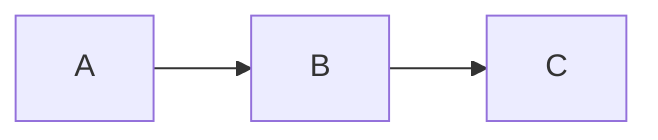

# Documentation

文档生成和维护。

**任务**: $ARGUMENTS

## 文档类型

### 1. API 文档

- Swagger/OpenAPI 注释
- 接口说明和示例

### 2. 技术文档

- 架构设计文档
- 模块说明文档

### 3. 用户文档

- 功能使用指南
- FAQ

## 文档位置

```
docs/
├── prd/              # 产品需求文档
├── guides/           # 开发指南
├── architecture/     # 架构文档
└── api/              # API 文档

.claude/
├── CLAUDE.md         # AI 助手配置
└── skills/           # 技能文档
```

## API 文档规范 (NestJS)

```typescript
@ApiTags("resources")
@Controller("resources")
export class ResourcesController {
  @ApiOperation({ summary: "获取资源列表" })
  @ApiQuery({ name: "type", required: false, description: "资源类型" })
  @ApiResponse({ status: 200, description: "成功返回资源列表" })
  @Get()
  findAll(@Query() query: FindResourcesDto) {
    // ...
  }
}
```

## 代码注释规范

```typescript
/**
 * 处理资源创建请求
 *
 * @param dto - 创建资源的数据
 * @returns 创建的资源对象
 * @throws {BadRequestException} 当数据验证失败时
 *
 * @example
 * const resource = await service.create({
 *   title: 'My Resource',
 *   type: 'article'
 * });
 */
async create(dto: CreateResourceDto): Promise<Resource> {
  // ...
}
```

## Markdown 文档模板

````markdown
# 功能名称

## 概述

简要描述功能用途。

## 架构


````

## 使用方法

### 前置条件

### 步骤

## API 参考

## 配置选项

## 常见问题

```

## 我会帮助你

- 生成 API 文档
- 编写技术设计文档
- 更新 README
- 添加代码注释
- 创建用户指南
```
