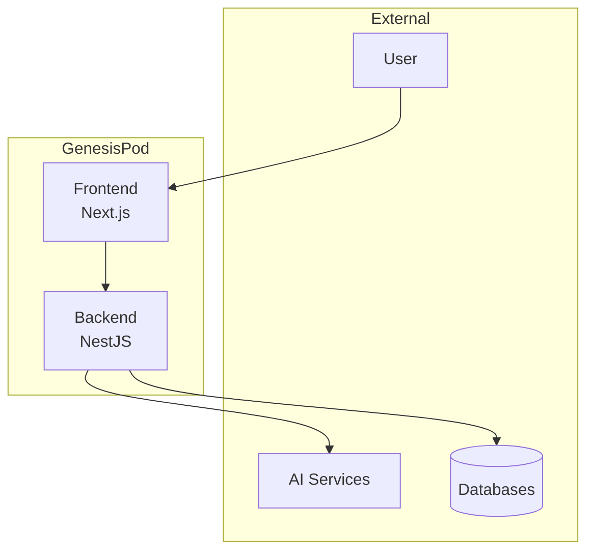
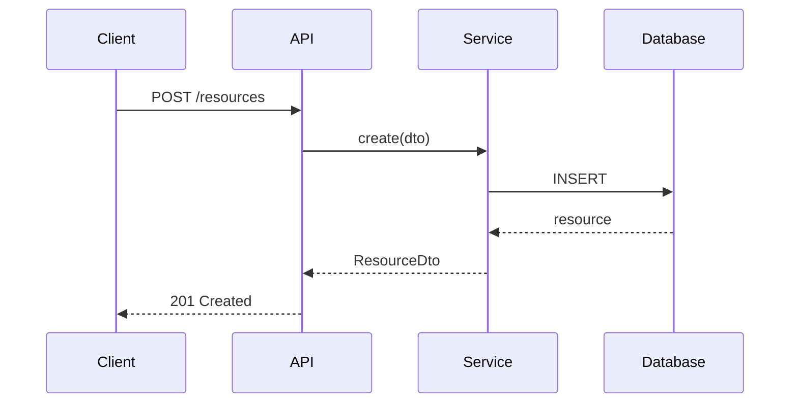

# ADR Guidelines

## ADR Template

```markdown
# ADR-{NUMBER}: {TITLE}

## Status

{Proposed | Accepted | Deprecated | Superseded by ADR-XXX}

## Context

What is the issue that we're seeing that is motivating this decision?

## Decision

What is the change that we're proposing and/or doing?

## Consequences

What becomes easier or more difficult because of this change?

## Alternatives Considered

What other options did we evaluate?

## References

- Related PRDs, issues, or external documentation
```

## ADR Directory Structure

```
docs/architecture/
├── decisions/
│   ├── 0001-use-nestjs-backend.md
│   ├── 0002-multi-database-strategy.md
│   ├── 0003-ai-orchestration-layer.md
│   ├── 0004-unified-deduplication.md
│   └── template.md
├── diagrams/
│   ├── system-overview.mermaid
│   ├── data-flow.mermaid
│   └── module-dependencies.mermaid
└── standards/
    ├── api-design.md
    ├── error-handling.md
    └── naming-conventions.md
```

## When to Write an ADR

- New technology or framework adoption
- Significant architectural changes
- Database schema design decisions
- Cross-module interface definitions
- Performance optimization strategies
- Security-related decisions

## Diagramming Standards

### System Context Diagram



### Data Flow Diagram



## Before Implementation Checklist

- [ ] ADR created and reviewed
- [ ] Schema changes documented
- [ ] API contracts defined
- [ ] Cross-module dependencies mapped
- [ ] Migration strategy planned
- [ ] Rollback plan documented

## Responsibilities

1. Design schemas before implementation
2. Create ADRs for significant decisions
3. Define interfaces between modules
4. Review changes for architectural impact
5. Maintain diagrams as system evolves
6. Enforce standards across codebase
7. Plan migrations for schema changes
