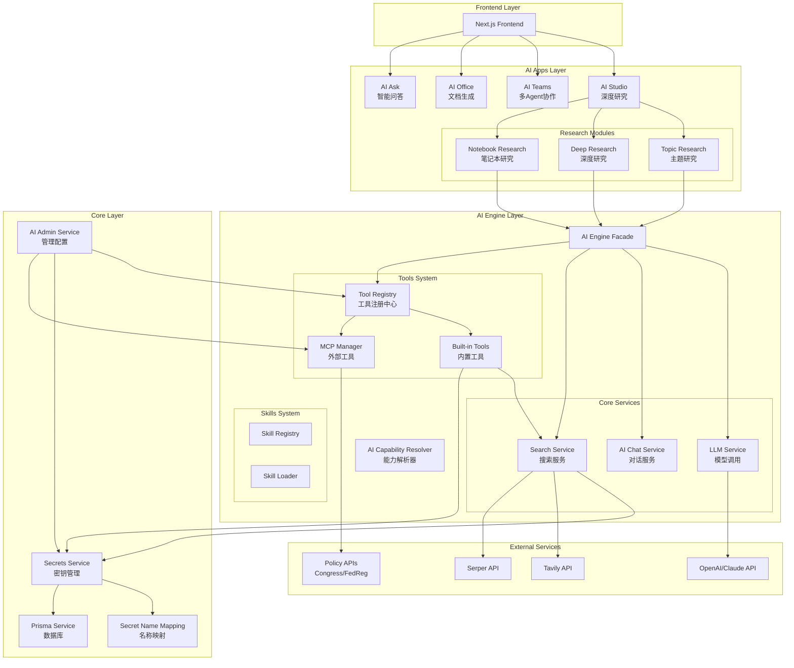
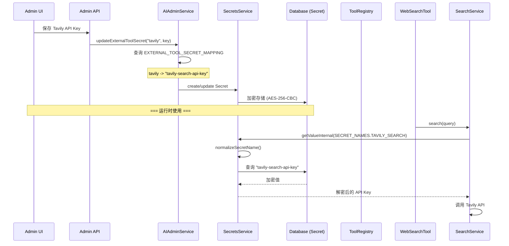
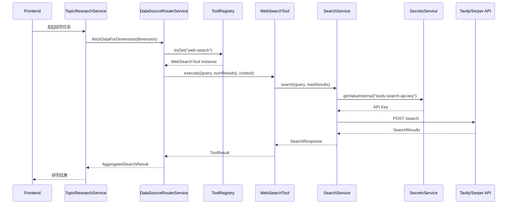
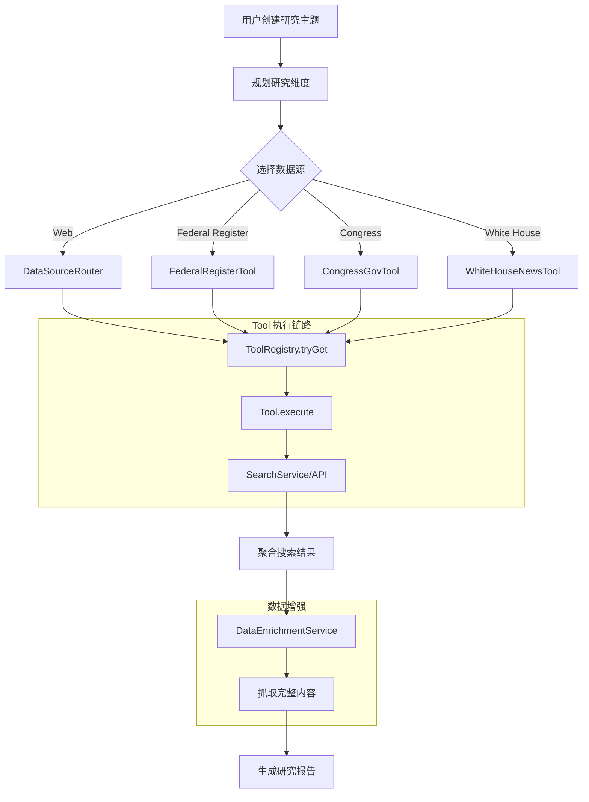
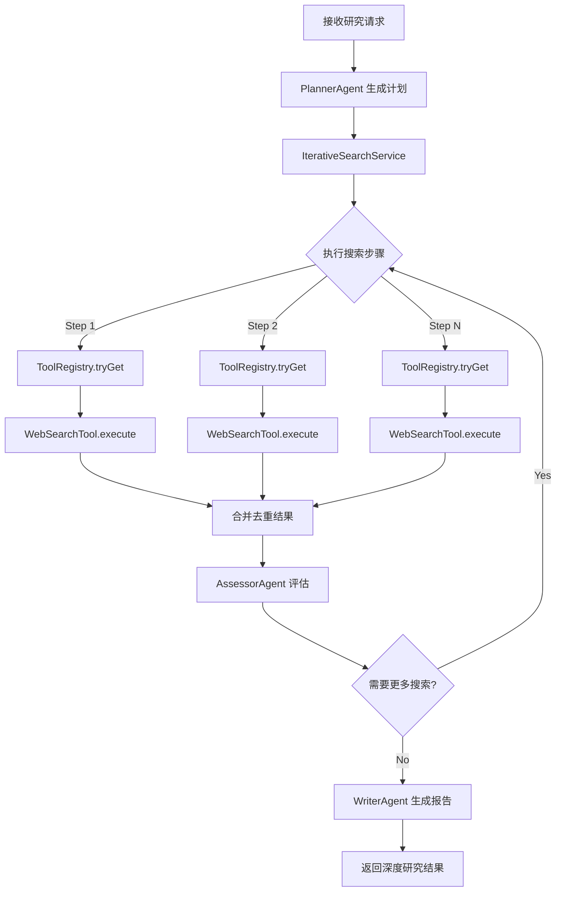

# Genesis.ai 系统架构诊断报告

> 诊断日期: 2026-01-21
> 诊断版本: 1.0
> 架构师: System Architect Agent

---

## 1. 执行摘要

### 1.1 系统健康状态

| 指标              | 状态                     | 说明                              |
| ----------------- | ------------------------ | --------------------------------- |
| **整体架构**      | :large_blue_circle: 良好 | 分层清晰，模块化设计合理          |
| **Secret 管理**   | :white_check_mark: 健康  | 统一使用 `secret-name.catalog.ts` |
| **Tool 调用链路** | :white_check_mark: 健康  | 已通过 ToolRegistry 统一调用      |
| **模块依赖**      | :yellow_circle: 注意     | 存在部分直接 SearchService 注入   |
| **数据流**        | :white_check_mark: 健康  | Admin -> Secret -> Tool 链路完整  |
| **业务流**        | :white_check_mark: 健康  | 研究任务流程完整                  |

### 1.2 关键发现

**优点:**

1. Secret 名称已统一通过 `EXTERNAL_TOOL_SECRET_MAPPING` 管理
2. 关键研究服务已重构为通过 ToolRegistry 调用
3. AIAdminService 提供完善的诊断能力
4. 支持多 Key 轮换和自动降级

**需关注:**

1. 仍有 15 个服务直接注入 SearchService（详见问题清单）
2. 部分服务直接调用政策工具而非通过 ToolRegistry
3. MCP Server 环境变量配置链路较复杂

---

## 2. 架构总图



---

## 3. 各层详细分析

### 3.1 Core Layer - 基础服务层

#### 3.1.1 Secrets 管理

**文件位置:** `backend/src/modules/ai-infra/secrets/`

| 文件                     | 职责               | 状态                    |
| ------------------------ | ------------------ | ----------------------- |
| `secrets.service.ts`     | 密钥存取、加密解密 | :white_check_mark: 健康 |
| `secret-name.catalog.ts` | 统一名称映射       | :white_check_mark: 健康 |

**设计亮点:**

1. 使用 AES-256-CBC 加密，每个 Secret 独立 IV
2. 支持旧格式名称自动转换（`normalizeSecretName`）
3. 支持版本管理和回滚

**名称映射定义 (`secret-name.catalog.ts:19-43`):**

```typescript
export const EXTERNAL_TOOL_SECRET_MAPPING: Record<string, string> = {
  // Web Search
  tavily: "tavily-search-api-key",
  serper: "serper-api-key",
  perplexity: "perplexity-api-key",

  // Content Extraction
  jina: "jina-api-key",
  firecrawl: "firecrawl-api-key",
  tavilyExtract: "tavily-extraction-api-key",

  // YouTube, TTS, Skills, Policy...
};
```

#### 3.1.2 Admin 配置

**文件位置:** `backend/src/modules/ai-infra/admin/ai-admin.service.ts`

**核心功能:**

1. 工具配置管理（从 ToolRegistry 获取实际工具）
2. 技能配置管理
3. MCP 服务器管理
4. 完整诊断能力（`diagnoseAllCapabilities`）

**Admin -> Secret -> Tool 链路 (行 36-147):**

```typescript
// AIAdminService 使用统一映射
const EXTERNAL_TOOL_DEFINITIONS: ExternalToolDefinition[] = [
  {
    id: "tavily",
    secretKeyName: EXTERNAL_TOOL_SECRET_MAPPING.tavily, // "tavily-search-api-key"
  },
  // ...
];
```

### 3.2 AI Engine Layer - 核心能力层

#### 3.2.1 Tool Registry

**文件位置:** `backend/src/modules/ai-engine/tools/registry/tool.registry.ts`

**设计原则:**

- 所有工具必须通过 Registry 注册
- 提供 `get`/`tryGet` 方法获取工具
- 支持按 ID、类别查询

**已注册工具 (`tools.provider.ts:110-175`):**

- Information Tools (9): web-search, web-scraper, federal-register, congress-gov, whitehouse-news...
- Generation Tools (6): text-generation, image-generation, code-generation...
- Processing Tools (7): data-analysis, file-parser, file-conversion...
- Execution Tools (6): python-executor, sql-executor, ocr-recognition...
- Integration Tools (6): message-push, github-integration, email-sender...
- Memory Tools (5): short-term-memory, long-term-memory, entity-memory...
- Export Tools (4): export-pptx, export-docx, export-pdf...
- Collaboration Tools (6): agent-handoff, task-delegation...

**总计: 49 个内置工具**

#### 3.2.2 Search Service

**文件位置:** `backend/src/modules/ai-engine/search/search.service.ts`

**架构特点:**

1. 支持多 Provider 降级（Tavily -> Serper -> DuckDuckGo）
2. 支持多 Key 轮换（Round-Robin + 健康状态追踪）
3. 使用 `SECRET_NAMES` 映射获取 API Key

**Secret 获取链路 (行 489-517):**

```typescript
// 使用统一的 SECRET_NAMES 映射
const tavilySecret = await this.secretsService.getValueInternal(
  SECRET_NAMES.TAVILY_SEARCH, // -> "tavily-search-api-key"
);
```

#### 3.2.3 MCP Manager

**文件位置:** `backend/src/modules/ai-engine/mcp/manager/mcp-manager.ts`

**核心功能:**

- 注册/注销 MCP 服务器
- 连接/断开管理
- 工具发现和调用路由

**环境变量解析 (`ai-admin.service.ts:288-343`):**

```typescript
private async resolveMCPServerEnv(server): Promise<Record<string, string>> {
  // 1. 从 metadata.env 读取用户配置
  // 2. 支持 $secret:SECRET_NAME 引用格式
  // 3. 支持 secretKey 字段引用 Secret Manager
}
```

### 3.3 AI Apps Layer - 应用层

#### 3.3.1 Topic Research（主题研究）

**文件位置:** `backend/src/modules/ai-app/research/topic-research/`

| 服务                            | 调用方式     | 状态                      |
| ------------------------------- | ------------ | ------------------------- |
| `leader-tool.service.ts`        | ToolRegistry | :white_check_mark: 已重构 |
| `data-source-router.service.ts` | ToolRegistry | :white_check_mark: 已重构 |
| `data-enrichment.service.ts`    | ToolRegistry | :white_check_mark: 已重构 |

**LeaderToolService 工具调用 (行 114-153):**

```typescript
// 通过 ToolRegistry 获取 web-search 工具
const webSearchTool = this.toolRegistry.tryGet("web-search");
if (!webSearchTool) {
  this.logger.error("web-search tool not registered");
  return [];
}
// 执行搜索
const toolResult = await webSearchTool.execute({ query, numResults }, context);
```

#### 3.3.2 Deep Research（深度研究）

**文件位置:** `backend/src/modules/ai-app/research/deep-research/`

| 服务                          | 调用方式     | 状态                      |
| ----------------------------- | ------------ | ------------------------- |
| `iterative-search.service.ts` | ToolRegistry | :white_check_mark: 已重构 |

#### 3.3.3 Notebook Research（笔记本研究）

**文件位置:** `backend/src/modules/ai-app/research/notebook-research/`

| 服务                          | 调用方式     | 状态                      |
| ----------------------------- | ------------ | ------------------------- |
| `ai-studio-source.service.ts` | ToolRegistry | :white_check_mark: 已重构 |

---

## 4. 数据流图

### 4.1 Admin 配置 External Tool API Key 流程



### 4.2 研究任务搜索数据流



---

## 5. 业务流图

### 5.1 Topic Research 研究流程



### 5.2 Deep Research 迭代搜索流程



---

## 6. 问题清单

### 6.1 严重问题 (Critical)

**无严重问题**

### 6.2 高优先级问题 (High)

| #   | 问题                                                 | 位置       | 影响             | 状态                   |
| --- | ---------------------------------------------------- | ---------- | ---------------- | ---------------------- |
| H1  | 部分服务直接注入 SearchService 而非通过 ToolRegistry | 见下方列表 | 绕过工具权限检查 | :yellow_circle: 需重构 |

**直接注入 SearchService 的服务列表:**

```
# 需要重构的服务（应通过 ToolRegistry 调用）
1. ai-engine/orchestration/services/iteration-manager.service.ts:46
2. ai-engine/orchestration/services/agent-executor.service.ts:67
3. ai-engine/facade/ai-engine.facade.ts:91
4. ai-app/teams/services/collaboration/mission/team-mission.service.ts:111
5. ai-app/teams/services/collaboration/mission/mission-execution.service.ts:133
6. ai-app/teams/services/ai/ai-response.service.ts:42
7. ai-app/office/slides/skills/task-decomposition.skill.ts:235
8. ai-app/office/slides/skills/data-supplement.skill.ts:123

# 工具内部使用（合理，作为底层实现）
9. ai-engine/tools/categories/information/web-search.tool.ts:115
10. ai-engine/tools/categories/information/web-scraper.tool.ts:135
11. ai-engine/tools/categories/information/policy/whitehouse-news.tool.ts:148
```

### 6.3 中优先级问题 (Medium)

| #   | 问题                                  | 位置                                    | 影响         | 建议                   |
| --- | ------------------------------------- | --------------------------------------- | ------------ | ---------------------- |
| M1  | 政策工具直接注入而非通过 ToolRegistry | `data-source-router.service.ts:53-55`   | 一致性问题   | 改为 ToolRegistry 调用 |
| M2  | MCP 环境变量配置链路复杂              | `ai-admin.service.ts:288-343`           | 配置错误风险 | 简化配置模型           |
| M3  | 部分数据源未实现                      | `data-source-router.service.ts:520-580` | 功能不完整   | 按需实现               |

**M1 详情 - 直接注入政策工具:**

```typescript
// data-source-router.service.ts:53-55
constructor(
  private readonly federalRegisterTool: FederalRegisterTool,
  private readonly congressGovTool: CongressGovTool,
  private readonly whiteHouseNewsTool: WhiteHouseNewsTool,
)
```

### 6.4 低优先级问题 (Low)

| #   | 问题                              | 位置                            | 建议       |
| --- | --------------------------------- | ------------------------------- | ---------- |
| L1  | 学术/GitHub/HackerNews 搜索未实现 | `data-source-router.service.ts` | 按需实现   |
| L2  | 部分 TODO 注释未清理              | 多处                            | 清理或实现 |

---

## 7. 改进建议

### 7.1 H1 - 统一 SearchService 调用

**问题:** 部分服务直接注入 SearchService，绕过了工具权限检查和统一的工具调用链路。

**解决方案:**

```typescript
// 重构前 - 直接注入
@Injectable()
export class SomeService {
  constructor(private readonly searchService: SearchService) {}

  async search(query: string) {
    return this.searchService.search(query); // 绕过权限检查
  }
}

// 重构后 - 通过 ToolRegistry
@Injectable()
export class SomeService {
  constructor(private readonly toolRegistry: ToolRegistry) {}

  async search(query: string) {
    const webSearchTool = this.toolRegistry.tryGet("web-search");
    if (!webSearchTool) {
      throw new Error("web-search tool not available");
    }
    return webSearchTool.execute({ query }, this.createContext());
  }
}
```

**优先级:** 高
**预估工作量:** 2-3 天

### 7.2 M1 - 统一政策工具调用

**问题:** `DataSourceRouterService` 直接注入政策工具，应通过 ToolRegistry 获取。

**解决方案:**

```typescript
// 重构前
constructor(
  private readonly federalRegisterTool: FederalRegisterTool,
)

// 重构后
private async searchFederalRegister(query: string): Promise<DataSourceResult[]> {
  const tool = this.toolRegistry.tryGet("federal-register");
  if (!tool) {
    this.logger.warn("federal-register tool not available");
    return [];
  }
  return tool.execute({ query }, context);
}
```

**优先级:** 中
**预估工作量:** 1 天

### 7.3 M2 - 简化 MCP 环境变量配置

**问题:** 当前 MCP 服务器的环境变量配置支持三种方式，增加了复杂度。

**当前配置方式:**

1. `metadata.env` 对象
2. `$secret:SECRET_NAME` 引用格式
3. `secretKey` 字段引用

**建议:** 统一为一种配置方式，推荐使用 `secretKey` 字段。

**优先级:** 中
**预估工作量:** 1-2 天

---

## 8. 验证检查清单

### 8.1 Secret 名称统一性

| 检查项                                              | 结果                                    |
| --------------------------------------------------- | --------------------------------------- |
| `secret-name.catalog.ts` 是否被 AIAdminService 使用 | :white_check_mark: 是 (行 4, 36-147)    |
| `secret-name.catalog.ts` 是否被 SecretsService 使用 | :white_check_mark: 是 (行 20-22)        |
| `secret-name.catalog.ts` 是否被 SearchService 使用  | :white_check_mark: 是 (行 11, 496-509)  |
| 是否还有硬编码的 Secret 名称                        | :white_check_mark: 无（已全部使用映射） |

### 8.2 Tool 调用链路

| 检查项                                                      | 结果                  |
| ----------------------------------------------------------- | --------------------- |
| LeaderToolService 是否通过 ToolRegistry 调用                | :white_check_mark: 是 |
| DataSourceRouterService 是否通过 ToolRegistry 调用 Web 搜索 | :white_check_mark: 是 |
| DataEnrichmentService 是否通过 ToolRegistry 调用            | :white_check_mark: 是 |
| IterativeSearchService 是否通过 ToolRegistry 调用           | :white_check_mark: 是 |
| 政策工具是否通过 ToolRegistry 调用                          | :x: 否（直接注入）    |

### 8.3 模块依赖

| 检查项                              | 结果                                          |
| ----------------------------------- | --------------------------------------------- |
| 是否存在循环依赖                    | :white_check_mark: 否（使用 forwardRef 解决） |
| AI Apps 是否只依赖 AI Engine Facade | :yellow_circle: 部分服务直接依赖底层服务      |
| Core 层是否被正确隔离               | :white_check_mark: 是                         |

### 8.4 API 接口完整性

| 检查项                      | 结果                                              |
| --------------------------- | ------------------------------------------------- |
| Admin API 是否暴露工具配置  | :white_check_mark: 是 (`getToolConfigs`)          |
| Admin API 是否暴露诊断能力  | :white_check_mark: 是 (`diagnoseAllCapabilities`) |
| Admin API 是否暴露 MCP 管理 | :white_check_mark: 是 (`getMCPServerConfigs`)     |

### 8.5 错误处理

| 检查项                       | 结果                                      |
| ---------------------------- | ----------------------------------------- |
| 工具不可用时是否有降级处理   | :white_check_mark: 是                     |
| API Key 获取失败时是否有降级 | :white_check_mark: 是（DuckDuckGo 兜底）  |
| 搜索失败时是否有重试机制     | :white_check_mark: 是（多 Provider 降级） |

### 8.6 日志记录

| 检查项                    | 结果                                      |
| ------------------------- | ----------------------------------------- |
| 工具调用是否有日志        | :white_check_mark: 是                     |
| Secret 访问是否有审计日志 | :white_check_mark: 是 (`SecretAccessLog`) |
| 错误是否被正确记录        | :white_check_mark: 是                     |

---

## 9. 结论

### 9.1 总体评价

Genesis.ai 的系统架构设计良好，具有以下优点：

1. **分层清晰**: Core -> AI Engine -> AI Apps 三层架构职责明确
2. **Secret 管理规范**: 统一使用 `secret-name.catalog.ts`，支持旧格式自动转换
3. **工具系统完善**: ToolRegistry 提供统一的工具注册和调用机制
4. **诊断能力强**: AIAdminService 提供全面的系统诊断功能
5. **降级机制完备**: 搜索服务支持多 Provider、多 Key 降级

### 9.2 主要待改进项

1. **统一工具调用入口**: 将剩余直接注入 SearchService 的服务改为通过 ToolRegistry 调用
2. **简化 MCP 配置**: 减少环境变量配置方式，降低复杂度
3. **完善数据源实现**: 按需实现学术/GitHub/HackerNews 搜索

### 9.3 建议优先级

| 优先级 | 任务                              | 预估工作量 |
| ------ | --------------------------------- | ---------- |
| P0     | 无                                | -          |
| P1     | H1 - 统一 SearchService 调用      | 2-3 天     |
| P2     | M1 - 统一政策工具调用             | 1 天       |
| P2     | M2 - 简化 MCP 配置                | 1-2 天     |
| P3     | L1/L2 - 实现缺失数据源、清理 TODO | 按需       |

---

## 附录

### A. 文件路径索引

| 模块               | 关键文件                                                                                    |
| ------------------ | ------------------------------------------------------------------------------------------- |
| Secret 管理        | `backend/src/modules/ai-infra/secrets/secret-name.catalog.ts`                               |
| Secret 服务        | `backend/src/modules/ai-infra/secrets/secrets.service.ts`                                   |
| Admin 服务         | `backend/src/modules/ai-infra/admin/ai-admin.service.ts`                                    |
| Tool Registry      | `backend/src/modules/ai-engine/tools/registry/tool.registry.ts`                             |
| Tool Provider      | `backend/src/modules/ai-engine/tools/tools.provider.ts`                                     |
| Search Service     | `backend/src/modules/ai-engine/search/search.service.ts`                                    |
| MCP Manager        | `backend/src/modules/ai-engine/mcp/manager/mcp-manager.ts`                                  |
| Leader Tool        | `backend/src/modules/ai-app/research/topic-research/services/leader-tool.service.ts`        |
| Data Source Router | `backend/src/modules/ai-app/research/topic-research/services/data-source-router.service.ts` |
| Data Enrichment    | `backend/src/modules/ai-app/research/topic-research/services/data-enrichment.service.ts`    |
| Iterative Search   | `backend/src/modules/ai-app/research/deep-research/iterative-search.service.ts`             |

### B. Secret 名称映射表

| Tool ID       | Secret Name               | 用途     |
| ------------- | ------------------------- | -------- |
| tavily        | tavily-search-api-key     | Web 搜索 |
| serper        | serper-api-key            | Web 搜索 |
| perplexity    | perplexity-api-key        | Web 搜索 |
| jina          | jina-api-key              | 内容提取 |
| firecrawl     | firecrawl-api-key         | 内容提取 |
| tavilyExtract | tavily-extraction-api-key | 内容提取 |
| supadata      | supadata-api-key          | YouTube  |
| elevenlabs    | elevenlabs-api-key        | TTS      |
| googleTts     | google-tts-api-key        | TTS      |
| skillsmp      | skillsmp-api-key          | Skills   |
| congress-gov  | congress-gov              | 政策研究 |
| opensanctions | opensanctions-api         | 政策研究 |

---

**报告生成时间:** 2026-01-21
**下次诊断建议:** 完成 P1/P2 改进后


