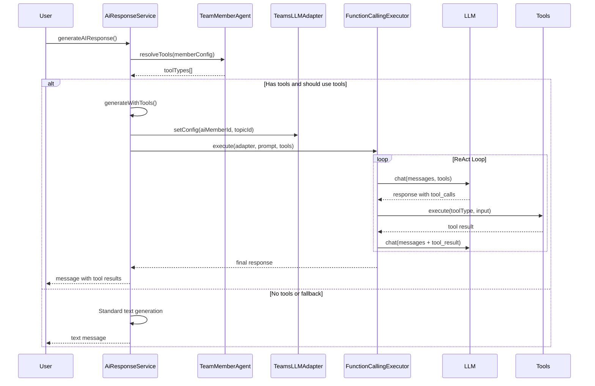

# AI-Teams 工具集成 - 实现完成

## 概述

已成功实现 `ai-teams` 模块与 `ai-agents` 工具系统的集成,使 AI 团队成员能够调用工具来完成任务。

## 实现内容

### 1. TeamsLLMAdapter - LLM 适配器

**文件**: `backend/src/modules/ai/ai-teams/agents/teams-llm-adapter.ts`

**功能**:

- 实现 `ILLMAdapter` 接口
- 复用 `AiChatService.generateChatCompletionWithKey()` 方法
- 支持从数据库或环境变量获取 API Key
- 支持 OpenAI 格式的 Function Calling
- 兼容多种 Provider (OpenAI, Anthropic, Google)

**核心方法**:

```typescript
class TeamsLLMAdapter implements ILLMAdapter {
  // 设置成员和 Topic 配置
  setConfig(config: TeamsLLMAdapterConfig): void;

  // 格式化工具定义
  formatTools(functions: FunctionDefinition[]): Tool[];

  // 解析工具调用
  parseToolCalls(response: LLMResponse): ToolCallRequest[];

  // 构建工具结果消息
  buildToolResultMessage(toolCallId, toolName, result): LLMMessage;

  // 执行 Chat Completion
  chat(options: LLMRequestOptions): Promise<LLMResponse>;
}
```

**关键特性**:

- 自动从数据库查找 AI Model 配置
- 支持环境变量 fallback
- 多 Provider 响应格式转换
- 类型安全的消息转换

### 2. AiResponseService 增强

**文件**: `backend/src/modules/ai/ai-teams/ai-response.service.ts`

**新增依赖注入**:

```typescript
constructor(
  // ... 现有依赖
  private teamMemberAgent: TeamMemberAgent,
  private teamsLLMAdapter: TeamsLLMAdapter,
  private functionCallingExecutor: FunctionCallingExecutor,
)
```

**新增方法**:

#### `shouldUseTools(aiMember)`

判断 AI 成员是否应该使用工具:

- 检查成员是否有 `capabilities`
- 检查角色描述中的关键词 (leader, researcher, analyst, etc.)
- 返回布尔值

#### `buildMemberConfig(aiMember)`

构建成员配置用于工具解析:

- 推断成员角色 (researcher, analyst, leader, etc.)
- 提取 capabilities
- 提取专业领域

#### `generateWithTools(...)`

使用工具模式生成 AI 响应:

1. 配置 `TeamsLLMAdapter`
2. 构建工具上下文 (`ToolContext`)
3. 调用 `FunctionCallingExecutor.execute()`
4. 收集工具调用事件
5. 保存最终响应到数据库

**核心流程**:

```typescript
// 执行 Function Calling
const eventGenerator = this.functionCallingExecutor.execute(
  this.teamsLLMAdapter,
  systemPrompt,
  userPrompt,
  toolTypes,
  toolContext,
  config,
);

// 收集事件
for await (const event of eventGenerator) {
  if (event.type === "tool_call") { ... }
  if (event.type === "tool_result") { ... }
  if (event.type === "complete") { ... }
  if (event.type === "error") { ... }
}
```

### 3. generateAIResponse 修改

在 `generateAIResponse()` 方法中添加工具调用逻辑:

```typescript
// 检查是否应该使用工具
const memberConfig = this.buildMemberConfig(aiMember);
const toolTypes = this.teamMemberAgent.resolveTools(memberConfig);

// 如果有工具且应该使用,尝试工具模式
if (toolTypes.length > 0 && this.shouldUseTools(aiMember)) {
  try {
    return await this.generateWithTools(
      topicId,
      aiMember,
      filteredContextMessages,
      toolTypes,
      finalSystemPrompt,
    );
  } catch (error) {
    // 降级到标准模式
    this.logger.error("Tool mode failed, falling back...");
  }
}

// ... 保留现有的纯文本生成逻辑 ...
```

**关键特性**:

- ✅ 保持向后兼容 - 不改变现有 API 接口
- ✅ 优雅降级 - 工具调用失败时自动回退到纯文本模式
- ✅ 清晰日志 - 便于调试

### 4. 模块注册

**文件**: `backend/src/modules/ai/ai-teams/ai-teams.module.ts`

**更新**:

```typescript
import { TeamMemberAgent, TeamsLLMAdapter } from "./agents";

@Module({
  providers: [
    // ... 现有 providers
    TeamMemberAgent,
    TeamsLLMAdapter,  // 新增
  ],
  exports: [
    // ... 现有 exports
    TeamMemberAgent,
    TeamsLLMAdapter,  // 新增
  ],
})
```

### 5. 导出更新

**文件**: `backend/src/modules/ai/ai-teams/agents/index.ts`

```typescript
export { TeamMemberAgent } from "./team-member.agent";
export { TeamsLLMAdapter } from "./teams-llm-adapter";
export type { TeamsLLMAdapterConfig } from "./teams-llm-adapter";
```

## 工具调用流程



## 工具分配策略

根据成员角色自动分配工具:

| 角色           | 工具类型                                                     |
| -------------- | ------------------------------------------------------------ |
| **researcher** | WEB_SEARCH, WEB_SCRAPER, RAG_SEARCH, KNOWLEDGE_GRAPH         |
| **analyst**    | DATA_ANALYSIS, PYTHON_EXECUTOR, DATABASE_QUERY               |
| **writer**     | TEXT_GENERATION, EXPORT_DOCX, EXPORT_PDF                     |
| **developer**  | CODE_GENERATION, PYTHON_EXECUTOR, GITHUB_INTEGRATION         |
| **designer**   | IMAGE_GENERATION, EXPORT_IMAGE, EXPORT_PPTX                  |
| **leader**     | TASK_DELEGATION, WORKFLOW_ORCHESTRATION, CONSENSUS_MECHANISM |
| **general**    | TEXT_GENERATION, WEB_SEARCH, SHORT_TERM_MEMORY               |

## 使用示例

### 创建支持工具的 AI 成员

```typescript
// 1. 创建 AI Member
const aiMember = await prisma.topicAIMember.create({
  data: {
    topicId: "topic-id",
    displayName: "AI Researcher",
    roleDescription: "专业的信息研究员", // 包含 "researcher" 关键词
    capabilities: ["WEB_SEARCH", "DOCUMENT_ANALYSIS"], // 会触发工具使用
    aiModel: "gpt-4",
  },
});

// 2. 用户发送消息
// 系统自动检测该成员应该使用工具
// 自动分配工具: WEB_SEARCH, WEB_SCRAPER, RAG_SEARCH...
```

### 测试工具调用

```bash
# 1. 确保 API Key 已配置
# 方式 1: 数据库中配置 AI Model
# 方式 2: 设置环境变量
export OPENAI_API_KEY=sk-xxx

# 2. 发送需要工具的消息
# 例如: "搜索 2025 年 AI 最新进展"
# AI 成员会自动调用 WEB_SEARCH 工具
```

## 错误处理

### 工具调用失败

- 记录详细错误日志
- 自动降级到纯文本模式
- 用户体验不中断

### API Key 缺失

- 优先从数据库获取
- 回退到环境变量
- 返回清晰的错误提示

### 超时和重试

- 工具执行支持超时配置
- 可选的重试策略
- 防止无限循环 (maxIterations, maxToolCalls)

## 配置选项

### ExecutionConfig

```typescript
{
  maxIterations: 5,        // 最大迭代次数
  maxToolCalls: 10,        // 最大工具调用次数
  parallelToolCalls: false, // 是否并行执行工具
  enableRetry: true,       // 是否启用重试
  temperature: 0.7,        // LLM 温度
  maxTokens: 4096,        // 最大 Token 数
}
```

## 注意事项

1. **向后兼容**: 不使用工具的 AI 成员仍然使用原有的纯文本生成逻辑
2. **性能影响**: 工具调用会增加响应时间,建议仅对需要的成员启用
3. **成本考虑**: Function Calling 会增加 Token 使用量
4. **错误恢复**: 所有工具调用失败都会降级到标准模式

## 后续优化

### 短期

- [ ] 扩展 `AiChatService` 直接支持 `tools` 参数
- [ ] 添加工具调用的可观测性 (日志、指标)
- [ ] 优化工具选择逻辑

### 中期

- [ ] 支持工具调用结果的流式输出
- [ ] 添加工具调用历史记录
- [ ] 实现工具使用统计和分析

### 长期

- [ ] 自动学习工具使用模式
- [ ] 工具组合优化
- [ ] 多 Agent 协作工具调用

## 测试清单

- [x] TypeScript 编译通过 (新增代码)
- [ ] 单元测试
  - [ ] TeamsLLMAdapter 适配器测试
  - [ ] shouldUseTools 逻辑测试
  - [ ] generateWithTools 流程测试
- [ ] 集成测试
  - [ ] 端到端工具调用测试
  - [ ] 降级逻辑测试
  - [ ] 多 Provider 兼容性测试
- [ ] 性能测试
  - [ ] 工具调用延迟测试
  - [ ] 并发工具调用测试

## 已知问题

1. `team-member.agent.ts` 中存在一些类型错误,但这些是现有代码的问题,不在本次集成范围内:
   - `ITool` vs `BaseTool` 类型不匹配
   - `getDescription()` vs `description` 属性访问
   - 这些需要单独修复

2. `AiChatService.generateChatCompletionWithKey()` 暂不直接支持 `tools` 参数,当前通过 `as any` 传递

## 参考文档

- [AI Agents 架构文档](./ai-agents-architecture.md)
- [工具系统设计](./ai-tools-design.md)
- [Function Calling 最佳实践](./function-calling-best-practices.md)
