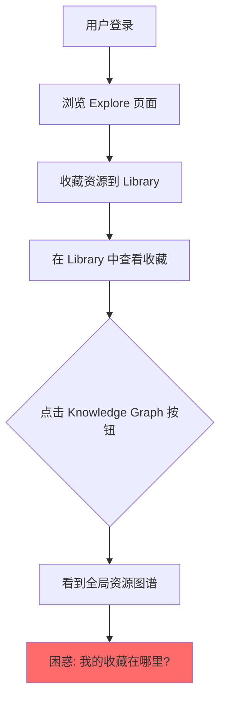
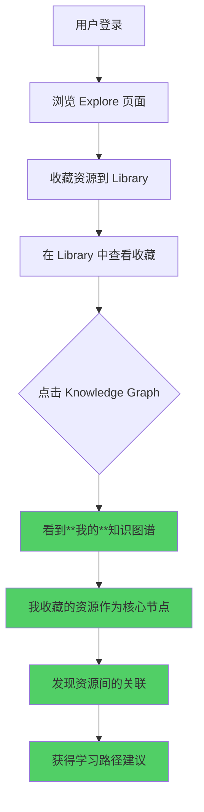

# Knowledge Graph 功能产品设计审视报告

> **版本**: v1.0
> **创建日期**: 2025-12-15
> **审视人**: 资深产品经理
> **状态**: 待评审

---

## 目录

1. [执行摘要](#1-执行摘要)
2. [目标用户分析](#2-目标用户分析)
3. [功能位置决策](#3-功能位置决策)
4. [现状分析](#4-现状分析)
5. [业界最佳实践对标](#5-业界最佳实践对标)
6. [问题诊断](#6-问题诊断)
7. [改进建议](#7-改进建议)
8. [实施路线图](#8-实施路线图)

---

## 1. 执行摘要

### 1.1 核心发现

经过对 DeepDive 项目知识图谱功能的全面审视，发现以下**关键问题**：

1. **范围定义模糊**：知识图谱究竟是"全局资源关系可视化"还是"用户个人知识体系构建"？
2. **与 Library 断层**：用户在 Library 中保存的资源无法在知识图谱中体现，两个模块完全割裂
3. **用户价值不清晰**：现有功能偏向技术展示，缺乏明确的用户场景和价值主张
4. **数据源单一**：仅从 Resource 表读取，忽略了 Collection、Note、UserActivity 等用户行为数据

### 1.2 影响评估

- **用户体验**: ⚠️ 严重 - 核心功能与用户预期严重不符
- **产品一致性**: ⚠️ 严重 - Library 与知识图谱功能割裂
- **技术架构**: ⚠️ 中等 - PostgreSQL 实现可行，但数据整合不足
- **商业价值**: ⚠️ 高 - 知识图谱是核心差异化功能，现状无法支撑产品定位

### 1.3 建议优先级

**P0 (立即修复)**：

- 明确产品定位和范围定义
- 整合 Library 数据到知识图谱

**P1 (1-2周内)**：

- 重新设计用户交互流程
- 补充用户行为数据维度

**P2 (1个月内)**：

- 优化可视化体验
- 添加个性化推荐能力

---

## 2. 目标用户分析

### 2.1 知识图谱给谁用更好？

#### 2.1.1 用户画像分析

| 用户类型       | 典型场景                     | 对知识图谱的需求强度 | 推荐程度   |
| -------------- | ---------------------------- | -------------------- | ---------- |
| **研究型用户** | 学术研究、技术调研、论文综述 | **极高**             | ⭐⭐⭐⭐⭐ |
| **学习型用户** | 系统学习某领域、构建知识体系 | **高**               | ⭐⭐⭐⭐   |
| **创作型用户** | 写博客、做分享、内容创作     | **中高**             | ⭐⭐⭐⭐   |
| **浏览型用户** | 偶尔浏览、随便看看           | **低**               | ⭐⭐       |
| **收藏型用户** | 大量收藏但很少整理           | **中**               | ⭐⭐⭐     |

#### 2.1.2 核心目标用户（Primary Users）

**画像 1：深度研究者**

```
姓名：张博士
角色：AI 研究员 / 技术专家
行为特征：
- 收藏 100+ 篇论文和技术文章
- 需要理清论文之间的引用关系
- 关注某几个核心作者的研究脉络
- 定期输出技术报告或论文

对知识图谱的期望：
✅ 看到论文之间的引用和被引用关系
✅ 发现研究领域的演进路径
✅ 找到尚未阅读但被频繁引用的重要论文
✅ 按主题/作者/时间筛选图谱视图
```

**画像 2：系统学习者**

```
姓名：李同学
角色：在职学习者 / 转行人士
行为特征：
- 正在系统学习某个领域（如 AI、区块链）
- 收藏了多个学习路径相关的资源
- 需要知道"我学了什么，还缺什么"
- 希望有清晰的学习进度可视化

对知识图谱的期望：
✅ 看到自己的知识覆盖范围
✅ 发现知识盲点（别人都学了但我没学的）
✅ 获得"下一步该学什么"的建议
✅ 看到学习进度的可视化
```

**画像 3：内容创作者**

```
姓名：王老师
角色：技术博主 / 培训讲师
行为特征：
- 需要整理素材写文章或课程
- 收藏的资源需要建立关联
- 希望发现可以串联的知识点
- 输出需要有逻辑性和完整性

对知识图谱的期望：
✅ 快速找到可以关联的资源
✅ 发现主题之间的隐藏联系
✅ 导出图谱作为课程/文章的配图
✅ 验证内容的完整性（是否有遗漏）
```

#### 2.1.3 次要目标用户（Secondary Users）

**画像 4：收藏整理者**

```
姓名：赵收藏家
角色：信息囤积者
行为特征：
- 收藏了大量资源但很少阅读
- 偶尔想整理但不知道从何下手
- 希望有工具帮助"看清自己收藏了什么"

对知识图谱的期望：
✅ 自动整理收藏的资源
✅ 发现重复或相似的收藏
✅ 给收藏打标签分类
```

#### 2.1.4 非目标用户

| 用户类型     | 为什么不适合                 | 应引导到哪里       |
| ------------ | ---------------------------- | ------------------ |
| 纯浏览用户   | 没有个人知识积累，图谱无意义 | Explore 页面       |
| 一次性用户   | 不需要知识管理               | 搜索功能           |
| 团队协作用户 | 当前版本不支持团队图谱       | 等待 v2.0 协作功能 |

#### 2.1.5 用户分层策略

```
                    用户金字塔

                   /\
                  /  \
                 / 5% \    深度研究者 → 知识图谱 Pro 功能
                /------\
               /  15%   \   系统学习者 → 知识图谱 + 学习路径
              /----------\
             /    30%     \  内容创作者 → 知识图谱 + 导出功能
            /--------------\
           /      50%       \ 普通用户 → Library + 简化图谱入口
          /------------------\
```

**策略建议**：

1. **核心聚焦**：优先服务深度研究者和系统学习者（20% 用户）
2. **功能分层**：为不同用户提供不同复杂度的图谱视图
3. **渐进引导**：普通用户通过简化入口逐步发现图谱价值

---

## 3. 功能位置决策

### 3.1 知识图谱应该放在哪里？

#### 3.1.1 位置选项分析

| 位置选项            | 描述                         | 优点                     | 缺点                          | 推荐度     |
| ------------------- | ---------------------------- | ------------------------ | ----------------------------- | ---------- |
| **A. Library 内嵌** | 作为 Library 的一个视图/Tab  | 上下文完整，数据关联自然 | 占用 Library 空间，复杂度增加 | ⭐⭐⭐⭐⭐ |
| **B. 独立页面**     | 单独的 /knowledge-graph 页面 | 沉浸式体验，空间大       | 与 Library 割裂，上下文丢失   | ⭐⭐⭐     |
| **C. 侧边抽屉**     | Library 右侧可展开的面板     | 可同时查看列表和图谱     | 空间受限，大图谱体验差        | ⭐⭐⭐⭐   |
| **D. 浮动窗口**     | 可拖拽的浮动窗口             | 灵活，不影响主界面       | 移动端不适用，管理复杂        | ⭐⭐       |
| **E. Explore 内嵌** | 作为 Explore 的可视化模式    | 发现新内容               | 不是个人知识，定位不符        | ⭐⭐       |

#### 3.1.2 推荐方案：Library 内嵌 + 独立页面（双入口）

**核心设计理念**：

> 知识图谱是 Library 的可视化形态，本质上是同一份数据的不同呈现方式。

**具体方案**：

```
┌─────────────────────────────────────────────────────────────────┐
│                          Library 页面                           │
├─────────────────────────────────────────────────────────────────┤
│  ┌─────────────────────────────────────────────────────────┐   │
│  │   [列表视图] [卡片视图] [图谱视图]  ← 视图切换 Tab         │   │
│  └─────────────────────────────────────────────────────────┘   │
│                                                                 │
│  当选择"图谱视图"时：                                           │
│  ┌─────────────────────────────────────────────────────────┐   │
│  │                                                         │   │
│  │           简化版知识图谱（内嵌）                          │   │
│  │                                                         │   │
│  │    [○]───[○]───[○]                                      │   │
│  │     │     │     │                                       │   │
│  │    [○]   [○]   [○]      [🔗 打开完整图谱]                │   │
│  │                                                         │   │
│  └─────────────────────────────────────────────────────────┘   │
│                                                                 │
└─────────────────────────────────────────────────────────────────┘

点击"打开完整图谱"后：
                              ↓

┌─────────────────────────────────────────────────────────────────┐
│                    Knowledge Graph 独立页面                      │
│                    (保持 Library 上下文)                         │
├─────────────────────────────────────────────────────────────────┤
│  ← 返回 Library                     当前范围：我的收藏           │
│                                     Collection: [AI 研究 ▼]      │
├─────────────────────────────────────────────────────────────────┤
│                                                                 │
│                      完整版知识图谱                              │
│                                                                 │
│         [○]─────[○]─────[○]─────[○]                            │
│          │       │       │       │                              │
│         [○]     [○]     [○]     [○]                            │
│          │       │               │                              │
│         [○]─────[○]─────────────[○]                            │
│                                                                 │
│  ┌────────────────┐                                             │
│  │ 筛选面板       │                                             │
│  │ - Collection   │                                             │
│  │ - 时间范围     │                                             │
│  │ - 节点类型     │                                             │
│  └────────────────┘                                             │
│                                                                 │
└─────────────────────────────────────────────────────────────────┘
```

#### 3.1.3 入口和导航设计

**入口 1：Library 视图切换**

```tsx
// Library 页面顶部
<ViewSwitcher>
  <ViewTab icon={<ListIcon />} label="列表" active={view === "list"} />
  <ViewTab icon={<GridIcon />} label="卡片" active={view === "grid"} />
  <ViewTab icon={<GraphIcon />} label="图谱" active={view === "graph"} />
</ViewSwitcher>
```

**入口 2：Collection 右键菜单/快捷操作**

```tsx
// Collection 卡片的操作菜单
<DropdownMenu>
  <MenuItem onClick={() => openGraphForCollection(collectionId)}>
    <GraphIcon /> 在图谱中查看
  </MenuItem>
</DropdownMenu>
```

**入口 3：资源详情页**

```tsx
// 资源详情页的关联面板
<RelatedSection>
  <h3>相关资源</h3>
  <Button onClick={() => openGraphWithFocus(resourceId)}>
    <GraphIcon /> 在图谱中查看关系
  </Button>
</RelatedSection>
```

**入口 4：导航栏（可选，低优先级）**

```tsx
// 侧边栏导航
<NavItem href="/knowledge-graph" icon={<GraphIcon />}>
  Knowledge Graph
</NavItem>
// 注：此入口作为"我的知识全景"，显示用户所有收藏的图谱
```

#### 3.1.4 URL 结构设计

```
/library                           → Library 列表视图
/library?view=graph                → Library 图谱视图（内嵌简化版）
/library?view=graph&collection=xxx → 特定 Collection 的图谱视图

/knowledge-graph                   → 完整知识图谱页面（全部收藏）
/knowledge-graph?collection=xxx    → 特定 Collection 的完整图谱
/knowledge-graph?focus=resourceId  → 以某资源为中心的图谱
/knowledge-graph?tag=xxx           → 特定标签的图谱
```

#### 3.1.5 数据范围决策

| 入口来源         | 默认数据范围         | 可扩展范围      |
| ---------------- | -------------------- | --------------- |
| Library 视图切换 | 当前 Collection      | 所有收藏        |
| Collection 右键  | 该 Collection        | 相关 Collection |
| 资源详情页       | 以该资源为中心 2-hop | 扩展到 3-hop    |
| 导航栏直接访问   | 用户所有收藏         | 按筛选条件调整  |

#### 3.1.6 与其他模块的关系

```
┌─────────────────────────────────────────────────────────────────┐
│                         DeepDive 产品架构                        │
├─────────────────────────────────────────────────────────────────┤
│                                                                 │
│   ┌─────────┐     ┌─────────┐     ┌─────────────────────────┐  │
│   │ Explore │────▶│ Library │────▶│    Knowledge Graph      │  │
│   │ (发现)  │收藏  │ (管理)  │可视化│    (洞察)              │  │
│   └─────────┘     └─────────┘     └─────────────────────────┘  │
│        │               │                      │                 │
│        ▼               ▼                      ▼                 │
│   "找到好内容"    "整理我的收藏"       "理解知识关系"           │
│                                                                 │
│   ──────────────────────────────────────────────────────────   │
│                                                                 │
│   知识图谱是 Library 的延伸，不是独立功能                        │
│   图谱的数据来源 = 用户在 Library 中的收藏                       │
│                                                                 │
└─────────────────────────────────────────────────────────────────┘
```

### 3.2 最终决策建议

**决策 1：知识图谱的归属**

> ✅ 知识图谱属于 Library 模块，是 Library 数据的可视化呈现

**决策 2：主入口位置**

> ✅ Library 页面的视图切换（列表/卡片/图谱）

**决策 3：完整体验入口**

> ✅ 支持"打开完整图谱"跳转到独立页面，但保持 Library 上下文

**决策 4：默认数据范围**

> ✅ 默认显示用户的个人知识（收藏），不显示全局数据

**决策 5：导航栏入口**

> ⚠️ 暂不添加到主导航，待功能成熟后再评估

---

## 4. 现状分析

### 2.1 当前功能架构

#### 2.1.1 前端实现

**文件**: `frontend/app/knowledge-graph/page.tsx`

**核心功能**：

- 独立页面，从 `/knowledge-graph/overview` API 获取数据
- 显示节点统计：Resources、Authors、Topics、Tags
- 支持布局切换：力导向、环形、层次
- 可点击节点查看详情

**问题点**：

```typescript
// 仅获取全局概览数据，没有用户个性化
const response = await fetch(`${config.apiUrl}/knowledge-graph/overview`);

// 没有与 Library 的关联
// 用户无法看到"我收藏的资源"在图谱中的位置
```

#### 2.1.2 后端服务

**文件**: `backend/src/common/graph/graph.service.ts`

**数据来源**：

```typescript
// 仅从 Resource 表查询最新 100 条记录
const resources = await this.prisma.resource.findMany({
  take: MAX_RESOURCES,
  orderBy: { createdAt: "desc" },
  // ...
});
```

**构建逻辑**：

1. 遍历 Resource 记录
2. 从 `authors` JSON 字段提取作者节点
3. 从 `categories`、`tags` 字段提取主题/标签节点
4. 创建 `AUTHORED`、`BELONGS_TO`、`TAGGED_WITH` 关系

**缺失内容**：

- ❌ 没有用户维度数据（Collection、Note、UserActivity）
- ❌ 没有资源间的相似关系（虽有 `findSimilarResources` 方法但未在概览中使用）
- ❌ 没有用户的知识掌握状态（MASTERS 关系）
- ❌ 没有学习路径数据

#### 2.1.3 可视化组件

**文件**: `frontend/components/shared/views/KnowledgeGraphView.tsx`

**技术实现**：

- 使用 D3.js 力导向布局
- 节点类型：Resource、Author、Topic、Tag
- 节点大小根据连接数动态调整
- 支持拖拽、缩放、高亮

**用户体验问题**：

- 节点过多时难以浏览（100个 Resource + Authors + Topics + Tags）
- 缺乏筛选和聚焦能力
- 无法突出用户相关内容

### 2.2 数据范围和来源

#### 2.2.1 当前数据范围

| 数据类型 | 来源表                        | 是否包含 | 说明        |
| -------- | ----------------------------- | -------- | ----------- |
| 资源     | `resources`                   | ✅       | 最新 100 条 |
| 作者     | `resources.authors` (JSON)    | ✅       | 从资源提取  |
| 主题     | `resources.categories` (JSON) | ✅       | 从资源提取  |
| 标签     | `resources.tags` (JSON)       | ✅       | 从资源提取  |
| 用户收藏 | `collection_items`            | ❌       | **缺失**    |
| 用户笔记 | `notes`                       | ❌       | **缺失**    |
| 用户行为 | `user_activities`             | ❌       | **缺失**    |
| 学习路径 | `learning_paths`              | ❌       | **缺失**    |

#### 2.2.2 数据库设计对照

根据 `backend/prisma/schema.prisma`，实际可用的数据结构：

```prisma
// 用户收藏关系
model CollectionItem {
  id           String
  collectionId String
  resourceId   String
  note         String?    // 用户笔记！
  tags         String[]   // 用户标签！
  readStatus   ReadStatus // 阅读状态！
  addedAt      DateTime
}

// 用户活动
model UserActivity {
  userId       String
  resourceId   String
  activityType ActivityType  // VIEW, SAVE, UPVOTE 等
  createdAt    DateTime
}

// 用户笔记
model Note {
  id         String
  userId     String
  resourceId String?
  content    String
  tags       String[]
}
```

**关键发现**：

- ✅ 数据库已有完整的用户行为数据
- ❌ 知识图谱服务完全没有使用这些数据
- ❌ 存在严重的功能-数据脱节问题

### 2.3 用户交互流程

#### 2.3.1 当前用户路径



#### 2.3.2 用户预期路径



#### 2.3.3 功能入口分析

**Library 页面** (`frontend/app/library/page.tsx`):

```typescript
// Line 1301-1320: 存在 Knowledge Graph 入口
<Link
  href="/knowledge-graph"
  className="flex items-center gap-1.5 rounded border border-gray-300"
  title="View Knowledge Graph"
>
  <svg>...</svg>
  Graph
</Link>
```

**问题**：

- 入口在 Library 页面，暗示用户期望是"我的知识图谱"
- 实际跳转到独立页面，显示全局数据
- **期望与现实严重不符**

---

## 3. 业界最佳实践对标

### 3.1 Obsidian: 网络化知识管理标杆

#### 3.1.1 核心设计理念

> "Obsidian focuses on creating interconnected knowledge, and it does this better than any other app on the planet. Obsidian treats your notes like a brain—everything connects to everything else through a beautiful web of bidirectional links."

**关键特性**：

1. **双向链接** (Bidirectional Links)
   - 自动追踪反向链接
   - 每个笔记都知道"谁引用了我"

2. **本地优先** (Local-first)
   - 所有数据存储在本地
   - 用户完全拥有自己的知识库

3. **图谱视图的多层次性**
   - **全局图谱**: 展示整个知识库的结构
   - **局部图谱**: 聚焦于当前笔记的关联
   - **动态过滤**: 可按标签、链接深度筛选

4. **用户控制权**
   - 用户决定哪些节点显示
   - 支持手动调整节点位置（固定布局）

#### 3.1.2 对 DeepDive 的启示

| Obsidian 特性    | DeepDive 现状             | 建议                              |
| ---------------- | ------------------------- | --------------------------------- |
| 双向链接自动追踪 | ❌ 无                     | ✅ 添加资源间的引用关系           |
| 局部图谱聚焦     | ❌ 仅全局概览             | ✅ 支持"从某个收藏出发"的局部视图 |
| 动态过滤         | ⚠️ 布局切换，但无内容筛选 | ✅ 添加按 Collection/Tag 筛选     |
| 用户数据为中心   | ❌ 显示所有资源           | ✅ 默认显示用户相关数据           |

### 3.2 Roam Research: 每日笔记 + 网络思维

#### 3.2.1 核心设计理念

> "Roam Research organizes information in a non-linear, networked structure. Unlike traditional note apps that rely on folders and hierarchies, Roam is designed around bi-directional linking."

**关键特性**：

1. **每日笔记驱动** (Daily Notes)
   - 时间线作为知识捕获的锚点
   - 后续整理到知识网络

2. **块引用** (Block References)
   - 任何内容块都可以被引用
   - 形成更细粒度的知识连接

3. **图谱即查询结果**
   - 图谱不是静态展示，而是动态查询结果
   - 支持复杂的关系查询

#### 3.2.2 对 DeepDive 的启示

| Roam 特性    | DeepDive 现状          | 建议                                              |
| ------------ | ---------------------- | ------------------------------------------------- |
| 时间维度     | ⚠️ 仅按 createdAt 排序 | ✅ 支持按时间轴查看知识演进                       |
| 细粒度引用   | ❌ 仅资源级别          | ⚠️ 中期考虑支持笔记块引用                         |
| 图谱作为查询 | ❌ 固定的全局视图      | ✅ 支持"查询式图谱"（例如"我本周收藏的 AI 资源"） |

### 3.3 Notion: 协作 + 数据库思维

#### 3.3.1 核心设计理念

> "Notion distinguishes itself as the versatile workspace for bringing together notes, databases, kanban boards, and calendars into one visually appealing canvas."

**关键特性**：

1. **关系数据库**
   - 通过 Relation 字段连接不同数据库
   - 可视化展示数据间关系

2. **多视图切换**
   - Table、Board、Gallery、Timeline
   - 同一数据的不同视角

3. **协作优先**
   - 实时协作编辑
   - 权限管理

#### 3.3.2 Notion 的知识图谱局限

- ❌ **没有原生图谱功能**
- ⚠️ 需要第三方插件（如 [graphcentral/notion](https://github.com/graphcentral/notion)）
- ✅ 但 Relation 数据库提供了结构化的关系管理

#### 3.3.3 对 DeepDive 的启示

| Notion 特性 | DeepDive 现状        | 建议                      |
| ----------- | -------------------- | ------------------------- |
| 多视图切换  | ⚠️ 仅图谱视图        | ✅ 补充列表、看板视图     |
| 关系数据库  | ✅ PostgreSQL 已支持 | ✅ 在 UI 层暴露关系管理   |
| 协作功能    | ❌ 无                | ⚠️ 长期规划（非当前重点） |

### 3.4 业界共识的知识图谱设计原则

综合对比 Obsidian、Roam、Logseq 等工具，提炼出以下**共识原则**：

#### 3.4.1 数据范围原则

| 原则           | 说明                                            | DeepDive 现状          | 优先级 |
| -------------- | ----------------------------------------------- | ---------------------- | ------ |
| **用户中心**   | 默认显示用户相关数据，而非全局数据              | ❌ 显示全局 100 条资源 | P0     |
| **可控边界**   | 用户可自定义图谱范围（如某个文件夹/Collection） | ❌ 无法筛选            | P1     |
| **渐进式展开** | 从核心节点开始，逐步展开关联                    | ❌ 一次性加载所有      | P1     |
| **深度控制**   | 用户可设置关系深度（1-3 跳）                    | ⚠️ 固定深度 2          | P2     |

#### 3.4.2 可视化原则

| 原则         | 说明                                 | DeepDive 现状         | 优先级 |
| ------------ | ------------------------------------ | --------------------- | ------ |
| **视觉层次** | 核心节点更大/更亮，外围节点弱化      | ⚠️ 仅按连接数调整大小 | P1     |
| **语义颜色** | 颜色表达节点类型/状态（如已读/未读） | ⚠️ 仅按类型着色       | P1     |
| **交互反馈** | 高亮选中节点及其关联                 | ✅ 已支持             | -      |
| **布局稳定** | 支持固定节点位置，避免每次重新布局   | ❌ 无                 | P2     |

#### 3.4.3 功能集成原则

| 原则           | 说明                                      | DeepDive 现状         | 优先级 |
| -------------- | ----------------------------------------- | --------------------- | ------ |
| **上下文一致** | 从 Library 进入图谱，应聚焦 Library 数据  | ❌ 跳转到独立全局视图 | P0     |
| **双向导航**   | 从图谱可跳回资源详情/Library              | ⚠️ 仅"查看详情"按钮   | P1     |
| **就地编辑**   | 在图谱中可直接编辑关系（如添加/删除标签） | ❌ 无                 | P2     |

---

## 4. 问题诊断

### 4.1 产品定位问题

#### 4.1.1 范围定义模糊

**问题描述**：
知识图谱究竟是：

- A. **全局资源探索工具** - 展示 DeepDive 平台上所有资源的关系？
- B. **个人知识管理工具** - 展示用户自己的知识体系（收藏、笔记、学习路径）？

**当前实现倾向**：A（全局资源），但入口设计暗示 B（个人知识）

**影响**：

- 用户从 Library 点击 Graph 按钮，期望看到"我的知识图谱"
- 实际看到全局 100 条最新资源，产生困惑

**根因分析**：

1. 需求文档未明确定义产品边界
2. 技术实现时选择了"最简单"的全局查询方案
3. 缺乏产品-设计-开发对齐环节

#### 4.1.2 目标用户场景缺失

**问题**：没有明确的用户故事和使用场景

**应该回答的问题**：

- 用户在什么情况下会使用知识图谱？
- 用户通过知识图谱想解决什么问题？
- 知识图谱如何帮助用户完成核心任务（学习、研究、创作）？

**当前状态**：

- ❌ 没有文档定义用户场景
- ❌ 功能更像技术 Demo，而非产品功能
- ❌ 缺乏从用户价值倒推的设计思路

### 4.2 信息架构问题

#### 4.2.1 与 Library 模块割裂

**问题清单**：

1. **数据不互通**

   ```typescript
   // Knowledge Graph Service
   const resources = await this.prisma.resource.findMany({
     take: MAX_RESOURCES,
     orderBy: { createdAt: "desc" },
   });
   // 完全忽略了 collection_items 表！
   ```

2. **用户行为数据缺失**
   - Library 中用户的收藏、笔记、标签全部未体现
   - 无法看到"我重点关注的资源"在知识网络中的位置

3. **导航路径断裂**
   - Library → Graph：跳转到独立页面，丢失上下文
   - 无法"从某个收藏集出发"查看图谱

#### 4.2.2 节点和关系设计不足

**当前节点类型**：

- Resource
- Author（从 `resources.authors` JSON 提取）
- Topic（从 `resources.categories` JSON 提取）
- Tag（从 `resources.tags` JSON 提取）

**缺失的关键节点**：

- ❌ **User** - 用户自己作为知识图谱的中心
- ❌ **Collection** - 用户的收藏集
- ❌ **Note** - 用户的笔记（可作为独立知识单元）
- ❌ **Learning Path** - 学习路径

**当前关系类型**：

- `AUTHORED` (Author → Resource)
- `BELONGS_TO` (Resource → Topic)
- `TAGGED_WITH` (Resource → Tag)

**缺失的关键关系**：

- ❌ `SAVED_BY` (User → Resource)
- ❌ `NOTED_ON` (User → Resource/Note)
- ❌ `SIMILAR_TO` (Resource ↔ Resource)
- ❌ `CITED_BY` / `REFERS_TO` (Resource ↔ Resource)
- ❌ `IN_PATH` (Resource → LearningPath)

#### 4.2.3 数据来源单一

**问题**：仅从 `resources` 表查询，忽略了丰富的用户行为数据

**数据库中可用但未使用的数据**：

| 表名               | 可提供的价值                         | 当前是否使用 |
| ------------------ | ------------------------------------ | ------------ |
| `collection_items` | 用户收藏关系、笔记、标签             | ❌           |
| `notes`            | 用户笔记作为独立知识节点             | ❌           |
| `user_activities`  | 用户浏览、点赞等行为，可计算兴趣权重 | ❌           |
| `learning_paths`   | 学习路径和步骤                       | ❌           |
| `user_interests`   | 用户兴趣标签和权重                   | ❌           |

**影响**：

- 知识图谱成为"冷冰冰的数据关系展示"
- 缺乏个性化和用户相关性
- 无法体现用户的知识成长轨迹

### 4.3 用户体验问题

#### 4.3.1 认知负荷过高

**问题描述**：

- 一次性加载 100 个 Resource + 所有 Authors + 所有 Topics/Tags
- 节点数量可能达到 200-500 个
- 用户难以找到重点

**与业界对比**：

- Obsidian：默认只显示与当前笔记相关的节点
- Roam：从 Daily Note 或特定 Page 出发的局部视图
- DeepDive：直接抛出全局大图 ❌

#### 4.3.2 缺乏筛选和聚焦能力

**当前支持的交互**：

- ✅ 布局切换（力导向/环形/层次）
- ✅ 点击节点高亮
- ✅ 拖拽和缩放

**缺失的关键交互**：

- ❌ 按 Collection 筛选（"只看我的 AI 资源收藏"）
- ❌ 按时间筛选（"只看本周收藏的"）
- ❌ 按 Tag 筛选
- ❌ 按关系深度筛选（1-hop、2-hop）
- ❌ 搜索和定位节点

#### 4.3.3 视觉信息传达不足

**问题清单**：

1. **节点状态不明确**
   - 无法区分"已读"和"未读"资源
   - 无法看出哪些是"我收藏的"
   - 无法看出资源的质量评分

2. **边的语义弱化**

   ```typescript
   // 当前：边只有类型和颜色
   stroke: type === "AUTHORED"
     ? "#10b981"
     : type === "BELONGS_TO"
       ? "#f59e0b"
       : "#ef4444";
   ```

   - 缺少边的权重（如引用次数、相似度）
   - 缺少方向指示（尤其是 CITED_BY 等有向关系）

3. **缺乏数据概览**
   - 顶部显示节点总数，但无法快速了解图谱结构
   - 缺少"度分布"、"聚类情况"等统计信息

### 4.4 技术实现问题

#### 4.4.1 性能隐患

**问题**：

```typescript
// 查询所有资源的所有字段
const resources = await this.prisma.resource.findMany({
  take: MAX_RESOURCES,
  orderBy: { createdAt: "desc" },
  select: {
    id: true,
    title: true,
    type: true,
    authors: true, // JSON 字段，可能很大
    categories: true,
    tags: true,
    primaryCategory: true,
  },
});
```

**潜在风险**：

- `authors` JSON 可能包含大量信息（name、affiliation、email 等）
- 随着资源增长，查询时间会增加
- 前端一次性渲染大量节点会卡顿

**改进方向**：

- 分页加载或按需加载
- 只查询必要字段
- 考虑服务端聚合（如预计算节点度数）

#### 4.4.2 缓存策略缺失

**问题**：

- 每次访问 `/knowledge-graph/overview` 都重新查询数据库
- 数据变化不频繁，但每次都重新计算

**建议**：

```typescript
// 建议的缓存策略
const cacheKey = `kg:overview:user:${userId}`;
const cached = await redis.get(cacheKey);
if (cached) return JSON.parse(cached);

// 计算图谱数据...
await redis.setex(cacheKey, 600, JSON.stringify(result)); // 10分钟
```

#### 4.4.3 前后端职责划分不清

**问题**：

- 后端返回原始节点和边数据
- 前端负责布局计算（D3 力导向）
- 对于大规模图谱，布局计算可能很耗时

**改进方向**：

- 考虑服务端预计算布局（如使用 Graphology + Force Atlas 2）
- 或使用 WebGL 渲染（如 Sigma.js）提升性能

---

## 5. 改进建议

### 5.1 明确产品定位

#### 5.1.1 推荐定位（方案 A）

**定位**：**个人知识网络可视化工具**

**核心价值主张**：

> "在 DeepDive 中，知识图谱是你个人知识体系的可视化。通过图谱，你可以看到自己收藏的资源如何相互关联、发现知识盲点、获得个性化的学习路径建议。"

**范围界定**：

1. **默认范围**：用户的 Library（收藏、笔记）
2. **可选扩展**：与用户兴趣相关的推荐资源（作为"待探索"节点）
3. **全局视图**：作为高级功能，帮助用户发现新内容

**用户场景**：

- 场景 1：用户收藏了 50 篇 Transformer 相关论文，想看看它们之间的关系
- 场景 2：用户学习 AI，图谱帮助发现"我已掌握 A，但引用 A 的论文 B 我还没读"
- 场景 3：用户创作博客，从图谱中发现可以串联的知识点

#### 5.1.2 备选定位（方案 B）

**定位**：**领域知识探索工具**

**核心价值主张**：

> "DeepDive 的知识图谱展示了 AI 领域的知识演进脉络。通过图谱，你可以看到技术如何迭代、论文如何相互引用、哪些方向正在兴起。"

**范围界定**：

1. **默认范围**：DeepDive 平台上的所有资源
2. **筛选维度**：按领域、时间、影响力筛选
3. **个人视角**：通过高亮用户收藏来体现个性化

**用户场景**：

- 场景 1：用户想了解 Transformer 技术的演进历程
- 场景 2：用户发现某作者的多篇论文形成了一个研究方向
- 场景 3：用户通过图谱发现新兴技术趋势

#### 5.1.3 推荐方案对比

| 维度                   | 方案 A（个人知识网络）    | 方案 B（领域探索）    | 推荐 |
| ---------------------- | ------------------------- | --------------------- | ---- |
| 与 Library 一致性      | ✅ 高度一致               | ⚠️ 需独立入口         | A    |
| 用户价值清晰度         | ✅ 直接帮助用户整理知识   | ⚠️ 更像内容发现工具   | A    |
| 技术实现复杂度         | ⚠️ 需整合用户数据         | ✅ 当前已基本实现     | -    |
| 差异化竞争力           | ✅ 对标 Obsidian/Roam     | ⚠️ 对标学术图谱工具   | A    |
| 与 DeepDive 定位契合度 | ✅ 符合"个人研究助手"定位 | ⚠️ 偏向"信息聚合平台" | A    |

**最终推荐**：**方案 A - 个人知识网络可视化工具**

**理由**：

1. 与 Library 模块定位一致，避免功能割裂
2. 用户价值更明确，有清晰的使用场景
3. 差异化竞争优势更强（对标 Obsidian）
4. 符合 DeepDive 作为"个人研究助手"的产品定位

### 5.2 功能设计改进方案

#### 5.2.1 P0: 整合 Library 数据

**目标**：让知识图谱真正体现用户的知识体系

**具体改进**：

1. **修改默认数据源**

   ```typescript
   // 当前（错误）
   const resources = await this.prisma.resource.findMany({
     take: 100,
     orderBy: { createdAt: "desc" }
   });

   // 改进后（正确）
   async getGraphOverview(userId: string) {
     // 1. 获取用户收藏的资源
     const collectionItems = await this.prisma.collectionItem.findMany({
       where: {
         collection: { userId }
       },
       include: {
         resource: true,
         collection: true
       }
     });

     // 2. 构建节点
     const nodes = [];
     const edges = [];

     // 2.1 用户节点（中心）
     nodes.push({
       id: `user-${userId}`,
       type: 'User',
       label: 'Me',
       properties: { ... }
     });

     // 2.2 收藏集节点
     const collections = groupBy(collectionItems, 'collectionId');
     for (const [collectionId, items] of collections) {
       nodes.push({
         id: `collection-${collectionId}`,
         type: 'Collection',
         label: items[0].collection.name,
         properties: { itemCount: items.length }
       });

       edges.push({
         source: `user-${userId}`,
         target: `collection-${collectionId}`,
         type: 'OWNS'
       });
     }

     // 2.3 资源节点
     for (const item of collectionItems) {
       nodes.push({
         id: item.resource.id,
         type: 'Resource',
         label: item.resource.title,
         properties: {
           readStatus: item.readStatus,  // ✅ 用户状态
           userNote: item.note,           // ✅ 用户笔记
           userTags: item.tags            // ✅ 用户标签
         }
       });

       edges.push({
         source: `collection-${item.collectionId}`,
         target: item.resource.id,
         type: 'CONTAINS'
       });
     }

     // 2.4 作者、主题、标签节点（同现有逻辑）
     // ...

     return { nodes, edges };
   }
   ```

2. **添加用户笔记节点**

   ```typescript
   // 获取用户的独立笔记（不关联资源的）
   const notes = await this.prisma.note.findMany({
     where: {
       userId,
       resourceId: null, // 独立笔记
     },
   });

   for (const note of notes) {
     nodes.push({
       id: `note-${note.id}`,
       type: "Note",
       label: note.title || note.content.slice(0, 50),
       properties: {
         content: note.content,
         tags: note.tags,
       },
     });

     edges.push({
       source: `user-${userId}`,
       target: `note-${note.id}`,
       type: "CREATED",
     });
   }
   ```

3. **添加资源间相似关系**
   ```typescript
   // 利用现有的 findSimilarResources 方法
   for (const item of collectionItems) {
     const similar = await this.findSimilarResources(item.resourceId, 3);
     for (const { resource, commonCount } of similar) {
       // 只添加也在用户收藏中的相似资源
       if (collectionResourceIds.has(resource.id)) {
         edges.push({
           source: item.resourceId,
           target: resource.id,
           type: "SIMILAR_TO",
           weight: commonCount, // ✅ 边的权重
         });
       }
     }
   }
   ```

**预期效果**：

- ✅ 用户看到的是"我的知识图谱"，而非全局数据
- ✅ 节点包含用户的阅读状态、笔记、标签
- ✅ Collection 作为知识组织的容器清晰可见

#### 5.2.2 P0: 重新设计入口和导航

**问题**：当前从 Library 跳转到独立页面，丢失上下文

**方案 1：侧边面板（推荐）**

```typescript
// Library 页面右侧添加可折叠的 Graph Panel
<div className="flex">
  <div className="flex-1">
    {/* 原 Library 内容 */}
  </div>

  <div className={`transition-all ${graphPanelOpen ? 'w-1/2' : 'w-0'}`}>
    <KnowledgeGraphPanel
      focusType="collection"
      focusId={activeCollectionId}
      onNodeClick={(node) => {
        // 跳转到资源详情或笔记
      }}
    />
  </div>
</div>
```

**优点**：

- 保持在 Library 页面，上下文不丢失
- 可以边看图谱边管理收藏
- 支持双向导航

**方案 2：独立页面 + 上下文参数**

```typescript
// Library 按钮携带参数
<Link href={`/knowledge-graph?source=library&collectionId=${activeCollectionId}`}>
  View Graph
</Link>

// Knowledge Graph 页面读取参数，决定显示内容
const searchParams = useSearchParams();
const source = searchParams.get('source');
const collectionId = searchParams.get('collectionId');

if (source === 'library') {
  // 显示该 Collection 的图谱
}
```

**优点**：

- 保持独立页面的完整性
- 通过 URL 参数维持上下文
- 支持分享图谱链接

**推荐**：先实现方案 2（更快），再考虑方案 1（更优）

#### 5.2.3 P1: 添加筛选和聚焦能力

**筛选维度设计**：

```typescript
interface GraphFilters {
  // 1. 数据范围筛选
  scope: 'all' | 'collection' | 'tag' | 'time';
  collectionId?: string;      // 当 scope = 'collection'
  tag?: string;               // 当 scope = 'tag'
  dateRange?: [Date, Date];   // 当 scope = 'time'

  // 2. 节点类型筛选
  nodeTypes: ('Resource' | 'Author' | 'Topic' | 'Tag' | 'Note' | 'Collection')[];

  // 3. 关系类型筛选
  edgeTypes: ('SAVED_BY' | 'AUTHORED' | 'BELONGS_TO' | 'SIMILAR_TO' | ...)[];

  // 4. 深度筛选
  maxDepth: 1 | 2 | 3;

  // 5. 阅读状态筛选（个人知识图谱特有）
  readStatus?: ('UNREAD' | 'READING' | 'COMPLETED')[];
}
```

**UI 设计**：

```tsx
<div className="graph-filters">
  <select value={filters.scope} onChange={...}>
    <option value="all">All My Knowledge</option>
    <option value="collection">Specific Collection</option>
    <option value="tag">By Tag</option>
    <option value="time">By Time Range</option>
  </select>

  {filters.scope === 'collection' && (
    <select value={filters.collectionId} onChange={...}>
      {collections.map(c => <option key={c.id}>{c.name}</option>)}
    </select>
  )}

  <div className="node-type-filters">
    <label><input type="checkbox" checked={...} /> Resources</label>
    <label><input type="checkbox" checked={...} /> Authors</label>
    <label><input type="checkbox" checked={...} /> Notes</label>
  </div>

  <div className="depth-slider">
    <label>Relationship Depth: {filters.maxDepth}</label>
    <input type="range" min="1" max="3" value={filters.maxDepth} />
  </div>
</div>
```

#### 5.2.4 P1: 优化视觉信息传达

**节点视觉设计改进**：

| 信息维度   | 视觉编码   | 示例                                  |
| ---------- | ---------- | ------------------------------------- |
| 节点类型   | 形状       | Resource=圆形, Author=方形, Note=菱形 |
| 阅读状态   | 边框样式   | 未读=虚线, 已读=实线, 正在读=加粗     |
| 用户相关性 | 大小       | 我的收藏=大, 推荐资源=小              |
| 质量评分   | 颜色饱和度 | 高分=鲜艳, 低分=淡化                  |
| 最近访问   | 光晕效果   | 7天内访问=发光                        |

**边的视觉设计改进**：

```typescript
interface Edge {
  source: string;
  target: string;
  type: string;
  weight?: number; // 关系强度
  direction?: "directed" | "undirected";
}

// 视觉映射
const edgeStyle = {
  strokeWidth: edge.weight ? edge.weight * 2 : 1,
  strokeDasharray: edge.type === "SIMILAR_TO" ? "5,5" : "none",
  marker: edge.direction === "directed" ? "url(#arrow)" : "none",
};
```

**添加小地图（Mini-map）**：

```tsx
<div className="graph-container">
  <svg className="main-graph">...</svg>

  <div className="mini-map">
    {/* 缩略视图，显示当前视口在整个图谱中的位置 */}
  </div>
</div>
```

#### 5.2.5 P2: 添加智能推荐能力

**功能设计**：在个人知识图谱基础上，推荐扩展阅读

**实现逻辑**：

```typescript
async function getKnowledgeExpansionSuggestions(userId: string) {
  // 1. 分析用户的知识边界
  const userResources = await getUserSavedResources(userId);
  const userTopics = extractTopics(userResources);

  // 2. 查找"1-hop away"的资源
  const candidates = await this.prisma.resource.findMany({
    where: {
      OR: [
        // 2.1 引用了用户已读资源
        { citedResources: { hasSome: userResources.map((r) => r.id) } },
        // 2.2 与用户资源相似但未收藏
        {
          categories: { hasSome: userTopics },
          id: { notIn: userResources.map((r) => r.id) },
        },
        // 2.3 用户关注的作者的新作
        {
          authors: {
            path: "$[*].name",
            array_contains: userAuthors,
          },
        },
      ],
    },
    take: 20,
  });

  // 3. 计算推荐分数
  const scored = candidates.map((c) => ({
    resource: c,
    score: calculateRelevanceScore(c, userResources),
    reason: getRecommendationReason(c, userResources),
  }));

  return scored.sort((a, b) => b.score - a.score);
}
```

**UI 呈现**：

```tsx
<div className="graph-suggestions">
  <h3>Suggested to Explore</h3>
  {suggestions.map((s) => (
    <div key={s.resource.id} className="suggestion-card">
      <div className="title">{s.resource.title}</div>
      <div className="reason">{s.reason}</div>
      <button onClick={() => addToGraph(s.resource.id)}>Add to Graph</button>
    </div>
  ))}
</div>
```

### 5.3 技术改进建议

#### 5.3.1 数据查询优化

**问题**：当前一次性查询并构建所有节点

**改进方案**：分层加载

```typescript
// 第一层：核心节点（用户收藏）
const coreNodes = await getUserCollectionResources(userId);

// 第二层：按需加载（用户展开某个节点时）
async function expandNode(nodeId: string, depth: number = 1) {
  if (depth === 0) return [];

  const neighbors = await getNeighborNodes(nodeId);
  return neighbors;
}
```

**预期效果**：

- ✅ 初始加载更快
- ✅ 支持大规模知识图谱
- ✅ 用户可控制加载范围

#### 5.3.2 添加缓存层

```typescript
// Redis 缓存策略
const CACHE_KEYS = {
  userGraph: (userId: string) => `kg:user:${userId}`,
  collectionGraph: (collectionId: string) => `kg:collection:${collectionId}`,
  nodeNeighbors: (nodeId: string) => `kg:neighbors:${nodeId}`,
};

const CACHE_TTL = {
  userGraph: 600, // 10分钟
  collectionGraph: 300, // 5分钟
  nodeNeighbors: 1800, // 30分钟
};

async function getGraphOverview(userId: string) {
  const cacheKey = CACHE_KEYS.userGraph(userId);
  const cached = await redis.get(cacheKey);
  if (cached) return JSON.parse(cached);

  const data = await computeGraphOverview(userId);
  await redis.setex(cacheKey, CACHE_TTL.userGraph, JSON.stringify(data));
  return data;
}
```

#### 5.3.3 性能监控

**添加关键指标监控**：

```typescript
// 在 GraphService 中添加
async getGraphOverview(userId: string) {
  const startTime = Date.now();

  try {
    // ... 查询逻辑

    const duration = Date.now() - startTime;
    this.logger.log(`Graph overview computed in ${duration}ms for user ${userId}`);

    // 上报 Prometheus
    graphQueryDuration.observe(duration);

  } catch (error) {
    graphQueryErrors.inc();
    throw error;
  }
}
```

**监控指标**：

- 查询耗时分布（P50/P95/P99）
- 节点/边数量
- 缓存命中率
- 错误率

---

## 6. 实施路线图

### 6.1 P0 - 立即修复（1周内完成）

**目标**：解决最严重的产品定位和数据整合问题

#### 6.1.1 明确产品定位（1天）

**负责人**：产品经理 + 技术负责人

**输出**：

- [ ] 产品定位文档（方案 A vs 方案 B 决策）
- [ ] 用户场景文档（3-5 个核心场景）
- [ ] 功能范围清单（In Scope / Out of Scope）

**验收标准**：

- 团队对"知识图谱是什么"达成一致
- 明确与 Library 的关系定位

#### 6.1.2 整合 Library 数据（3天）

**负责人**：后端开发

**任务清单**：

- [ ] 修改 `GraphService.getGraphOverview()` 查询逻辑
  - 从 `collection_items` 表查询用户收藏
  - 添加 User 节点
  - 添加 Collection 节点
  - 资源节点包含 `readStatus`、`userNote`、`userTags`
- [ ] 添加用户笔记节点（`notes` 表）
- [ ] 添加资源间相似关系（利用 `findSimilarResources`）
- [ ] 编写单元测试

**验收标准**：

- API `/knowledge-graph/overview?userId=xxx` 返回用户个性化数据
- 包含 User、Collection、Resource、Note 节点
- 包含 OWNS、CONTAINS、SAVED_BY、SIMILAR_TO 关系

#### 6.1.3 修改前端数据获取逻辑（1天）

**负责人**：前端开发

**任务清单**：

- [ ] 页面获取当前登录用户 ID
- [ ] 调用 API 时传递 `userId` 参数
- [ ] 调整节点渲染逻辑，支持新的节点类型（User、Collection、Note）
- [ ] 节点 properties 显示用户数据（readStatus、userNote）

**验收标准**：

- 登录用户看到的是自己的知识图谱
- 节点包含个性化信息

#### 6.1.4 添加入口上下文参数（1天）

**负责人**：前端开发

**任务清单**：

- [ ] Library 页面 Graph 按钮携带参数
  ```tsx
  <Link href={`/knowledge-graph?source=library&collectionId=${activeCollectionId}`}>
  ```
- [ ] Knowledge Graph 页面读取参数
- [ ] 根据 `collectionId` 筛选显示内容

**验收标准**：

- 从 Library 某个 Collection 点击 Graph，优先显示该 Collection 的资源

#### 6.1.5 P0 验收测试（1天）

**负责人**：QA + 产品经理

**测试场景**：

1. 用户登录后访问 Library
2. 点击 "View Graph" 按钮
3. 验证：
   - [ ] 看到的是自己收藏的资源（不是全局 100 条）
   - [ ] 可以看到 Collection 节点
   - [ ] 资源节点显示阅读状态（未读/已读）
   - [ ] 如果有笔记，显示 Note 节点
4. 从某个 Collection 进入 Graph
   - [ ] 该 Collection 的资源被高亮或优先显示

### 6.2 P1 - 短期优化（2周内完成）

**目标**：提升用户体验和功能完整性

#### 6.2.1 添加筛选能力（3天）

**负责人**：前端 + 后端

**任务清单**：

- [ ] 设计 `GraphFilters` 数据结构（见 5.2.3）
- [ ] 后端 API 支持筛选参数
  ```typescript
  GET /knowledge-graph/overview?userId=xxx&scope=collection&collectionId=yyy
  ```
- [ ] 前端添加筛选 UI 组件
  - Collection 下拉选择
  - Tag 多选
  - 时间范围选择
  - 节点类型勾选
- [ ] 实现筛选逻辑（前端或后端）

**验收标准**：

- 用户可以筛选"只看某个 Collection"
- 可以筛选"只看最近 7 天收藏的"
- 可以隐藏/显示特定节点类型

#### 6.2.2 优化节点视觉设计（2天）

**负责人**：前端开发 + 设计师

**任务清单**：

- [ ] 设计不同节点类型的视觉样式（形状、颜色）
- [ ] 添加阅读状态视觉编码（边框样式）
- [ ] 添加节点悬停提示（Tooltip）显示详细信息
- [ ] 优化节点大小计算（考虑用户相关性）

**验收标准**：

- 不同类型节点容易区分
- 已读/未读资源一目了然
- 悬停显示资源标题、作者、状态等

#### 6.2.3 添加搜索和定位功能（2天）

**负责人**：前端开发

**任务清单**：

- [ ] 添加搜索框
- [ ] 实现节点搜索（模糊匹配标题）
- [ ] 搜索结果列表
- [ ] 点击结果定位并高亮节点

**验收标准**：

- 可以搜索资源标题
- 点击搜索结果，图谱自动缩放并居中到该节点

#### 6.2.4 添加小地图（Mini-map）（2天）

**负责人**：前端开发

**任务清单**：

- [ ] 在右下角添加缩略图组件
- [ ] 显示整个图谱的简化版本
- [ ] 显示当前视口位置
- [ ] 支持点击缩略图跳转

**验收标准**：

- 可以通过小地图快速导航大规模图谱

#### 6.2.5 优化性能和缓存（3天）

**负责人**：后端开发

**任务清单**：

- [ ] 添加 Redis 缓存层（见 5.3.2）
- [ ] 优化数据库查询（添加索引）
- [ ] 实现分层加载逻辑（核心节点 + 按需展开）
- [ ] 添加性能监控（Prometheus 指标）

**验收标准**：

- 缓存命中率 > 80%
- P95 响应时间 < 500ms
- 支持 500+ 节点的图谱浏览

### 6.3 P2 - 中期规划（1个月内完成）

**目标**：提升产品差异化和智能化水平

#### 6.3.1 添加智能推荐（5天）

**负责人**：后端开发 + 算法工程师

**任务清单**：

- [ ] 实现 `getKnowledgeExpansionSuggestions` 算法（见 5.2.5）
- [ ] 前端添加推荐面板
- [ ] 支持"添加到图谱"操作
- [ ] 记录推荐点击率（用于优化算法）

**验收标准**：

- 每次访问图谱时，推荐 5-10 个相关资源
- 推荐理由清晰（"引用了你已读的资源"）
- 点击"添加到图谱"后，节点动态加入

#### 6.3.2 支持图谱导出和分享（3天）

**负责人**：前端开发

**任务清单**：

- [ ] 导出为图片（PNG/SVG）
- [ ] 导出为 JSON 数据
- [ ] 生成分享链接（只读视图）
- [ ] 支持嵌入到笔记（iframe）

**验收标准**：

- 可以下载图谱为图片
- 可以分享图谱给他人查看（只读）

#### 6.3.3 添加学习路径可视化（5天）

**负责人**：前端 + 后端

**任务清单**：

- [ ] 从 `learning_paths` 表查询用户的学习路径
- [ ] 在图谱中高亮学习路径相关资源
- [ ] 显示路径进度（已完成/进行中/未开始）
- [ ] 支持从图谱创建新学习路径

**验收标准**：

- 图谱中可以看到学习路径的可视化
- 路径中的资源按顺序连接

#### 6.3.4 优化大规模图谱渲染（5天）

**负责人**：前端开发

**任务清单**：

- [ ] 评估 WebGL 渲染方案（如 Sigma.js）
- [ ] 实现节点聚类（相似节点合并为一个）
- [ ] 支持"展开/折叠"聚类
- [ ] 添加图谱统计面板（度分布、聚类系数等）

**验收标准**：

- 支持 1000+ 节点流畅渲染
- 可以动态聚类和展开

### 6.4 里程碑和验收

#### 6.4.1 P0 里程碑（第 1 周结束）

**验收会议**：产品演示 + 用户测试

**验收标准**：

- [ ] 5 位内部用户测试，全部反馈"这是我的知识图谱"
- [ ] Library 和 Knowledge Graph 功能打通
- [ ] 无 P0/P1 bug

**风险**：如果未通过，延后 P1 计划

#### 6.4.2 P1 里程碑（第 3 周结束）

**验收会议**：产品复审 + 数据分析

**验收标准**：

- [ ] 用户可以有效筛选和浏览图谱（完成任务成功率 > 80%）
- [ ] 性能指标达标（P95 < 500ms）
- [ ] 用户反馈评分 > 4/5

**风险**：如果性能不达标，优先优化后再进入 P2

#### 6.4.3 P2 里程碑（第 7 周结束）

**验收会议**：Beta 版发布前评审

**验收标准**：

- [ ] 智能推荐准确率 > 60%（用户点击率）
- [ ] 支持学习路径可视化
- [ ] 支持导出和分享

**发布计划**：

- 内部 Beta 测试（1 周）
- 公开 Beta 发布
- 收集用户反馈，规划下一版

---

## 7. 成功指标

### 7.1 定量指标

| 指标                            | 当前值 | P0 目标 | P1 目标 | P2 目标 |
| ------------------------------- | ------ | ------- | ------- | ------- |
| **功能使用率**                  |        |         |         |         |
| Knowledge Graph DAU/Library DAU | ?      | 20%     | 40%     | 60%     |
| 平均停留时长                    | ?      | 2 min   | 5 min   | 8 min   |
| 回访率（7日）                   | ?      | 30%     | 50%     | 70%     |
| **用户体验**                    |        |         |         |         |
| 任务完成率（找到相关资源）      | ?      | 60%     | 80%     | 90%     |
| 用户满意度评分                  | ?      | 3.5/5   | 4.0/5   | 4.5/5   |
| **技术性能**                    |        |         |         |         |
| API 响应时间（P95）             | ?      | < 1s    | < 500ms | < 300ms |
| 缓存命中率                      | 0%     | 70%     | 85%     | 90%     |
| 错误率                          | ?      | < 1%    | < 0.5%  | < 0.1%  |

### 7.2 定性指标

**用户反馈收集**：

- [ ] 每周 5 位用户深度访谈
- [ ] NPS（Net Promoter Score）调查
- [ ] 用户行为录屏分析

**关键问题**：

1. "知识图谱帮助你发现了什么？"
2. "你是否会推荐给同事/朋友？"
3. "最大的痛点是什么？"

---

## 8. 风险和缓解措施

### 8.1 技术风险

| 风险                 | 影响 | 概率 | 缓解措施                                   |
| -------------------- | ---- | ---- | ------------------------------------------ |
| 大规模图谱性能问题   | 高   | 中   | 1. 分层加载 2. 考虑 WebGL 渲染 3. 节点聚类 |
| 数据查询复杂度高     | 中   | 高   | 1. 添加数据库索引 2. 使用缓存 3. 异步计算  |
| 前后端数据格式不一致 | 低   | 中   | 1. 定义清晰的 TypeScript 接口 2. 添加验证  |

### 8.2 产品风险

| 风险                   | 影响 | 概率 | 缓解措施                                        |
| ---------------------- | ---- | ---- | ----------------------------------------------- |
| 用户不理解知识图谱价值 | 高   | 中   | 1. 添加引导教程 2. 提供示例图谱 3. 强调具体场景 |
| 与 Library 功能冗余    | 中   | 低   | 1. 明确差异化价值 2. 设计互补的用户体验         |
| 推荐算法不准确         | 中   | 中   | 1. 收集用户反馈 2. A/B 测试 3. 持续优化         |

### 8.3 资源风险

| 风险         | 影响 | 概率 | 缓解措施                                             |
| ------------ | ---- | ---- | ---------------------------------------------------- |
| 开发资源不足 | 高   | 中   | 1. 严格优先级管理 2. P2 功能可延后 3. 考虑外包可视化 |
| 设计资源有限 | 中   | 中   | 1. 参考业界设计 2. 使用组件库 3. 先功能后美化        |

---

## 9. 参考资料

### 9.1 业界最佳实践

- [Notion vs Obsidian vs Roam Research 2025: Best Note-Taking App for Productivity](https://www.primeproductiv4.com/blog-articles/notion-vs-obsidian-vs-roam-research-productivity-comparison)
- [Best PKM Software and Tools 2024 (Notion, Obsidian, Roam, Etc.) - Improve Workspace](https://improveworkspace.com/best-pkm-software-and-tools/)
- [Top Graph-Based Knowledge Management Tools 2025 for Enhanced Productivity and Research](https://blog.knowing.app/posts/top-graph-based-knowledge-management-tools-2025/)
- [7 Best Obsidian Alternatives with Powerful Graph Features in 2025](https://scrintal.com/comparisons/obsidian-alternatives-with-robust-graph-features)

### 9.2 技术文档

- D3.js Force Layout: https://d3js.org/d3-force
- Sigma.js (WebGL Graph Rendering): https://www.sigmajs.org/
- Graphology (Graph Data Structure): https://graphology.github.io/

### 9.3 内部文档

- `docs/architecture/overview.md` - DeepDive 技术架构
- `backend/prisma/schema.prisma` - 数据库 Schema
- `frontend/components/shared/views/KnowledgeGraphView.tsx` - 前端实现

---

## 10. 变更记录

| 版本 | 日期       | 作者         | 变更内容               |
| ---- | ---------- | ------------ | ---------------------- |
| v1.0 | 2025-12-15 | 资深产品经理 | 初始版本，完成全面审视 |

---

## 11. 附录

### 11.1 术语表

| 术语                  | 定义                                         |
| --------------------- | -------------------------------------------- |
| Knowledge Graph       | 知识图谱，用节点和边表示实体及其关系的可视化 |
| Bidirectional Link    | 双向链接，A 链接 B 时，B 自动知道被 A 引用   |
| PKM                   | Personal Knowledge Management，个人知识管理  |
| Force-Directed Layout | 力导向布局，模拟物理引力/斥力的图谱布局算法  |

### 11.2 用户场景示例

**场景 1：学习路径发现**

> 张三是一名 AI 工程师，最近在学习 Transformer 架构。他在 DeepDive Library 中收藏了 20 篇相关论文。
>
> 1. 张三点击 Library 页面的 "View Graph" 按钮
> 2. 知识图谱显示他收藏的 20 篇论文及其作者、主题
> 3. 张三发现其中 5 篇论文都引用了 "Attention Is All You Need"，但他还没收藏原论文
> 4. 系统在推荐面板中提示："你可能想读：Attention Is All You Need（被你收藏的 5 篇论文引用）"
> 5. 张三点击"添加到图谱"，并收藏该论文
> 6. 图谱自动更新，显示新的引用关系

**场景 2：知识盲点发现**

> 李四正在准备一篇关于 "Diffusion Models" 的博客。
>
> 1. 李四在 Library 创建了一个名为 "Diffusion Models Research" 的 Collection，收藏了 15 篇论文
> 2. 从该 Collection 进入知识图谱
> 3. 图谱显示这 15 篇论文按主题聚类：Score-based、DDPM、Latent Diffusion
> 4. 李四发现 Latent Diffusion 的资源只有 2 篇，而其他主题都有 6-7 篇
> 5. 系统推荐："你在 Latent Diffusion 主题下资源较少，推荐以下论文..."
> 6. 李四补充了 3 篇 Latent Diffusion 论文，知识体系更完整

---

**文档结束**

如有疑问，请联系产品团队或提交 Issue。
