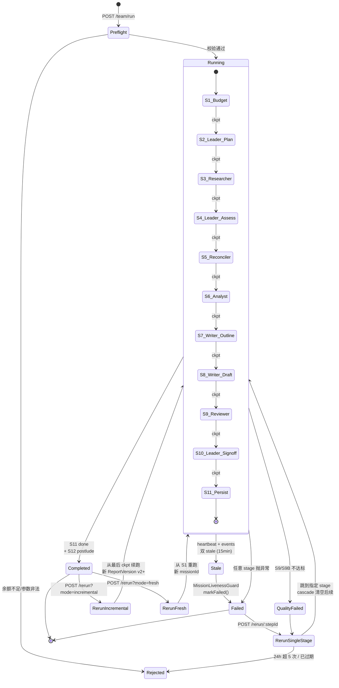
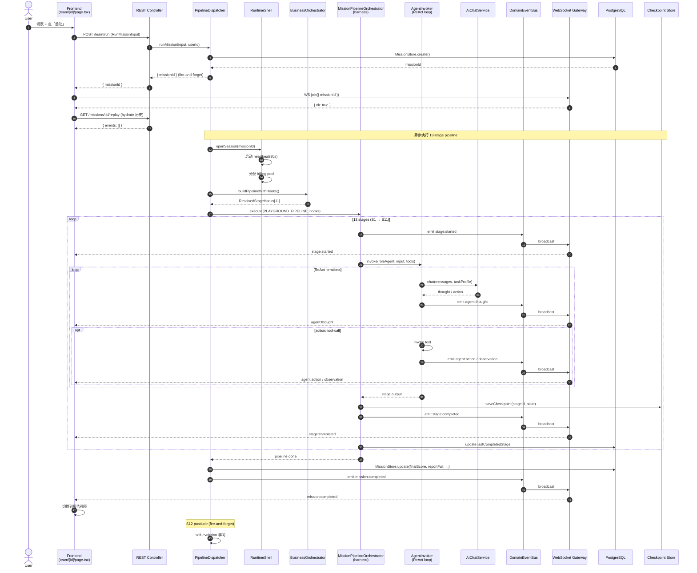
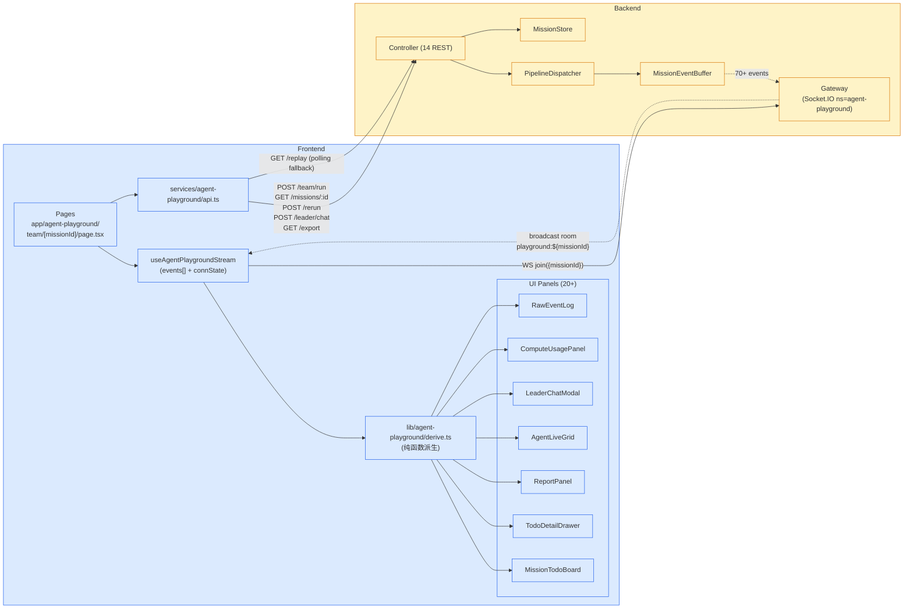
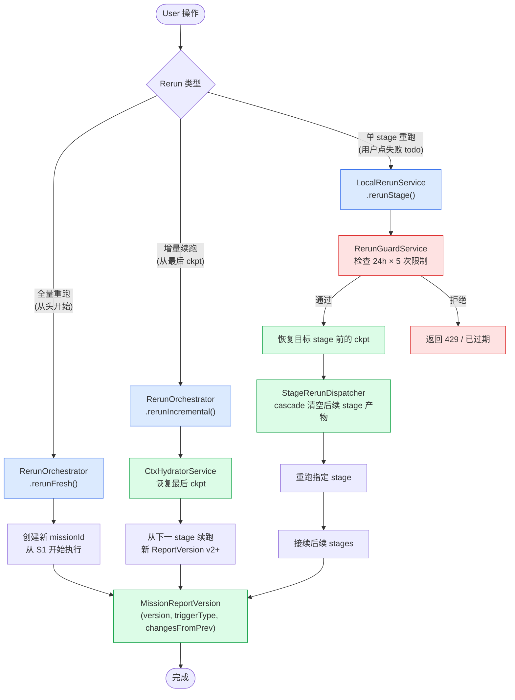

# Agent Playground 架构总览

> **模块**: `backend/src/modules/ai-app/agent-playground/`
> **本质**: Mission Pipeline 的**完整运行平台 + 实时可视化调试 UI**(不是简单的 Agent 测试工具)
> **入口**: `PlaygroundPipelineDispatcher.runMission()` — R2-C 单轨化后的**唯一** mission runner
> **Pipeline**: 13 stage(`s1-budget` → `s12-self-evolution`)由 8 个角色 Agent 协作完成

---

## 1. 分层架构总览

```mermaid
flowchart TB
    subgraph L4["L4 · Open API"]
        REST["REST Controller<br/>14 个端点"]
        WS["WebSocket Gateway<br/>(namespace=agent-playground)"]
    end

    subgraph L3["L3 · AI App — Agent Playground"]
        subgraph CORE["核心入口"]
            DISP["★ PlaygroundPipelineDispatcher<br/>(唯一 mission runner)"]
            ORCH["PlaygroundBusinessOrchestrator<br/>(11 个 stage hook builders)"]
            SHELL["MissionRuntimeShellService<br/>(billing / pool / abort / heartbeat)"]
        end

        subgraph ROLES["8 个 Role Services"]
            R1["LeaderService<br/>(M0/M1/M6/M7 phase)"]
            R2["ResearcherService"]
            R3["ReconcilerService"]
            R4["AnalystService"]
            R5["WriterService"]
            R6["ReviewerService"]
            R7["VerifierService"]
            R8["StewardService"]
            INV["AgentInvoker<br/>(pool + rate-limit)"]
        end

        subgraph LIFECYCLE["Mission Lifecycle"]
            STORE["MissionStore<br/>(Prisma CRUD + ownership)"]
            BUF["MissionEventBuffer<br/>(70+ 事件 / 5000 上限)"]
            CKPT["PrismaMissionCheckpointStore"]
            CHAT["LeaderChatService<br/>(动态聊天)"]
            EXP["MissionExportService<br/>(md/csv/json)"]
        end

        subgraph RERUN["Rerun 子系统"]
            RR1["MissionRerunOrchestratorService<br/>(fresh / incremental)"]
            RR2["LocalRerunService<br/>(单 stage 重跑)"]
            RR3["CtxHydratorService<br/>(checkpoint 恢复)"]
            RR4["RerunGuardService<br/>(24h × 5 次限制)"]
            RR5["StageRerunDispatcher"]
        end

        subgraph CONFIG["注册项 (onModuleInit / Bootstrap)"]
            CFG1["playground.config.ts<br/>13 step PIPELINE"]
            CFG2["8 Agent specs<br/>(LeaderAgent / ResearcherAgent / ...)"]
            CFG3["17 SKILL.md<br/>(mece-mission-planning 等)"]
            CFG4["MISSION_RUNNER token<br/>→ custom-agents 消费"]
        end
    end

    subgraph L25["L2.5 · AI Harness (facade)"]
        H1["MissionPipelineOrchestrator<br/>(通用 13-stage 执行器)"]
        H2["MissionPipelineRegistry"]
        H3["DomainEventBus"]
        H4["SocketBroadcastAdapter"]
        H5["MissionLivenessGuard<br/>(心跳 + stale 检测)"]
        H6["MissionElectionTracker<br/>(模型分配一致性)"]
        H7["MissionCheckpointService"]
        H8["ReAct / PlanAct<br/>Agent Frameworks"]
    end

    subgraph L2["L2 · AI Engine (facade)"]
        EN1["AiChatService<br/>(LLM 中介, BYOK)"]
        EN2["SkillLoaderService"]
        EN3["PromptSkillRegistrationService"]
        EN4["SkillRegistry"]
        EN5["ToolRegistry<br/>(web-search / rag / qa-gen)"]
    end

    subgraph L1["L1 · Infra"]
        I1["PrismaModule<br/>(PostgreSQL)"]
        I2["CreditsModule"]
        I3["JwtModule"]
        I4["SecretsModule (BYOK)"]
    end

    REST --> DISP
    WS --> BUF
    REST --> CHAT
    REST --> EXP
    REST --> RR1
    REST --> RR2

    DISP --> ORCH
    DISP --> SHELL
    DISP --> STORE
    DISP --> BUF
    DISP --> CKPT
    ORCH --> ROLES
    ROLES --> INV
    INV --> H8

    RR1 --> RR3
    RR1 --> RR4
    RR2 --> RR3
    RR2 --> RR5
    RR1 --> CKPT

    DISP --> H1
    H1 --> H3
    H3 --> H4
    H4 -.broadcast.-> WS
    SHELL --> H5
    SHELL --> H6
    CKPT --> H7

    INV --> EN1
    CONFIG -.注册.-> EN2
    CONFIG -.注册.-> EN3
    CONFIG -.注册.-> EN4
    ROLES --> EN5

    STORE --> I1
    BUF --> I1
    CKPT --> I1
    SHELL --> I2
    REST --> I3
    EN1 --> I4

    classDef l4 fill:#fef3c7,stroke:#d97706
    classDef l3 fill:#dbeafe,stroke:#2563eb
    classDef l25 fill:#e0e7ff,stroke:#4f46e5
    classDef l2 fill:#dcfce7,stroke:#16a34a
    classDef l1 fill:#f3f4f6,stroke:#6b7280
    class L4,REST,WS l4
    class L3,CORE,ROLES,LIFECYCLE,RERUN,CONFIG,DISP,ORCH,SHELL,R1,R2,R3,R4,R5,R6,R7,R8,INV,STORE,BUF,CKPT,CHAT,EXP,RR1,RR2,RR3,RR4,RR5,CFG1,CFG2,CFG3,CFG4 l3
    class L25,H1,H2,H3,H4,H5,H6,H7,H8 l25
    class L2,EN1,EN2,EN3,EN4,EN5 l2
    class L1,I1,I2,I3,I4 l1
```



> **关键依赖约束**:
> - 不依赖 `ai-app/teams/` —— Playground 自成完整编排,是 AI Teams 的"参考实现"
> - 不直接调 LLM —— 通过 `AgentInvoker` → `ReAct` → `AiChatService`,模型由 BYOK + UserModelConfig 自动选
> - `MissionPipelineOrchestrator` 是 harness 通用件,Playground 用 `playground.config.ts` 把它特化成 13-stage 流水线

---

## 2. 13-Stage Mission Pipeline

8 个角色 Agent 接力完成 13 个 stage,每个 stage 完成后写 checkpoint,支持续跑/重跑。

```mermaid
flowchart LR
    START([Preflight<br/>校验 credits/wall/models]) --> S1

    subgraph STAGES["13-Stage Pipeline"]
        direction TB
        S1["S1: Budget Estimate"] --> S2
        S2["S2: Leader Plan<br/>(M0 phase)"] --> S3
        S3["S3: Researcher Collect<br/>(per-dimension 并行)"] --> S4
        S4["S4: Leader Assess<br/>(M1 phase)"] --> S5
        S5["S5: Reconciler<br/>Cross-Dim Fact-Check"] --> S6
        S6["S6: Analyst<br/>Synthesize Insights"] --> S7
        S7["S7: Writer<br/>Plan Outline"] --> S8
        S8["S8: Writer Draft<br/>(ReportArtifact v2)"] --> S8B
        S8B["S8B: Section<br/>Quality Enhancement"] --> S9
        S9["S9: Reviewer<br/>Critic L4 Verdict"] --> S9B
        S9B["S9B: Report<br/>Objective Eval (10-dim)"] --> S10
        S10["S10: Leader<br/>Foreword + Signoff<br/>(M6 + M7 phase)"] --> S11
        S11["S11: Mission Persist<br/>(write to DB)"]
    end

    S11 --> POST
    POST["S12: Self-Evolution<br/>(fire-and-forget postlude)<br/>failure-learning"] --> DONE

    DONE([Status: completed])
    FAIL([Status: failed/rejected/<br/>quality-failed])

    S1 -.失败.-> FAIL
    S2 -.失败.-> FAIL
    S3 -.失败.-> FAIL
    S4 -.失败.-> FAIL
    S5 -.失败.-> FAIL
    S8 -.失败.-> FAIL
    S9 -.质量门.-> FAIL
    S10 -.Leader reject.-> FAIL

    classDef leader fill:#fef3c7,stroke:#d97706
    classDef research fill:#dbeafe,stroke:#2563eb
    classDef synth fill:#dcfce7,stroke:#16a34a
    classDef quality fill:#fce7f3,stroke:#db2777
    classDef persist fill:#f3f4f6,stroke:#6b7280
    class S2,S4,S10 leader
    class S3,S5 research
    class S6,S7,S8,S8B synth
    class S9,S9B quality
    class S1,S11,POST persist
```



**Stage 角色对应**:

| Stage | 角色          | 关键输出                                      |
| ----- | ------------- | --------------------------------------------- |
| S1    | (system)      | budget estimate                               |
| S2    | **Leader**    | leaderPlan (dimensions / strategy)            |
| S3    | **Researcher** × N | per-dimension findings (并行)            |
| S4    | **Leader**    | assess + accept/reject researchers            |
| S5    | **Reconciler** | factTable / conflicts / gaps / figureCands  |
| S6    | **Analyst**   | synthesized insights                          |
| S7    | **Writer**    | outline plan                                  |
| S8    | **Writer**    | ReportArtifact v2 (sections/citations/figures) |
| S8B   | **Writer**    | section quality enhancement                   |
| S9    | **Reviewer**  | critic L4 verdict                             |
| S9B   | **Verifier**  | 10-dim objective scores                       |
| S10   | **Leader**    | foreword + signoff (acceptable/concerns/reject) |
| S11   | **Steward**   | persist to DB + finalize                      |
| S12   | (postlude)    | failure-learning patterns                     |

---

## 3. Mission 生命周期与 Checkpoint/Rerun



**心跳与 Stale 检测**(`MissionLivenessGuard`):

| 阶梯       | 触发条件               | 动作                |
| ---------- | ---------------------- | ------------------- |
| Soft warn  | 20min 无 heartbeat     | 仅日志,不杀          |
| Hard kill  | 15min heartbeat + events 双 stale | `markFailed()` |
| Wall-time  | 4h 总执行时长          | 强制终止            |

---

## 4. 数据模型关系

```mermaid
erDiagram
    User ||--o{ AgentPlaygroundMission : owns
    AgentPlaygroundMission ||--o{ AgentPlaygroundMissionEvent : emits
    AgentPlaygroundMission ||--|| MissionElectionState : tracks
    AgentPlaygroundMission ||--o{ AgentPlaygroundLeaderChat : chats
    AgentPlaygroundMission ||--o{ AgentPlaygroundResearchResult : produces
    AgentPlaygroundMission ||--o{ AgentPlaygroundChapterDraft : drafts
    AgentPlaygroundMission ||--o{ MissionReportVersion : versions
    AgentPlaygroundMission ||--o{ AgentPlaygroundRerunAttempt : reruns
    AgentPlaygroundMission ||--o{ MissionCheckpoint : checkpoints

    AgentPlaygroundMission {
        string id PK
        string userId FK
        string topic "VARCHAR(500)"
        string depth "quick/standard/deep"
        string language
        int maxCredits "default 300"
        string status "running/completed/failed/rejected/quality-failed"
        datetime startedAt
        datetime completedAt
        int wallTimeMs
        int finalScore "0-100"
        bigint tokensUsed
        float costUsd
        json dimensions "[{id,name,rationale}]"
        json reportFull "ReportArtifact v1/v2"
        int reportArtifactVersion "1 or 2+"
        json verdicts "[{verifierId,score,critique}]"
        json leaderJournal "{plan,decisions,foreword}"
        int leaderOverallScore
        boolean leaderSigned
        string leaderVerdict "acceptable/concerns/reject"
        json reconciliationReport "{factTable,conflicts,gaps}"
        json analystOutput
        json outlinePlan
        int lastCompletedStage "0-12 用于 pod 重启恢复"
        string podId "VARCHAR(120)"
        datetime heartbeatAt "每 30s 刷新"
    }

    AgentPlaygroundMissionEvent {
        string id PK
        string missionId FK
        string type "agent-playground.* (70+ 类型)"
        string agentId
        string traceId
        json payload "shape 由 event-schemas 定义"
        bigint ts "ms epoch"
        datetime createdAt
    }

    MissionElectionState {
        string missionId PK_FK
        string_array committedModelIds
        json reservations "[{agentId,modelId,tokens}]"
    }

    MissionCheckpoint {
        string id PK
        string missionId FK
        string stageId "s1-budget ~ s11-persist"
        json state "stage 输出 snapshot"
        datetime savedAt
    }

    MissionReportVersion {
        string id PK
        string missionId FK
        int version "v1 initial / v2+ rerun"
        string versionLabel
        string triggerType "initial/rerun-fresh/rerun-incremental"
        string reportTitle
        json reportFull
        json changesFromPrev
        int finalScore
        boolean leaderSigned
        datetime generatedAt
    }

    AgentPlaygroundRerunAttempt {
        string id PK
        string missionId FK
        string userId FK
        string stepId "s3-researcher 等"
        datetime triggeredAt
    }

    AgentPlaygroundLeaderChat {
        string id PK
        string missionId FK
        string role "user/leader"
        text content
        datetime createdAt
    }
```

---

## 5. 启动 Mission 时序图



---

## 6. 前后端实时通信



**事件命名空间**(70+ 事件,部分示例):

| 命名空间       | 事件                                                     | 触发位置                     |
| -------------- | -------------------------------------------------------- | ---------------------------- |
| `mission:*`    | started / completed / failed / cancelled                 | Dispatcher                   |
| `stage:*`      | started / completed / failed / skipped                   | MissionPipelineOrchestrator  |
| `agent:*`      | thought / action / observation / reflection / completed  | AgentInvoker (ReAct)         |
| `leader:*`     | goals-set / decision / verdict / signed                  | LeaderService                |
| `researcher:*` | started / completed / dimension:*                        | ResearcherService            |
| `reconciler:*` | fact-table / conflict / gap                              | ReconcilerService            |
| `writer:*`     | outline / section / citation / figure                    | WriterService                |
| `reviewer:*`   | critic / score                                           | ReviewerService              |
| `verifier:*`   | dimension-score / verdict                                | VerifierService              |
| `tool:*`       | invoke-start / invoke-end / error                        | ToolRegistry                 |
| `budget:*`     | estimate / consumed / exceeded                           | RuntimeShell                 |
| `heartbeat:*`  | tick / stale-detected                                    | MissionLivenessGuard         |

**降级链路**: WebSocket → 失败 → HTTP polling(`GET /replay?since=lastTs`)4s 间隔。

---

## 7. Rerun 子系统



---

## 8. REST API 速查

```
POST   /api/v1/agent-playground/team/run                       启动 mission
POST   /api/v1/agent-playground/dev/trigger-mission            内部触发(userApiKeyId 鉴权)
GET    /api/v1/agent-playground/missions                       列表(当前用户)
GET    /api/v1/agent-playground/missions/:id                   详情
GET    /api/v1/agent-playground/missions/:id/replay            事件回放(polling fallback)
GET    /api/v1/agent-playground/missions/:id/export?format=md  导出(md/csv/json)
GET    /api/v1/agent-playground/missions/:id/report-versions   报告版本列表
GET    /api/v1/agent-playground/missions/:id/report-versions/:v  特定版本
GET    /api/v1/agent-playground/missions/resumable             可恢复的 missions
POST   /api/v1/agent-playground/missions/:id/rerun?mode=...    全量/增量重跑
POST   /api/v1/agent-playground/missions/:id/rerun/:stepId     单 stage 重跑
POST   /api/v1/agent-playground/missions/:id/cancel            取消
POST   /api/v1/agent-playground/missions/:id/leader/chat       Leader 动态聊天

WS     /socket.io  (namespace=agent-playground)
       client → server: join / leave { missionId }
       server → client: 70+ agent-playground.* 事件 (room broadcast)
```

---

## 9. 关键架构亮点

| 亮点                  | 实现                                                                     |
| --------------------- | ------------------------------------------------------------------------ |
| **R2-C 单轨化**       | 删除 legacy TeamMission,`PlaygroundPipelineDispatcher` 是唯一入口         |
| **S1/S1-1 拆分**      | dispatcher (runtime glue) → business-orchestrator (11 hooks) 单向依赖     |
| **跨 Stage 状态**     | `PlaygroundCrossStageState` 统一容器(替代之前 14 个 ad-hoc fields)       |
| **MissionLivenessGuard** | 双信号判定(heartbeat + events 双 stale)+ 三阶梯(soft/hard/wall-time)   |
| **Skill 注册修复**    | `onModuleInit` 加目录,`onApplicationBootstrap` 真正注册到 SkillRegistry |
| **Checkpoint 完整性** | 每 stage save,支持 incremental rerun 跳过已完成 stage                    |
| **报告版本化**        | v1 首跑,v2+ rerun,记 `changesFromPrev` 供前端 diff 视图                  |
| **事件去重**          | hash(type + ts + agentId + payloadSnippet) 防 WS 重连重复推送             |
| **MISSION_RUNNER 合约** | 通过 DI token 暴露,custom-agents 模块可消费同一 runner                  |
| **BYOK 模型选择**     | 不硬编码模型,通过 `UserModelConfig` + 环境默认自动选                     |

---

## 10. 关键文件路径速查

```
backend/src/modules/ai-app/agent-playground/
├── agent-playground.module.ts
├── agent-playground.controller.ts                   ← 14 REST 端点
├── agent-playground.gateway.ts                      ← Socket.IO
├── agent-playground.events.ts                       ← 70+ 事件类型清单
├── agent-playground.event-schemas.ts                ← Zod schema
├── playground.config.ts                             ← ★ 13 step PIPELINE 定义
├── playground-runtime.config.ts                     ← wall-time / stale 阈值
├── playground-tuning-profile.ts                     ← LLM 调参预设
│
├── services/mission/
│   ├── workflow/
│   │   ├── playground-pipeline-dispatcher.service.ts   ← ★ runMission 入口
│   │   ├── playground-business-orchestrator.service.ts ← 11 hook builders
│   │   ├── playground-cross-stage-state.ts
│   │   ├── mission-runtime-shell.service.ts            ← billing/pool/abort
│   │   ├── mission-stage-bindings.service.ts
│   │   └── stages/
│   │       ├── s1-mission-estimate-budget.stage.ts
│   │       ├── s2-leader-plan-mission.stage.ts
│   │       ├── s3-researcher-collect-findings.stage.ts
│   │       ├── s4-leader-assess-research.stage.ts
│   │       ├── s5-reconciler-cross-dim-fact-check.stage.ts
│   │       ├── s6-analyst-synthesize-insights.stage.ts
│   │       ├── s7-writer-plan-outline.stage.ts
│   │       ├── s8-writer-draft-report.stage.ts
│   │       ├── s8b-section-quality-enhancement.stage.ts
│   │       ├── s9-reviewer-critic-l4.stage.ts
│   │       ├── s9b-report-objective-evaluation.stage.ts
│   │       ├── s10-leader-foreword-and-signoff.stage.ts
│   │       ├── s11-mission-persist.stage.ts
│   │       └── s12-self-evolution.stage.ts
│   ├── lifecycle/
│   │   ├── mission-store.service.ts
│   │   ├── mission-event-buffer.service.ts
│   │   └── prisma-mission-checkpoint.store.ts
│   ├── rerun/
│   │   ├── mission-rerun-orchestrator.service.ts
│   │   ├── local-rerun.service.ts
│   │   ├── ctx-hydrator.service.ts
│   │   ├── rerun-guard.service.ts
│   │   ├── stage-rerun.dispatcher.ts
│   │   └── rerun-runtime-builder.service.ts
│   └── leader-invocation.factory.ts
│
├── services/roles/                                  ← 8 个角色
│   ├── leader.service.ts                            ← M0/M1/M6/M7 phase
│   ├── researcher.service.ts
│   ├── reconciler.service.ts
│   ├── analyst.service.ts
│   ├── writer.service.ts
│   ├── reviewer.service.ts
│   ├── verifier.service.ts
│   ├── steward.service.ts
│   └── agent-invoker.service.ts                     ← agent pool + rate-limit
│
├── services/chat/leader-chat.service.ts             ← Leader 动态聊天
├── services/export/mission-export.service.ts        ← md/csv/json
├── agents/                                          ← 8 个 Agent spec
│   └── leader/leader.agent.ts + SKILL.md
└── skills/                                          ← 17 个 SKILL.md

frontend/
├── app/agent-playground/
│   ├── page.tsx                                     ← mission 列表
│   └── team/[missionId]/page.tsx                    ← ★ 实时流监听 detail 页
│
├── components/agent-playground/                     ← 20+ 组件
│   ├── PlaygroundMissionDialog.tsx                  ← 启动表单
│   ├── MissionTodoBoard.tsx                         ← stage 任务看板
│   ├── TodoDetailDrawer.tsx                         ← 任务详情(thought/action/obs)
│   ├── MissionFlowView.tsx                          ← pipeline 流程图
│   ├── PipelineTimeline.tsx
│   ├── TeamRosterPanel.tsx
│   ├── LeaderChatModal.tsx
│   ├── LeadJournalPanel.tsx
│   ├── ReportPanel.tsx + artifact/
│   ├── ReferencesPanel.tsx
│   ├── RawEventLog.tsx
│   ├── AgentLiveGrid.tsx
│   ├── ComputeUsagePanel.tsx
│   ├── BudgetAndTimeLimitPanel.tsx
│   ├── DimensionsPanel.tsx
│   ├── VerifyConsensusPanel.tsx
│   ├── CostBreakdownPanel.tsx
│   ├── MemoryIndexPanel.tsx
│   └── CapabilityMeters.tsx
│
├── lib/agent-playground/
│   ├── derive.ts                                    ← ★ 事件→UI state 派生
│   ├── todo-ledger.ts                               ← todo tree 逻辑
│   ├── drawer-derive.ts
│   ├── synthesize-artifact.ts
│   ├── report-artifact.types.ts                     ← ReportArtifact v2 schema
│   ├── stage-id-mapping.ts                          ← step ↔ stage 映射
│   └── friendly-error.util.ts
│
├── lib/playground-design/tokens.ts                  ← design tokens
├── components/playground-ui/                        ← 通用 UI 件
└── services/agent-playground/api.ts                 ← REST 客户端

backend/prisma/schema/
└── models.prisma                                    ← AgentPlaygroundMission /
                                                       AgentPlaygroundMissionEvent /
                                                       MissionElectionState /
                                                       MissionCheckpoint /
                                                       MissionReportVersion /
                                                       AgentPlaygroundRerunAttempt /
                                                       AgentPlaygroundLeaderChat
```
