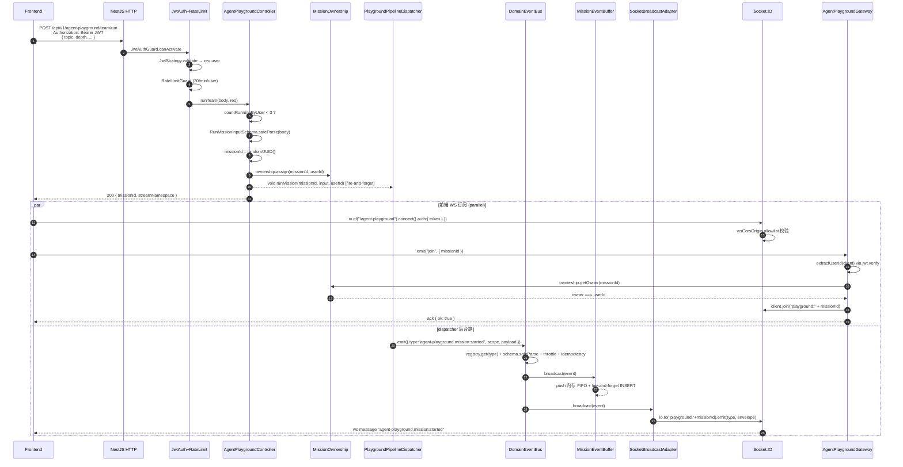
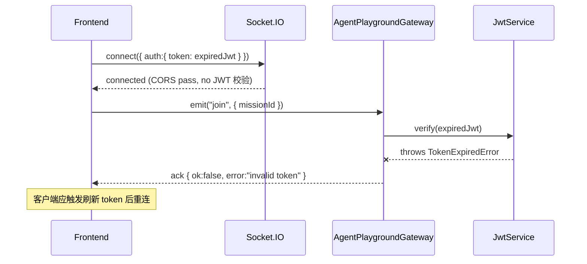
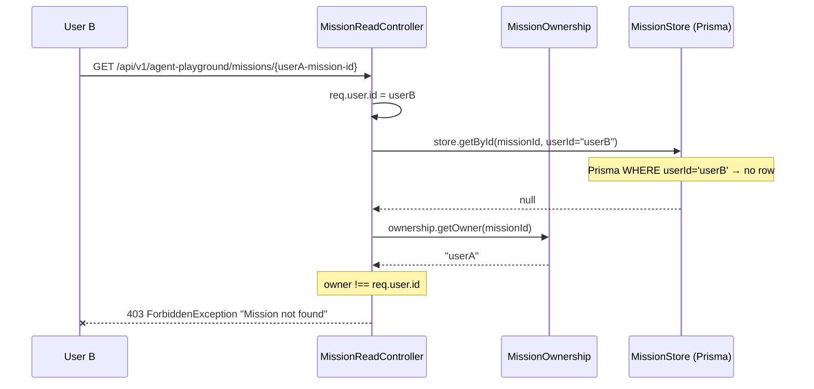
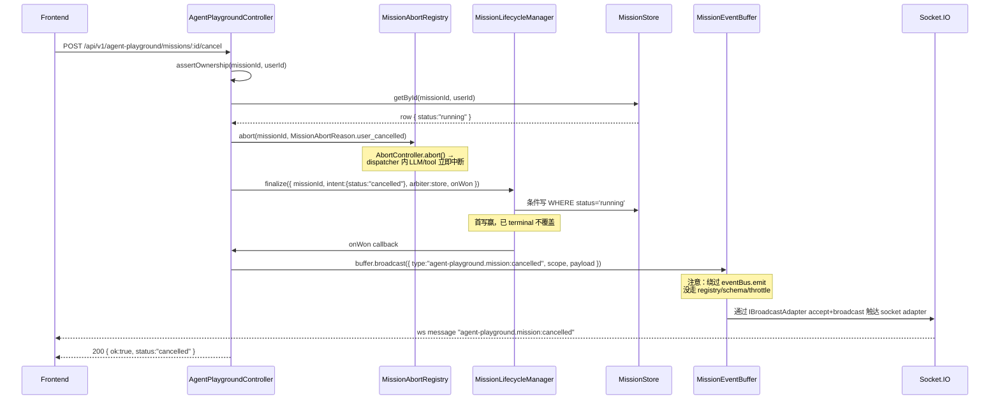

# Agent Playground — HTTP / WebSocket 入口层端到端分析

> 范围：从前端发起 HTTP / WebSocket 请求到 `PlaygroundPipelineDispatcher.runMission` 之间的全部接入层。本文是 5 路并行分析中的第 1 路（入口层），不涉及 pipeline 内部 / agent 执行 / 持久化细节。
>
> 路径前缀：所有 HTTP 端点 controller 内声明 `@Controller("agent-playground")`，全局前缀 `api/v1`（`backend/src/main.ts:195`），WebSocket namespace `agent-playground`（`agent-playground.gateway.ts:35`）。

---

## 1. Overview

agent-playground 的入口层由 **3 个 HTTP controller + 1 个 WebSocket gateway** 组成，全部在 `AgentPlaygroundModule` 装配（`backend/src/modules/ai-app/agent-playground/module/agent-playground.module.ts:123-127`）。

| 角色                 | 文件                                            | 端点数                     | 类型      |
| -------------------- | ----------------------------------------------- | -------------------------- | --------- |
| Lifecycle controller | `api/controller/agent-playground.controller.ts` | 6（含 `budget-tiers` GET） | HTTP      |
| Read controller      | `api/controller/mission-read.controller.ts`     | 8                          | HTTP      |
| Rerun controller     | `api/controller/mission-rerun.controller.ts`    | 4                          | HTTP      |
| WebSocket gateway    | `api/controller/agent-playground.gateway.ts`    | 2 events (`join`, `leave`) | Socket.IO |

> 命名注意：尽管任务要求里点名 `runtime/playground.gateway.ts`，实际目录里 **不存在** 这个文件。WebSocket gateway 位于 `api/controller/agent-playground.gateway.ts:38`。`runtime/` 下只有 `agent-playground.event-relay.ts` / `agent-playground.input-rebuilder.ts` 等非入口文件。

入口层的核心职责：

1. **认证 + 限流**：JwtAuthGuard 解析 `req.user`，RateLimitGuard 配置滑动窗口
2. **DTO 校验**：唯一一个写路径 DTO `RunMissionInput` 走 **Zod** `safeParse`（不是 class-validator）
3. **ownership 仲裁**：所有访问通过 `MissionOwnershipRegistry.getOwner` + DB fallback（`BaseMissionController.assertOwnership`）
4. **fire-and-forget 启动**：`runMission` HTTP 立即返回 `missionId`，dispatcher 在 `void`-ed promise 里跑 14 stage
5. **事件路由**：所有 `agent-playground.*` DomainEvent 被 `SocketBroadcastAdapter` 推到 `playground:<missionId>` 房间，同时 `MissionEventBuffer` 落 DB 供 `/replay` polling 兜底

---

## 2. HTTP 端点矩阵

> 所有端点在 `api/v1/agent-playground/` 前缀下。"Guards" 列里 `JwtAuthGuard` 在 controller 级 `@UseGuards`（除 `dev/trigger-mission` 显式 `@Public()`）；method 级再叠加 `RateLimitGuard`。

### 2.1 Lifecycle controller（`agent-playground.controller.ts`）

| Method | 路径                   | Handler                    | DTO/Body                                                             | Guards (effective)      | RateLimit (req/min, keyType) | 业务效果                                                                                                                                                                                     |
| ------ | ---------------------- | -------------------------- | -------------------------------------------------------------------- | ----------------------- | ---------------------------- | -------------------------------------------------------------------------------------------------------------------------------------------------------------------------------------------- |
| GET    | `/budget-tiers`        | `getBudgetTiers` (L88)     | —                                                                    | JwtAuth                 | —                            | 返回 `DEPTH_BUDGET_TIERS` 投影 + `BUDGET_FIELD_LIMITS`，**前端档位渲染单一源**（`run-mission.dto.ts:178`）                                                                                   |
| POST   | `/dev/trigger-mission` | `devTriggerMission` (L121) | `{ userApiKeyId, input, internalToken? }`                            | **@Public** + RateLimit | 3/min, **ip**                | 反查 `user_api_keys.userId` 后 `pipelineDispatcher.runMission` fire-and-forget；require `x-agent-playground-token` header（`timingSafeEqual` 比对 `AGENT_PLAYGROUND_DEV_TRIGGER_TOKEN` env） |
| POST   | `/team/run`            | `runTeam` (L177)           | `RunMissionInput` (Zod)                                              | JwtAuth + RateLimit     | 30/min, **user**(default)    | 唯一前端 mission 启动入口；超并发（>= 3 running）返回 400                                                                                                                                    |
| POST   | `/missions/:id/cancel` | `cancelMission` (L223)     | —                                                                    | JwtAuth                 | —                            | `abortRegistry.abort` + `lifecycleManager.finalize` 写 cancelled 终态，`buffer.broadcast` `mission:cancelled`                                                                                |
| DELETE | `/missions/:id`        | `deleteMission` (L276)     | —                                                                    | JwtAuth                 | —                            | 拒删 running 状态（FK 保护），`store.deleteByUser` + 清 ownership + electionTracker                                                                                                          |
| PATCH  | `/missions/:id`        | `updateMission` (L309)     | `{ topic?, maxCredits?, budgetMultiplierOverride?, wallTimeCapMs? }` | JwtAuth                 | —                            | topic 任意状态可改；预算字段仅非 running 状态可改（store 层再守一遍）                                                                                                                        |

### 2.2 Read controller（`mission-read.controller.ts`）

| Method | 路径                                     | Handler                            | DTO/Body                                | Guards              | RateLimit        | 备注                                                                                    |
| ------ | ---------------------------------------- | ---------------------------------- | --------------------------------------- | ------------------- | ---------------- | --------------------------------------------------------------------------------------- |
| GET    | `/missions`                              | `listMissions` (L78)               | —                                       | JwtAuth             | —                | 当前用户全部 mission，top 100                                                           |
| GET    | `/missions/resumable`                    | `listResumable` (L92)              | —                                       | JwtAuth             | —                | 有 checkpoint 的 mission 列表                                                           |
| GET    | `/missions/:id`                          | `getMission` (L112)                | —                                       | JwtAuth             | —                | 启动后 5s 内 DB 行未落时返回 `{ status: 'starting' }` 占位（防 403 顶掉前端 detail 页） |
| PATCH  | `/missions/:id/visibility`               | `updateVisibility` (L144)          | `UpdateVisibilityDto` (class-validator) | JwtAuth             | —                | 唯一一个用 class-validator DTO 的端点                                                   |
| GET    | `/missions/:id/export`                   | `exportMission` (L159)             | query `format`                          | JwtAuth             | —                | format whitelist：`md/markdown/json/pdf/docx/csv-facts/csv-citations`                   |
| GET    | `/missions/:id/report-versions`          | `listMissionReportVersions` (L179) | —                                       | JwtAuth             | —                | 报告版本列表（不含 reportFull）                                                         |
| GET    | `/missions/:id/report-versions/:version` | `getMissionReportVersion` (L218)   | —                                       | JwtAuth             | —                | 单版本完整 reportFull                                                                   |
| GET    | `/replay/:missionId`                     | `replay` (L263)                    | query `since`                           | JwtAuth + RateLimit | 60/min, **user** | polling fallback：先 `buffer.read` 内存，空时走 `buffer.readPersisted` DB               |
| GET    | `/missions/:id/leader-chat`              | `listLeaderChat` (L286)            | —                                       | JwtAuth             | —                | Leader 对话历史                                                                         |
| POST   | `/error-report`                          | `reportClientError` (L302)         | `{ missionId?, message?, stack?, ... }` | **@Public**         | —                | 前端 ErrorBoundary 上报；只写 stderr，不写 DB                                           |

### 2.3 Rerun controller（`mission-rerun.controller.ts`）

| Method | 路径                                      | Handler                 | DTO/Body                                                                     | Guards              | RateLimit        | 备注                                                          |
| ------ | ----------------------------------------- | ----------------------- | ---------------------------------------------------------------------------- | ------------------- | ---------------- | ------------------------------------------------------------- |
| POST   | `/missions/:id/rerun`                     | `rerunMission` (L68)    | query `mode=fresh\|incremental`                                              | JwtAuth + RateLimit | 30/min, **user** | 委托 `rerunOrchestrator.rerunFullMission`；默认 `incremental` |
| POST   | `/missions/:id/todos/:todoId/rerun`       | `rerunTodo` (L100)      | `{ origin?, scope?, dimensionRef?, chapterIndex?, todoTitle?, reasonText? }` | JwtAuth + RateLimit | 30/min, **user** | 开新 mission 跑单 todo                                        |
| POST   | `/missions/:id/todos/:todoId/local-rerun` | `localRerunTodo` (L141) | 同上 + `stepId?`                                                             | JwtAuth + RateLimit | 30/min, **user** | 复用原 missionId 局部 patch                                   |
| POST   | `/missions/:id/leader-chat`               | `sendLeaderChat` (L213) | `{ content }` (string, 1-4000 chars)                                         | JwtAuth + RateLimit | 30/min, **user** | trim 后校验长度（防大量空格绕过 4000 上限）                   |

### 2.4 共享行为

- `BaseMissionController.assertOwnership(missionId, userId)`（`base-mission.controller.ts:24-43`）—— 所有 `:id` 路径的双层守卫：内存 LRU 命中即拒 / DB fallback 检查 mission row 存在 → 否则 `ForbiddenException`
- 控制器内不少 handler 还直接 `await store.getById(id, userId)` 再判 null（Prisma 层用 `userId` 作为 WHERE 条件 → 越权场景下返回 null → controller `throw ForbiddenException("Mission not found")`）
- DELETE 对 running mission 抛 400，"先 cancel 再 delete"——历史 FK 事故（`agent-playground.controller.ts:285-289`）

---

## 3. WebSocket 接口

### 3.1 Namespace + 事件

| Event                         | 方向            | Payload                                                                    | 返回                                        | 文件                                                                                                                    |
| ----------------------------- | --------------- | -------------------------------------------------------------------------- | ------------------------------------------- | ----------------------------------------------------------------------------------------------------------------------- |
| `connection`                  | 客户端 → 服务端 | handshake.auth: `{ token }` or `{ Authorization }`                         | socket id                                   | Socket.IO 内置                                                                                                          |
| `join`                        | 客户端 → 服务端 | `{ missionId }`                                                            | `{ ok, error?, errorCode?, retryAfterMs? }` | `agent-playground.gateway.ts:64`                                                                                        |
| `leave`                       | 客户端 → 服务端 | `{ missionId }`                                                            | `{ ok }`                                    | `agent-playground.gateway.ts:134`                                                                                       |
| `agent-playground.<sub-type>` | 服务端 → 客户端 | DomainEvent envelope（`{ type, payload, agentId?, traceId?, timestamp }`） | —                                           | `SocketBroadcastAdapter.broadcast` (`backend/src/modules/ai-harness/protocols/realtime/socket-broadcast.adapter.ts:53`) |

### 3.2 房间策略

- **房间名**：`playground:<missionId>`（前缀 `playground` 来自 `agent-playground.gateway.ts:55` 的 `roomPrefix`，与 namespace 字符串 `agent-playground` **不同**——容易引起混淆）
- **加入方式**：仅客户端主动 emit `"join"` 触发；服务端不会自动加房间（即使是 mission 所有者）
- **多设备**：同一 user 多个 socket 各自 emit `join` 后都会 `client.join("playground:m-id")`，Socket.IO 房间允许多 socket 共存，事件并行送达
- **离开**：客户端 emit `"leave"` 或断开连接（Socket.IO 默认在 disconnect 时自动清空该 socket 的所有房间）

### 3.3 CORS

`wsCorsOrigin` 函数式回显（`backend/src/common/config/ws-cors.ts:36-49`）：

- 无 origin（同源/非浏览器）→ 允许
- dev 模式下任意 `localhost:*` / `127.0.0.1:*` → 允许
- 否则匹配 `CORS_ORIGINS` / `FRONTEND_URL` / `RAILWAY_FRONTEND_URL` / `APP_CONFIG.railway.*` allowlist
- 配置 `credentials: true`（`agent-playground.gateway.ts:36`），因此不能用 `*` 通配

### 3.4 事件 envelope 形状

```ts
// SocketBroadcastAdapter.broadcast (socket-broadcast.adapter.ts:60-68)
const envelope = {
  type: event.type, // "agent-playground.mission:started"
  payload: event.payload,
  agentId: event.agentId,
  traceId: event.traceId,
  timestamp: event.timestamp,
};
this.io.to(`playground:${missionId}`).emit(event.type, envelope);
```

注意：socket emit 的 event 名 **就是完整 type**（带 `agent-playground.` 前缀），前端按完整 type 字符串监听。

### 3.5 大事件降级

`isPotentiallyLarge` 启发式（`socket-broadcast.adapter.ts:121-148`）：

- `payload` 是 string > 8KB → 触发预检
- 数组长度 > 100 → 触发预检
- 含 `fullMarkdown` / `sections` / `chapters` / `reportArtifact` / `reportFull` / `content` / `report` / `body` 字段且字段实际 > 8KB / 50 项 → 触发预检

触发预检后：

- `JSON.stringify` 失败（循环引用） → emit `agent-playground.event:dropped` placeholder（`reason: "serialize_failed"`）
- 序列化 > 256KB → emit `agent-playground.event:oversized` placeholder + 提示客户端走 `/replay` 拉完整
- 其它 → 正常 emit

---

## 4. 守护链路

### 4.1 JwtAuth + Public 装饰器

- `JwtAuthGuard`（`backend/src/common/guards/jwt-auth.guard.ts:19`）继承 Passport `AuthGuard('jwt')`
- `canActivate` 先看 `IS_PUBLIC_KEY` reflector（`L28-32`），@Public 标的 handler **跳过** JWT 验证
- 未标 Public → super.canActivate → 调 `JwtStrategy.validate`（`backend/src/modules/ai-infra/auth/strategies/jwt.strategy.ts:66-83`）
- JwtStrategy 用 `ExtractJwt.fromAuthHeaderAsBearerToken()`（强制 `Authorization: Bearer <jwt>`）
- 验签用 `JWT_SECRET` env（无 env 时 strategy 构造时直接 throw critical error，`L34-40`）
- 验签成功后查 Redis blocklist `blocklist:user:<userId>`（`L70-75`），命中即 401
- 返回 `{ id, email, username }` → NestJS 注入到 `req.user`（`RequestWithUser`）

控制器里 `const userId = req.user?.id;` 是惯用法，但 **如果 handler 标了 @Public，`req.user` 就是 undefined**，必须显式 `if (!userId) throw new ForbiddenException`。例如 `error-report` 端点（`mission-read.controller.ts:302`）允许 anon → `userId = req.user?.id ?? "anon"`。

### 4.2 RateLimit 装饰器 + Guard

- `@RateLimit({ maxRequests, windowSeconds, keyType, message })` (`backend/src/common/guards/rate-limit.guard.ts:90`) 用 `SetMetadata` 挂 method 级
- `RateLimitGuard` 读取 metadata，无配置直接 pass（`L131-133`）
- key 提取（`L198-225`）：
  - `keyType: "user"` → `req.user.id` 优先，无则回退到 IP（除非 `skipAnonymous`）
  - `keyType: "ip"` → `x-forwarded-for` / `x-real-ip` / `req.ip`
- 内存滑动窗口算法（`Map<key, { timestamps: number[] }>`），按 cutoff 过滤
- 超限 → `HttpException(429, { statusCode, error, message, retryAfter })`
- 每次请求附加响应头 `X-RateLimit-Limit / -Remaining / -Reset`
- **限制**：内存版，**多 pod 不一致**（Railway 多实例时单实例计数）；同模块有 `DistributedRateLimitGuard` 但 playground 没用

### 4.3 DTO 校验：Zod 而非 class-validator

- `RunMissionInputSchema`（`api/dto/run-mission.dto.ts:21-101`）是 zod schema
- controller 内手动 `safeParse`（`agent-playground.controller.ts:143-150` / `193-200`）
- 校验失败：`throw new BadRequestException`，message 拼接 `issues.map(i => path.join(".") + ":" + i.message).join("; ")`
- 矛盾组合 `.refine`：`depth=quick + lengthProfile=epic/mega` → 400
- **没有走** NestJS `ValidationPipe`，所以 transform / whitelist 全部失效。多余字段会被 zod 默认行为忽略（zod 默认 strip unknown，但本 schema 没显式 `.strict()`）
- 唯一 class-validator DTO：`UpdateVisibilityDto`（`mission-read.controller.ts:147`）走 NestJS DTO pipe

### 4.4 链路顺序

```
请求进入
  ↓
全局 setGlobalPrefix("api/v1") (main.ts:195)
  ↓
controller @UseGuards(JwtAuthGuard)
  ↓
method @UseGuards(RateLimitGuard) + @RateLimit({...})
  ↓
NestJS ValidationPipe (仅对 class-validator DTO 生效)
  ↓
handler 方法体内手动 RunMissionInputSchema.safeParse
  ↓
assertOwnership (针对 :id 路径)
  ↓
业务逻辑
```

> 注意 Guard 在 ValidationPipe 之前执行。RateLimit 即便 DTO 非法也会扣计数。

---

## 5. Happy Path 调用栈

> 场景：已登录用户点"开始研究" → 创建 mission → 前端订阅 → 收到 `mission:started`。

### 5.1 HTTP `POST /api/v1/agent-playground/team/run`

```
HTTP POST → JwtAuthGuard.canActivate                      jwt-auth.guard.ts:24
        → JwtStrategy.validate                            jwt.strategy.ts:66
        → req.user = { id, email, username }
        → RateLimitGuard.canActivate (30/min user)        rate-limit.guard.ts:123
        → AgentPlaygroundController.runTeam               agent-playground.controller.ts:177
            ├─ const userId = req.user?.id                                    :181
            ├─ store.countRunningByUser(userId) >= 3 ? BadRequest             :186-191
            ├─ RunMissionInputSchema.safeParse(body)                          :193-200
            ├─ const missionId = randomUUID()                                 :202
            ├─ ownership.assign(missionId, userId)                            :204
            ├─ void pipelineDispatcher.runMission(missionId, input, userId)   :207-213
            │       → (跑到第 2 路 dispatcher 范围)
            └─ return { missionId, streamNamespace: "agent-playground" }      :215
```

返回 `{ missionId, streamNamespace }` 给前端，HTTP 即可关闭。dispatcher 在后台跑。

### 5.2 WebSocket join

```
client.io.of("/agent-playground").connect({ auth: { token: jwt } })
  ↓ Socket.IO 握手 → wsCorsOrigin 校验                       ws-cors.ts:36
  ↓ 不在此阶段验 JWT（gateway 不实现 OnGatewayConnection）
  ↓
client.emit("join", { missionId })
  ↓
AgentPlaygroundGateway.handleJoin                          agent-playground.gateway.ts:64
  ├─ extractUserId(client)                                                    :144
  │   ├─ auth.token ?? auth.Authorization.replace(/^Bearer\s+/i, "")
  │   ├─ jwt.verify(token) → { sub | id | userId }
  │   └─ return userId  (throw UnauthorizedException 时 handler catch 返回 { ok:false })
  ├─ ownership.getOwner(missionId)  → owner?                                  :88
  │   └─ undefined → fallback store.getById(missionId, userId)               :91-118
  │                 ├─ DB error → { ok:false, errorCode:"SERVICE_UNAVAILABLE", retryAfterMs:5000 }
  │                 ├─ null     → { ok:false, errorCode:"MISSION_NOT_FOUND" }
  │                 └─ hit      → ownership.assign(missionId, userId) + owner = userId
  ├─ owner !== userId → { ok:false, error:"forbidden" }                       :119-124
  ├─ await client.join(`playground:${missionId}`)                             :126
  └─ return { ok: true }
```

### 5.3 服务端 emit → 客户端接收

```
dispatcher 内 eventBus.emit({ type: "agent-playground.mission:started", scope:{missionId,userId}, ... })
  ↓
DomainEventBus.emit                                        domain-event-bus.ts:67
  ├─ registry.get(type)? → 未注册 → log.warn + drop                          :68-75
  ├─ spec.schema.safeParse(payload) → fail → log.error + drop                :77-95
  ├─ idempotency dedupe (Redis)                                              :97-105
  ├─ throttle per (type, agentId) (Redis)                                    :107-142
  └─ Promise.all(adapters.filter(accepts).map(broadcast))                    :144-155
      ├─ MissionEventBuffer.broadcast                                        business-team-event-buffer.framework.ts:60
      │     ├─ accepts: type.startsWith("agent-playground.")                 mission-event-buffer.service.ts:25
      │     ├─ push 进内存 FIFO（5000 cap, 1h TTL）
      │     └─ fire-and-forget prisma.agentPlaygroundMissionEvent.create
      └─ SocketBroadcastAdapter.broadcast                                    socket-broadcast.adapter.ts:53
            └─ this.io.to(`playground:${missionId}`).emit(event.type, envelope)

客户端 socket.on("agent-playground.mission:started", (envelope) => ...)
```

`SocketBroadcastAdapter` 在 `AgentPlaygroundGateway.afterInit` 注册（`agent-playground.gateway.ts:49-61`），**不在 `onModuleInit`**（io server 此时未绑定）；这是 review 笔记里的 "必修 #7"。

---

## 6. 异常场景分支

### 6.1 未登录访问 → 401

**HTTP：** 任意标了 `@UseGuards(JwtAuthGuard)` 但没 `@Public()` 的端点，无 `Authorization: Bearer` 或 token 过期 → `JwtAuthGuard.handleRequest` 抛 `new UnauthorizedException("Please sign in to continue")`（`jwt-auth.guard.ts:42-46`）→ NestJS 返回 401。

**WebSocket：** 没在 Socket.IO 握手层验 JWT；客户端能 connect 成功。但 emit `"join"` 时 `extractUserId` 抛 `UnauthorizedException("no auth token")`（`agent-playground.gateway.ts:151`）→ handler catch 后返回 `{ ok:false, error:"no auth token" }`，**不会断开 socket**。客户端必须根据 ack 自行重连或提示登录。token 过期同样：`jwt.verify` 抛 → `UnauthorizedException("invalid token")` → ack `{ ok:false, error:"invalid token" }`。

**注意**：socket 没 disconnect 意味着 anon 用户可以一直 emit `join` 探测 mission（但永远拿不到 ok）—— 但 DB 查询会被 `store.getById(missionId, userId)` 里 `userId` 是 anon 提供的字符串挡住（实际 `extractUserId` 已 throw 不会跑到 store）。

### 6.2 userId 合法但 mission 不属于该 user → 403

**HTTP：** 两条路径——

- 直接 `store.getById(id, userId)` 返回 null（Prisma WHERE 含 `userId`）→ `ForbiddenException("mission not found")`，例如 `cancelMission:232-233`、`deleteMission:283-284`、`getMission:136`
- 走 `assertOwnership` helper（`base-mission.controller.ts:24-43`）：
  - in-memory owner 命中且 !== userId → `ForbiddenException("mission ${missionId} not owned by you")`
  - in-memory miss + DB miss → `ForbiddenException("mission ${missionId} not found")`

**WebSocket：** `agent-playground.gateway.ts:119-124`，owner !== userId → `{ ok:false, error:"forbidden" }`，log warn 记录越权尝试。

**安全语义**：两种返回 "not found" / "not owned by you" / "forbidden" 实际泄漏的信息差不多——攻击者拿到 missionId 时能区分"不存在 vs 别人的" 这点在 in-memory 命中 owner 但不匹配时会泄漏，因为 message 是 "not owned by you" 不是 "not found"。但 missionId 是 UUID v4，不可枚举。

### 6.3 DTO 校验失败 → 400

**Zod 路径（POST /team/run, /dev/trigger-mission）**：

```ts
const parsed = RunMissionInputSchema.safeParse(body);
if (!parsed.success) {
  throw new BadRequestException(
    `Invalid input: ${parsed.error.issues.map((i) => `${i.path.join(".")}:${i.message}`).join("; ")}`,
  );
}
```

错误 body 形如：`{ statusCode:400, message:"Invalid input: topic:String must contain at least 2 character(s); depth:Invalid enum value...", error:"Bad Request" }`。

**特殊 refine**：`depth=quick + lengthProfile=epic|mega` → message `"depth=quick 与 lengthProfile=epic/mega 矛盾..."`（`run-mission.dto.ts:91-100`）。

**class-validator 路径（PATCH /missions/:id/visibility）**：标准 NestJS ValidationPipe（依赖 main.ts 全局 useGlobalPipes，本路未查）。

**PATCH /missions/:id**：手动 if-else 验证（`agent-playground.controller.ts:324-370`），topic 空 / >500 字符 / maxCredits 越界 / budgetMultiplierOverride 越界 / wallTimeCapMs 越界 全部 BadRequest。

**Leader chat content**：trim 后空字符串 → 400；> 4000 chars → 400（`mission-rerun.controller.ts:222-228`）。

**export format**：不在 whitelist → 400（`mission-read.controller.ts:166-170`）。

### 6.4 RateLimit 触发 → 429

`HttpException(429, { statusCode, error:"Too Many Requests", message, retryAfter })`（`rate-limit.guard.ts:168-177`），retryAfter 秒数算自最早 timestamp + windowMs - now。

各端点的限制：

- `/team/run`、`/missions/:id/rerun`、`/todos/:todoId/rerun`、`/todos/:todoId/local-rerun`、`/leader-chat` POST：30/60s/user
- `/replay/:missionId`：60/60s/user
- `/dev/trigger-mission`：3/60s/**ip**（公网防爬）

**多 pod 风险**：内存版 guard，假设 Railway 跑 2 pod，"30/min" 实际上是 "60/min total"。需要严格全局限流应迁 `DistributedRateLimitGuard`。

### 6.5 WebSocket 连接断开 → 房间清理 / 重连恢复

**断开**：Socket.IO 内置在 `disconnect` 事件时自动把该 socket 从所有房间移除，所以 `playground:<missionId>` 房间里的"虚 socket"会自动清掉。gateway **没** 实现 `OnGatewayDisconnect`，没有自定义清理。

**重连**：客户端必须显式 re-emit `"join"` 重新加入房间。期间错过的事件需要走：

1. `GET /api/v1/agent-playground/replay/:missionId?since=<ts>` —— `MissionEventBuffer.read` 先查内存（1h TTL），miss 走 `readPersisted` 从 DB
2. 内存 FIFO 容量 5000，超出按时间序丢老的（`business-team-event-buffer.framework.ts:74-76`）
3. Railway recycle 后内存全没，但 DB `agent_playground_mission_events` 表持久（fire-and-forget INSERT）

**Adapter 注册时机**：`SocketBroadcastAdapter` 在 `afterInit` 注册（`agent-playground.gateway.ts:49-61`）；`MissionEventBuffer` 在 `AgentPlaygroundModule.onModuleInit` 注册（`agent-playground.module.ts:257`）。两者注册到同一个 `DomainEventBus.adapters[]`。

### 6.6 Duplicate mission 创建 / 并发提交

**MissionId 由 server 生成**：`randomUUID()`（`agent-playground.controller.ts:152`、`:202`），客户端无法指定 → 不存在 client 端 duplicate。

**用户级并发限制**：`store.countRunningByUser(userId) >= 3` → 400（`runTeam:184-191`），但这只是 SELECT COUNT 后判，**有 race condition**：两个请求同时到达时都看到 count=2，都 pass 检查，都 INSERT → DB 最终 4 个 running。**没有 DB 唯一约束兜底**。

**Ownership.assign**：内存 Map，二次 assign 同 missionId 会 `log.warn("already assigned — overwriting")`（`ownership-registry.ts:40-44`），但 UUID 撞车概率为 0，不是真问题。

### 6.7 事件 schema 未注册 → 静默 drop + log.warn

`DomainEventBus.emit` 在 type 不在 registry 时（`domain-event-bus.ts:68-75`）：

```
this.log.warn(`Domain event "${event.type}" not registered — dropping. Use DomainEventRegistry.register() at module init.`);
return false;
```

**Schema 校验失败时**（`domain-event-bus.ts:77-95`）：

- 默认行为：`log.error` + return false（不阻断 mission）
- `STRICT_DOMAIN_EVENT_VALIDATION=true` env 时：`throw new Error(msg)`（dev 期排查 contract drift）

事件注册时机：`AgentPlaygroundModule.onModuleInit` 调 `registry.registerAll(AGENT_PLAYGROUND_EVENTS)`（`agent-playground.module.ts:255`）。`AGENT_PLAYGROUND_EVENTS` 共 80+ 个 type（`events/agent-playground.events.ts:123-243`），全部以 `agent-playground.` 前缀（`S()` 工厂强制注入）。

**坑点**：`mission:cancelled` 在 controller 里直接 `buffer.broadcast({...})` 调用（`agent-playground.controller.ts:256-261`），**绕过 `eventBus.emit`，没走 registry 校验也没走 schema 校验**。但 `buffer.accepts` 还是要 `type.startsWith("agent-playground.")`（`mission-event-buffer.service.ts:25`），所以 type 前缀错了会被 buffer 拒。SocketBroadcastAdapter 同前缀检查（`socket-broadcast.adapter.ts:50`）。

这条路径意味着 controller 直调 buffer.broadcast 时 **没经过 throttle / idempotency / DomainEventRegistry schema 校验**，只走 buffer 自己的 `accepts` 过滤。属于历史遗留绕行，新代码不应模仿——dispatcher 注释明确（`playground.pipeline.ts:119-123`）说之前 7 处直调被改成走 `eventBus.emit`。

### 6.8 后端启动期收到请求（onModuleInit 未完成） → 行为

按依赖顺序：

1. `JwtModule.registerAsync` 在 imports 中（`agent-playground.module.ts:114-121`）—— NestJS 必须 resolve 完才注册 controller，所以 JwtAuth 在收请求时一定就绪
2. `AgentPlaygroundModule.onModuleInit` 做三件事（`agent-playground.module.ts:243-450`）：
   - `skillLoader.addSkillDirectory` —— 仅 push config，不影响 HTTP
   - `registry.registerAll(AGENT_PLAYGROUND_EVENTS)`（L255）—— 未完成时 dispatcher emit 会 drop + warn
   - `eventBus.registerAdapter(buffer)`（L257）—— 未完成时事件不入 buffer，`/replay` 读不到
   - `livenessGuard.registerAdapter("agent-playground", ...)`（L270）—— 未完成时 mission 可启动但不被 liveness 巡检
3. `PlaygroundPipelineDispatcher.onModuleInit`（`playground.pipeline.ts:229-246`）：
   - `businessOrch.bindSessionLookup`
   - `registry.register(PLAYGROUND_PIPELINE)` —— 未完成时 `orchestrator.run` 找不到 pipeline → throw
   - `cleanupOrphanRunningMissions`（fire-and-forget）
4. `AgentPlaygroundGateway.afterInit`（`agent-playground.gateway.ts:49`）：Socket.IO 在 `app.listen` 之后绑定 io，所以是最后注册的 hook。**这之前任何 emit 都不会到 socket**（buffer 仍接，DB 仍落）。

**结论**：如果有人在 `app.listen` 完成前 hit `/team/run`，HTTP 是不通的（端口未监听）。一旦端口开放，所有上面的 onModuleInit 都已跑完（NestJS lifecycle 保证 OnModuleInit < listen()）。**唯一窗口**是 Gateway `afterInit` 与 onModuleInit 之间——但 afterInit 在 socket server 绑定时调用，而 socket server 绑定也在 `app.listen` 之前，所以同样无窗口。

**实际坑**：`cleanupOrphanRunningMissions` 是 `void`-ed promise（`playground.pipeline.ts:245`），它在跑的时候 `/team/run` 已能接请求，但因为它扫的是 DB 上 status='running' heartbeat 已停的 mission，与新创建的 mission 不冲突。

---

## 7. 错误返回路径汇总

| 异常                          | 抛出位置                                                                         | HTTP code | 客户端可见 message 示例                                                                                                                 |
| ----------------------------- | -------------------------------------------------------------------------------- | --------- | --------------------------------------------------------------------------------------------------------------------------------------- |
| `UnauthorizedException`       | JwtAuthGuard                                                                     | 401       | "Please sign in to continue"                                                                                                            |
| `ForbiddenException`          | controller `req.user?.id` 缺 / assertOwnership / store.getById null              | 403       | "mission ${id} not owned by you" / "mission ${id} not found" / "Authentication required"                                                |
| `BadRequestException`         | DTO 校验 / 字段越界 / 状态机非法                                                 | 400       | "Invalid input: topic:String must contain..." / "maxCredits must be 10..100000" / "mission ${id} 状态为 running，请先 cancel 再 delete" |
| `HttpException(429)`          | RateLimitGuard                                                                   | 429       | "请求过于频繁，请在 5 秒后重试"                                                                                                         |
| 未捕获 throw（dispatcher 内） | `void this.pipelineDispatcher.runMission(...).catch(err => this.log.error(...))` | —         | 不影响 HTTP（fire-and-forget），但前端通过 `agent-playground.mission:failed` socket 事件接收                                            |
| WebSocket auth 失败           | gateway handleJoin                                                               | —         | ack `{ ok:false, error:"invalid token" }`                                                                                               |
| WebSocket forbidden           | gateway handleJoin                                                               | —         | ack `{ ok:false, error:"forbidden" }`                                                                                                   |
| WebSocket DB error            | gateway handleJoin DB fallback                                                   | —         | ack `{ ok:false, errorCode:"SERVICE_UNAVAILABLE", retryAfterMs:5000 }`                                                                  |

NestJS 默认 `HttpException` 序列化为：

```json
{ "statusCode": 400, "message": "...", "error": "Bad Request" }
```

---

## 8. 序列图（mermaid）

### 8.1 Happy path：HTTP POST → dispatcher 启动 → WS 收到 mission:started



### 8.2 错误路径：JWT 过期 → WS 拒绝



### 8.3 错误路径：越权访问 mission



### 8.4 取消 mission 的完整链路



---

## 9. 关键发现

1. **入口层无 NestJS pipe-based DTO 校验（除 visibility）**：所有写路径手动 `RunMissionInputSchema.safeParse`，错误信息靠 controller 内拼接 issues。一致性 OK，但跳过了 ValidationPipe 的 transform / whitelist。

2. **MissionEventBuffer 既是 IBroadcastAdapter 又被直调**：
   - 正常路径：`DomainEventBus.emit` → buffer + socket adapter（自动路由）
   - 异常路径（controller cancel / liveness markFailed）：直接 `buffer.broadcast(event)` 绕过 registry/schema 校验。dispatcher 早期 7 处直调已改回 `eventBus.emit`（`playground.pipeline.ts:119-124` 注释），但 controller / module-level 还有残留。
   - 这意味着 cancel / liveness 路径的事件 schema **没有运行时校验**，contract drift 不会被 STRICT_DOMAIN_EVENT_VALIDATION 抓到。

3. **WebSocket auth 错误不断开连接**：错误 ack 后 socket 仍 connected，客户端可重试不同 missionId / token。生产 logger 会 warn 越权尝试（`agent-playground.gateway.ts:120-122`）但不会主动 ban。

4. **JWT 在 WS 和 HTTP 上各用一套**：
   - HTTP：Passport `AuthGuard('jwt')` + JwtStrategy（含 Redis blocklist 校验）
   - WS：`JwtService.verify`（来自 `JwtModule.registerAsync` in module:114-121）**不查 blocklist**，被禁用用户的 socket 不会被拒
   - 这是个安全 gap：禁用用户旧 socket 仍能 emit join / 收事件，直到 token 过期

5. **RateLimit 是 in-memory 单 pod**：多 pod 部署时实际限额是 `pods × maxRequests`。dev-trigger 用 ip keyType 防爬，但攻击者用多 IP 仍可绕过。

6. **并发 mission 创建有 race**：`countRunningByUser` 不加锁，两个并发 POST `/team/run` 都可能过 3-mission 检查（`agent-playground.controller.ts:186-191`）。

7. **room 前缀 vs namespace 命名歧义**：namespace `agent-playground`，房间前缀 `playground`（不带 `agent-`），事件 type 前缀 `agent-playground.`。三者各自不同——前端订阅时要小心。

8. **dev/trigger-mission 入口是后门**：`@Public()` + ip-based RateLimit + header token + userApiKeyId 反查。安全依赖 `AGENT_PLAYGROUND_DEV_TRIGGER_TOKEN` env 严格保密，且 userApiKeyId 是 UUID v4 不可猜（`agent-playground.controller.ts:96-105` `timingSafeEqual`）。

9. **/replay 是 polling fallback，不是主路径**：60/min/user，配合 `MissionEventBuffer.read`（内存 5000 cap, 1h TTL）→ `readPersisted`（DB 持久）两级。多设备 / 重连 / WS 断线时由前端主动调用。

10. **事件总数 80+**：覆盖 mission lifecycle / stage lifecycle / agent lifecycle / dimension / chapter / leader / verifier / budget / report 全维度。注册时机是 `AgentPlaygroundModule.onModuleInit:255`，必须在 dispatcher 启动 mission 前完成（NestJS lifecycle 保证）。

---

## 10. 引用清单（file:line）

入口源码：

- `backend/src/modules/ai-app/agent-playground/api/controller/agent-playground.controller.ts:62-388` — Lifecycle controller
- `backend/src/modules/ai-app/agent-playground/api/controller/mission-read.controller.ts:46-327` — Read controller
- `backend/src/modules/ai-app/agent-playground/api/controller/mission-rerun.controller.ts:39-231` — Rerun controller
- `backend/src/modules/ai-app/agent-playground/api/controller/base-mission.controller.ts:13-44` — assertOwnership helper
- `backend/src/modules/ai-app/agent-playground/api/controller/agent-playground.gateway.ts:38-162` — WS gateway
- `backend/src/modules/ai-app/agent-playground/api/dto/run-mission.dto.ts:21-101` — Zod schema

Module 装配：

- `backend/src/modules/ai-app/agent-playground/module/agent-playground.module.ts:110-209` — DI
- `backend/src/modules/ai-app/agent-playground/module/agent-playground.module.ts:243-450` — onModuleInit
- `backend/src/modules/ai-app/agent-playground/events/agent-playground.events.ts:123-243` — 80+ event registry
- `backend/src/modules/ai-app/agent-playground/events/agent-playground.event-schemas.ts:1-1146` — Zod payload schemas

跨层依赖：

- `backend/src/common/guards/jwt-auth.guard.ts:19-47` — JwtAuthGuard + IS_PUBLIC_KEY
- `backend/src/common/guards/rate-limit.guard.ts:97-310` — RateLimitGuard + decorator
- `backend/src/common/decorators/public.decorator.ts:1-5` — @Public
- `backend/src/common/types/express-request.types.ts:11-23` — RequestWithUser
- `backend/src/common/config/ws-cors.ts:36-49` — wsCorsOrigin
- `backend/src/modules/ai-infra/auth/strategies/jwt.strategy.ts:24-115` — JwtStrategy + Redis blocklist
- `backend/src/modules/ai-harness/lifecycle/mission-lifecycle/ownership-registry.ts:31-68` — MissionOwnershipRegistry
- `backend/src/modules/ai-harness/lifecycle/mission-lifecycle/abort-registry.ts:32-80` — MissionAbortRegistry + MissionAbortReason
- `backend/src/modules/ai-harness/protocols/events/domain-event-bus.ts:40-158` — DomainEventBus
- `backend/src/modules/ai-harness/protocols/events/domain-event-registry.ts:17-50` — DomainEventRegistry
- `backend/src/modules/ai-harness/protocols/realtime/socket-broadcast.adapter.ts:34-149` — SocketBroadcastAdapter
- `backend/src/modules/ai-harness/teams/business-team/lifecycle/business-team-event-buffer.framework.ts:36-134` — Buffer framework
- `backend/src/modules/ai-harness/teams/business-team/lifecycle/abstractions/event-buffer.contract.ts:29-53` — EventBufferHooks
- `backend/src/modules/ai-app/agent-playground/mission/lifecycle/mission-event-buffer.service.ts:22-59` — playground buffer concrete
- `backend/src/modules/ai-app/agent-playground/mission/pipeline/playground.pipeline.ts:307-365` — runMission entry signature
- `backend/src/main.ts:195-197` — setGlobalPrefix("api/v1")

测试：

- `backend/src/modules/ai-app/agent-playground/__tests__/agent-playground.gateway.spec.ts:1-245` — gateway 行为覆盖
- `backend/src/modules/ai-app/agent-playground/__tests__/agent-playground.events.spec.ts:1-47` — event schema 注册回归
- `backend/src/modules/ai-app/agent-playground/__tests__/agent-playground.module-boot.spec.ts:27-50` — boot smoke（仅 placeholder）

---

**报告完成时间**：2026-05-24
**本路覆盖范围**：HTTP/WS 入口层（路径 1 of 5），止于 `pipelineDispatcher.runMission` 的调用边界
**下一路 (路径 2)**：dispatcher 内部 + pipeline 14 stage 编排
