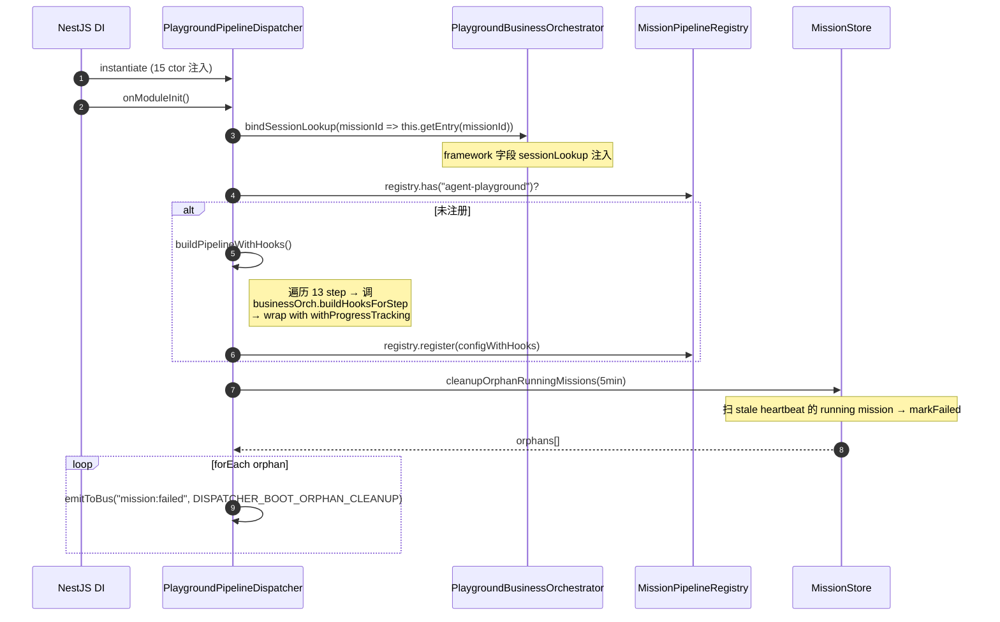
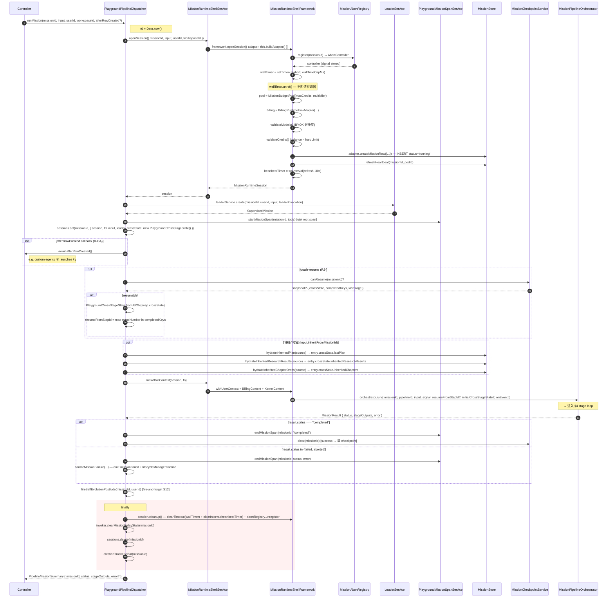
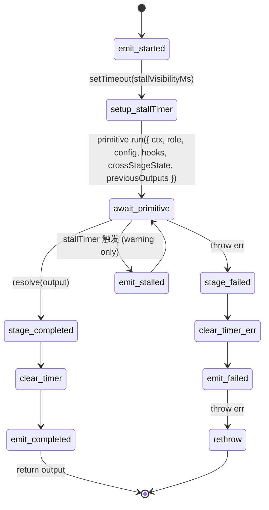
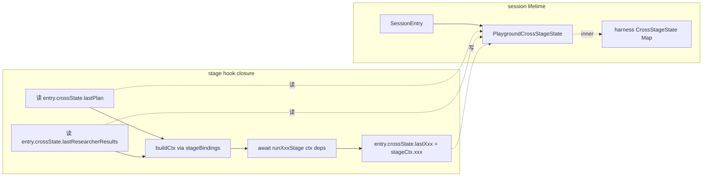
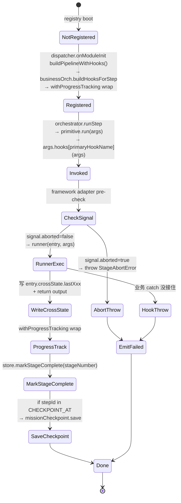

# 02 — Pipeline Orchestration (agent-playground)

> **路 2 / 共 5 路 · 端到端业务流分析 · 2026-05-24**
>
> 本文覆盖 dispatcher 收到 mission → 13 step 跑完/中断的全部机制层。
> 范围严格限定在 dispatcher / orchestrator / framework / runner-glue；不进入
> stage 内部 LLM 调用（路 3）或 mission 持久化细节（路 4）。
>
> **所有 file:line 引用基于 main@2026-05-24 工作树。**

---

## 1. Overview

### 1.1 分层定位

```
HTTP Controller (L4 / api/controller/agent-playground.controller.ts)
   ↓ runMission(missionId, input, userId)
PlaygroundPipelineDispatcher (L3 / mission/pipeline/playground.pipeline.ts)
   ├── extends BusinessTeamMissionDispatcherFramework  (L2.5 / harness/teams/business-team/dispatcher/)
   ↓
MissionRuntimeShellService (L3 / mission/pipeline/mission-runtime-shell.service.ts)
   ├── 注入 IMissionRuntimeAdapter into
   ↓
MissionRuntimeShellFramework  (L2.5 / harness/teams/business-team/lifecycle/mission-runtime-shell.framework.ts)
   ├── 装配 wallTimer / heartbeat / abortController / billing / budgetPool
   ↓
MissionPipelineOrchestrator   (L2.5 / harness/teams/orchestrator/pipeline/mission-pipeline-orchestrator.service.ts)
   ├── 跑 13 step（顺序为主 + S4‖S5 并行）；emit stage:* events
   ↓ 调每 step 的 primitive.run(args)
PlaygroundBusinessOrchestrator (L3 / mission/pipeline/playground-business-orchestrator.service.ts)
   ├── extends BusinessTeamOrchestratorFramework
   ├── 持有 11 个 buildSXxxHooks() → 调 runXxxStage(ctx, deps)
   ↓
Stage primitive 内部 hook closures
   ├── 路 3 接管：stage hook 内部调 LLM / agent / tool
```

四层职责（自上而下）：

| 层                                       | 类 / 文件                                                     | 职责                                                                   |
| ---------------------------------------- | ------------------------------------------------------------- | ---------------------------------------------------------------------- |
| **Controller (L4)**                      | `agent-playground.controller.ts`                              | HTTP 解码 → 调 dispatcher                                              |
| **Dispatcher (L3+L2.5 thin)**            | `PlaygroundPipelineDispatcher` (extends framework)            | per-mission session lifecycle + bridge orchestrator 事件到业务事件总线 |
| **Runtime Shell (L3+L2.5)**              | `MissionRuntimeShellService` / `MissionRuntimeShellFramework` | 装配 wallTimer / heartbeat / abort / budget pool / billing context     |
| **Orchestrator (L2.5)**                  | `MissionPipelineOrchestrator`                                 | 按 PipelineConfig.steps 顺序跑 + S4‖S5 并行 + emit lifecycle 事件      |
| **Business Orchestrator (L3+L2.5 thin)** | `PlaygroundBusinessOrchestrator` (extends framework)          | 11 个 stage hook builders → stage 内部 runner                          |

### 1.2 关键单一职责边界

- **engine 不知 agent / mission** → mission-pipeline-orchestrator 不在 `ai-engine`，在 `ai-harness/teams/orchestrator/`
- **A2A 协议接口源头**在 `protocols/ipc/abstractions/`（dispatcher 不 emit "A2A 包"，emit `BusinessTeamMissionBusEvent`）
- **dispatcher → orchestrator 单向依赖**：business-orchestrator 仅 `type-import SessionEntry`，不引用 dispatcher 运行时类
- **framework re-export 不走 facade**：`teams/business-team/*` 内部文件直接 import 同包 source，避开 `facade/index.ts` 回环（参见 `mission-runtime-shell.framework.ts:18` 注释）

### 1.3 Soft cancel 信号源（4 个）

`session.missionAbort.signal` 的 4 个触发源（按优先级）：

1. **`user_cancelled`** — controller.cancelMission → `MissionAbortRegistry.abort(missionId, "user_cancelled")`
2. **`budget_exhausted`** — `MissionBudgetPool.assertCharge()` 触发 → emit + abort
3. **`mission_wall_time_exceeded`** — `MissionRuntimeShellFramework` 的 `setTimeout(wallTimer, wallTimeCapMs)` 触发
4. **`mission_row_missing`** / **`rerun_replacing_stale`** / **`superseded`** / **`orchestrator_shutdown`** — 其它边界

唯一权威 abort enum：`ai-harness/lifecycle/mission-lifecycle/abort-registry.ts:22-29`

```ts
export enum MissionAbortReason {
  user_cancelled = "user_cancelled",
  budget_exhausted = "budget_exhausted",
  mission_wall_time_exceeded = "mission_wall_time_exceeded",
  mission_row_missing = "mission_row_missing",
  rerun_replacing_stale = "rerun_replacing_stale",
  superseded = "superseded",
  orchestrator_shutdown = "orchestrator_shutdown",
}
```

---

## 2. PLAYGROUND_PIPELINE — 13 step 矩阵

> 完整定义见 `runtime/playground.config.ts:62-518`。每 step 用 `defineMissionPipeline()` 注册到 `MissionPipelineRegistry`。
>
> S12 self-evolution **不在 pipeline.steps** —— 由 dispatcher 在 mission terminal 后 fire-and-forget 调 `runSelfEvolutionStage()`，以 `mission:postlude:*` 事件流广播（playground.pipeline.ts:584-655 / 注释 playground.config.ts:505-509）。

### 2.1 Step Matrix

| #   | stepId                        | primitive                          | roleId     | timeoutMs          | rerunable                    | depends_on (ctxReads)                                                               | ctxWrites                                                                         | dbWrites                                                                                                                                                  |
| --- | ----------------------------- | ---------------------------------- | ---------- | ------------------ | ---------------------------- | ----------------------------------------------------------------------------------- | --------------------------------------------------------------------------------- | --------------------------------------------------------------------------------------------------------------------------------------------------------- |
| 1   | `s1-budget`                   | `persist` (mode=budget-pre)        | —          | 30 000             | **false** ("预算闸不可重跑") | `input`                                                                             | —                                                                                 | `max_credits`                                                                                                                                             |
| 2   | `s2-leader-plan`              | `plan`                             | leader     | 900 000 (15 min)   | true                         | `input`                                                                             | `plan`                                                                            | `dimensions`, `theme_summary`                                                                                                                             |
| 3   | `s3-researcher-collect`       | `research` (mode=byPlanDimensions) | researcher | 1 200 000 (20 min) | true                         | `plan`, `input`                                                                     | `researcherResults`                                                               | — (写子表 research_results)                                                                                                                               |
| 4   | `s4-leader-assess`            | `assess`                           | leader     | 600 000 (10 min)   | true                         | `plan`, `researcherResults`                                                         | —                                                                                 | `leader_journal`                                                                                                                                          |
| 5   | `s5-reconciler`               | `synthesize` (mode=reconcile)      | reconciler | 300 000 (5 min)    | true                         | `researcherResults`                                                                 | `reconciliationReport`                                                            | `reconciliation_report`                                                                                                                                   |
| 6   | `s6-analyst`                  | `synthesize` (mode=analyze)        | analyst    | 600 000            | true                         | `researcherResults`, `reconciliationReport`                                         | `analystOutput`                                                                   | `analyst_output`                                                                                                                                          |
| 7   | `s7-writer-outline`           | `draft` (mode=outline)             | writer     | 300 000            | true                         | `analystOutput`, `plan`                                                             | `outlinePlan`                                                                     | `outline_plan`                                                                                                                                            |
| 8   | `s8-writer`                   | `draft` (mode=full)                | writer     | 1 500 000 (25 min) | true                         | `outlinePlan`, `analystOutput`, `researcherResults`, `reconciliationReport`, `plan` | `report`, `reportArtifact`, `reviewScore`, `verifierVerdicts`, `trajectoryStored` | `report_full`, `report_artifact_version`                                                                                                                  |
| 9   | `s8b-quality-enhancement`     | `review` (mode=quality-enhance)    | reviewer   | 600 000            | true                         | `reportArtifact`                                                                    | `reportArtifact`                                                                  | `report_full`                                                                                                                                             |
| 10  | `s9-critic`                   | `review` (mode=meta-critic)        | reviewer   | 300 000            | true                         | `reportArtifact`                                                                    | `reportArtifact`                                                                  | `report_full`                                                                                                                                             |
| 11  | `s9b-objective-eval`          | `review` (mode=objective)          | reviewer   | 300 000            | true                         | `reportArtifact`                                                                    | `reportArtifact`                                                                  | `report_full`, `verdicts`                                                                                                                                 |
| 12  | `s10-leader-foreword-signoff` | `signoff`                          | leader     | 300 000            | true                         | `reportArtifact`, `verifierVerdicts`                                                | `leaderSignOff`                                                                   | `leader_signed`, `leader_overall_score`, `leader_verdict`, `leader_journal`                                                                               |
| 13  | `s11-persist`                 | `persist` (mode=final)             | —          | 120 000            | true                         | `reportArtifact`, `verifierVerdicts`, `leaderSignOff`, `trajectoryStored`           | —                                                                                 | `report_full`, `report_artifact_version`, `completed_at`, `final_score`, `status`, `tokens_used`, `cost_usd`, `trajectory_stored`, `last_completed_stage` |
| ✱   | `s12-self-evolution`          | (not pipeline step)                | steward    | —                  | n/a                          | `plan`, `researcherResults`, `reportArtifact`, `leaderSignOff`                      | —                                                                                 | — (写 memory/postmortem)                                                                                                                                  |

### 2.2 `defaultStepTimeoutMs` & timeout 语义

- `PLAYGROUND_PIPELINE.defaultStepTimeoutMs = 10 * 60_000` (10 min) — 见 `playground.config.ts:511`
- **重要：timeoutMs 不再杀 stage**（2026-05-06 整改，注释见 `playground.config.ts:107-113` + `mission-pipeline-orchestrator.service.ts:277-300`）：
  - 平台层删除 stage 死秒表 `withTimeout` race
  - `timeoutMs * 1.5`（或默认 15 min）后仅 emit `stage:stalled` 警告（不杀）
  - 真死活由三道兜底：
    1. `MissionLivenessGuard`（监听 DomainEventBus inactivity 5min）
    2. `mission-runtime-shell.wallTimer`（mission 总长上限 4h）
    3. primitive 内 LLM HTTP timeout 抛错冒泡

### 2.3 11 个 role 定义

`playground.config.ts:65-106` 注册 8 个 role（少于 stage role 数，是因为 reviewer 同时承担 s8b/s9/s9b）：

| roleId       | stateful                                    | SKILL.md path                        |
| ------------ | ------------------------------------------- | ------------------------------------ |
| `leader`     | **true** ★ 跨 stage 持有 statefulRoleStates | `mission/agents/leader/SKILL.md`     |
| `researcher` | false                                       | `mission/agents/researcher/SKILL.md` |
| `reconciler` | false                                       | `mission/agents/reconciler/SKILL.md` |
| `analyst`    | false                                       | `mission/agents/analyst/SKILL.md`    |
| `writer`     | false                                       | `mission/agents/writer/SKILL.md`     |
| `reviewer`   | false                                       | `mission/agents/reviewer/SKILL.md`   |
| `verifier`   | false                                       | `mission/agents/verifier/SKILL.md`   |
| `steward`    | false                                       | `mission/agents/steward/SKILL.md`    |

Skill 加载经 `buildSkillSpecFromMd()`（playground.config.ts:31-57）→ `loadSkill(agentDir, AGENTS_ROOT_DIR)` 拉 frontmatter + duties，拼成 IAgentSpec。outputSchema 是 always-pass z.unknown() 占位（R2-A.0 留给后续真正集成）。

### 2.4 DAG cascade rerun 元数据

每 step `dag` 字段：

- `successors`: 重跑该 stage 必须自动跑的下游链（cascade chain）
- `rerunable`: 是否允许用户从 UI 触发重跑
- `resetFields`: 重跑前要 reset 的 mission row 列
- `rerunableReason`: rerunable=false 时给前端的文案

校验逻辑：`ai-harness/runner/dag/stage-dag-meta.types.ts:104-146` `validateStageDag()` — 启动期 registry boot 调一次，校验 successors 引用合法 + 无环。

---

## 3. dispatcher.runMission 时序图

### 3.1 onModuleInit (boot 阶段)



引用：`playground.pipeline.ts:229-286`

### 3.2 runMission happy path（前 9 步装配）



引用：`playground.pipeline.ts:307-575`

### 3.3 ctor 注入的 15 个依赖

```ts
constructor(
  private readonly registry: MissionPipelineRegistry,           // L2.5 pipeline 注册表
  private readonly orchestrator: MissionPipelineOrchestrator,   // L2.5 执行器
  private readonly runtimeShell: MissionRuntimeShellService,     // L3 wallTimer + heartbeat 装配器
  private readonly stageBindings: MissionStageBindingsService,   // L3 ctx + deps 装配（buildCtx / buildDeps）
  private readonly leaderService: LeaderService,                 // L3 stateful Leader 容器
  private readonly invoker: AgentInvoker,                        // L3 通用 emit + agent 调度桥
  private readonly leaderInvocationFactory: LeaderInvocationFactory,
  private readonly missionCheckpoint: MissionCheckpointService,  // L2.5 crash-resume snapshot
  private readonly missionEventBuffer: MissionEventBuffer,        // L3 短时事件 buffer（s12 用）
  private readonly store: MissionStore,                          // L3 mission DB row CRUD
  private readonly electionTracker: MissionElectionTracker,      // L2.5 model diversity tracker
  eventBus: DomainEventBus,                                       // L2.5 唯一 emit 总线
  private readonly businessOrch: PlaygroundBusinessOrchestrator, // L3 11-stage hook builders
  private readonly lifecycleManager: MissionLifecycleManager,    // L2.5 终态写仲裁单入口（C0/G1）
  private readonly missionSpan: PlaygroundMissionSpanService,    // L3 otel span
)
```

注意：

- `eventBus` 走 `super(eventBus, config)` 注入到 framework，dispatcher 不再本地存 eventBus ref；
- `lifecycleManager.finalize(...)` 是 **唯一终态写入口**（C0/G1）—— dispatcher 任何 markFailed/markCompleted 都经此仲裁，禁直写 `store.markX()`（见 `playground.pipeline.ts:681 / 838`）。

---

## 4. stage 执行循环（MissionPipelineOrchestrator）

### 4.1 整体逻辑

`mission-pipeline-orchestrator.service.ts:97-233`

```
run(args):
  1. resolveSteps(config)         // 启动期把 primitive + role 一次性解析
  2. stageOutputs = {...initial}  // 从 resume snapshot hydrate
  3. crossStageState = fromJSON(initial)
  4. startIndex = resolvedSteps.findIndex(resumeFromStepId) + 1  // resume 跳过
  5. emit mission:started
  6. for i = startIndex; i < resolvedSteps.length; i++:
       a. signal.aborted? → throw StageAbortError
       b. isS4S5Pair?       → Promise.all([runStep(s4), runStep(s5)]) + i++
                              否则 runStep(s_i)
       c. stageOutputs[step.id] = output
  7. emit mission:completed | mission:failed | mission:aborted
  8. return MissionResult { status, stageOutputs, crossStageState, error? }
```

### 4.2 顺序 vs DAG 并发

**结论：默认是顺序执行**（for-loop, await between steps），**唯一并发是 S4‖S5**（hard-coded special case）。

S4‖S5 并行（mission-pipeline-orchestrator.service.ts:149-194）的安全 guard：

- S4 ctxWrites=[] (只写 `leader_journal` DB)，S5 ctxWrites=[`reconciliationReport`] → ctxWrites disjoint
- S4 不读 S5 输出
- DB column 不冲突（leader_journal vs reconciliation_report）
- Node.js 单线程 async 保证 crossState 读在 first await 前同步发生

注意：**S3 dim 内部 fan-out**（每 dim 一个 researcher）是在 `s3-researcher-collect` 这**一个** stage 内部用 `runDagConcurrency()`（business-team/invocation/business-team-dag-concurrency.ts）跑，**不是 orchestrator-level 并发**。

### 4.3 stage 执行单步（runStep）



引用：`mission-pipeline-orchestrator.service.ts:259-367`

**stallVisibilityMs 计算：** `Math.max(timeoutMs * 1.5, 60_000)` 默认 15 min（同 §2.2）。
**stallTimer 是 warning-only**（emit `stage:stalled`），不杀 stage。

### 4.4 stage:degraded 软失败信号

stage hook 内部 catch 决定不阻断但要让用户可见 → 通过 `deps.markStageDegraded(missionId, userId, stepId, reason)`（mission-stage-bindings.service.ts:168-184）emit `agent-playground.stage:degraded`。

dispatcher onEvent handler 接到 `stage:degraded` → framework.bridgeOrchestratorStageEvent 桥接到 bus。

但注意：`stage:degraded` 在当前代码中**不是** orchestrator 内部 emit（orchestrator 只 emit 6 类：mission:\* / stage:started / stage:completed / stage:failed / stage:stalled），而是**业务侧 stage hook 经 deps.markStageDegraded 主动 emit**，因此 `MissionEvent` union 在 `mission-pipeline-orchestrator.service.ts:36-47` 列了 `stage:degraded` 是给 onEvent 透传用。

### 4.5 异常→事件映射

| Stage 内部抛出                                     | orchestrator 处理                                   | 上层（dispatcher）                                                                                         |
| -------------------------------------------------- | --------------------------------------------------- | ---------------------------------------------------------------------------------------------------------- |
| `StageAbortError`                                  | emit `mission:aborted`, return status=aborted       | 进入 `handleMissionFailure` 路径                                                                           |
| `Error("S3-AllDimensionsFailed: ...")`             | emit `stage:failed` then rethrow → `mission:failed` | finalize(failed, failureCode=PROVIDER_API_ERROR)                                                           |
| `InsufficientCreditsException`                     | 同上                                                | finalize(failed, failureCode=ORCH_CREDIT_INSUFFICIENT)                                                     |
| `ByokRequiredError`                                | 同上                                                | finalize(failed, failureCode=PROVIDER_BYOK_MODEL_NOT_FOUND)                                                |
| `InputValidationError` / `DefineAgentMissingError` | 同上                                                | finalize(failed, failureCode=RUNNER_INPUT_SCHEMA_MISMATCH)                                                 |
| 含 `rate-limit` / `429` 消息                       | 同上                                                | failureCode=PROVIDER_RATE_LIMIT                                                                            |
| AbortError（signal aborted）                       | 同上                                                | reason 路由：user_cancelled→skip / budget_exhausted→BUDGET_EXHAUSTED / wall_time→RUNNER_WALL_TIME_EXCEEDED |

完整 failureCode 路由表见 `playground.pipeline.ts:756-799`。

---

## 5. cross-stage-state 数据流

### 5.1 容器层级

```
MissionPipelineOrchestrator.run()
  └─ ctx (MissionContext)        ── 短命：每 mission 一份，stage 间共享（input / signal / statefulRoleStates）
  └─ crossStageState (CrossStageState) ── 短命：harness base K/V store，仅 stage primitive 用（orchestrator-level）
  └─ stageOutputs (Record<stepId, unknown>) ── 短命：stage primitive return value，按 step.id 索引

PlaygroundPipelineDispatcher.sessions Map
  └─ SessionEntry.crossState (PlaygroundCrossStageState extends BusinessTeamCrossStageStateFramework)
      ├─ inner: harness CrossStageState (typed wrapper)
      ├─ lastPlan / lastResearcherResults / ... (14 typed getter/setter)
      └─ inheritedResearchResults / inheritedChapters / s3PartialResults (rerun + crash-resume 缓存)
```

**注意双套 crossState：**

1. **orchestrator-level `crossStageState`**（mission-pipeline-orchestrator.service.ts:106）— 仅给 primitive 内部读写，每 stage primitive 自己决定 key naming（业务前缀避冲突）。
2. **dispatcher-level `entry.crossState`**（PlaygroundCrossStageState）— hook closures 读写，stage 间业务数据传递（lastPlan, lastReport 等）。

两者不互通。**业务真正使用的是 dispatcher-level**（hook closures 通过 `getEntry(missionId).crossState`），orchestrator-level 主要是给 generic primitive 内部副作用累计用。

### 5.2 14 个 typed 字段（playground-cross-stage-state.ts）

```ts
class PlaygroundCrossStageState extends BusinessTeamCrossStageStateFramework {
  // 11 个 stage 中间产物
  lastPlan, lastResearcherResults, lastReconciliationReport, lastAnalystOutput,
  lastOutlinePlan, lastReport, lastReportArtifact, lastReviewScore,
  lastVerifierVerdicts, lastLeaderForeword, lastLeaderSignOff
  // 1 个跨 stage 共享状态
  s4PatchFailures
  // 1 个迭代级 checkpoint
  s3PartialResults   // dim → ResearcherDimResult (crash-resume per-dim)
  // 2 个 trajectory rerun cache
  inheritedResearchResults, inheritedChapters
}
```

### 5.3 mutation-safe 保证

- harness base `CrossStageState` 用 `Map<string, unknown>`，**不是 ImmutableMap**。无写锁，靠 Node 单线程 async 保证：
  - hook 内部读 → 立即同步 `entry.crossState.lastPlan` （Map.get）
  - 接着 await LLM
  - 完成后写 `entry.crossState.lastPlan = X`（Map.set）
- 并行场景仅 S4‖S5 一处（§4.2 已分析 disjoint writes 安全）
- S3 dim 内部并行通过 `runDagConcurrency` 给每个 dim 单独的 stageCtx，dim 完成后串行 collect 到 `entry.crossState.lastResearcherResults`

### 5.4 数据流



### 5.5 rerun hydrate 流程

dispatcher.runMission 在 `orchestrator.run` 之前：

1. **crash-resume**：如果 `missionCheckpoint.canResume(missionId)` 返回 snapshot：
   - `PlaygroundCrossStageState.fromJSON(snap.crossState)` 还原 in-memory
   - `resumeFromStepId = max stageNumber in snap.completedKeys`（orchestrator startIndex+1 跳过已完成）

2. **"更新"按钮**：如果 `input.inheritFromMissionId`：
   - `hydrateInheritedPlan(source)` → `entry.crossState.lastPlan = sourcePlan`
   - `hydrateInheritedResearchResults(source)` → 复制到新 mission DB 子表 + `entry.crossState.inheritedResearchResults`
   - `hydrateInheritedChapterDrafts(source)` → 同上

S2 hook 检测到 `lastPlan` 已就绪即跳过 Leader LLM 调用并 emit synthetic plan event（playground-business-orchestrator.service.ts:221-279）。

### 5.6 checkpoint 持久化触发点

`withProgressTracking()`（playground.pipeline.ts:159-227）包主 hook，主 hook 完成后：

1. `store.markStageComplete(missionId, stageNumber)`（DB last_completed_stage 字段）
2. 仅当 stepId 在 `CHECKPOINT_AT`（`s2-leader-plan`, `s3-researcher-collect`, `s8-writer`）时：
   - `missionCheckpoint.save(missionId, { lastStage, topic, crossState: entry.crossState.toJSON() }, completedKeys, "running")`

S3 还有迭代级 checkpoint（`checkpointDimension`，playground-business-orchestrator.service.ts:455-479）：每个 dim 完成后 save snapshot，让 pod 崩溃后 dim 级 resume。

---

## 6. DAG 并发模型

### 6.1 三层并发

| 层                              | 并发是什么    | 上限                                | 实现                                                                           |
| ------------------------------- | ------------- | ----------------------------------- | ------------------------------------------------------------------------------ |
| **pipeline orchestrator level** | step 并行     | hard-coded 仅 S4‖S5                 | `Promise.all([runStep(s4), runStep(s5)])`                                      |
| **stage 内 dim 并行**（S3）     | 多 dim 同时跑 | `input.concurrency` (默认 by depth) | `runDagConcurrency(items, concurrency, fn)` (business-team-dag-concurrency.ts) |
| **dim 内章节并行**（S8）        | 多章节同时写  | tuning profile                      | `ChapterBatchExecutor` (helpers/chapter-batch-executor.helper.ts)              |

### 6.2 runDagConcurrency 行为

`business-team/invocation/business-team-dag-concurrency.ts:35-142`

- 拓扑求解：编译期 dependsOn 数组 → adjacency map + inDeg counter
- **死锁检测**：scheduler 拓扑求解前先做 reachability check，找不到 root → fallback 到 flat ConcurrencyLimiter（仍并发，但不按 DAG 顺序）
- **firstError 行为**：第一个 task 抛错后停 dispatch 新任务，**已 in-flight 任务跑完才 reject**（保数据一致）
- 输出顺序：results 按 input items 顺序填充（不按完成顺序）

### 6.3 ConcurrencyLimiter（信号量）

`ai-harness/runner/concurrency/concurrency-limiter.ts`

- FIFO queue 信号量
- `acquire()` → `Promise<release>` (release 必须调用一次)
- `run(fn)` 便捷封装（try-finally release）
- 幂等 release（重复 release 无害）

### 6.4 DAGExecutor（DB-backed，**与 in-memory 严格区分**）

`ai-harness/runner/dag/dag-executor.ts`

- 给 **DB-backed 任务池**调度用（research/TI 的持久化任务队列）
- 业务侧 inject `DAGAdapter` 实现 `fetchExecutable / executor / countPending / isCancelled`
- 真动态：`Promise.race` 任意一 task 完成即下轮 fetch
- 死锁检测：30 次连续无 executable 任务退出
- **agent-playground 当前不用 DAGExecutor**（business-team-dag-concurrency.ts:7-10 注释明确两者边界：dag-executor for DB-backed；in-memory helper for stage 内 dim 并行）

### 6.5 concurrency budget 来源

`input.concurrency` → `RunMissionInput` DTO 字段（api/dto/run-mission.dto.ts）。
默认值由 `depth` 派生（`resolveMissionWallTimeMs` / `resolveMissionCredits` / `resolveBudgetMultiplier` 同一处解析逻辑）。

S3 fan-out 实际并发上限：由 dim 数 × `input.concurrency` 决定（每 dim 一个 task）。
ConcurrencyLimiter / runDagConcurrency 不读 env config，concurrency 直接由 caller 传参。

---

## 7. stage hook lifecycle

### 7.1 hook 类型分类

| Hook 名                                                                                                 | 触发时机                    | 谁调用                      | 用途                             |
| ------------------------------------------------------------------------------------------------------- | --------------------------- | --------------------------- | -------------------------------- |
| **primary hook**（由 primitive 决定，如 `runRole` / `synthesize` / `draftOnce` / `persist` / `review`） | stage primitive.run 主路径  | stage primitive 内部        | 业务核心调用（LLM / agent 调度） |
| **assistant hook**（如 `extractPlanFields`, `parseDecision`, `scoreScaling`）                           | primitive 内部派生数据      | stage primitive 内部        | 业务专属同步转换                 |
| **fan-out hook**（如 `fanOut` + `perItemPipeline`）                                                     | research 类 primitive       | primitive 内部 fan-out 调度 | 多 dim 调度                      |
| **degraded marker**（`deps.markStageDegraded`）                                                         | stage 内部 catch 决定不阻断 | hook 实现方主动调           | emit `stage:degraded`            |

### 7.2 hook lifecycle 状态图



### 7.3 BusinessTeamOrchestratorFramework default adapter vs playground override

playground 的 11 个 stage hook 都是 **多 hook 模式**（如 s2 同时 `runRole` + `extractPlanFields`），不走 framework 的 single-hook default adapter（`business-team-orchestrator.framework.ts:129-168`）。

framework `resolveStageRunner(stepId)` 在 playground 永远返回 null（playground-business-orchestrator.service.ts:150-154），实际入口是 playground 自己 override 的 `buildHooksForStep(stepId, primitive)`（playground-business-orchestrator.service.ts:118-142）。

framework 的 default adapter 仅在其它业务团队（如 social）走 single-hook 时复用。

### 7.4 hook 异常处理边界

- **framework adapter 抛 `StageAbortError`** → orchestrator 接到 → emit `mission:aborted` / status=aborted
- **runner 抛业务 Error** → primitive 透传 → orchestrator emit `stage:failed` → throw → 触发外层 try/catch → emit `mission:failed`
- **hook 内 catch 后调 `markStageDegraded`** → emit `stage:degraded` 警告，stage 继续返回（不抛）
- **withProgressTracking 内 store.markStageComplete / checkpoint.save 失败** → log.warn 不抛（non-fatal，playground.pipeline.ts:186-218）

---

## 8. Happy path — 13 step 全过的事件流

> 假设：用户首次跑 mission，无 inherit、无 resume、不触发任何 degraded / stalled。

```
[t=0]   POST /api/agent-playground/missions/run
  ├── controller.runMission(input)
  ├── dispatcher.runMission(missionId, input, userId, workspaceId)
  ├── runtimeShell.openSession(...)
  │     ├── abortRegistry.register → AbortController
  │     ├── setTimeout(wallTimer, 4h)
  │     ├── new MissionBudgetPool(credits, multiplier)
  │     ├── validateModels → emit agent-playground.mission:warning? (单模型)
  │     ├── validateCredits → throw if balance <= hardLimit
  │     ├── store.create(missionId, status='running')
  │     └── setInterval(heartbeatRefresh, 30s)
  ├── leaderService.create → SupervisedMission
  ├── missionSpan.startMissionSpan("playground.mission")
  ├── sessions.set(missionId, { session, t0, input, leader, crossState })
  └── orchestrator.run({...})

[orchestrator] emit mission:started
[orchestrator] → bridgeOrchestratorStageEvent SKIPS (mission:* not handled)
  // mission:started 直接由 invoker.emitEvent or DomainEventBus
  // (orchestrator emit, dispatcher onEvent 不桥 mission:* event)

[t=2s] runStep(s1-budget)
  emit stage:started (stepId=s1-budget, primitive=persist)
    → dispatcher.onEvent → missionSpan.startStageSpan
    → framework.bridgeOrchestratorStageEvent → emitToBus("agent-playground.stage:lifecycle", status=started)
  await primitive.run → buildS1BudgetHooks().persist(args)
    → runBudgetEstimateStage(invariants, deps)
    → emit agent-playground.mission:budget-estimated
  emit stage:completed (output={...})
    → missionSpan.endStageSpan(completed)
    → bridge → emitToBus("agent-playground.stage:lifecycle", status=completed, output)
  withProgressTracking:
    store.markStageComplete(1)
    // s1 NOT in CHECKPOINT_AT → skip checkpoint

[t=15s] runStep(s2-leader-plan)
  emit stage:started
  await primitive.run → buildS2LeaderPlanHooks().runRole(args)
    → runLeaderPlanStage(stageCtx, deps)
    → LLM 调用 (路 3)
    → ctx.plan populated
    → entry.crossState.lastPlan = stageCtx.plan
  emit stage:completed
  store.markStageComplete(2)
  missionCheckpoint.save("s2-leader-plan", completedKeys=[s1,s2])

[t=2min] runStep(s3-researcher-collect)
  emit stage:started
  await primitive.run → buildS3ResearcherCollectHooks().perItemPipeline(args)
    fanOut → [{ kind: "all-dimensions" }]
    perItemPipeline:
      cache check: no inheritedResearchResults → fresh path
      runResearcherDispatchStage(stageCtx, deps + checkpointDimension)
        → for each dim (runDagConcurrency, parallel):
            emit agent-playground.dimension:research:started
            researcher LLM (路 3)
            emit agent-playground.dimension:research:completed
            checkpointDimension(missionId, dimId, dimResult) → missionCheckpoint.save partial
        → mutate stageCtx.researcherResults
      entry.crossState.lastResearcherResults = stageCtx.researcherResults
      store.saveResearchResult(...) × N (持久化 baseline)
      check failedCount: 0/N → no markStageDegraded
  emit stage:completed
  store.markStageComplete(3)
  missionCheckpoint.save("s3-researcher-dispatch", completedKeys=[s1,s2,s3])

[t=20min] runStep(s4-leader-assess)  & runStep(s5-reconciler)  // ★ S4‖S5 并行
  emit stage:started × 2
  await Promise.all([
    s4.runRole(args):
      runLeaderAssessResearchStage → ctx.plan/researcherResults patches?
      entry.crossState.lastPlan = stageCtx.plan
      entry.crossState.lastResearcherResults = stageCtx.researcherResults
    ,
    s5.synthesize(args):
      runReconcilerStage → ctx.reconciliationReport
      entry.crossState.lastReconciliationReport = stageCtx.reconciliationReport
  ])
  emit stage:completed × 2
  store.markStageComplete(4 & 5)

[t=30min] runStep(s6-analyst)
  buildS6AnalystHooks().synthesize → runAnalystStage
  entry.crossState.lastAnalystOutput = stageCtx.analystOutput
  emit stage:completed

[t=35min] runStep(s7-writer-outline)
  buildS7WriterOutlineHooks().draftOnce → runWriterOutlineStage
  entry.crossState.lastOutlinePlan = stageCtx.outlinePlan
  emit stage:completed

[t=1h] runStep(s8-writer)
  buildS8WriterHooks().draftOnce → runWriterStage
  entry.crossState.lastReport / lastReportArtifact / lastReviewScore / lastVerifierVerdicts
  emit stage:completed
  store.markStageComplete(8)
  missionCheckpoint.save("s8-writer-draft", completedKeys=[s1..s8])

[t=1h5min] runStep(s8b-quality-enhancement)
  buildReviewHooks("s8b-quality-enhancement").review → runSectionQualityEnhancementStage
  entry.crossState.lastReportArtifact mutated
  emit stage:completed

[t=1h10min] runStep(s9-critic) / runStep(s9b-objective-eval)  // 顺序，非并行
  ... 同上 review hooks ...

[t=1h20min] runStep(s10-leader-foreword-signoff)
  buildS10SignoffHooks().runRole → runLeaderForewordAndSignoffStage
  entry.crossState.lastLeaderForeword / lastLeaderSignOff

[t=1h22min] runStep(s11-persist)
  buildS11PersistHooks().persist → runPersistStage(missionId, userId, t0, result, pool)
    → finalize via lifecycleManager (条件写 WHERE status='running')
    → 写 report_full / completed_at / final_score / status='completed' / tokens_used / ...
  missionCheckpoint.clear(missionId)  // success path 清 checkpoint
  store.saveReportVersion(missionId, triggerType=initial, ...)
  emit stage:completed

[orchestrator] emit mission:completed
  → dispatcher.onEvent NOT bridge mission:* (framework.bridgeOrchestratorStageEvent returns false for non-stage events)

[dispatcher post-orchestrator-return]
  missionSpan.endMissionSpan(missionId, "completed")
  missionCheckpoint.clear(missionId)  // 重复清，幂等
  fireSelfEvolutionPostlude(missionId, userId):
    emit mission:postlude:started
    void runSelfEvolutionStage(...) (fire-and-forget)
    .then  → emit mission:postlude:completed
    .catch → emit mission:postlude:failed

[finally]
  session.cleanup():
    clearTimeout(wallTimer)
    clearInterval(heartbeatTimer)
    abortRegistry.unregister(missionId)
  invoker.clearMissionRelayState(missionId)
  sessions.delete(missionId)
  electionTracker.clear(missionId)

return PipelineMissionSummary { status: "completed", stageOutputs, error: undefined }
```

**事件总数**：mission:started + 13×(stage:started, stage:completed) + S4S5 一对额外 + mission:completed + postlude:started + postlude:completed ≈ 32 个 lifecycle event。**stage:lifecycle 是统一桥接 wire**（详 §10）。

---

## 9. 异常场景分支（9 类，本路视角）

> **P0 = 必须正确处理（mission 不能死循环 / 不能 leak session / 不能写错状态）**；
> **P1 = 影响 UX（用户应该看到正确文案）**；
> **P2 = 边界**。

### 9.1 single stage timeout → 怎么终结（P1）

**当前真相**：stage timeout **不杀 stage**（2026-05-06 整改）。

- `step.timeoutMs * 1.5` 后 emit `stage:stalled` warning（mission-pipeline-orchestrator.service.ts:302-313）
- stage 自己跑到 primitive return / primitive 内 LLM HTTP timeout 抛 / signal aborted 为止
- 真死活兜底：
  1. **MissionLivenessGuard** 监听 DomainEventBus 该 missionId inactivity 5min → abort
  2. **mission-runtime-shell wallTimer**（4h）到点 abort
  3. **primitive 内 LLM SDK timeout** 抛 → orchestrator emit stage:failed → mission:failed

stage 一直 stalled 不动（没 LLM event emit）时，由 **LivenessGuard** 在 5min 内强制 abort 整 mission。

### 9.2 stage throw（业务异常 / unhandled error）→ 是否进 retry / 影响后续（P0）

**结论**：orchestrator **不重试 stage**。

- stage hook 内业务 throw → primitive throw → orchestrator runStep catch → emit `stage:failed` → throw 给 orchestrator.run for-loop
- orchestrator.run 的外层 try/catch（mission-pipeline-orchestrator.service.ts:217-232）→ 判定 isAbort：
  - `StageAbortError` → status=aborted, emit mission:aborted
  - 其它 → status=failed, emit mission:failed
- 返回 MissionResult 给 dispatcher，dispatcher 走 `handleMissionFailure` 路径
- **后续 step 全部 skip**（throw 已退出 for-loop）

retry 在 stage 内部：S3 dim 内有 retry（dim 级失败兜底），但 stage 整体不 retry。

### 9.3 AbortSignal fired（用户点 cancel）→ 怎么穿透 in-flight stage（P0）

**穿透链**：

1. controller.cancelMission → `abortRegistry.abort(missionId, "user_cancelled")` → 同一 AbortController.signal 立即 aborted=true（reason="user_cancelled"）
2. session.missionAbort.signal 已传给 `orchestrator.run({ signal })`
3. orchestrator 在每个 for-loop 头部 check `args.signal?.aborted`（mission-pipeline-orchestrator.service.ts:142-147）→ throw StageAbortError
4. **framework default adapter** 也 check `args.ctx.signal?.aborted`（business-team-orchestrator.framework.ts:149-153）→ throw StageAbortError
5. **stage 内部 LLM call** 必须 `await llmClient.chat({ signal })` 才能立即中断（路 3 责任）
6. dispatcher.handleMissionFailure 看 `signal.reason === "user_cancelled"` → skip mission:failed（controller 已 emit `mission:cancelled`，playground.pipeline.ts:756-770）

**关键：lifecycleManager.finalize(intent.status="cancelled", abort=true)** 是 controller 走的路径，dispatcher.runMission 看到 signal 已 aborted 时**不再写 DB**（条件写 WHERE status='running' 会失败 / no-op），避免覆盖 controller 的 cancelled 状态（C0/G1 单点仲裁）。

### 9.4 DAG sibling 一个 fail 是否拖死其他（P0）

#### 9.4.1 S4‖S5 这一处 orchestrator-level 并行

代码：`Promise.all([runStep(s4), runStep(s5)])`（mission-pipeline-orchestrator.service.ts:174-189）

- 任一 throw → Promise.all reject → for-loop 上层 catch → mission:failed
- 另一支已 in-flight 但**没等它跑完**（Promise.all 不 cancel）→ 仍写 entry.crossState.lastXxx（但 mission 已失败，不再用）
- **没有 unhandled rejection**（Promise.all 包了）但另一支的 emit stage:completed 会**继续到 dispatcher.onEvent**（onEvent 内部还会跑），可能造成"已 mission:failed 但又收到 stage:completed"的事件序列错位 — **这是 P1 隐患**。

#### 9.4.2 S3 fan-out 内部 dim 并行

`runDagConcurrency` 行为（business-team/invocation/business-team-dag-concurrency.ts:124-128）：

- firstError 后不再 dispatch 新 dim
- 已 in-flight dim 跑完才 reject（保数据一致）
- 但 reject 出去：S3 hook throw → S3 stage:failed → mission:failed
- entry.crossState.lastResearcherResults 部分填充（在 catch 之前的 dim 已写 DB），dispatcher.handleMissionFailure 把这部分 partial 报告写入 mission row 的 themeSummary/dimensions

### 9.5 pipeline 整体 wall-time 超 → mission-wall-time-exceeded（P0）

链：

1. `MissionRuntimeShellFramework` ctor 装 `setTimeout(wallTimer, wallTimeCapMs)`（mission-runtime-shell.framework.ts:77-107）
2. wallTimer 触发：
   - emit `agent-playground.mission:budget-warning-hard`（reason=wall_time_exceeded）
   - `missionAbort.abort(MissionAbortReason.mission_wall_time_exceeded)`
3. 当前 in-flight stage 的 signal.aborted=true（reason="mission_wall_time_exceeded"）
4. orchestrator 下一次 signal check 抛 StageAbortError → mission:aborted
5. dispatcher.handleMissionFailure：abortReason==="mission_wall_time_exceeded" → failureCode=RUNNER_WALL_TIME_EXCEEDED → emit mission:failed + finalize(failed)
6. displayMessage="运行超过墙钟时限被中止。请在「Mission 设置」提高时间上限后重跑。"（playground.pipeline.ts:801-807）

**关键：P0-1 audit 修法** — wallTimer 内 try/finally 保证 abortRegistry.abort 一定执行（即使 emit 失败）— mission-runtime-shell.framework.ts:78-106。

### 9.6 pipeline budget exhausted（P0）

- `MissionBudgetPool.assertCharge()` 抛 BudgetExhaustedError（or `pool.abort(MissionAbortReason.budget_exhausted)`） — 由路 3 详查
- 同 9.5 链路：signal.reason="budget_exhausted" → handleMissionFailure → failureCode=BUDGET_EXHAUSTED
- displayMessage：`预算已耗尽（已用约 ${k} tokens / $${cost}）。请在「Mission 设置」提高 Credits 上限后重跑。`

### 9.7 rerun 某个 stage（从 checkpoint 起跑）→ 状态怎么复原（P0）

两种 rerun：

#### A. crash-resume（R2-#37）

dispatcher.runMission 启动时：

1. `missionCheckpoint.canResume(missionId)` 返回 snapshot
2. `PlaygroundCrossStageState.fromJSON(snap.crossState)` → 替换 sessions.set 的 entry.crossState
3. `resumeFromStepId = max stageNumber in snap.completedKeys` → 传给 orchestrator
4. orchestrator startIndex = resolvedSteps.findIndex(resumeFromStepId) + 1 → for-loop 从此 step 之后开始
5. crossStageState（orchestrator-level）从 `initialCrossStageState`（snap.crossState）hydrate
6. 已完成 step 的 stageOutputs 不在 snap 里（snap 只存 crossState）→ stageOutputs 起始为空，后续 stage 通过 entry.crossState 读 last\* 字段

S3 还有 dim 级 resume（s3PartialResults）：

- S3 hook 检测到 `entry.crossState.s3PartialResults` 不空 → 把已完成 dim 过滤掉，pendingDims 重新 dispatch
- 完成后 merge 回原 dim 顺序

#### B. UI 手动重跑某 stage（cascade rerun）

走 `mission-rerun-orchestrator.service.ts` 路径（不在本路范围），但走相同的 PLAYGROUND_PIPELINE.steps[i].dag.resetFields / successors 元数据：

- step.dag.resetFields 决定要 reset 哪些 mission row 列
- step.dag.successors 决定 cascade 链
- step.dag.rerunable=false → UI 拒绝（s1-budget 唯一禁止重跑）

### 9.8 stage hook 自己 throw（binding handler bug）→ 是否拖死 pipeline（P1）

- hook closure throw → primitive throw → orchestrator emit stage:failed → mission:failed
- **不拖死其他 mission**：每 mission 独立 SessionEntry / sessions Map / AbortController
- dispatcher 的 try/finally 兜底 cleanup（playground.pipeline.ts:546-574）：即使 handleMissionFailure 自己抛错，finally 仍会 cleanup session（cleanup catch 包，避免二次抛错）
- A-8 兜底：`reachedTerminal=false` 时 emit `mission:execution-aborted`（不写 DB 避再抛）

### 9.9 mission-runtime-shell openSession 失败（DB 不可用）→ 是否进 mission（P0）

`MissionRuntimeShellFramework.openSession` try/catch（mission-runtime-shell.framework.ts:120-156）：

- 装 wallTimer/heartbeat 之后才 try
- catch 内 `cleanup()` 调 clearTimeout/clearInterval/abortRegistry.unregister → 不 leak resource
- throw 抛给 dispatcher.runMission
- dispatcher 的 try-catch（playground.pipeline.ts:529-545）→ `tryHandleAbort(reason="execution_threw")`
- tryHandleAbort 内 emit `mission:execution-aborted` + 调 `lifecycleManager.finalize(failed)`
- finally cleanup session（catch wrap）

**注意失败路径**：mission row 此时**还没 INSERT**（adapter.createMissionRow 在 validate 之后），finalize 试图条件写 `WHERE status='running'` 会 0 行影响 → arbiter 返回 false → finalize.won=false → no-op，整 mission 行从未存在过。这是 by-design：失败发生在 row 创建前，不需要 DB 反映任何状态。

---

## 10. Framework 与 App 子类的 hook 接口契约表

### 10.1 三个 framework + 三个业务子类

| Framework (L2.5)                                            | 业务子类 (L3)                                       | source file (framework)                                                  | source file (子类)                                             |
| ----------------------------------------------------------- | --------------------------------------------------- | ------------------------------------------------------------------------ | -------------------------------------------------------------- |
| `BusinessTeamMissionDispatcherFramework`                    | `PlaygroundPipelineDispatcher`                      | `business-team/dispatcher/business-team-mission-dispatcher.framework.ts` | `mission/pipeline/playground.pipeline.ts`                      |
| `BusinessTeamOrchestratorFramework<TSession>`               | `PlaygroundBusinessOrchestrator`                    | `business-team/orchestrator/business-team-orchestrator.framework.ts`     | `mission/pipeline/playground-business-orchestrator.service.ts` |
| `MissionRuntimeShellFramework` (+ `IMissionRuntimeAdapter`) | `MissionRuntimeShellService` (+ playground adapter) | `business-team/lifecycle/mission-runtime-shell.framework.ts`             | `mission/pipeline/mission-runtime-shell.service.ts`            |
| `BusinessTeamStageBindingsFramework<TCtxArgs,TCtx,TDeps>`   | `MissionStageBindingsService`                       | `business-team/bindings/business-team-stage-bindings.framework.ts`       | `mission/pipeline/mission-stage-bindings.service.ts`           |
| `BusinessTeamCrossStageStateFramework`                      | `PlaygroundCrossStageState`                         | `business-team/state/business-team-cross-stage-state.framework.ts`       | `mission/pipeline/playground-cross-stage-state.ts`             |
| `BusinessTeamMissionSpanFramework`                          | `PlaygroundMissionSpanService`                      | `business-team/span/business-team-mission-span.framework.ts`             | `mission/pipeline/playground-mission-span.service.ts`          |

### 10.2 Dispatcher framework 注入点（业务方填）

```ts
super(eventBus, {
  namespace: "agent-playground",
  stageLifecycleEvent: "agent-playground.stage:lifecycle",
  stageStalledEvent: "agent-playground.stage:stalled",
  stageDegradedEvent: "agent-playground.stage:degraded",
  mapStepId: mapStepIdToFrontendStageId, // optional: stepId → frontend stage id 映射
});
```

framework 暴露给业务子类的 protected method：

- `emitToBus(event)` — 统一事件出口（catch + log warn 不抛）
- `bridgeOrchestratorStageEvent(event, ctx)` — 返回 true 表示已接管 stage:\* 事件，业务方不再处理

### 10.3 Orchestrator framework 注入点

```ts
super(
  { namespace: "playground", stageNumber: STAGE_NUMBER },
  { primaryHookOverrides: {...} },  // optional
);
```

abstract method（业务方必填）：

- `protected abstract resolveStageRunner(stepId): StageRunner<TSession> | null`

可 override（业务方可选）：

- `buildHooksForStep(stepId, primitive): ResolvedStageHooks` — playground override（多 hook 模式）
- `adaptRunnerToHooks(runner, stepId, primitive)` — single-hook adapter（playground 不用）

protected helper（framework 提供）：

- `getEntry(missionId)` — 必抛错版（未 bind 抛）
- `tryGetEntry(missionId)` — 软查（未 bind 返 undefined）
- `getStageNumber(stepId)` — config 查询

dispatcher 在 onModuleInit 必须调一次 `businessOrch.bindSessionLookup(missionId => this.getEntry(missionId))`，否则 framework `getEntry` 抛错。

### 10.4 RuntimeShell adapter（业务方注入决策）

`IMissionRuntimeAdapter<TInput>` 字段（mission-runtime-shell.service.ts:64-122）：

- `eventNamespace: string` — `agent-playground`
- `billingModuleType: string` — `agent-playground`
- `resolveWallTimeCapMs(input)` — `resolveMissionWallTimeMs(input)`
- `resolveMaxCredits(input)` — `resolveMissionCredits(input)`
- `resolveBudgetMultiplier(input)` — `resolveBudgetMultiplier(input)`
- `createMissionRow({...})` — 业务表 INSERT
- `refreshHeartbeat(missionId, podId)` — 业务列 update
- `emitMissionEvent({type, missionId, userId, payload})` — adapter 调 invoker.emitEvent

### 10.5 Orchestrator event 契约（核心）

orchestrator emit 的 8 类事件（MissionEvent.type）：

| event.type          | 谁 emit                                      | dispatcher.onEvent bridge 行为                                                   |
| ------------------- | -------------------------------------------- | -------------------------------------------------------------------------------- |
| `mission:started`   | orchestrator                                 | **不桥**（mission:\* 不在 framework.bridgeOrchestratorStageEvent）               |
| `mission:completed` | orchestrator                                 | **不桥**                                                                         |
| `mission:failed`    | orchestrator                                 | **不桥**（dispatcher 之后 emit 自己的 mission:failed via handleMissionFailure）  |
| `mission:aborted`   | orchestrator                                 | **不桥**                                                                         |
| `stage:started`     | orchestrator                                 | bridge → emitToBus `agent-playground.stage:lifecycle` (status=started)           |
| `stage:completed`   | orchestrator                                 | bridge → emitToBus `agent-playground.stage:lifecycle` (status=completed, output) |
| `stage:failed`      | orchestrator                                 | bridge → emitToBus `agent-playground.stage:lifecycle` (status=failed, error)     |
| `stage:stalled`     | orchestrator (stallTimer)                    | bridge → emitToBus `agent-playground.stage:stalled`                              |
| `stage:degraded`    | **业务 hook** (via `deps.markStageDegraded`) | 业务方直接 emit，**不经 onEvent**（dispatcher.onEvent 不会触发）                 |

### 10.6 contract 设计差异：playground 3 分 vs radar 单一 RUN_STAGE

radar 用一个粗粒度 `RUN_STAGE` 事件（所有 stage 状态变化都用同一 type，状态字段区分），playground 用三类细粒度（`stage:lifecycle` + `stage:stalled` + `stage:degraded`）。背后契约设计差异：

- **playground**：复杂 13-stage pipeline，前端 todo-ledger 要按 stage 分别推进度条 + 区分"卡顿警告"和"软失败警告"，3 分类匹配 UI 需求
- **radar**：feed-refresh 类轻量任务（少量 stage / 大量 batch），单一 RUN_STAGE + payload 区分足够，避免 UI 订阅多 channel
- framework 不替业务方决策 event type（`BusinessTeamMissionDispatcherConfig.stageLifecycleEvent` 等 4 个字段全由业务方注入），保留两种语义都能落地

### 10.7 mission:\* 双源问题（设计意图）

`mission:started / mission:completed / mission:failed / mission:aborted` 两个 emit 源：

1. **orchestrator emit**（pipeline 内部主动）→ dispatcher.onEvent **不桥**
2. **dispatcher emit**（runMission 主流程 + handleMissionFailure）→ 主要的 emit 源

设计意图（playground.pipeline.ts:451-486 注释）：

- orchestrator stage:\* 是单源（dispatcher 主导桥接）
- mission:\* 由 dispatcher 主导（更靠近业务，知道 failureCode / displayMessage / partial 产物）
- orchestrator 内部 mission:\* 是 fallback signal（用于 onEvent 透传到 trace 等次要消费方），主要业务事件流由 dispatcher 控制

---

## 附录 A — Stage primitive ID 与 hook key 映射表

| primitive    | playground primary hook key    | 数量（13 step 中）          |
| ------------ | ------------------------------ | --------------------------- |
| `persist`    | `persist`                      | 2 (s1, s11)                 |
| `plan`       | `runRole`                      | 1 (s2)                      |
| `research`   | `perItemPipeline` (+ `fanOut`) | 1 (s3)                      |
| `assess`     | `runRole` (+ `parseDecision`)  | 1 (s4)                      |
| `synthesize` | `synthesize`                   | 2 (s5, s6)                  |
| `draft`      | `draftOnce`                    | 2 (s7, s8)                  |
| `review`     | `review`                       | 3 (s8b, s9, s9b)            |
| `signoff`    | `runRole`                      | 1 (s10)                     |
| `learn`      | `postmortemClassifier`         | 0 (s12 不在 pipeline.steps) |

---

## 附录 B — 关键 file:line 引用速查

| 主题                                                                              | 文件:行                                                                                                               |
| --------------------------------------------------------------------------------- | --------------------------------------------------------------------------------------------------------------------- |
| PLAYGROUND_PIPELINE 13 step 配置                                                  | `backend/src/modules/ai-app/agent-playground/runtime/playground.config.ts:62-518`                                     |
| dispatcher.runMission 主路径                                                      | `backend/src/modules/ai-app/agent-playground/mission/pipeline/playground.pipeline.ts:307-575`                         |
| dispatcher onModuleInit + pipeline 注册                                           | `playground.pipeline.ts:229-246`                                                                                      |
| dispatcher cleanupOrphanRunningMissions                                           | `playground.pipeline.ts:254-286`                                                                                      |
| withProgressTracking + markStageComplete + checkpoint                             | `playground.pipeline.ts:159-227`                                                                                      |
| handleMissionFailure + failureCode 分类                                           | `playground.pipeline.ts:724-901`                                                                                      |
| tryHandleAbort 兜底                                                               | `playground.pipeline.ts:658-710`                                                                                      |
| fireSelfEvolutionPostlude (S12)                                                   | `playground.pipeline.ts:584-655`                                                                                      |
| MissionRuntimeShellFramework.openSession                                          | `backend/src/modules/ai-harness/teams/business-team/lifecycle/mission-runtime-shell.framework.ts:46-157`              |
| MissionRuntimeShellFramework.runWithinContext                                     | `mission-runtime-shell.framework.ts:159-194`                                                                          |
| MissionPipelineOrchestrator.run                                                   | `backend/src/modules/ai-harness/teams/orchestrator/pipeline/mission-pipeline-orchestrator.service.ts:97-233`          |
| S4‖S5 并行特例                                                                    | `mission-pipeline-orchestrator.service.ts:149-194`                                                                    |
| orchestrator.runStep + stallVisibilityMs                                          | `mission-pipeline-orchestrator.service.ts:259-367`                                                                    |
| BusinessTeamMissionDispatcherFramework.bridgeOrchestratorStageEvent               | `backend/src/modules/ai-harness/teams/business-team/dispatcher/business-team-mission-dispatcher.framework.ts:118-191` |
| BusinessTeamOrchestratorFramework.adaptRunnerToHooks (single-hook default)        | `backend/src/modules/ai-harness/teams/business-team/orchestrator/business-team-orchestrator.framework.ts:129-168`     |
| PlaygroundBusinessOrchestrator.buildHooksForStep (multi-hook playground override) | `backend/src/modules/ai-app/agent-playground/mission/pipeline/playground-business-orchestrator.service.ts:118-142`    |
| PlaygroundCrossStageState typed fields                                            | `backend/src/modules/ai-app/agent-playground/mission/pipeline/playground-cross-stage-state.ts:57-177`                 |
| runDagConcurrency (S3 dim 并行)                                                   | `backend/src/modules/ai-harness/teams/business-team/invocation/business-team-dag-concurrency.ts:35-142`               |
| ConcurrencyLimiter                                                                | `backend/src/modules/ai-harness/runner/concurrency/concurrency-limiter.ts:31-99`                                      |
| DAGExecutor (DB-backed, **未在 playground 使用**)                                 | `backend/src/modules/ai-harness/runner/dag/dag-executor.ts:64-165`                                                    |
| StageAbortError                                                                   | `backend/src/modules/ai-harness/teams/services/stages/abstractions/stage-primitive.interface.ts:146-155`              |
| MissionAbortReason enum                                                           | `backend/src/modules/ai-harness/lifecycle/mission-lifecycle/abort-registry.ts:22-29`                                  |
| MissionLifecycleManager.finalize（终态写仲裁单入口）                              | `backend/src/modules/ai-harness/lifecycle/mission-lifecycle/mission-lifecycle-manager.ts:81-110`                      |
| StageDagMeta + validateStageDag                                                   | `backend/src/modules/ai-harness/runner/dag/stage-dag-meta.types.ts:33-180`                                            |

---

**文档结束。**
