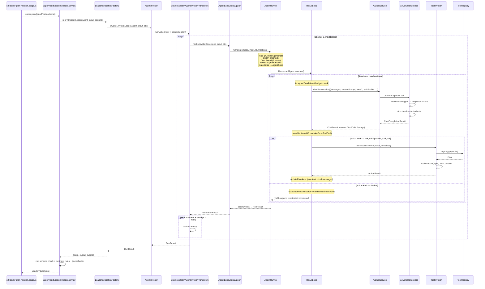
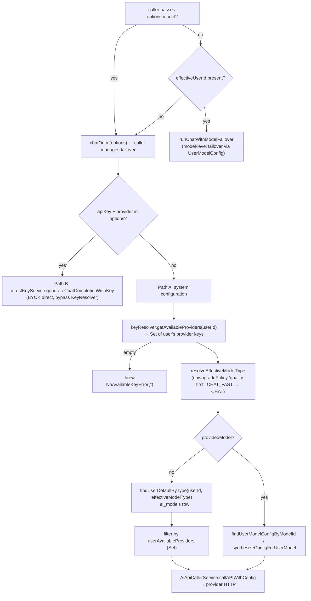
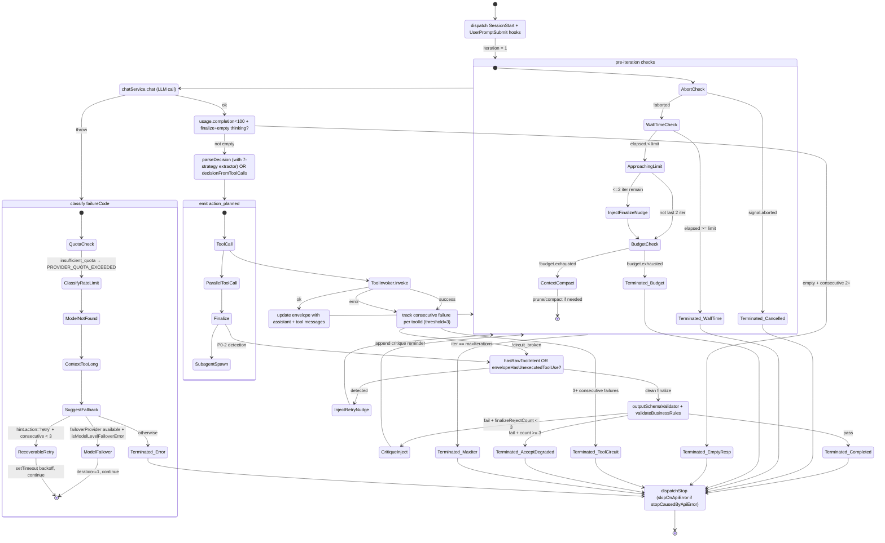

# Agent Playground — Path 03 — Agent / LLM Invocation Layer (Stage → Invoker → Executor → AiChat → Provider)

> **Snapshot date**: 2026-05-24
> **Path scope (of 5 parallel paths)**: Agent / LLM call layer between the pipeline stage handler and the upstream provider. Everything that happens _inside_ one stage's call to `leader.plan() / researcher.collect() / analyst.synthesize() / ...` belongs here. Pipeline scheduling = Path 02. Mission persistence = Path 04.
> **Goal**: 100% branch coverage of the invocation chain — happy path, recoverable retries, all 14 documented failure modes, and the mapping back to "Claude Code reverse insights 10" from `CLAUDE.md`.

---

## 1. Overview — what Path 3 covers

The playground pipeline runs 12 stages (`s1-mission-estimate-budget` → `s12-self-evolution`). Each stage that _thinks_ (leader, researcher, reconciler, analyst, writer, reviewer, verifier, critic, steward) ultimately does one thing: **invoke an agent spec and consume its `RunResult`**. Path 3 is the full call path _from_ the stage handler _to_ the LLM provider _and back_:

```
┌──────────────────────── PATH 02 (pipeline scheduling) ────────────────────────┐
│  s2-leader-plan-mission.stage.ts  →  runWithStageInstrumentation              │
└────────────────────────────────┬───────────────────────────────────────────────┘
                                 │ leader.plan(...)
                                 ▼
        ai-app/agent-playground/mission/roles/leader.service.ts
                       SupervisedMission.plan()
                                 │ runFn({ spec: LeaderAgent, input, agentId })
                                 ▼
        mission/pipeline/leader-invocation.factory.ts (build runFn closure)
                                 │ invoker.invoke(LeaderAgent, input, ctx)
                                 ▼
┌─────────────────── PATH 03 starts here ──────────────────────────────────────┐
│  mission/roles/agent-invoker.service.ts                                       │
│         AgentInvoker (playground adapter)                                     │
│            │ wraps via                                                        │
│            ▼                                                                  │
│  ai-harness/teams/business-team/invocation/                                   │
│         BusinessTeamAgentInvokerFramework (retry/backoff/abort skeleton)      │
│            │ hooks.invokeOnce                                                 │
│            ▼                                                                  │
│  mission/roles/agent-execution-support.ts                                     │
│         AgentExecutionSupport.invoke (billingMeta envelope)                   │
│            │ runner.run(Spec, input, RunOptions)                              │
│            ▼                                                                  │
│  ai-harness/agents/dev-tools/agent-runner.service.ts                          │
│         AgentRunner — @DefineAgent meta + Tool Recall + envelope materialize  │
│            │ HarnessedAgent.execute()                                         │
│            ▼                                                                  │
│  ai-harness/runner/loop/react-loop.ts                                         │
│         ReActLoop — perceive → reason → act → reflect                         │
│            │                            │                                     │
│   ┌────────┴────────┐          ┌────────┴──────────┐                          │
│   │ chatService.chat│          │ toolInvoker.invoke │                         │
│   ▼                 ▼          ▼                    ▼                         │
│  ai-engine/llm/services/    ai-harness/runner/tool-invoker/                  │
│    ai-chat.service.ts         tool-invoker.ts → ToolRegistry.get(id)         │
│    → TaskProfileMapper        → tool.execute(input, ToolContext)             │
│    → AiApiCallerService       (engine/tools/* + MCP/OpenAPI/function adapter)│
│    → provider (Anthropic /                                                    │
│      OpenAI / Grok / DeepSeek /                                               │
│      Gemini / vLLM)                                                           │
└──────────────────────────────────────────────────────────────────────────────┘
```

**Out of scope**: stage choreography (Path 02), `MissionStore` writes / `mission-store.service.ts` (Path 04), DomainEventBus / WebSocket relay shape (Path 05). Path 3 owns everything that happens _between_ the stage's `await leader.plan()` and the matching `RunResult` it returns.

### Files this path touches (absolute paths)

| Layer                     | File                                                                                                                                                                                                              |
| ------------------------- | ----------------------------------------------------------------------------------------------------------------------------------------------------------------------------------------------------------------- |
| App adapter               | `D:/projects/codes/genesis-agent-teams/backend/src/modules/ai-app/agent-playground/mission/roles/agent-invoker.service.ts`                                                                                        |
| App execution support     | `D:/projects/codes/genesis-agent-teams/backend/src/modules/ai-app/agent-playground/mission/roles/agent-execution-support.ts`                                                                                      |
| App invocation factory    | `D:/projects/codes/genesis-agent-teams/backend/src/modules/ai-app/agent-playground/mission/pipeline/leader-invocation.factory.ts`                                                                                 |
| App role services         | `D:/projects/codes/genesis-agent-teams/backend/src/modules/ai-app/agent-playground/mission/roles/leader.service.ts` (and `researcher / reconciler / analyst / writer / reviewer / steward / verifier.service.ts`) |
| App agent specs           | `D:/projects/codes/genesis-agent-teams/backend/src/modules/ai-app/agent-playground/mission/agents/<role>/<role>.agent.ts` + `SKILL.md`                                                                            |
| App skill loader shim     | `D:/projects/codes/genesis-agent-teams/backend/src/modules/ai-app/agent-playground/mission/agents/_shared/skill-loader.ts`                                                                                        |
| Harness framework         | `D:/projects/codes/genesis-agent-teams/backend/src/modules/ai-harness/teams/business-team/invocation/business-team-agent-invoker.framework.ts`                                                                    |
| Harness runner            | `D:/projects/codes/genesis-agent-teams/backend/src/modules/ai-harness/agents/dev-tools/agent-runner.service.ts`                                                                                                   |
| Harness loop              | `D:/projects/codes/genesis-agent-teams/backend/src/modules/ai-harness/runner/loop/react-loop.ts`                                                                                                                  |
| Harness tool invoker      | `D:/projects/codes/genesis-agent-teams/backend/src/modules/ai-harness/runner/tool-invoker/tool-invoker.ts`                                                                                                        |
| Harness tool routing      | `D:/projects/codes/genesis-agent-teams/backend/src/modules/ai-harness/runner/tool-routing/tool-selector.ts`                                                                                                       |
| Harness cache planner     | `D:/projects/codes/genesis-agent-teams/backend/src/modules/ai-harness/runner/context/cache-control-planner.ts`                                                                                                    |
| Harness budget            | `D:/projects/codes/genesis-agent-teams/backend/src/modules/ai-harness/guardrails/budget/budget-accountant.ts` + `mission-budget-pool.ts`                                                                          |
| Engine LLM entry          | `D:/projects/codes/genesis-agent-teams/backend/src/modules/ai-engine/llm/services/ai-chat.service.ts`                                                                                                             |
| Engine TaskProfile mapper | `D:/projects/codes/genesis-agent-teams/backend/src/modules/ai-engine/llm/services/task-profile-mapper.service.ts`                                                                                                 |
| Engine API caller         | `D:/projects/codes/genesis-agent-teams/backend/src/modules/ai-engine/llm/services/ai-api-caller.service.ts`                                                                                                       |
| Engine structured output  | `D:/projects/codes/genesis-agent-teams/backend/src/modules/ai-engine/llm/structured-output/` (router + adapters)                                                                                                  |
| Engine skills loader      | `D:/projects/codes/genesis-agent-teams/backend/src/modules/ai-engine/skills/loader/skill-md/skill-md-loader.ts`                                                                                                   |
| Engine tool registry      | `D:/projects/codes/genesis-agent-teams/backend/src/modules/ai-engine/tools/registry/tool.registry.ts`                                                                                                             |

---

## 2. End-to-end invocation chain (stage → provider)

### 2.1 Bird's-eye sequence



### 2.2 Layer responsibilities (single sentence each)

| Layer                                             | Owns                                                                                                                                                                                                            |
| ------------------------------------------------- | --------------------------------------------------------------------------------------------------------------------------------------------------------------------------------------------------------------- |
| **Stage handler**                                 | "Get the right agent service, hand it pipeline ctx, write outputs back to `CrossStageState`."                                                                                                                   |
| **`SupervisedMission` (leader.service)**          | "Hold cross-phase memory (`decisions[] / plan / foreword`), call `runFn` once per phase, validate output with zod + business rules, journal."                                                                   |
| **`LeaderInvocationFactory`**                     | "Curry `{missionId, userId, billing}` so `runFn` becomes `({spec, input, agentId}) => RunResult`. Pure plumbing."                                                                                               |
| **`AgentInvoker` (app)**                          | "Wire the harness framework with **playground-specific** hooks: `invokeOnce`, `onAgentStart/End` (PlaygroundMissionSpanService), `onDegrade` (emit `agent-playground.stage:degraded`)."                         |
| **`BusinessTeamAgentInvokerFramework` (harness)** | "Cross-app retry skeleton: transient-only retry (`isRetryableError`), exponential backoff, abort short-circuit, span lifecycle. Defaults `maxRetries=2`."                                                       |
| **`AgentExecutionSupport`**                       | "Translate `InvocationContext` → `RunOptions` (`billingMeta.moduleType="agent-playground"`, abort signal from `MissionAbortRegistry`, `envAdapter`, `toolRecallHint`, `loopOverride`)."                         |
| **`AgentRunner`**                                 | "Read `@DefineAgent` meta, BYOK precheck, Tool Recall 5 steps, build `<environment>` + `<available_tools>` blocks, materialize `IAgentSpec` + `IAgentIdentity`, wrap `BillingContext.run`, drain agent events." |
| **`ReActLoop`**                                   | "Perceive → reason → act → reflect. Budget accounting per LLM call. 14 exit gates (see §5)."                                                                                                                    |
| **`AiChatService.chat`**                          | "Resolve effective `userId` (options → RequestContext → KernelContext fallback), hard 16-min timeout race, hook bus dispatch, Path A (modelType) vs Path B (BYOK direct), guardrails, observer dispatch."       |
| **`TaskProfileMapperService`**                    | "creativity/outputLength/reasoningDepth → temperature/maxTokens/reasoningDepth. Reasoning-model token boost. JSON-mode temp clamp."                                                                             |
| **`AiApiCallerService`**                          | "Provider-specific HTTP (`callOpenAICompatibleAPI` / `callAnthropicAPI` / `callGoogleAPI`), structured-output adapter integration, prompt-cache header."                                                        |
| **`ToolInvoker`**                                 | "Validate action against allowed/forbidden lists, circuit-breaker check, build `ToolContext`, execute, truncate output to 32K chars (or `tool.maxResultSizeChars`), record failures."                           |
| **`ToolRegistry`**                                | "Single source for all tools (engine-level). Look up by `id` or `category`."                                                                                                                                    |

---

## 3. SKILL.md → AgentSpec materialization

### 3.1 SKILL.md format (Anthropic skill standard, internalized)

Every `mission/agents/<role>/SKILL.md` is a YAML-frontmatter markdown file. The body uses HTML comment anchors:

```markdown
---
id: agent-playground.leader
name: Leader
description: ...
allowedTools: []
allowedModels: ["claude-sonnet-4-6"]
duties: ["plan", "assess-research", "foreword", "signoff"]
domain: agent-playground
version: "1.0"
---

<!-- soul:start -->

# 你是 Leader

... (identity / values / style / anti-patterns)

<!-- soul:end -->

<!-- duty:plan:start -->

... (mustache-rendered prompt template for M0 plan phase)

<!-- duty:plan:end -->

<!-- duty:assess-research:start -->

... (M1)

<!-- duty:assess-research:end -->

<!-- duty:foreword:start -->     ... <!-- duty:foreword:end -->
<!-- duty:signoff:start -->      ... <!-- duty:signoff:end -->
```

Parser: `ai-engine/skills/loader/skill-md/skill-md-loader.ts:46 loadSkill(agentDir, agentsRootDir) → ParsedSkill { frontmatter, soul, duties }`. Caching: keyed on `${agentsRootDir}::${agentDir}` — cleared by `clearSkillCache()` (test-only).

```mermaid
flowchart TD
  A["<role>/SKILL.md"] -->|fs.readFileSync| B[parseSkill]
  B -->|YAML frontmatter parse| C[SkillFrontmatter]
  B -->|extract `<!-- soul:* -->`| D["soul: string"]
  B -->|extract `<!-- duty:NAME:* -->` for each name in frontmatter.duties| E["duties: Record<string, string>"]
  C & D & E --> F["ParsedSkill"]
  F -->|cache by `${agentsRootDir}::${agentDir}`| G[in-process Map]
  H["leader.agent.ts<br/>buildSystemPrompt"] -->|buildPromptFromDuty('leader', dutyName, vars)| I["_shared/skill-loader.ts shim"]
  I -->|engineBuildPromptFromDuty + PLAYGROUND_AGENTS_ROOT| J["loadSkill('leader', root)"]
  J --> F
  F -->|mustache-render duties[dutyName] with vars| K["system prompt body"]
```

### 3.2 `@DefineAgent` meta → `IAgentSpec` materialize

`leader.agent.ts:288` (the decorator block):

```ts
@DefineAgent({
  id: "playground.leader",
  version: "2.0.0",
  identity: { role: "leader", description: "..." },
  loop: "react",
  skills: ["mece-mission-planning", "leader-mid-mission-assess",
           "leader-foreword", "leader-signoff"],
  toolCategories: ["information"],
  taskProfile: { creativity: "low", outputLength: "medium",
                 reasoningDepth: "moderate" },
  inputSchema: Input,                       // zod discriminated union
  outputSchema: Output,                     // zod discriminated union
  budget: { maxTokens: 16_000, maxIterations: 4 },
})
export class LeaderAgent extends AgentSpec<typeof Input, typeof Output> { ... }
```

`AgentRunner.run` (`agent-runner.service.ts:297`) then walks through:

1. **`readDefineAgentMeta(Spec)`** → `DefineAgentOptions` (id, taskProfile, budget, tools, toolCategories, skills, inputSchema, outputSchema, loop).
2. **`precheckByok(opts, meta.id)`** — if `opts.environment` and `onMissingByok!='allow'`, call `env.getByokStatus()`; if `"platform"` and policy=`fail` → throw `ByokRequiredError`.
3. **`performToolRecall(meta, opts)`** — 5 steps:
   - Step 1: base set = `toolRegistry.listByCategory(toolCategories) ∪ {id ∈ tools : registry.isAvailable(id)}`
   - Step 2: hint.categories narrowing — strict path A (must subset spec categories) or tag-based path B fallback (`tool.tags` ∩ `hint.categories`); generic tools (no tags) survive
   - Step 3: subtract `hint.excludeIds`
   - Step 4: `ToolACL` via `env.getUserEntitlements()` — fail-closed (drop any tool with unmet `requiredEntitlements`)
   - Step 5: clip `hint.preferIds` to recalled set, mark `★ recommended` in catalog
   - **Phase P18-2 degrade**: if narrowed pool is empty but baseSet has tools, log warning + fall back to baseSet. Only if baseSet also empty → throw `InsufficientToolsError`.
4. **`collectAugmentBlocks`** → injects two extra blocks at the tail of systemPrompt:
   - `<environment>` (byok / credits / available models — from `IRuntimeEnvironment`)
   - `<available_tools>` (with `input:` schema summary + concrete `example:` action wrapper to teach LLM how to wrap calls) + `<available_skills>` (with `skill_invoke` action example)
5. **`resolvePreferredModel`** — if `opts.preferredModelId` set, use it. Else call `factory.electPreferredModelSelection({ roleId, taskProfile, userId, envSnapshot })` — election may reserve via `MissionElectionReservation { token, modelId, createdAt }`.
6. **`materialize`** — `inputSchema.safeParse(input)` → if fail → throw `InputValidationError`. Build `IAgentIdentity` with budget multiplier applied (`budgetMultiplier` from RunOptions; `maxIterationsHardCap` is _not_ scaled). Compose final `IAgentSpec`:

   ```ts
   const agentSpec: IAgentSpec = {
     identity,
     loop: loopOverride ?? meta.loop,
     systemPrompt: appendBlocks(meta.systemPrompt ?? buildSystemPromptFn(...)),  // single-append; tail blocks attached once
     taskProfile: meta.taskProfile,
     outputSchema, outputJsonSchema,
     validateBusinessRules: validateFn,
     stubFn, buildSystemPrompt, buildUserPrompt,
     userId, workspaceId, runtimeEnv,         // critical for BYOK + envelope.runtimeEnv
     metadata: { searchTimeRange, language, missionId, dimensionId }   // mission-scoped scalars
   };
   ```

7. **`factory.create(agentSpec, preferredModelId, preferredModelSelection)`** → `HarnessedAgent`.
8. **`BillingContext.run`** wrap (only if `opts.userId` and no outer billing context) → run `drainEvents`.
9. **outputSchema final assertion** at DX layer (`agent-runner.service.ts:397-477`): if `meta.outputSchema` and `safeParse` fails on `finalOutput` → mark state `failed`, but **suppress** `RUNNER_OUTPUT_SCHEMA_MISMATCH` if upstream already emitted a structured error event and the candidate is empty (avoid masking the root cause).

---

## 4. TaskProfile → LLM parameter mapping

### 4.1 Profile lookup table

`ai-engine/llm/services/task-profile-mapper.service.ts` is the **only** service that knows raw model parameters. AI App callers MUST go through `taskProfile` (CLAUDE.md hard rule: no `model: "gpt-4"` or `temperature: 0.7` literals).

| TaskProfile field                          | Maps to                                                                             | Source                      |
| ------------------------------------------ | ----------------------------------------------------------------------------------- | --------------------------- |
| `creativity: 'deterministic'`              | `temperature = 0.1`                                                                 | `CREATIVITY_TO_TEMPERATURE` |
| `creativity: 'low'`                        | `temperature = 0.3`                                                                 | same                        |
| `creativity: 'medium'`                     | `temperature = 0.7` (also the no-profile default)                                   | same                        |
| `creativity: 'high'`                       | `temperature = 0.9`                                                                 | same                        |
| `outputLength: 'minimal'`                  | `maxTokens = 500`                                                                   | `OUTPUT_LENGTH_TO_TOKENS`   |
| `outputLength: 'short'`                    | `maxTokens = 1500`                                                                  | same                        |
| `outputLength: 'medium'`                   | `maxTokens = 4096` (4000 in some code paths)                                        | same                        |
| `outputLength: 'long'`                     | `maxTokens = 8000`                                                                  | same                        |
| `outputLength: 'extended'`                 | `maxTokens = 16000`                                                                 | same                        |
| `outputFormat: 'json'`                     | `temperature = min(temp, JSON_OUTPUT_MAX_TEMPERATURE)` (typically clamped to ≤ 0.3) | same                        |
| `reasoningDepth: 'deep'` (reasoning model) | bumps `maxTokens` to `min(32000, model.maxTokens)`                                  | line 179-187                |

### 4.2 Reasoning-model token boost (the critical exception)

When `modelConfig.isReasoning === true`:

- `outputLength: 'minimal'/'short'` → `effectiveMaxTokens = max(base, ceil(reasoningMin * 0.5))` capped at 16000. (Comment in code: "提到 0.5 倍率 + 16000 上限 → 12500 tokens（CoT 6.5k + visible 6k）". The previous 0.3×8000 boost was insufficient — reasoning models burned 6-8k on CoT, leaving <1k visible, and under `response_format=json_object` they would emit a minimal empty JSON to "fake finalize". The current numbers were tuned against o1 / gpt-5.4 behavior.)
- `outputLength: 'extended'` and `model.maxTokens >= 32000` → push to 32000.
- `outputLength: 'long'` and `model.maxTokens >= 28000` → push to 28000.

### 4.3 Model selection (no hard-coding!)



Key constraint from CLAUDE.md "Facade boundary": **never hardcode `gpt-4o`**. Fallback strings are always `""` (empty) so the downstream service resolves via `TaskProfile` + ModelType.

### 4.4 Where the profile flows in ReActLoop

`react-loop.ts:1662` — `chatService.chat({ taskProfile: specTaskProfile ?? { creativity: "low", outputLength: "medium" } })`:

- **`specTaskProfile`** is the agent's `@DefineAgent` declaration (e.g. leader = `low/medium/moderate`).
- ReActLoop never overrides agent intent (this used to be a bug — the loop's hardcoded `low/long` was suppressing researcher's `medium/long`).
- Default fallback `low/medium` (≥16k tokens after mapping) was tuned to avoid reasoning models bursting their CoT budget.

---

## 5. Tool call loop — the actual state machine

### 5.1 ReAct loop state diagram



### 5.2 Tool dispatch — what the LLM gets to see

ReActLoop emits two prompt blocks in the system prompt (built by `agent-runner.collectAugmentBlocks` + `buildCatalogBlock`):

```
<available_tools>
- web-search ★ recommended: Search the web for current information
  input: {"query": "string (search query)", "numResults?": "number (default 5)"}
  example: {"kind":"tool_call","toolId":"web-search","input":{"query":"<query>"}}
- web-scraper: Fetch and clean a web page
  input: {"url": "string (URL)", "extractMainContent?": "boolean"}
  example: {"kind":"tool_call","toolId":"web-scraper","input":{"url":"<url>"}}
  // To call multiple tools in one turn, wrap them: {"kind":"parallel_tool_call","calls":[...]}
</available_tools>

<available_skills>
- mece-mission-planning: ...
  example: {"kind":"skill_invoke","skillId":"mece-mission-planning","input":{"task":"<task-specific data>"}}
</available_skills>
```

This `example:` field was added after production traces showed LLMs emitting raw NDJSON tool inputs (no wrapping) → `InvalidActionError` → schema mismatch → mission failure. The catalog now teaches the wire format explicitly.

### 5.3 Tool source adapters (MCP / OpenAPI / function-calling)

The L2 single source for tools is `ai-engine/tools/registry/tool.registry.ts`. Per CLAUDE.md MECE rule: **MCP lives in engine, not harness** — MCP adapter, OpenAPI adapter, and function adapter all sit beside the registry as tool **source adapters** (same layer as direct function tools). Whoever publishes a tool calls `ToolRegistry.register(tool)`. The ReActLoop / ToolInvoker doesn't know whether a tool is MCP-backed, OpenAPI-backed, or a hand-written function — they all expose the same `ITool` interface.

`AgentToolRegistry` (`runner/env/tool-registry.ts`) is the **per-agent slice** that picks up `IAgentSpec.tools[]` from the registry and exposes `FunctionDefinition[]` for native function-calling. Required for the `HARNESS_REACT_NATIVE_FC=true` path.

### 5.4 ToolInvoker filtering (allowlist / forbiddenlist)

`tool-invoker.ts:128`:

1. Circuit-breaker short-circuit (returns `TOOL_RUNTIME_ERROR` immediately if open).
2. `forbiddenTools.includes(toolId)` → `AgentAccessDeniedError("forbidden")`, `failureCode = TOOL_INPUT_VALIDATION_FAILED`.
3. `allowedTools.length > 0 && !allowedTools.includes(toolId)` → `AgentAccessDeniedError("not_in_whitelist")`.
4. `!toolRegistry.has(toolId)` → `ToolNotFoundError`, `failureCode = TOOL_NOT_FOUND`.
5. Build `ToolContext` with `executionId = action.callId ?? randomUUID()`, `sessionId`, `userId`, `signal`, `metadata` (JSON-scalar subset of `envelope.metadata`).
6. `tool.execute(input, ctx)` → if `result.success === false`, classify error (`/timeout/` → `TOOL_TIMEOUT`, `/validation/` → `TOOL_INPUT_VALIDATION_FAILED`, default `TOOL_RUNTIME_ERROR`).
7. Truncate output via `tool.maxResultSizeChars || 32_000` (DEFAULT_RESULT_MAX_CHARS) — pick head not tail (agent needs schema/field names more than trailing data). Strings → `<head>…[TRUNCATED N chars]`. Non-strings → JSON.stringify then truncate.
8. **`P0-LIVE-TOOL-ERR-VISIBILITY`** (2026-04-30): on tool error, the LLM-visible `output` field still carries `{ success: false, error: msg, errorCode, toolId, failureCode }` so the next ReAct turn can see _why_ it failed instead of guessing on an `undefined`.

### 5.5 Parallel tool dispatch

`ToolInvoker.invokeMany` (line 409):

- Default concurrency = 5 (or `parallel.maxConcurrency`).
- Batch slicing with `Promise.allSettled` (single failure does not bring down the batch).
- Aggregate `IActionResult.output` = `[{ output | error: msg }, ...]`.
- `IActionResult.error` is set **only** when every sub-call failed (caller can introspect `subResults` for partial outcomes).
- `latencyMs` is wall-clock of the whole batch, not sum.

### 5.6 Native function-calling vs prompt-driven (double-layer net)

ReActLoop has two protocols, gated by env flag:

| Path                                       | Trigger                                              | Behavior                                                                                                                                                                                                                                                                                                                                                                                                    |
| ------------------------------------------ | ---------------------------------------------------- | ----------------------------------------------------------------------------------------------------------------------------------------------------------------------------------------------------------------------------------------------------------------------------------------------------------------------------------------------------------------------------------------------------------- |
| Native FC (`HARNESS_REACT_NATIVE_FC=true`) | `agentToolRegistry.getSchemas(toolIds)` is non-empty | Pass `FunctionDefinition[]` to `chat({tools})`. No `DECISION_SYSTEM_SUFFIX` injection, no `responseFormat='json'`. If `response.toolCalls` non-empty → `decisionFromToolCalls` → done. Else fall through to `parseDecision`.                                                                                                                                                                                |
| Prompt-driven (default)                    | flag off OR FC path's `toolCalls` empty              | Append `DECISION_SYSTEM_SUFFIX` (Decision Protocol JSON envelope spec) to system prompt, set `responseFormat='json'`, set `structuredOutputStrategy='json_schema'` with `REACT_LOOP_DECISION_JSON_SCHEMA` (or strict finalize schema on `approachingLimit`). Parse JSON via `extractJsonFromAIResponse` (7-strategy extractor: markdown fence stripping, truncated JSON repair, NDJSON-first-object, etc.). |

The dual path is the **double-layer net** for vLLM deployments where the operator forgot `--tool-call-parser <name>`: native FC returns nothing useful, but the prompt-driven layer still has the envelope spec in the prompt and the LLM can satisfy the Decision Protocol. The two `DECISION_SYSTEM_SUFFIX` / `DECISION_FC_SUFFIX` strings are **byte-identical** to preserve prompt-cache prefix hit rate (see §6).

### 5.7 LLM protocol tolerance (parseDecision)

`react-loop.ts:1827 parseDecision(raw)`:

1. Run raw text through `extractJsonFromAIResponse` (handles markdown fences, ```blocks, NDJSON, truncated JSON repair,`<think>...</think>` stripping).
2. If extraction fails → emit "finalize raw text" decision with `parseError = { name: 'JsonExtractFailed', message }`. ReActLoop's empty-response check + P0-2 unexecuted-tool-use gate will catch this as `failed_parse` or inject a retry nudge.
3. Strip `<think>` / `<reasoning>` tags from `thinking` field (Nemotron / DeepSeek-R1 / QwQ frequently leak CoT in the wrong field).
4. **Tolerance branches** (LLM protocol drift):
   - Top-level `kind` without `action` wrapper → treat the whole object as the action.
   - Top-level `actions[]` shorthand → auto-wrap into `parallel_tool_call`.
   - Object with no `action` key → wrap as `finalize.output` (saves chapter-writer / dimension-integrator from spamming InvalidActionError).
   - `kind` is a non-reserved string but has `input` → treat as `tool_call` with `toolId = kind` (toolId-as-kind fallback for Nemotron / Qwen reasoning models).
5. **Reserved kinds** (`tool_call / parallel_tool_call / finalize / subagent_spawn / skill_invoke / llm_generate`) — only the first three are supported in the protocol. The latter three throw `InvalidActionError("unknown_kind")` to prevent prompt injection / privilege escalation (Security R2 fix, 2026-05-07). The native FC path mirrors this with `RESERVED_ACTION_KINDS.has(tc.name)` rejection in `decisionFromToolCalls`.

### 5.8 Structured output strategies (provider differences)

`STRUCTURED_OUTPUT_STRATEGIES` (engine/llm/structured-output/structured-output-strategy.types.ts):

| Strategy                 | Provider                              | Notes                                                                                                                                                                            |
| ------------------------ | ------------------------------------- | -------------------------------------------------------------------------------------------------------------------------------------------------------------------------------- |
| `json_schema_strict`     | OpenAI strict / Grok strict           | `response_format: {type:'json_schema', strict: true}`. **Cannot coexist with `tools:[]`** on some providers — ReActLoop FC branch deliberately omits `structuredOutputStrategy`. |
| `json_schema`            | OpenAI/Grok non-strict, DeepSeek-chat | Same shape, no `strict`.                                                                                                                                                         |
| `tool_use`               | Anthropic                             | Forces output through Tools API `tool_choice: {type:'tool', name:'<schemaName>'}` — schema-as-tool-arg.                                                                          |
| `json_mode`              | most                                  | `response_format: {type:'json_object'}`.                                                                                                                                         |
| `gemini_response_schema` | Gemini                                | `generationConfig.responseSchema + responseMimeType: 'application/json'`.                                                                                                        |
| `gbnf_grammar`           | llama.cpp / vLLM                      | GBNF grammar string.                                                                                                                                                             |
| `prompt`                 | any                                   | System prompt addon + zod post-parse. Bottom-tier fallback.                                                                                                                      |
| `none`                   | any                                   | Disabled — direct text.                                                                                                                                                          |

Routing: `StructuredOutputRouterService.route(modelId, requestedStrategy)` picks the model's configured `structured_output_strategy` (admin-set DB column on `ai_models`) → on adapter failure walks down `fallbackStrategies[]`. ReActLoop always asks for `json_schema` non-strict on its decision wrapper; on `approachingLimit` it switches to `buildFinalizeDecisionSchema(finalizeOutputJsonSchema)` to enforce the business-agent payload shape under `action.output`.

---

## 6. Prompt caching strategy

### 6.1 What gets cached

`runner/context/cache-control-planner.ts`:

| Segment                                                                                              | Cached?                                       | Why                                       |
| ---------------------------------------------------------------------------------------------------- | --------------------------------------------- | ----------------------------------------- |
| System prompt (full text including `<environment>` + `<available_tools>` + `DECISION_SYSTEM_SUFFIX`) | Yes (always, when prefix ≥ 4096 chars)        | Stable across iterations within a mission |
| `high-priority + !transient` reminders                                                               | Yes (appended to system prefix)               | Mission-level constants                   |
| Tools list (`envelope.tools[]`)                                                                      | Yes (passed as `cachePrefix.toolDefinitions`) | Change frequency low                      |
| `messages[]` (assistant + tool turns)                                                                | No                                            | New every turn                            |
| `low-priority` / `transient` reminders                                                               | No                                            | Per-turn or short-lived                   |

Anthropic prompt-cache limit is 4 breakpoints; the planner outputs **1** (`anchor='system', ttl='5m'`) leaving 3 for callers. Minimum cacheable prefix is 4096 chars (~ Anthropic's `1024 tokens` floor in chars).

### 6.2 Where the cache directive ends up

- `ReActLoop.reason` passes `cachePrefix` → `chat({ cachePolicy: 'auto', sharedCachePrefix: { systemPromptText, toolDefinitions } })`.
- `AiApiCallerService.callAnthropicAPI` (line 834-846): when `cachePolicy='auto'`, the system payload is shaped as `[{type:'text', text: systemText, cache_control: {type:'ephemeral'}}]` instead of the bare string form.
- The byte-identical `DECISION_FC_SUFFIX = DECISION_SYSTEM_SUFFIX` invariant exists **specifically** to keep prompt-cache prefix stable across `HARNESS_REACT_NATIVE_FC` flag flips.

### 6.3 Reverse insight from Claude Code v2.1.88 §7

"`pinnedEdits` MUST be re-inserted at the same offset (byte-equal) every turn — otherwise prefix drift collapses cache hit from 90%→0." Our analog is the byte-equality of `DECISION_SYSTEM_SUFFIX` across flag toggles + the system text in `envelope.system` not mutating after `materialize()`. The `approachingLimit` finalize critique is **appended** to messages (not prepended to system), preserving the cached system prefix.

---

## 7. Budget tracking data flow

### 7.1 Components

```
MissionBudgetPool (1 per mission, cap = {maxTokens, maxCostUsd})
   ├── allocate(subCap) → MissionAwareBudgetAccountant (1 per agent invocation)
   └── recordSpend(prompt, completion, cost)   ← MissionAwareBudgetAccountant calls back

Each MissionAwareBudgetAccountant:
   ├── accountLLM(promptTokens, completionTokens, costUsd, cacheReadTokens)
   │     → tokensUsed += prompt + completion + cacheRead    (cache reads occupy context!)
   │     → costUsd    += costUsd (skip if null = pricing-not-registered)
   │     → pool.recordSpend(prompt, completion, costUsd)
   ├── exhausted()  → tokensUsed >= cap.maxTokens || costUsd >= cap.maxCostUsd
   │                  || pool.isExhausted()
   ├── shouldDowngrade()  → tokenPct >= 0.7 || costPct >= 0.7  (the 70% soft warn)
   ├── canDowngrade()     → currentTier !== 'basic'
   ├── downgrade()        → strong → standard → basic (each call moves one tier)
   └── snapshot()         → {tokensUsed, costUsd, currentTier, uncostedLLMCalls}
```

### 7.2 When does each gate fire?

`react-loop.ts` checkpoints per iteration:

| Trigger                                                                      | What fires                                                                     | Branch                                                                                                                                                       |
| ---------------------------------------------------------------------------- | ------------------------------------------------------------------------------ | ------------------------------------------------------------------------------------------------------------------------------------------------------------ |
| Iteration start, `budget?.exhausted()` true                                  | `budget_warning(severity:exhausted)` → `suggestFallback({reason:'no_credit'})` | if hint.action='retry' with retryAfterMs → `setTimeout(min(retryAfterMs,10s))` + `continue`. Else emit `error: LOOP_BUDGET_EXHAUSTED` + `terminated:budget`. |
| After `reason()` returns, `budget.shouldDowngrade()` true and not yet warned | `budget_warning(severity:pressure)` + auto-downgrade tier if possible          | `currentTier` moves strong → standard → basic; the next iteration's `pricingRegistry.pickModelForTier` picks a cheaper model                                 |
| `pricingRegistry.estimateCost` returns null                                  | `uncostedLLMCalls++` (visible in snapshot)                                     | tokens still count toward `maxTokens` cap; cost stays at last known value                                                                                    |

### 7.3 Cost estimation invariant

`react-loop.ts:1741`: `costUsd = pricingRegistry?.estimateCost(modelId, promptTokens, completionTokens, cacheReadTokens, cacheWriteTokens) ?? null`. **The `null` propagates** — `BudgetAccountant.accountLLM` doesn't fake `0`. This was a hard lesson: silently treating unknown models as $0 made `BudgetAccountant` lie, and missions over-ran their hard cap by 5-10× because the DB hadn't been seeded with prices for `claude-sonnet-4-6` after a model refresh.

### 7.4 Notifying upstream (the app sees budget pressure)

The playground's `AgentInvoker.tickCost` (`agent-invoker.service.ts:207`) is called by stages (post-stage tick) to roll up agent-event tokens into the `MissionBudgetPool` and emit a `agent-playground.mission:cost-tick` event. The relay-level abort registry (`agent-playground.event-relay`) is the path 5 component that flips abort signal when pool exhaustion is detected — Path 3 doesn't own that fire, but **does** consume the resulting `AbortSignal` via `runner.run({ signal })` → `ReActLoop.run({ signal })` → mid-LLM-call abort at the next iteration boundary (and `chat({ signal })` for in-flight HTTP).

---

## 8. Happy path — fully annotated trace

> Scenario: S2 invokes `leader.plan({ topic, depth: 'standard' })`. Leader uses `parallel_tool_call` once for two web searches, then finalizes.

```
[stage]
  s2-leader-plan-mission.stage.ts:runLeaderPlanStage(ctx)
  → runWithStageInstrumentation(ctx,deps,'s2-leader-plan',role:'leader',...)
  → emit 'agent-playground.stage:started' { stage:'s2-leader-plan' }
  → leader.plan({ priorPostmortems: [...] })

[leader.service]
  SupervisedMission.plan(opts) — line 153
  → planInput = { phase:'plan', topic, description, depth, language, userProfile, priorPostmortems }
  → res1 = await runFn({ spec: LeaderAgent, input: planInput, agentId: 'leader' })

[leader-invocation.factory]
  LeaderInvocationFactory.build({missionId,userId,billing}) returned this closure
  → invoker.invoke(LeaderAgent, planInput, {
      missionId, userId, agentId:'leader', role:'leader',
      envAdapter: billing
    })

[agent-invoker.service.ts]
  AgentInvoker.invoke
  → spanService?.startAgentSpan(missionId, 'leader')      // R3-#38 agent span
  → const fw = new BusinessTeamAgentInvokerFramework({hooks}, abortRegistry)
  → return fw.invoke(LeaderAgent, planInput, ctx)

[business-team-agent-invoker.framework.ts]
  attempt=0
  → hooks.invokeOnce(spec, input, ctx)
  → returns RunResult — onAgentEnd(ctx,'completed')

[agent-execution-support.ts]
  AgentExecutionSupport.invoke
  → signal = abortRegistry.getSignal(missionId)
  → runner.run(LeaderAgent, planInput, {
      userId, environment: envAdapter, budgetMultiplier, toolRecallHint,
      loopOverride, signal,
      billingMeta: { moduleType:'agent-playground', operationType:'leader', referenceId: missionId },
      onEvent: (ev) => relay.relayAgentEvents([ev], ctx)
    })

[agent-runner.service.ts:run]
  → meta = readDefineAgentMeta(LeaderAgent)
       { id:'playground.leader', loop:'react', toolCategories:['information'],
         taskProfile:{creativity:'low',outputLength:'medium',reasoningDepth:'moderate'},
         budget:{maxTokens:16000,maxIterations:4}, ... }
  → precheckByok(opts, 'playground.leader')   // no-op since onMissingByok='allow' default
  → recall = performToolRecall(meta, opts)
       Step1 base: toolRegistry.listByCategory(['information']) → ['web-search','web-scraper',...]
       Step2 hint.categories: opts.toolRecallHint may be empty for leader — pool unchanged
       Step3 excludeIds: none
       Step4 ToolACL: env.getUserEntitlements() → user has 'information.*' entitlement → all pass
       Step5 preferIds: empty for leader
       → { recalledIds: ['web-search','web-scraper'], source:'spec' }
  → emit 'tools_recalled' event
  → augmentBlocks = collectAugmentBlocks(meta, opts, ['web-search','web-scraper'], [])
       <environment>: byok=personal, credits.balance=42.3, models=8/12 available
       <available_tools>: web-search, web-scraper with example: action wrappers
  → preferredModelSelection = factory.electPreferredModelSelection({
      roleId:'leader', taskProfile, userId, envSnapshot
    })  →  { modelId: 'claude-sonnet-4-6', reservation: {token:'r-abc',createdAt} }
  → { agent, instance, parsedInput } = materialize(...)
       inputSchema.safeParse(planInput) → ok
       identity = { role:{id:'leader'}, tools:['web-search','web-scraper'],
                    constraints:{ maxTokens:16000, maxIterations:4, maxWallTimeMs:undefined }}
       agentSpec.systemPrompt = leader.agent.buildSystemPrompt({input:planInput})
            ⇨ buildPromptFromDuty('leader','plan', { topic,depth,language,priorPostmortems,
                                                      currentDate, currentYear,
                                                      dimensionsTarget:'5-8', ... })
            ⇨ engineBuildPromptFromDuty('leader','plan', vars, PLAYGROUND_AGENTS_ROOT)
            ⇨ loadSkill('leader', PLAYGROUND_AGENTS_ROOT) → ParsedSkill (cached after 1st mission)
            ⇨ mustache-render duties['plan'] with vars
            ⇨ appendBlocks: + outputSchemaBlock + envBlock + tool catalog block
  → BillingContext.run({userId, moduleType:'agent-playground', operationType:'leader',
                       referenceId: missionId}, () => drainEvents(...))

[drainEvents]
  for await (ev of agent.execute({goal, input: parsedInput, signal})) ...

[HarnessedAgent.execute → ReActLoop.run]
  → SessionStart hook dispatch
  → UserPromptSubmit hook dispatch
  → iteration=1

  Iter 1:
  → signal.aborted? no.
  → wallTime < 300_000ms ok.
  → budget?.exhausted()? no.
  → contextManager.ensureBudget(envelope)? no-op (small).
  → messages = buildMessages(envelope) → [{role:'user', content: goalText}]
  → tierModelId: byokUserId=userId set → skip pricing tier pick → tierModelId = null
       (BYOK fix 2026-05-12: defer to chat() to call findUserDefaultByType)
  → reason(messages, baseSystem, signal, undefined /* tierModel */,
            cachePrefix={systemPromptText, toolDefinitions},
            userId, taskProfile, recalledToolIds, approachingLimit=false, undefined)
       systemPrompt = baseSystem + DECISION_SYSTEM_SUFFIX
       chatService.chat({
         messages, systemPrompt, tools: undefined /* FC flag off */,
         modelType: AIModelType.CHAT,
         cachePolicy:'auto', sharedCachePrefix,
         taskProfile: {creativity:'low',outputLength:'medium',reasoningDepth:'moderate'},
         strictMode: true,
         responseFormat: 'json',
         structuredOutputStrategy: 'json_schema',
         outputJsonSchema: REACT_LOOP_DECISION_JSON_SCHEMA,
         skipGuardrails: true,
         operationName: 'harness:react-loop:reason',
         userId, signal
       })

[ai-chat.service.ts:chat]
  effectiveUserId = userId
  → chatOnce(options) → chatRaceWrapped(options) → 16-min Promise.race timer
  → chatLegacy → chatInner
       Path A: keyResolver.getAvailableProviders(userId) → Set(['anthropic'])
       resolveEffectiveModelType('CHAT','quality-first') → 'CHAT'
       findUserDefaultByType(userId,'CHAT') → ai_models row { id:'claude-sonnet-4-6',
                                                              provider:'anthropic',
                                                              isReasoning:false,
                                                              structuredOutputStrategy:'tool_use' }
       TaskProfileMapper.mapToParameters(taskProfile, modelConfig) → {temperature:0.3, maxTokens:4096}
       keyResolver.resolveKey(userId,'anthropic') → {key, source:'personal'}
       → AiApiCallerService.callAPIWithConfig('anthropic',endpoint,key,modelId,
                                              messages,maxTokens:4096,temp:0.3,
                                              timeout, responseFormat:undefined /* anthropic */,
                                              reasoningDepth:undefined, cachePolicy:'auto',
                                              structuredOutputStrategy:'tool_use',
                                              outputJsonSchema: REACT_LOOP_DECISION_JSON_SCHEMA,
                                              schemaName)
            → callAnthropicAPI(...)
                 system: [{type:'text', text, cache_control:{type:'ephemeral'}}]   // cache!
                 tool_use adapter: requestBody.tools=[{name:'decision',input_schema}],
                                   tool_choice:{type:'tool',name:'decision'}
                 POST https://api.anthropic.com/v1/messages
                 → 200 OK with tool_use block containing the decision JSON
            → returns ChatCompletionResult {
                 content: '<json>',
                 model:'claude-sonnet-4-6',
                 tokensUsed:3450, inputTokens:3100, outputTokens:350,
                 cacheCreationTokens:2800, cacheReadTokens:0,
                 finishReason:'stop',
                 apiKeySource:'personal'
               }
  → guardrails: skipGuardrails=true (harness call) → skipped
  → emitSpanEnd, return ChatResult

[ReActLoop.reason cont]
  → usage = { promptTokens:3100, completionTokens:350, costUsd:0.0048,
              cacheReadTokens:0, modelId:'claude-sonnet-4-6' }
  → rawContent = response.content
  → parseDecision(rawContent)
       extractJsonFromAIResponse(raw) → ok, parsed
       obj.action.kind = 'parallel_tool_call', calls = [{toolId:'web-search', input:{query:'...'}}, ...]
       normalizeAction → IParallelToolCallAction
       → return { decision: { thinking:'I need two web searches', action },
                  rawContent, parseError: undefined }
  → consecutiveRecoverableRetries = 0 (reset on success)
  → lastIterRawContent = rawContent
  → isEmptyResponse? no (thinking non-empty)
  → budget.accountLLM(3100, 350, 0.0048, 0)  → tokensUsed=3450
  → budget.shouldDowngrade()? no (3450/16000 = 21%)
  → emit 'thinking' { text:'I need two web searches', promptTokens:3100, ... }
  → emit 'action_planned' { kind:'parallel_tool_call', calls:[...] }
  → lastActionKind = 'parallel_tool_call'

  executeAction(action, envelope, agentId, signal, allowedTools, forbiddenTools)
  → PreToolUse hook per call → none blocked
  → toolInvoker.invokeMany(filtered, envelope, {agentId,signal})
       concurrency=5, batch one batch of 2
       Promise.allSettled [
         invoke({toolId:'web-search', input:{query:'topic A current state'}},...),
         invoke({toolId:'web-search', input:{query:'topic A future trends'}},...)
       ]
       both succeed → IActionResult { output:[{output:resA},{output:resB}], subResults:[r1,r2] }
  → PostToolUse hook per sub-result

  enrichedActionResult.tokensUsed = (actionResult.tokensUsed?? 0) + 3100 + 350
  → emit 'action_executed' enrichedActionResult

  → toolFailureCounters: web-search success → counter reset to 0
  → updateEnvelope(envelope, decision, actionResult)
       append assistantMsg (JSON of {thinking,action})
       append observations for each subResult: {role:'tool', content: wrapToolObservation(...),
                                                 name: toolId, toolCallId}

  → not finalize → continue

  Iter 2:
  → all pre-checks pass
  → reason → chat call with the new envelope (system unchanged, messages grew)
       cache hit: cacheReadTokens=3050 (system prefix cached!)
       cost: estimateCost reduces input cost by 90% for cached portion
  → decision.action.kind = 'finalize', output = { phase:'plan', dimensions:[6 items], goals:{...}, ... }
  → finalize-detection: P0-2 unexecuted-tool-use gate
       hasRawToolIntent? rawContent does not contain orphan tool-call markers → false
       hasNativeToolUse? envelope tool messages all have results → false
       → no nudge needed
  → outputSchemaValidator(output)
       (validator is internal — DX layer outputSchema validation is the FINAL gate after run() returns)
       business validator: dim count check → 6 dimensions, depth=standard target=[5,8] → ok
       id uniqueness → ok
  → no issues → emit 'output' { output } + 'terminated' { reason:'completed' }

[ReActLoop.run finally]
  → dispatchStop({reason:'completed'}, ctx, stopCausedByApiError=false)

[drainEvents return]
  → { events:[...], state:'completed', lastOutput, iterations:2 }

[agent-runner.service.ts run cont]
  → outputSchema final assertion at DX layer
       safeParse(lastOutput) → ok
  → computeRunMetrics(events, 'completed', hasOutput=true)
       exitReason = 'completed'
       tokensUsed = {prompt:6000, completion:680, total:6680}  // both iters summed
       modelTrail = [{iter:1, modelId:'claude-sonnet-4-6', latency, tokens}, ...]
       toolsUsed = [{toolId:'web-search', calls:2, totalLatencyMs:4500, failures:0}]
       toolsCatalogSnapshot = ['web-search','web-scraper']
  → return RunResult {
       output: LeaderPlanOutput,
       state: 'completed',
       exitReason: 'completed',
       iterations: 2,
       wallTimeMs: 8400,
       tokensUsed, costCents: 0,
       modelTrail, events,
       toolsUsed, toolsCatalogSnapshot,
       meta: { agentId:'playground.leader', specVersion:'2.0.0', startedAt, finishedAt },
       agent
     }

[AgentExecutionSupport.invoke return]
[business-team-agent-invoker.framework.ts]
  hooks.onAgentEnd(ctx, 'completed')
  → spanService.endAgentSpan(missionId,'leader','completed')
  → return RunResult

[AgentInvoker.invoke return]
[LeaderInvocationFactory closure]
  → return { state:'completed', output: planResult, events }

[SupervisedMission.plan cont]
  → res.state='completed' → no retry needed
  → clamp minCoverage if > 80 (defensive against LLM ignoring plan.md guidance)
  → resolve facet preferred tools for each dim (deterministic matrix override)
  → context.plan = planResult
  → store.appendLeaderJournal(...) (async, error swallowed as non-fatal)
  → return LeaderPlanOutput

[stage cont]
  ctx.plan = { themeSummary, dimensions, goals, initialRisks }
  → narrate completion, emit lifecycle:completed
```

**Net result for this happy path**: 2 LLM calls, 1 parallel tool dispatch (2 sub-calls), cache hit on iter 2 saving ~90% of input cost, total ~6.7k tokens, ~$0.011 cost, ~8.4s wall time, journal write side-effect.

---

## 9. Failure branches — 14 documented exception scenarios

> Severity: **CRIT** = mission cannot proceed, **HIGH** = stage fails / agent degrades, **MED** = retried automatically, **LOW** = recovered transparently.

### 9.1 LLM API 4xx (invalid_request) — **HIGH**

**Where caught**: `ReActLoop.reason()` try/catch (line 946-1178). `isRetryableError(message)` returns false for 4xx → no retry.

**Classification**: message matches regex chains to pick `failureCode`:

- `/insufficient_quota|exceeded.*quota|payment required/i` → `PROVIDER_QUOTA_EXCEEDED` (highest priority; BYOK single-source — does **not** auto-cross-provider)
- `/model.*not.*found|invalid model|requested resource was not found|docs\.x\.ai|404\b/i` → `PROVIDER_BYOK_MODEL_NOT_FOUND`
- `/context.*length|maximum context/i` → `PROVIDER_TRUNCATED`
- otherwise → `PROVIDER_API_ERROR`

**Branch**:

1. `runtimeEnv.invalidate()` if `QUOTA_EXCEEDED` (force snapshot refresh — otherwise sibling-model picker keeps believing the dead provider is healthy).
2. Model-level failover attempt: if `modelFailoverProvider` supplied and `isModelLevelFailoverError(err)`, push failed model id to `failedModelIds[]` + extract provider name into `failedProviders[]`, call `modelFailoverProvider(failedModelIds, failedProviders)`. If new model returned, set `failoverModelId` for next iter, **decrement `iteration -= 1`** (model switch is not a reasoning iteration), `continue`. Cap = `MAX_MODEL_FAILOVERS`.
3. If no failover: emit `error` event with `failureCode + diagnostic + recoveryHint` (mapped from `suggestFallback`: `'downgrade' → 'switch_model'`, `'notify_user' → 'abort'`).
4. `terminated:error` (or `terminated:cancelled` if aborted). `stopCausedByApiError = true` so `dispatchStop` skips `skipOnApiError=true` hooks (insight #4 below).

### 9.2 LLM API 5xx (provider down) — **MED**

**Detection**: `isRetryableError('5xx')` → `true`. Message includes `5xx`, `service unavailable`, etc.

**Branch**: Two layers of retry —

1. ReActLoop's recoverable-retry loop (`MAX_RECOVERABLE_RETRIES = 3`, exponential backoff capped at 10s, `consecutiveRecoverableRetries` resets on any successful `reason()`).
2. If still failing → `BusinessTeamAgentInvokerFramework` top-level retry (`maxRetries=2`, backoff via `calculateBackoffDelay(attempt)`). After all attempts exhausted → `onDegrade` hook → `agent-playground.stage:degraded` event with `transient: true`.

### 9.3 LLM rate limit (429) — **MED**

**Classification**: `/rate.?limit|429|too many requests/i` → `PROVIDER_RATE_LIMIT`. Also `/cooldown|temporarily unavailable/i` (`ProviderCooldownError` from key resolver) → same code, but the error object carries `remainingMs` (duck-typed read).

**Branch**:

- `cooldownRemainingMs != null` → wait `min(cooldownRemainingMs + 250ms jitter, 30s cap)`. If cooldown > 30s (e.g. 5-min multi-key cooldown), do NOT busy-wait — fall through to terminal `error` with hint `notify_user`/`switch_model` so UI can surface "BYOK quota exhausted".
- Else → exponential backoff `recoveryHint.retryAfterMs ?? base * 2^(retry-1)`, capped at 10s.

### 9.4 LLM timeout (request hangs) — **CRIT-recoverable**

**Two layers**:

1. **Inner**: `AiApiCallerService` uses axios timeout (default 120s for HTTP, longer for streaming). Causes `ETIMEDOUT` / `AbortError`. Caught by ReActLoop → classified as `PROVIDER_API_ERROR`, may retry.
2. **Outer (mechanism fix, 2026-05-05)**: `chatRaceWrapped` (line 1330) wraps every `chat()` in a `Promise.race` with **hard 16-min timeout** (`HARD_TIMEOUT_MS = 16 * 60_000`). Independent of axios/streaming event loop. If LLM hangs (server sends empty chunks indefinitely) → race rejects → mission stage throws. **Without this**, mission could hang 30+ minutes (real incident: mission stuck S4 because ReAct's per-iteration wall-time check never fired since `await chat` never resumed).

### 9.5 LLM response not valid JSON (structured output failure) — **HIGH (loop self-heals)**

**Where caught**: `parseDecision()` (line 1827) — `extractJsonFromAIResponse` tries 7 strategies (markdown fence strip, brace counting, JSON repair, `<think>` strip, NDJSON first-object, etc.). All fail → returns `parseError: { name:'JsonExtractFailed' }` and a sentinel decision `{thinking:'', action:{kind:'finalize', output: rawText}}`.

**Branch**:

- ReActLoop's empty-response check (line 829) catches `thinking:'' + finalize + empty/raw output` → classifies as `PARSE_MALFORMED_JSON` (or `LOOP_EMPTY_RESPONSE_IMMEDIATE` if completion<100, or `LOOP_REASONING_COT_EXHAUSTION` if completion≫0 but visible empty).
- Emits `error` event with the raw content snippet (≤1000 chars) so the trace UI shows the **actual** LLM output for diagnosis. Calls `runtimeEnv.suggestFallback({failedModelId, reason:'parse_failure'})` to optionally switch to a non-reasoning model.
- If `recoveryHint.action='retry'` → retried via the recoverable-retry path. Else `terminated:empty_llm_response`.

### 9.6 Tool throws (internal exception) — **MED**

**Catch**: `ToolInvoker.invoke()` line 346-396 — top-level try/catch around `tool.execute()`.

**Branch**:

- `failureCode` heuristic: `/timeout/` → `TOOL_TIMEOUT`, else `TOOL_RUNTIME_ERROR`.
- LLM-visible `output` carries `{success:false, error: errMsg + "（partial data: N bytes available）", toolId, failureCode, partialData?}` — agent's next iteration sees the error and can adjust strategy.
- `tool-circuit-breaker.ts` records the failure; next call to the same toolId may short-circuit.
- ReActLoop's per-toolId failure counter (`toolFailureCounters`, threshold `TOOL_CIRCUIT_THRESHOLD=3`) — 3 consecutive failures on same toolId → emit `error: TOOL_RUNTIME_ERROR` + `terminated:error` (whole agent fails, not just the call).

### 9.7 Tool argument schema mismatch — **HIGH**

**Catch**: `tool.execute(input, ctx)` returns `{success:false, error:{code:'INPUT_VALIDATION', message}}`. `ToolInvoker` classifies as `TOOL_INPUT_VALIDATION_FAILED` (via `/invalid input|validation/i`).

**Branch**: same surface as tool runtime error (LLM gets the validation message in `output.error`). After 3 consecutive — circuit broken.

### 9.8 Tool not found in registry — **HIGH**

**Catch**: `ToolInvoker.invoke()` line 204: `!toolRegistry.has(toolId)` → returns `IActionResult` with `error: ToolNotFoundError`, `failureCode: TOOL_NOT_FOUND`.

**Branch**: emitted to LLM as `output: undefined + error.message`. The catalog block already told LLM only to use listed toolIds; this branch fires when:

- LLM hallucinates a tool name (rare with the example: line).
- The `toolId-as-kind` fallback in `parseDecision` accepted a non-registered string (also rare).

### 9.9 Prompt cache miss (expected hit, actual miss) — **LOW**

**Detection**: `chat()` response usage has `cacheReadTokens === 0` but `cacheCreationTokens > 0`. Implicit — no error emitted, but observability events carry the data.

**Branch**: silent. Cache miss only inflates cost (~10×), it never breaks correctness. Watch for:

- System prompt bytes changing (insight #7 below).
- `HARNESS_REACT_NATIVE_FC` flag flip between requests (the byte-equality of `DECISION_FC_SUFFIX = DECISION_SYSTEM_SUFFIX` exists to mitigate this).
- TTL expiry (5-min ephemeral; long stage gaps).

### 9.10 Agent loop exceeds MAX_TURNS — **HIGH**

**Trigger**: `while (iteration < criteria.maxIterations)` exits without `finalize`. Most common cause: LLM keeps emitting `parallel_tool_call` past the budget.

**Branch**:

- Emit `error: LOOP_MAX_ITERATIONS`, `terminated:error` (NOT `terminated:budget` — this was a 2026-04-30 fix; legacy code mapped `reason:'budget'` → legacyState `completed`, which made `output` look successful when it was actually a raw decision JSON dump).
- Final iterations (`approachingLimit = remaining ≤ 2 && maxIterations > 3`):
  - Inject "ITERATION BUDGET WARNING" system reminder telling LLM to finalize NOW.
  - Switch to strict `buildFinalizeDecisionSchema(finalizeOutputJsonSchema)` so provider enforces business payload shape under `action.output`.

### 9.11 Thinking signature mismatch (cross-provider fallback) — **MED**

**Trigger**: Failover from one provider to another mid-conversation when the previous turn carried an Anthropic `thinking` block with a `signature` field. The signature is tied to the original model — the new provider returns 400.

**Branch**: `AiApiCallerService` strips `thinking[].signature` when serializing history for a different provider. (Insight #6 from Claude Code v2.1.88 — implemented via the `model-failover.classifier.ts` + adapter normalization step.)

### 9.12 Mid-call abort (user cancels) — **HIGH (clean)**

**Path**: User clicks Cancel → frontend → backend → `MissionAbortRegistry.abort(missionId)`. The `AbortController.signal` is registered against the mission and consumed in three places:

1. `ReActLoop.run` checks `signal.aborted` at every iteration boundary (line 519).
2. `ReActLoop.reason` checks `signal.aborted` before and after `chat()` — throws "ReAct loop aborted by signal".
3. `chat({ signal })` forwards to `AiApiCallerService` — axios `AbortController` cancels in-flight HTTP.

**Branch**: emit `terminated:cancelled` (stopReason='cancelled'). `BusinessTeamAgentInvokerFramework` sees aborted signal → throws without retrying. `AgentInvoker.invoke` re-throws. Stage handler catches and emits `agent-playground.stage:failed` with cancelled reason.

### 9.13 Budget soft warn (80%) — **LOW (auto-downgrade)**

**Trigger**: `BudgetAccountant.shouldDowngrade()` returns true at 70% (the threshold is 70 in the code, despite the doc's "80%" rhetorical phrasing — see `budget-accountant.ts:32`). Set `budgetWarned=true` to fire once per mission.

**Branch**:

1. Try `budget.canDowngrade()` → `downgrade()` moves `currentTier`: strong → standard → basic.
2. Emit `budget_warning { severity:'pressure', tier: newTier }`.
3. Next iteration's `pricingRegistry.pickModelForTier(currentTier)` returns a cheaper model (admin Path A only — BYOK path skips tier logic entirely, see `react-loop.ts:721-733`).
4. No mission termination. No event emission to the user (severity=pressure is informational).

### 9.14 Budget hard cap (100%) — **CRIT**

**Trigger**: `BudgetAccountant.exhausted() === true` (>= cap by tokens OR cost OR pool exhausted across mission).

**Branch**: at iteration start (line 616):

1. Ask `runtimeEnv.suggestFallback({reason:'no_credit'})` for hint.
2. Emit `budget_warning { severity:'exhausted', fallbackHint }`.
3. If `hint.action='retry'` with `retryAfterMs != null` → `setTimeout(min(retryAfterMs,10s))` + `continue` (rare — only when a transient quota refill is expected).
4. Else emit structured `error: LOOP_BUDGET_EXHAUSTED` (with `recoveryHint`) + `output: lastAssistantMessage` + `terminated:budget`.
5. `MissionAbortRegistry.abort(missionId)` is fired by the relay layer (Path 05) when the pool exhausts — propagates to _other_ running agents in the same mission via shared signal.

---

## 10. Claude Code v2.1.88 reverse insights — hit points in this layer

> Reference: CLAUDE.md "Claude Code v2.1.88 反向洞察 10 条". These are protection rules we adopted from the Anthropic CLI source. This section maps each rule to where it lives in Path 3.

| #   | Insight                                                                                         | Implementation here                                                                                                                                                                                                                                                                                                                                                          |
| --- | ----------------------------------------------------------------------------------------------- | ---------------------------------------------------------------------------------------------------------------------------------------------------------------------------------------------------------------------------------------------------------------------------------------------------------------------------------------------------------------------------- |
| 1   | `stop_reason==='tool_use'` is unreliable; check content for unexecuted tool_use blocks          | `react-loop.ts:1311-1349` — after `finalize` decision is parsed, `rawContentHasUnexecutedToolIntent(lastIterRawContent, lastIterHadParseError)` OR `envelopeHasUnexecutedToolUse(messages)` triggers a `[P0-2 TOOL_USE_DETECTED]` critique-inject + `continue` instead of finalizing. Prevents "JSON truncated → parser fallback says finalize → mission ends with garbage". |
| 2   | `stop_reason` arrives at `message_delta`, not `content_block_stop`                              | Not directly exposed; we read `finishReason` from `ChatCompletionResult` which is populated at the message level.                                                                                                                                                                                                                                                            |
| 3   | `assistantMessages.push` use original obj, yield clone, mutating breaks prompt cache            | Honored implicitly — `react-loop.updateEnvelope` calls `envelope.append([msg])` which constructs a **new** envelope via copy (immutable `ContextEnvelope`).                                                                                                                                                                                                                  |
| 4   | API error must NOT run stop hook (hooks injecting tokens → PTL → retry storm)                   | `react-loop.ts:1539-1549` `finally` block calls `dispatchStop(..., stopCausedByApiError)` — when API error path sets `stopCausedByApiError=true`, hooks with `skipOnApiError=true` are skipped. Maps to `feedback_lint_staged_stash_safety` / `project_p1_react_runaway_fix_2026_04_29` in CLAUDE.md memory.                                                                 |
| 5   | Need `MAX_CONSECUTIVE_FAILURES=3` autocompact circuit breaker                                   | `MAX_RECOVERABLE_RETRIES = 3` (env-configurable) for recoverable errors; `MAX_FINALIZE_REJECTS = 3` for schema rejection; `TOOL_CIRCUIT_THRESHOLD = 3` for tool failure circuit. All three independently bounded — no path can spin past 3 consecutive failures.                                                                                                             |
| 6   | On fallback must strip `thinking.signature` (signature is model-bound)                          | Anthropic API caller (`ai-api-caller.service.ts`) handles via `model-failover.classifier.ts` adapter — strips `signature` field when re-serializing assistant history under a different provider.                                                                                                                                                                            |
| 7   | `pinnedEdits` must be byte-identical every turn or prefix drifts → cache 90%→0                  | `DECISION_FC_SUFFIX = DECISION_SYSTEM_SUFFIX` byte-equality (line 219). System prompt assembled in `materialize()` is frozen once per agent invocation. Cache breakpoints anchored on stable `'system'` position only.                                                                                                                                                       |
| 8   | Sub-agent / forked agent must NOT use cached microcompact (module-state cross-thread pollution) | Subagent code path (`subagent_spawn` in `react-loop.executeAction` line 2198) creates a fresh `IAgent` via `spawner.spawn` with independent budget — does **not** share `ContextEnvelope` or `BudgetAccountant` with the parent. Insight informs the `feedback_lint_staged_stash_safety` rule.                                                                               |
| 9   | After fallback must yield paired `tool_result` placeholder, else `invalid_request`              | When a tool fails, `ToolInvoker.invoke` ALWAYS returns an `IActionResult` (never throws to caller) — `react-loop.updateEnvelope` appends a paired `role:'tool'` observation message even for errors. This guarantees `tool_use` / `tool_result` pairing in the Anthropic wire format.                                                                                        |
| 10  | `streamingToolExecutor.discard()` must exist for tool_use_id drift safety                       | Streaming path: `AiStreamHandlerService` handles partial tool-call assembly with explicit discard on abort. Non-streaming path (the normal ReAct path) doesn't run partial tool execution, so no drift can occur (full response is parsed in one shot).                                                                                                                      |

---

## 11. Agent handoff (leader → researcher → analyst → ...)

Path 3 does **not** orchestrate handoffs across stages — that's Path 02. But it does support **state injection** during invocation:

- **Outgoing state**: `SupervisedMission.context` holds `decisions[] / plan / foreword / pastDecisions`. Each invocation's `input` carries `myPlan / myDecisions / stageOutcomes` (see leader's `assess-research` and `foreword` phases on lines 134-209).
- **Incoming state**: When researcher invokes, `runFn` passes a structured `input` containing `dimensionId / topic / language / toolHint / searchTimeRange`. None of this leaks into `envelope.memory` between runs — each `runner.run` materializes a fresh `IContextEnvelope`.
- **Mission-scoped scalars** (`searchTimeRange / language / missionId / dimensionId`) flow into `envelope.metadata` via `buildEnvelopeMetadataFromInput(parsedInput)` (agent-runner line 48-61). `ToolInvoker` then puts them on `ToolContext.metadata` so search tools have a fallback when the LLM forgets to pass `timeRange`.

**OpenAI-standard "handoffs" feature** (per CLAUDE.md L2.5 structure note) lives under `ai-harness/handoffs/`. Not currently used by playground — leader/researcher/analyst are wired in by the pipeline scheduler, not by the LLM choosing to hand off mid-run.

---

## 12. Quick reference — exit reason mapping

`ExitReason` enum (agent-runner.service.ts:69) priority for `computeRunMetrics`:

```
cancelled > failed_* > budget_exhausted > wall_time_exceeded
         > max_iterations > validation_rejected_max > completed
```

| `failureCode`                                                                                                                         | → `exitReason`            |
| ------------------------------------------------------------------------------------------------------------------------------------- | ------------------------- |
| `LOOP_BUDGET_EXHAUSTED`                                                                                                               | `budget_exhausted`        |
| `RUNNER_WALL_TIME_EXCEEDED`                                                                                                           | `wall_time_exceeded`      |
| `LOOP_MAX_ITERATIONS`                                                                                                                 | `max_iterations`          |
| `PARSE_MALFORMED_JSON / PARSE_MISSING_ACTION / PARSE_UNKNOWN_ACTION_KIND / PARSE_EMPTY_ACTIONS_ARRAY / LOOP_REASONING_COT_EXHAUSTION` | `failed_parse`            |
| `TOOL_NOT_FOUND / TOOL_TIMEOUT / TOOL_RUNTIME_ERROR / TOOL_INPUT_VALIDATION_FAILED` (or 3+ consecutive same-tool failures)            | `failed_tool`             |
| `PROVIDER_API_ERROR / PROVIDER_BYOK_MODEL_NOT_FOUND / PROVIDER_RATE_LIMIT`                                                            | `failed_model`            |
| `LOOP_EMPTY_RESPONSE_IMMEDIATE / REFLEXION_CONSECUTIVE_EMPTY`                                                                         | `empty_response`          |
| `RUNNER_OUTPUT_SCHEMA_MISMATCH / REFLEXION_VERIFIER_LOW_SCORE`                                                                        | `validation_rejected_max` |
| no error event but state='failed'                                                                                                     | `failed_parse` (fallback) |

`state` is derived: `completed` + `validation_rejected_max` exit → `degraded` (still usable); `failed` + bestPartialOutput → still `failed` (don't fake success); `cancelled`/`completed`/`failed` otherwise pass through.

---

## 13. What is NOT in this layer (cross-reference for the other 4 paths)

- **Mission lifecycle / abort registry firing** — Path 04 owns `MissionAbortRegistry`, mission DB rows, `MissionStore.appendLeaderJournal`. Path 3 only **consumes** `MissionAbortRegistry.getSignal(missionId)`.
- **Stage scheduling, dependency graph, rerun cascade** — Path 02 owns `playground-pipeline-dispatcher`, stage handlers, `CrossStageState` writes, narrative emission.
- **DomainEventBus relay shape, WebSocket fanout** — Path 05 owns `AgentPlaygroundEventRelay`, `events.emit` to the bus, abort-on-budget cascade.
- **Frontend** — Path 01 owns React mission card, SSE/WS subscription.

When debugging an end-to-end failure, the **type** of failure dictates the path:

- "stage X never started" → Path 02 (dispatcher) + Path 04 (lifecycle).
- "stage started but agent didn't finalize" → Path 3 (this doc) — look at the `events` field of `RunResult` for the actual exit reason.
- "stage finalized but write to DB lost" → Path 04.
- "stage completed but UI never updated" → Path 05.

---

## 14. Open seams / known limitations

1. `BudgetAccountant.downgrade` only fires on Path A (admin tier) — BYOK path always uses the user's configured model. If user's only model is expensive, no automatic relief (intentional — Path 3 cannot make BYOK decisions on behalf of users).
2. `subagent_spawn` action kind exists in `executeAction` (line 2198) but the protocol-level `RESERVED_ACTION_KINDS` set rejects it from LLM emission (Security R2 fix). Effectively gated behind explicit `parent + spawner` wiring in `RunOptions` — playground does not use it today; reserved for harness internal flows.
3. `outputSchemaValidator` accepts a validator function but is currently only wired for the in-loop critique-inject path; the DX-layer final schema check (`agent-runner.run`) duplicates the validation. The two checks can disagree if the validator and `meta.outputSchema` are out of sync — keep them coupled in the agent's `@DefineAgent` spec.
4. Native function-calling path (`HARNESS_REACT_NATIVE_FC=true`) is opt-in and disabled by default in playground. The prompt-driven path is canonical and battle-tested; FC is preserved as a future capability + a vLLM compatibility net.
5. `MissionElectionReservation` (preferred-model election) ties a `token` to a `modelId` at runner-start time — the reservation is consumed by `factory.create` but not visibly tracked for late-arriving model failures. If the elected model fails on iteration 1, model-level failover re-elects without releasing the reservation token (small accounting drift).
