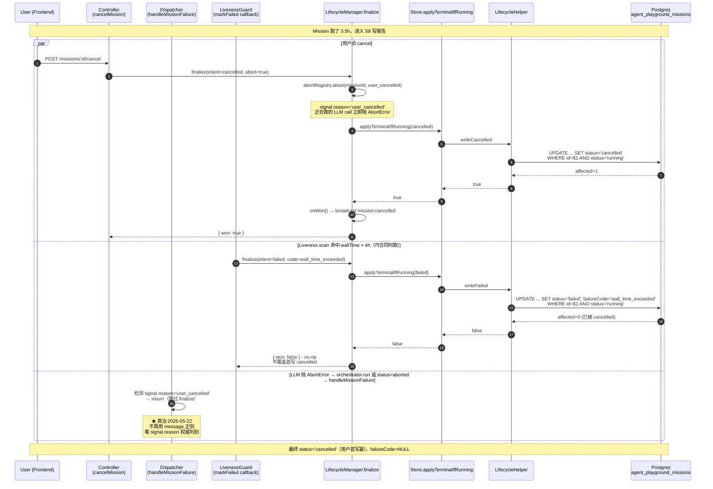
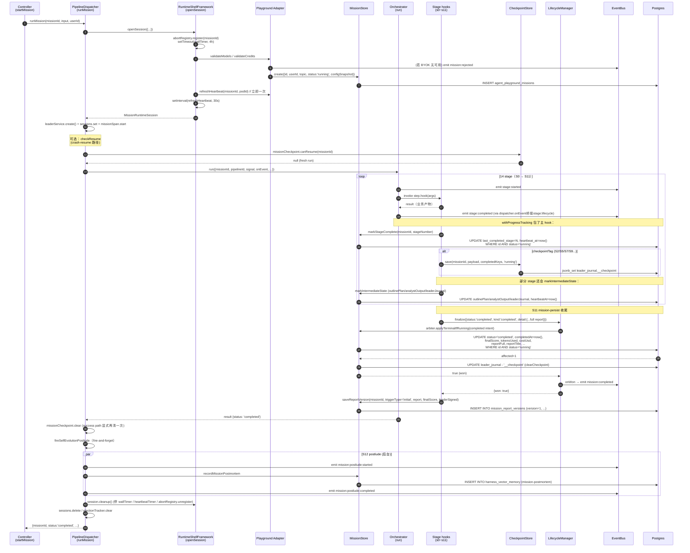

# 04 · Mission Lifecycle / 持久化层（agent-playground 端到端分析）

> 本文是 agent-playground 端到端业务流分析的第 4 路（共 5 路）。范围严格限定在 mission **创建 → 持久化 → heartbeat → terminal 仲裁 → resume → 孤儿回收**。stage 业务、agent 调用、HTTP 接收分别由第 1/2/3 路覆盖，本文不重复展开。
>
> 日期：2026-05-24。代码基准：当前 `main` 分支（HEAD `61cce0fb5`，agent-playground P6 Wave 1 framework 化下沉之后）。

---

## 1. Overview

agent-playground 的 mission 持久化层在仓库里跨三层目录：

| 层              | 目录                                                             | 角色                                                                                                                                                                                                                      |
| --------------- | ---------------------------------------------------------------- | ------------------------------------------------------------------------------------------------------------------------------------------------------------------------------------------------------------------------- |
| L3 ai-app       | `backend/src/modules/ai-app/agent-playground/mission/lifecycle/` | playground 业务专属：表名/字段映射、`projectUserProfileView`、`appendDimensions`、`updateVisibility`                                                                                                                      |
| L2.5 ai-harness | `backend/src/modules/ai-harness/teams/business-team/lifecycle/`  | 通用 framework（mission-store / event-buffer / checkpoint-store / lifecycle-transitions / update / postmortem / report / runtime-shell），所有 business-team 应用共用                                                     |
| L2.5 ai-harness | `backend/src/modules/ai-harness/lifecycle/mission-lifecycle/`    | 平台 mission lifecycle 单元：`MissionLifecycleManager`（finalize 仲裁）、`MissionAbortRegistry`、`MissionLivenessGuard`、`MissionRuntimeStateStore`（Redis 活性探测）、rerun orchestrator、`MissionFailureCode` canonical |
| L1 infra schema | `backend/prisma/schema/models.prisma` （models 9758-10073）      | DB schema：`AgentPlaygroundMission` 主行 + 6 张关联表                                                                                                                                                                     |

**核心架构原则（2026-05-22 契约审计后落定 C0 / C1 / C2 / C5 / C7）**：

1. **C0 / G1 单点终态写**：所有把 mission 推到 `completed/failed/cancelled` 的来源（dispatcher 正常完成 → S11、dispatcher 失败 → `handleMissionFailure`、dispatcher 兜底 → `tryHandleAbort`、controller `cancelMission`、liveness `markFailed`、A-8 finally 兜底）**统一**调 `MissionLifecycleManager.finalize`，由 arbiter (`MissionStore.applyTerminalIfRunning`) 用条件写 `WHERE status='running'` 做"首写者赢"仲裁。第二写直接拿到 `count=0` 返回 `won=false`，不覆盖首写原因。
2. **C2 canonical failure code**：DB 列 `failure_code` 写 `MissionFailureCode` enum（`user_cancelled` / `budget_exhausted` / `wall_time_exceeded` / `runtime_crashed` / `leader_signoff_rejected` / `provider_error` / `mission_row_missing` / `unknown`），FailureCategory 读时投影、不独立赋值。
3. **C5 / G7 typed config snapshot**：openSession 时调 `PlaygroundMissionInputRebuilder.buildForFreshRun` 冻结一份 `MissionConfigSnapshot`（含 schemaVersion + snapshotRevision + budget + runtimeLimits + businessInput），所有 rerun / hydrate / 前端读都只读 snapshot。`userProfile` 列是 snapshot 的**读时投影**（`projectUserProfileView`），不再独立写。
4. **RB4 双心跳契约**：
   - DB `heartbeatAt`（`AgentPlaygroundMission.heartbeat_at`）= **唯一回收依据**；30s 由 `MissionRuntimeShellFramework.setInterval` 刷新。
   - Redis `mission:rt:hb:` = 活性探测（标识哪个 pod 持有该 mission，TTL 90s），**不参与回收判定**。契约由 `liveness-reclaim-contract.spec.ts` 守护。

---

## 2. Mission 表 schema + state machine

### 2.1 `AgentPlaygroundMission` 主表字段（prisma/schema/models.prisma:9796-9904）

```prisma
model AgentPlaygroundMission {
  id                String   @id @default(uuid())
  userId            String   @map("user_id")
  user              User     @relation(fields: [userId], references: [id], onDelete: Cascade)  // 用户删除级联
  visibility        ContentVisibility @default(PRIVATE)
  workspaceId       String?  @map("workspace_id")
  electionState     MissionElectionState?  // 模型选举状态（FK 反向）

  // 输入
  topic             String   @db.VarChar(500)
  depth             String   @db.VarChar(20)    // quick / standard / deep
  language          String   @db.VarChar(20)
  maxCredits        Int      @map("max_credits") // ★ 2026-05-22 删 @default(300)：唯一写入点 createMissionRow 总是显式给

  // 状态
  status            String   @db.VarChar(20)    // running / completed / failed / cancelled / quality-failed / rejected
  startedAt         DateTime @default(now())
  completedAt       DateTime?
  elapsedWallTimeMs Int?    @map("elapsed_wall_time_ms")  // ★ C4/G5：实测耗时（与配置上限同名两义旧字段 wallTimeMs 改名）

  // 完成时填充
  finalScore        Int?
  tokensUsed        BigInt?
  costUsd           Float?
  trajectoryStored  Int?
  reportTitle       String?  @db.VarChar(500)
  reportSummary     String?  @db.Text
  errorMessage      String?  @db.Text
  failureCode       String?  @db.VarChar(40)    // ★ C2/G3：MissionFailureCode canonical

  // 持久化 blob
  themeSummary             String?
  dimensions               Json?
  reportFull               Json?   @db.JsonB
  reportFullUri            String?
  reportFullSize           Int?
  reportArtifactVersion    Int?
  verdicts                 Json?
  userProfile              Json?    // ⚠ 写时只写 configSnapshot；userProfile 由 projectUserProfileView 读时投影回 shape
  configSnapshot           Json?    // ★ C5/G7：typed MissionConfigSnapshot（单一真源）
  reconciliationReport     Json?    @db.JsonB
  reconciliationReportUri  String?
  reconciliationReportSize Int?

  // Leader-Replanner（M0/M6 持久化）
  leaderJournal      Json?   @db.JsonB   // ★ checkpoint 的 reserved key `__checkpoint` 嵌在这里
  leaderJournalUri   String?
  leaderJournalSize  Int?
  leaderOverallScore Int?
  leaderSigned       Boolean?
  leaderVerdict      String? @db.VarChar(20)

  // PR-R0 per-task rerun 持久化（S6 / S7 cascade hydrate 用）
  analystOutput     Json?  @db.JsonB
  analystOutputUri  String?
  analystOutputSize Int?
  outlinePlan       Json?  @db.JsonB
  outlinePlanUri    String?
  outlinePlanSize   Int?

  // ★ PR-H v1 pod-aware lifecycle（2026-05-01）
  lastCompletedStage Int?      @map("last_completed_stage")  // 0~12，单调递增，pod 重启后 resume 用
  podId              String?   @db.VarChar(120)              // RAILWAY_REPLICA_ID || hostname
  heartbeatAt        DateTime? @map("heartbeat_at")          // runMission 每 30s 刷一次

  // 关联
  leaderChats     AgentPlaygroundLeaderChat[]
  researchResults AgentPlaygroundResearchResult[]
  chapterDrafts   AgentPlaygroundChapterDraft[]
  reportVersions  MissionReportVersion[]
  rerunAttempts   AgentPlaygroundRerunAttempt[]

  @@index([userId, startedAt(sort: Desc)])
  @@index([status])
  @@index([status, heartbeatAt])  // PR-H: pod recovery 扫描
  @@map("agent_playground_missions")
}
```

### 2.2 关联表

| 表                              | 角色                                                                                    |
| ------------------------------- | --------------------------------------------------------------------------------------- |
| `AgentPlaygroundRerunAttempt`   | 24h 内 mission+stepId 重跑次数限制（≤5/24h 防滥用，rerun-guard.service 读）             |
| `AgentPlaygroundMissionEvent`   | mission 事件流持久化（buffer write-through，liveness scan getMostRecentEventTs 读）     |
| `MissionElectionState`          | mission 级模型选举状态（FK 回 agent_playground_missions，CASCADE）                      |
| `AgentPlaygroundResearchResult` | per-dim researcher 完整产物（rerun hydrate `crossState.lastResearcherResults`）         |
| `AgentPlaygroundChapterDraft`   | per-chapter draft（rerun hydrate `dimensionPipelines.chapters[i]`，跳过通过的章节重写） |
| `MissionReportVersion`          | 报告版本化（每次 rerun → 新 version，不覆盖；missionId+version 唯一索引）               |
| `AgentPlaygroundLeaderChat`     | 用户 ↔ Leader 对话记录                                                                  |

### 2.3 State machine

```mermaid
stateDiagram-v2
    [*] --> running: store.create()<br/>(MissionRuntimeShellFramework.openSession 内)
    running --> running: refreshHeartbeat (每30s)<br/>markStageComplete (每 stage 成功)<br/>markIntermediateState (S2/S6/S7/S10)<br/>appendLeaderJournal (M0/M6)<br/>appendDimensions (用户 chat 加 dim)
    running --> completed: finalize(completed)<br/>arbiter.writeCompleted<br/>(WHERE status='running')
    running --> failed: finalize(failed)<br/>arbiter.writeFailed<br/>(WHERE status='running', leaderSigned≠false)
    running --> quality-failed: finalize(failed) +<br/>leaderSigned=false<br/>(buildFailedUpdate 分支)
    running --> cancelled: finalize(cancelled)<br/>arbiter.writeCancelled<br/>(controller.cancelMission)

    failed --> running: markReopened (rerun)<br/>reopenTransaction tx
    quality-failed --> running: markReopened (rerun)
    cancelled --> [*]
    completed --> [*]

    note right of running
        ★ 4 终态来源同时争用
        finalize 仲裁条件写
        WHERE status='running'
        首写者 won=true
        其余 won=false 无副作用
    end note
```

**实际 status 字面量集合**：`running` / `completed` / `failed` / `cancelled` / `quality-failed` / `rejected`。其中 `quality-failed` 与 `rejected` 是 **app 业务态**，平台 `MissionTerminalStatus` 不识别（只识 completed/failed/cancelled），由 `outcomeFromStatus` 投影成 `failure`。

**平台 lifecycle status**（`MissionLifecycleManager.MissionLifecycleStatus`）= `starting | running | completed | failed | cancelled`，**不掺业务语义** —— quality-failed 由 app `failureCode = leader_signoff_rejected` 表达。

---

## 3. 写入路径矩阵

> **唯一允许直写 `agent_playground_missions` 行的入口**：
>
> 1. `MissionStore.applyTerminalIfRunning`（arbiter，C0 唯一终态写口）
> 2. `MissionStoreHooks.createMission / writeHeartbeat / resetHeartbeat / writeStageProgress / markOrphanFailed`（framework 内部）
> 3. `MissionLifecycleHelper.appendLeaderJournal / reopenTransaction`（jsonb 原子操作）
> 4. `MissionUpdateHelper.runUpdate`（用户主动 patch：topic / budget / reset）
> 5. `MissionUpdateHelper.markIntermediateState`（S2/S6/S7/S10 中间产物落库）
> 6. `PrismaMissionCheckpointStore.upsertJsonKey / removeJsonKey`（jsonb_set 原子 `leader_journal.__checkpoint`）
> 7. `MissionStore.appendDimensions`（用户 chat 加 dim，Serializable tx）
> 8. `MissionStore.updateVisibility`（多租户可见性切换）
> 9. `MissionStore.deleteByUser`（用户删 mission）

### 3.1 矩阵表

| 写入动作                                                 | Caller                                                                                                 | 调用方法                                                                                                            | 触发条件                                                                               | SQL（关键）                                                                                                                                                                                                                                                                         |
| -------------------------------------------------------- | ------------------------------------------------------------------------------------------------------ | ------------------------------------------------------------------------------------------------------------------- | -------------------------------------------------------------------------------------- | ----------------------------------------------------------------------------------------------------------------------------------------------------------------------------------------------------------------------------------------------------------------------------------- |
| **INSERT row**                                           | `MissionRuntimeShellFramework.openSession` (harness)                                                   | `adapter.createMissionRow` → `MissionStore.create`                                                                  | controller.startMission → `pipelineDispatcher.runMission` → `runtimeShell.openSession` | `INSERT INTO agent_playground_missions (id, userId, topic, depth, language, maxCredits, status='running', configSnapshot, ...)`                                                                                                                                                     |
| **heartbeatAt 刷新**                                     | `MissionRuntimeShellFramework.openSession` 的 setInterval(30s)                                         | `adapter.refreshHeartbeat` → `MissionStore.refreshHeartbeat` → `storeHooks.writeHeartbeat`                          | 每 30s tick / openSession 立即一次 fire-and-forget                                     | `UPDATE agent_playground_missions SET heartbeat_at=now(), pod_id=$1 WHERE id=$2`                                                                                                                                                                                                    |
| **heartbeatAt 清空**                                     | （仅 framework `clearHeartbeat`，目前 dispatcher 未主动调用，cleanup 路径靠 session.cleanup 停 timer） | `MissionStore.clearHeartbeat` → `resetHeartbeat`                                                                    | 终态后选用                                                                             | `UPDATE agent_playground_missions SET heartbeat_at=NULL WHERE id=$1 AND user_id=$2`                                                                                                                                                                                                 |
| **lastCompletedStage**                                   | `withProgressTracking` (playground.pipeline.ts) 包每个 primary hook 的 success path                    | `MissionStore.markStageComplete` → `writeStageProgress`                                                             | Stage 主 hook resolve（非 throw）                                                      | `UPDATE agent_playground_missions SET last_completed_stage=$N, heartbeat_at=now() WHERE id=$1 AND status='running'`                                                                                                                                                                 |
| **completed (终态)**                                     | S11 `s11-mission-persist.stage.ts` 成功 + `leaderSigned=true` 分支                                     | `deps.lifecycleManager.finalize({status:'completed'})` → arbiter `writeCompleted`                                   | S11 全部通过 + Leader signed                                                           | `UPDATE agent_playground_missions SET status='completed', completedAt=now(), finalScore, tokensUsed, costUsd, reportFull, reportTitle, reportSummary, ... WHERE id=$1 AND status='running'`                                                                                         |
| **failed (终态) ①** Lead 拒签                            | S11 `leaderSigned=false` 分支                                                                          | `finalize({status:'failed'})` + `detail.leaderSigned=false` → `buildFailedUpdate` 走 quality-failed 分支            | Leader sign-off refusal                                                                | `UPDATE ... SET status='quality-failed', failureCode='leader_signoff_rejected', ... WHERE id=$1 AND status='running'`                                                                                                                                                               |
| **failed (终态) ②** chapter 不达标                       | S11 substantive sections 不足 / coverage 不到阈值                                                      | `finalize({status:'failed'})`                                                                                       | S11 校验失败                                                                           | `UPDATE ... SET status='failed', errorMessage='chapter_content_*', ... WHERE id=$1 AND status='running'`                                                                                                                                                                            |
| **failed (终态) ③** dispatcher 内 orchestrator 失败      | `playground.pipeline.ts:handleMissionFailure`                                                          | `finalize({status:'failed', failureCode: mapAgentFailureCode(missionFailureCode)})`                                 | `orchestrator.run` 返回 `status='failed'/'aborted'`                                    | `UPDATE ... SET status='failed', failureCode=$1, errorMessage=$2, tokensUsed, costUsd, ... WHERE id=$1 AND status='running'`                                                                                                                                                        |
| **failed (终态) ④** execution_aborted 兜底               | `playground.pipeline.ts:tryHandleAbort` catch 块                                                       | `finalize({status:'failed'})`                                                                                       | runtimeShell.runWithinContext throw（catch 兜底）                                      | 同上                                                                                                                                                                                                                                                                                |
| **failed (终态) ⑤** liveness reclaim                     | `MissionLivenessGuard.markFailed` callback (agent-playground.module.ts:360)                            | `lifecycleManager.finalize({failureCode: wall_time_exceeded / runtime_crashed})`                                    | scan 检测到 heartbeat AND events 同 stale > 5min / wallTime > 4h                       | 同上                                                                                                                                                                                                                                                                                |
| **failed (终态) ⑥** boot orphan cleanup                  | `playground.pipeline.ts:cleanupOrphanRunningMissions` (onModuleInit)                                   | `store.cleanupOrphanRunningMissions` → `findOrphanRunning + markOrphanFailed`（**不走 finalize**，直接 updateMany） | pod boot 时扫所有 heartbeat > 5min stale running missions                              | `UPDATE agent_playground_missions SET status='failed', failureCode='runtime_crashed', errorMessage='Mission 在执行中遇到后端重启...' WHERE id IN (...) AND status='running'`                                                                                                        |
| **cancelled (终态)**                                     | `agent-playground.controller.ts:cancelMission`                                                         | `lifecycleManager.finalize({status:'cancelled', reason:user_cancelled, abort:true})`                                | 用户 POST /cancel                                                                      | `UPDATE ... SET status='cancelled', completedAt=now(), errorMessage='Mission cancelled by user.' WHERE id=$1 AND status='running' AND user_id=$2`                                                                                                                                   |
| **reopen (failed → running)**                            | `mission-rerun-orchestrator.service.ts`（rerun）                                                       | `MissionStore.markReopened` → `lifecycle.markReopened` → `reopenTransaction` tx                                     | rerun-fresh / rerun-incremental                                                        | tx: `UPDATE ... SET status='running', errorMessage=NULL, completedAt=NULL, finalScore=NULL, leaderSigned=NULL, ... WHERE id=$1 AND user_id=$2 AND status IN ('failed','quality-failed')` + `INSERT INTO agent_playground_mission_events (type='agent-playground.mission:reopened')` |
| **中间产物 outlinePlan / analystOutput / leaderJournal** | stage `withProgressTracking` 后置 `missionStore.markIntermediateState`                                 | `MissionUpdateHelper.markIntermediateState` → `runUpdate`                                                           | S2/S6/S7/S10 等中间 stage 产物落库                                                     | `UPDATE agent_playground_missions SET outlinePlan=$1, analystOutput=$2, leaderJournal=$3, heartbeatAt=now() WHERE id=$1`                                                                                                                                                            |
| **checkpoint save**                                      | `withProgressTracking` 选择性 (`CHECKPOINT_AT` 标记的 step)                                            | `MissionCheckpointService.save` → `PrismaMissionCheckpointStore.upsertJsonKey`                                      | stage 完成 + 该 step 在 `CHECKPOINT_AT` 集合                                           | `UPDATE agent_playground_missions SET leader_journal = jsonb_set(COALESCE(leader_journal,'{}'::jsonb), '{__checkpoint}', $1::jsonb, true) WHERE id=$2`                                                                                                                              |
| **checkpoint clear**                                     | S11 成功路径 + 终态 framework 默认调 `hooks.clearCheckpoint`                                           | `MissionStore.clearCheckpointJsonbKey` (raw SQL)                                                                    | mission 终态后 / 成功路径显式 `missionCheckpoint.clear`                                | `UPDATE agent_playground_missions SET leader_journal = COALESCE(leader_journal,'{}'::jsonb) - '__checkpoint' WHERE id=$1 AND leader_journal ? '__checkpoint'`                                                                                                                       |
| **appendLeaderJournal**                                  | M0/M6 lead-replanner 阶段                                                                              | `MissionStore.appendLeaderJournal` → tx Serializable                                                                | Lead 写 plan / decisions / foreword                                                    | tx: `findUnique(leaderJournal) → merge → update`（特殊：`decisions` 数组合并而非覆盖）                                                                                                                                                                                              |
| **appendDimensions**                                     | 用户在 LeaderChat 让 Lead 加 dim（appendDimensionsByUser）                                             | `MissionStore.appendDimensions`                                                                                     | Lead chat 输出 `type='CREATE_TODO'`                                                    | tx Serializable: 读 dimensions → push 新 dim（带 `id=dim-user-${baseIdx+i+1}, source='user-chat'`） → update                                                                                                                                                                        |
| **updateTopicByUser / updateBudgetByUser**               | `agent-playground.controller.ts:updateMission`                                                         | `MissionUpdateHelper.*ByUser`                                                                                       | PATCH /missions/:id；预算字段仅非 running 状态                                         | `UPDATE ... WHERE id=$1 AND user_id=$2 SET topic=...` / `SET maxCredits=..., configSnapshot=applyInputPatch(...)`                                                                                                                                                                   |
| **resetFields**                                          | rerun-fresh 路径                                                                                       | `MissionUpdateHelper.resetFields` (via `RESET_FIELD_MAP`)                                                           | rerun-fresh 准备重跑前 reset 输出字段                                                  | `UPDATE ... SET reportFull=NULL, finalScore=NULL, ... WHERE id=$1 AND user_id=$2`                                                                                                                                                                                                   |
| **markRerunPatch**                                       | `local-rerun.service.ts`                                                                               | `MissionUpdateHelper.markRerunPatch`                                                                                | per-task rerun 局部产物覆盖原值                                                        | `UPDATE ... SET <patched fields> WHERE id=$1`                                                                                                                                                                                                                                       |
| **report version**                                       | S11 成功路径 + handleMissionFailure 有 partial report 路径                                             | `MissionStore.saveReportVersion` → `MissionReportHelper` tx Serializable                                            | mission completed / failed with partial report                                         | tx: `aggregate max(version) → INSERT INTO mission_report_versions (missionId, version+1, reportFull, finalScore, leaderSigned, triggerType)`                                                                                                                                        |
| **researchResult upsert**                                | S3 dimension researcher 完成                                                                           | `MissionStore.saveResearchResult` → `MissionReportHelper`                                                           | per-dim 收尾                                                                           | `INSERT ... ON CONFLICT (missionId, dimension, retryLabel) DO UPDATE`                                                                                                                                                                                                               |
| **chapterDraft upsert**                                  | S8 章节产出 / S9 reviewer 评分                                                                         | `MissionStore.saveChapterDraft`                                                                                     | 章节状态变更（writing/reviewing/passed/done/failed-finalized）                         | `INSERT ... ON CONFLICT (missionId, dimension, chapterIndex) DO UPDATE`                                                                                                                                                                                                             |
| **postmortem 记录**                                      | S12 self-evolution（fireSelfEvolutionPostlude，fire-and-forget）                                       | `MissionStore.recordMissionPostmortem`                                                                              | 终态后 postlude 阶段                                                                   | `INSERT INTO harness_vector_memory (namespace=userId, source='agent-playground:mission', tags=['mission-postmortem','signed'/'unsigned'], embedding, metadata)`                                                                                                                     |
| **visibility 切换**                                      | `agent-playground.controller.ts:updateVisibility`                                                      | `MissionStore.updateVisibility`                                                                                     | 用户改 PRIVATE/WORKSPACE/PUBLIC                                                        | `SELECT ownership → UPDATE WHERE id=$1 SET visibility=$2`                                                                                                                                                                                                                           |
| **delete mission**                                       | `agent-playground.controller.ts:deleteMission`                                                         | `MissionStore.deleteByUser`                                                                                         | DELETE /missions/:id（status≠running）                                                 | `DELETE FROM agent_playground_missions WHERE id=$1 AND user_id=$2`                                                                                                                                                                                                                  |
| **bulk markOrphanFailed**                                | `BusinessTeamMissionStoreFramework.cleanupOrphanRunningMissions` 内（boot orphan cleanup）             | `storeHooks.markOrphanFailed`                                                                                       | pod boot + heartbeat > 5min stale                                                      | `UPDATE agent_playground_missions SET status='failed', completedAt=now(), failureCode='runtime_crashed', errorMessage='Mission 在执行中遇到后端重启...' WHERE id IN (...) AND status='running'`                                                                                     |

### 3.2 写入条件总结

- **所有终态写**强制带 `WHERE status='running'`（条件写）→ 首写赢。
- 大部分用户拥有性写（cancel / delete / patch）带 `WHERE id=$1 AND user_id=$2`，避免越权。
- `markIntermediateState` 不带 ownership/running 校验（信任 dispatcher 调用方在 session 内），但带 `heartbeatAt=now()` 顺便刷新心跳。
- `appendLeaderJournal` / `appendDimensions` 用 `Serializable` tx 防 read-modify-write 互覆盖。
- `checkpoint upsertJsonKey` 用 raw `jsonb_set` 原子操作，避免与 `appendLeaderJournal` 并发互踩（P1-R5-A 2026-04-30 修复）。

---

## 4. Finalize 仲裁机制

### 4.1 接口契约

```typescript
// ai-harness/lifecycle/mission-lifecycle/mission-lifecycle-manager.ts:81-127
async finalize<TExtra>(args: {
  missionId: string;
  intent: MissionTerminalIntent<TExtra>;
  arbiter: MissionTerminalArbiter<TExtra>;
  abort?: boolean;             // 是否同时 abort signal（user cancel / budget / wall-time 置 true）
  onWon?: () => Promise<void>; // 仅赢家执行（事件广播 / 清理）
}): Promise<{ won: boolean }>;
```

执行步骤：

1. 若 `abort=true`：`abortRegistry.abort(missionId, intent.reason ?? user_cancelled)`（幂等，二次 abort `signal.aborted=true` 直接 return false）
2. `won = await arbiter.applyTerminalIfRunning(missionId, intent)` —— **arbiter 内部用条件写**
3. `won=false` → log "lost race"，return（不抛错，不覆盖首写原因）
4. `won=true` → log "won"，跑 `onWon`（异常吞掉，仅 warn，不影响终态）

### 4.2 Playground arbiter 实现

`MissionStore.applyTerminalIfRunning` 按 `extra.kind` 分派：

```typescript
// mission-store.service.ts:279-301
switch (extra.kind) {
  case "completed":
    return this.lifecycle.writeCompleted(missionId, extra.detail, extra.userId);
  case "failed":
    return this.lifecycle.writeFailed(missionId, extra.detail, extra.userId);
  case "cancelled":
    return this.lifecycle.writeCancelled(missionId, extra.userId);
}
```

`writeCompleted/Failed/Cancelled` 走 `BusinessTeamLifecycleTransitionsFramework`：

```typescript
// business-team-lifecycle-transitions.framework.ts
const data = this.hooks.buildCompletedUpdate(detail); // playground 字段映射
const affected = await this.hooks.conditionalUpdate(
  missionId,
  { userId },
  data,
);
//     ↑ playground 实现 = prisma.agentPlaygroundMission.updateMany({
//         where: { id: missionId, status: "running", ...(userId ? {userId} : {}) },
//         data,
//       })
await this.hooks.clearCheckpoint(missionId); // 终态后清 checkpoint
return affected > 0; // ← 首写赢/输的核心信号
```

**关键不变量**：`affected > 0` 仅当行此前确实在 `status='running'` 且（可选）userId 匹配。第二个 finalize 调用拿到 `affected=0` 返回 `false`，外部 `won=false` 不跑 `onWon`，不重复广播事件、不重复 emit。

### 4.3 多源同时竞争（核心场景）



### 4.4 仲裁的关键防御

- **不读 status 再写**（race 不可避免）：所有 finalize 走 `updateMany WHERE status='running'`，由 DB 原子保证只有一个生效。
- **failed → cancelled 不能反向覆盖**（直到 reopenTransaction 才能 failed → running）。
- **abort signal.reason 是用户取消的权威判据**（不再用脆弱的 `/cancel/i.test(message)`）：
  - controller.cancelMission → `abortRegistry.abort(missionId, user_cancelled)`
  - wall-time timer → `abortRegistry.abort(missionId, mission_wall_time_exceeded)`
  - budget guard → `abortRegistry.abort(missionId, budget_exhausted)`
- 这让 `handleMissionFailure` 能精准区分"已被用户取消（跳过 emit mission:failed）" vs "预算/超时（必须 emit mission:failed + finalize）"。

### 4.5 abort reason → failureCode 映射

```typescript
// ai-harness/lifecycle/mission-lifecycle/abstractions/mission-failure.ts:86-101
const ABORT_REASON_TO_FAILURE_CODE = {
  user_cancelled: user_cancelled,
  budget_exhausted: budget_exhausted,
  mission_wall_time_exceeded: wall_time_exceeded,
  mission_row_missing: mission_row_missing,
  rerun_replacing_stale: runtime_crashed,
  superseded: runtime_crashed,
  orchestrator_shutdown: runtime_crashed,
};
```

agent 级大写 code（`failure-extraction.utils` 产出）→ mission code 见同文件 `AGENT_CODE_TO_FAILURE_CODE`，未知降级到 `unknown`。

---

## 5. Liveness scan 循环

### 5.1 注册与 boot

`MissionLivenessGuard` 是 `@Global` harness service。`AgentPlaygroundModule.onModuleInit` 注册自家 adapter：

```typescript
// agent-playground.module.ts:270-449
this.livenessGuard.registerAdapter(
  "agent-playground",
  {
    fetchRunningMissions: async () => { /* prisma.agentPlaygroundMission.findMany(status='running'), take=200 */ },
    getMostRecentEventTs: async (ids, sinceMs) => {
      // prisma.agentPlaygroundMissionEvent.groupBy({by:['missionId'], where:{missionId IN, ts >= sinceMs}, _max:{ts}})
    },
    markFailed: async (missionId, reason, errorMessage) => {
      // ★ MAJOR-4：经 finalize 仲裁（不直写 store），落 canonical failureCode
      const failureCode = reason === "wall-time-exceeded" ? wall_time_exceeded : runtime_crashed;
      await this.lifecycleManager.finalize<PlaygroundTerminalExtra>({
        missionId,
        intent: { status: "failed", failureCode, errorMessage, extra: { kind: "failed", detail: { errorMessage, failureCode } } },
        arbiter: this.store,
        onWon: async () => {
          this.electionTracker.clear(missionId);
          await this.eventBus.emit({ type: "agent-playground.mission:failed", ... });
        },
      });
    },
    emitWarning: async (missionId, userId, payload) => {
      // emit "agent-playground.mission:warning" toast
    },
  },
  // 配置来自 PlaygroundRuntimeConfig（env override）
  {
    wallTimeCapMs: rt.wallTimeCapMs > 0 ? rt.wallTimeCapMs : Number.POSITIVE_INFINITY,
    staleThresholdMs: rt.staleThresholdMin * 60_000,         // 默认 15min
    softWarnThresholdMs: rt.softWarnThresholdMin * 60_000,   // 默认 20min
    startupGraceMs: 5 * 60_000,
    scanIntervalMs: 60_000,
    bootDelayMs: 60_000,
  },
);
```

### 5.2 scan 算法（mission-liveness-guard.service.ts:283-424）

每 60s 跑一次（boot 60s 后首次）：

```
1. fetch running missions（take 200）
2. 按 startupGrace 过滤（age < 5min 一律 spared，避免 fire-and-forget refresh 未落库即被杀）
3. 拉这批 mission 在最近 staleThreshold×3 = 15min 窗口的最近 event ts
4. 对每个候选：
   - effectiveStart = max(startedAt, lastReopenedAt ?? 0)  // ★ rerun-overhaul 2026-05-07
   - ageMs = now - effectiveStart
   - 若 ageMs > wallTimeCapMs (4h) → markFailed("wall-time-exceeded")
   - 否则计算 heartbeatAgeMs / eventAgeMs
   - 若 heartbeatStale AND eventStale → markFailed("no-activity")  ★ 必须双信号 stale
   - 否则若任一 > softWarnThreshold (20min) → emitWarning（dedup floor(softWarn/2) 内不重发）
```

**lastReopenedAt 来源**：`adapter.fetchRunningMissions` 实现里 groupBy `agent_playground_mission_events.type='agent-playground.mission:reopened'` 取最近 ts。防止"7h+ 前 started 的 mission rerun 后立即被 wall-time 误杀"。

### 5.3 三阶梯阈值

| 阶梯      | 阈值                    | 动作                             |
| --------- | ----------------------- | -------------------------------- |
| 启动豁免  | age < 5min              | spared                           |
| Soft warn | 任一信号 stale > 20min  | emitWarning（前端 toast，不杀）  |
| Hard kill | 双信号 stale > 15min    | markFailed("no-activity")        |
| Wall-time | effectiveStart age > 4h | markFailed("wall-time-exceeded") |

> 注意：staleThreshold(15min) 与 softWarn(20min) 顺序在 spec 上稍反直觉，但代码按 `softWarn > stale` 设计——理由是：硬杀靠双 stale 同时触发更严苛，soft warn 单信号即可触发故阈值更宽，确保 warn 先于 kill。

### 5.4 IN-PROCESS 状态

- `adapters` Map（namespace → adapter+config）：pod 重启时 onModuleInit 重新注册，不需要持久化（callback 持有 PrismaService DI 实例不可序列化）。
- `lastWarnedAt` Map（dedup warning 推送）：跨 pod 不一致只会导致每 pod 发一次，不影响正确性。
- 不迁 Redis：当前 Railway 单 pod 部署，跨 pod 场景未出现；迁 Redis 收益不抵破坏构造器零依赖。

---

## 6. Checkpoint + Crash-resume 数据流

### 6.1 写：`PrismaMissionCheckpointStore.save`

由 `withProgressTracking` 在 `CHECKPOINT_AT` 标记的 step 完成后调用：

```typescript
// playground.pipeline.ts:192-218
if (missionId && checkpointTag) {
  await this.missionCheckpoint.save(
    missionId,
    {
      lastStage: checkpointTag,
      topic: entry.input.topic,
      crossState: entry.crossState.toJSON(), // ★ R2-#37：含完整跨 stage 状态
    },
    completedKeys,
    "running",
  );
}
```

落地 SQL（原子 jsonb_set 避免与 `appendLeaderJournal` 并发互覆盖）：

```sql
UPDATE agent_playground_missions
SET leader_journal = jsonb_set(
  COALESCE(leader_journal, '{}'::jsonb),
  '{__checkpoint}',
  $1::jsonb,
  true
)
WHERE id = $2
```

**Checkpoint payload shape**（PersistedCheckpoint）：

```typescript
{
  savedAt: ISO string,           // 反序列化时 isNaN 校验防污染
  payload: { lastStage, topic, crossState },
  completedKeys: string[],       // 已完成的 stepId 数组
  status: "running",
}
```

**失败 best-effort**：`hooks.upsertJsonKey` catch 计数器 `saveFailures`，达到 `degradedThreshold=3` 次日志告警 "DEGRADED — mission resume capability lost"，**不影响 mission 主流程**（fire-and-forget）。

### 6.2 读：crash-resume on next openSession

```typescript
// playground.pipeline.ts:370-409
const resumeDecision = await this.missionCheckpoint.canResume(missionId);
if (resumeDecision.canResume && resumeDecision.snapshot) {
  const snap = resumeDecision.snapshot;
  // 1. 恢复 crossState
  if (payload.crossState) {
    const restored = PlaygroundCrossStageState.fromJSON(payload.crossState);
    this.sessions.set(missionId, { ...entry, crossState: restored });
    initialCrossStageState = payload.crossState;
  }
  // 2. 找到 highest-stageNumber completedKey 作为 resumeFromStepId
  if (snap.completedKeys.length > 0) {
    const stageNumber = this.businessOrch.STAGE_NUMBER;
    const sorted = [...snap.completedKeys].sort(
      (a, b) => (stageNumber[a] ?? 0) - (stageNumber[b] ?? 0),
    );
    resumeFromStepId = sorted[sorted.length - 1];
  }
}
// 3. 传给 orchestrator.run
return this.orchestrator.run({
  ...,
  resumeFromStepId,
  initialCrossStageState,
});
```

### 6.3 清：终态后 framework 自动清

`writeCompleted` / `writeFailed` / `writeCancelled` 最后一步：

```typescript
await this.hooks.clearCheckpoint(missionId);
// playground 实现 = MissionStore.clearCheckpointJsonbKey
//   = "UPDATE agent_playground_missions SET leader_journal = COALESCE(...) - '__checkpoint' WHERE id=$1 AND leader_journal ? '__checkpoint'"
```

### 6.4 listResumable（rerun 后扫所有可恢复 mission）

`PrismaMissionCheckpointStore.listRunningWithJson`：拉所有 `status='running'` mission（**不过滤时间窗** — P0-R5-3 修复，避免漏掉长 mission），应用层按 `savedAt` 过滤。

---

## 7. Happy path：mission 完整时序（fresh run, completed）



**Heartbeat 时间线**（典型 standard depth ≈ 30min mission）：

```
t=0       openSession → INSERT row, status='running', heartbeatAt=null
t=0+ε     refreshHeartbeat (fire-and-forget) → heartbeatAt=now, podId=<replica>
t=30s     setInterval tick → heartbeatAt=now
t=60s     setInterval tick → heartbeatAt=now
...
t=stage完成 → markStageComplete (顺带 heartbeatAt=now)
t=mark中间状态 → markIntermediateState (顺带 heartbeatAt=now)
...
t=完成    finalize.writeCompleted → status='completed'
            （heartbeatAt 仍是最后一次的值，不主动清，下游忽略）
            cleanup() 停 setInterval
```

---

## 8. 异常场景分支（10 类）

### 8.1 Pod crash（进程死，DB heartbeat 不再更新）

```
T=0     pod-A 跑 mission，heartbeat 30s 刷一次
T=300s  pod-A SIGKILL → setInterval timer 死
T=300s+ DB heartbeatAt 卡在 T=300s
T=600s  pod-B 启动 onModuleInit
        → cleanupOrphanRunningMissions(5min) 扫 heartbeat < T=900s-5min=T=600s 的 running
        → 但 heartbeatAt=T=300s 还在 5min 窗口内（T=600s - T=300s = 300s）
        → 未必杀，等下次 scan
T=900s  LivenessGuard scan
        → fetchRunning 拉到 mission
        → heartbeatAge = 600s > stale(15min=900s)? 还没到
        → 再过几分钟双信号同 stale 才杀
T=~15-20min 后  双 stale (heartbeat + events) → markFailed("no-activity", runtime_crashed)
```

**用户体验**：等约 15-20min 才看到 mission:failed 提示"Mission 在执行过程中失联 ≥ 15 分钟..."。如果 pod 在 boot 时（pod-B onModuleInit 触发 `cleanupOrphanRunningMissions(5min)`）就发现 heartbeat > 5min stale，立即 markFailed + emit mission:failed（不走 finalize，直接 updateMany；这是 boot orphan 快速路径，比 LivenessGuard 15min 快得多）。

### 8.2 DB 写超时（markRunning 失败）

`MissionRuntimeShellFramework.openSession`：

```typescript
try {
  await adapter.createMissionRow({...});  // ← 这里抛 P0001 / connection timeout
  ...
} catch (err) {
  cleanup();  // 停 wallTimer / heartbeatTimer / abortRegistry.unregister
  throw err;  // 向上抛
}
```

- **mission 不会卡 pending**（行根本没 INSERT 进 DB，没有"卡住"的 running row）
- 上层 `pipelineDispatcher.runMission` catch（controller `.catch(err)` 静默 log error）
- 用户视角：HTTP 200（已 return missionId）但 mission 永远不会出现在列表里（DB 无此 id）
- WebSocket 不会推任何事件（订阅 `playground:${missionId}` room 无人 broadcast）
- **改进空间**：当前未在 openSession 失败时 emit mission:failed。这是个已知缺口（依赖前端 polling getById 才发现）

### 8.3 重复 mission id（race condition）

mission id 由 `randomUUID()` 在 controller 生成，碰撞概率 ~10⁻³⁶。即使发生：

- `prisma.agentPlaygroundMission.create` 撞 PK conflict → 抛 `P2002`（不是 `P2003/P2025`）
- `isMissionRowMissing` 不识别此 code → 不触发 emergencyAbort
- openSession 路径 catch → cleanup → throw → 上层静默 log
- **未规避**：理论上"主调撞 PK 但前一个还在跑"会导致诡异。实操由 UUID 概率忽略。

### 8.4 Finalize 多源同时触发（核心场景）

见 §4.3 mermaid。仲裁规则：

| 同时发起                       | 仲裁结果                                                                                                                                                                     |
| ------------------------------ | ---------------------------------------------------------------------------------------------------------------------------------------------------------------------------- |
| cancel + budget                | 先到 DB 的赢；abort signal 已传 reason 给 handleMissionFailure 区分"用户取消（跳过 emit failed）" vs "budget（继续 emit failed + finalize）"；后者输了仲裁仅 log "lost race" |
| cancel + wallTime              | 同上（wallTime timer 先 abort，handleMissionFailure 走 budget/timeout 分支跑 finalize；用户 cancel 同时跑 finalize cancelled，DB 仲裁谁先到谁赢）                            |
| cancel + liveness              | cancel 几乎肯定先到（liveness 每 60s scan + 启动 grace），但理论上 race 不可避免；DB 仲裁兜底                                                                                |
| budget + wallTime              | abort reason 不同，两个 finalize 都走 failed 分支，failureCode 不同；DB 仲裁谁先写谁的 failureCode 落库                                                                      |
| S11 success + liveness reclaim | S11 几乎肯定在 mission age < 4h 时跑（标准 depth ~30min）；理论上长 mission 接近 4h 时可能撞 wall-time scan                                                                  |

所有竞争由 `UPDATE ... WHERE status='running'` 的原子性兜底。

### 8.5 Checkpoint 写入失败

`PrismaMissionCheckpointStore` 的 hooks.upsertJsonKey throw：

```typescript
// business-team-checkpoint-store.framework.ts:75-88
} catch (err) {
  const count = (this.saveFailures.get(missionId) ?? 0) + 1;
  this.saveFailures.set(missionId, count);
  this.log.warn(`[checkpoint.save ${missionId}] update failed (#${count}): ...`);
  if (count === this.degradedThreshold) {  // 默认 3
    this.log.error(`[checkpoint.save ${missionId}] DEGRADED — mission resume capability lost`);
  }
  // ★ 不 rethrow
}
```

- **best-effort**：mission 主流程**不阻塞**
- 影响：若后续 pod 崩，crash-resume 无 checkpoint 可用，只能从 S0 重跑
- `withProgressTracking` 包了 `.catch` 不让它冒泡污染 stage：

  ```typescript
  // playground.pipeline.ts:202-217
  await this.missionCheckpoint.save(...).catch((err: unknown) => {
    this.log.warn(`[progress-tracking ${missionId}] checkpoint.save failed (non-fatal): ${...}`);
  });
  ```

### 8.6 DB schema migration 期间 mission 创建

- migration 跑时 Postgres 短暂 `ACCESS EXCLUSIVE` 锁（ALTER TYPE / ALTER TABLE）
- `prisma.agentPlaygroundMission.create` 阻塞或 timeout
- 同 §8.2：openSession 失败，cleanup，throw 上层，mission 不存在
- **运维建议**：migration 期间前端禁用 startMission（或后端 controller 加 maintenance mode 拦截）

### 8.7 Mission completed 后又收到 stage:lifecycle 事件

S11 finalize 后，理论上 stage 不会再产 event（pipeline 已 return）。但 fire-and-forget 路径（S12 postlude / event buffer pending writes）有 race：

- 事件持久化：`MissionEventBuffer.persistEvent` 不带 `status='running'` 校验，直接 `INSERT agent_playground_mission_events`（FK 仅校验 missionId 存在）→ 可以写
- 影响：`mission_events` 表会多一些后续事件（mission:postlude:completed, agent:thought tail 等），前端只要 mission status 已 completed 就停 polling，不影响 UI
- mission 主行**不会被反向 update**（所有终态写都带 `WHERE status='running'`）

### 8.8 Event buffer 满

`MissionEventBuffer` 走 `BusinessTeamEventBufferFramework`（FIFO + TTL）：

```typescript
// business-team-event-buffer.framework.ts:74-77
if (slot.events.length > this.maxPerMission) {
  // 默认 5000
  slot.events.splice(0, slot.events.length - this.maxPerMission);
}
```

- **行为**：drop oldest（splice 头部）
- 不 block 主流程
- DB 持久化是 fire-and-forget（不影响内存上限）：`void this.hooks.persistEvent(...).catch(...)`
- TTL 1h 后整个 slot 被 GC（`gcIfNeeded` 每 GC interval 一次）
- 读 sync 优先内存（fast path），无内存或 sinceTs 在 DB → `readPersisted` 拉 DB

### 8.9 用户在 mission running 中删除自己（user cascade）

```prisma
user User @relation(fields: [userId], references: [id], onDelete: Cascade)
```

- DELETE user → CASCADE delete 所有 agent_playground_missions
- 进行中的 mission 行被删除 → 接下来任何 update 撞 FK / P2025 错误
- `isMissionRowMissing(P2003 | P2025)` → `true` → `triggerEmergencyAbort(missionId, "...")`
- `emergencyAbort` 调 `MissionAbortRegistry.abort(missionId, MissionAbortReason.mission_row_missing)`
- in-flight LLM / tool call 抛 AbortError → orchestrator.run 返 failed
- `handleMissionFailure` 走 finalize → arbiter.applyTerminalIfRunning → `updateMany` affected=0 (行不存在) → won=false → 不广播
- 用户视角：mission 已和账号一起灰飞烟灭，前端无残留 polling 错误

### 8.10 Mission paused 重启后恢复

**注意**：当前 schema **没有 `paused` 状态**。state machine 只有 running / completed / failed / cancelled / quality-failed / rejected。"暂停/恢复"在产品上由 **rerun-incremental** 实现（从 inheritFromMissionId hydrate 跳过已完成的 stage）：

- 完成的 mission：用户在 UI 点"重新运行" → controller startMission 带 `inheritFromMissionId` → 新 missionId + 走 `hydrateInheritedPlan / ResearchResults / ChapterDrafts` → 跳过 S3/章节重写
- 失败的 mission：rerun-orchestrator 调 `markReopened`（failed/quality-failed → running 反向 transition，tx 内 emit reopened 事件 + reset fields）

不存在"严格的 pause/resume"（mission running 中不能挂起；用户只能 cancel + rerun）。

### 8.11（额外）Liveness scan 误杀 fresh mission

`startupGraceMs=5min`：mission 启动 5min 内 scan 完全跳过该 mission。防御 fire-and-forget refreshHeartbeat 未落库的窗口。

### 8.12（额外）reopened 后 wall-time 误杀

旧 bug：`startedAt` 是 7h+ 前，reopen 后 wall-time scan 看 `now - startedAt > 4h` 立即杀。修复（2026-05-07 rerun-overhaul）：

```typescript
const effectiveStart = Math.max(m.startedAt.getTime(), reopenedMs);
```

`reopenedMs` 由 adapter `fetchRunningMissions` groupBy `mission:reopened` 事件最近 ts 算出。

---

## 9. Prisma schema 关键字段映射

| Prisma 字段                                                                | DB 列                                                       | 写入者                                                                                                                                                                              | 读取者                                                              |
| -------------------------------------------------------------------------- | ----------------------------------------------------------- | ----------------------------------------------------------------------------------------------------------------------------------------------------------------------------------- | ------------------------------------------------------------------- |
| `id`                                                                       | id (uuid)                                                   | controller 用 `randomUUID()` 生成传给 `runMission` → `openSession` → `createMission`                                                                                                | 所有 query                                                          |
| `userId`                                                                   | user_id                                                     | 同上（来自 JWT req.user.id）                                                                                                                                                        | ownership check, listByUser                                         |
| `status`                                                                   | status varchar(20)                                          | createMission='running' / writeCompleted='completed' / writeFailed='failed'/'quality-failed' / writeCancelled='cancelled' / reopenTransaction='running' / markOrphanFailed='failed' | 仲裁条件写 WHERE status='running'，listByUser，liveness scan        |
| `topic / depth / language`                                                 | topic / depth / language                                    | createMission（input 投影）                                                                                                                                                         | listByUser, configSnapshot fallback                                 |
| `maxCredits`                                                               | max_credits                                                 | createMission（已解析 effectiveMaxCredits）, updateBudgetByUser                                                                                                                     | budget 计算（ResolvedBudgetCaps.resolve → toTokenBudget）           |
| `startedAt`                                                                | started_at default now                                      | DB 默认                                                                                                                                                                             | listByUser, liveness scan, wall-time 计算                           |
| `completedAt`                                                              | completed_at                                                | writeCompleted/Failed/Cancelled = `new Date()`                                                                                                                                      | getById                                                             |
| `heartbeatAt`                                                              | heartbeat_at                                                | refreshHeartbeat (30s setInterval) + writeStageProgress 顺带 + markIntermediateState 顺带 + resetHeartbeat=NULL                                                                     | LivenessGuard fetchRunningMissions, boot orphan cleanup             |
| `podId`                                                                    | pod_id varchar(120)                                         | refreshHeartbeat（含 podId 参数）                                                                                                                                                   | 调试 / orphan 分析（无业务逻辑读）                                  |
| `lastCompletedStage`                                                       | last_completed_stage                                        | writeStageProgress (markStageComplete)                                                                                                                                              | crash-resume `resumeFromStepId` 推算                                |
| `configSnapshot`                                                           | config_snapshot json                                        | createMission (rebuilder.buildForFreshRun)                                                                                                                                          | cloneInputFromMission (rerun), getById, projectUserProfileView      |
| `userProfile`                                                              | user_profile json                                           | createMission (S4b 后停写)                                                                                                                                                          | 仅 legacy；新 mission 通过 projectUserProfileView 读 configSnapshot |
| `leaderJournal`                                                            | leader_journal jsonb                                        | appendLeaderJournal (Serializable tx) + checkpoint upsertJsonKey (raw jsonb_set) + markIntermediateState                                                                            | getById, checkpoint load, clearCheckpoint                           |
| `outlinePlan / analystOutput`                                              | outline_plan / analyst_output                               | markIntermediateState（S7/S6）                                                                                                                                                      | rerun cascade hydrate (ctx-hydrator.service)                        |
| `reportFull`                                                               | report_full jsonb                                           | writeCompleted/Failed（detail.report 写入）                                                                                                                                         | getById, saveReportVersion source                                   |
| `errorMessage`                                                             | error_message text                                          | writeFailed (truncated 2000) / writeCancelled ("Mission cancelled by user.") / markOrphanFailed (固定文案)                                                                          | getById, displayMessage 投影                                        |
| `failureCode`                                                              | failure_code varchar(40)                                    | writeFailed (detail.failureCode or leader_signoff_rejected) / markOrphanFailed='runtime_crashed' / liveness markFailed (wall_time_exceeded/runtime_crashed)                         | listRecentPostmortems, getById投影                                  |
| `finalScore / tokensUsed / costUsd / elapsedWallTimeMs`                    | final_score / tokens_used / cost_usd / elapsed_wall_time_ms | writeCompleted / writeFailed (含 partial)                                                                                                                                           | listByUser, getById                                                 |
| `visibility`                                                               | visibility ContentVisibility                                | updateVisibility（用户主动）                                                                                                                                                        | 多租户列表过滤                                                      |
| `leaderSigned / leaderOverallScore / leaderVerdict / leaderJournalUri ...` | leader\_\*                                                  | writeCompleted/Failed (extra.detail) + markIntermediateState                                                                                                                        | getById, savedReportVersion extra                                   |

### 9.1 关键 index

- `@@index([userId, startedAt(sort: Desc)])`：listByUser 排序用
- `@@index([status])`：listRunning（liveness fetchRunningMissions WHERE status='running'）
- `@@index([status, heartbeatAt])`：PR-H pod recovery 扫描 + LivenessGuard 复合 filter

### 9.2 JSON off-load 兜底（leaderJournalUri / reportFullUri / etc.）

- 当 jsonb 内容 > 阈值（实测大 leader_journal / report_full）外置 R2，DB 主列置 NULL，写 URI + size
- Prisma 读时通过 hydrate hook 透明 fetch（这里 select `leader_journal` 必须配套 `leader_journal_uri`，否则 PrismaService 警告"off-loaded content empty"）
- 影响本文档关心的 lifecycle 操作：jsonb_set 必须用 raw SQL（不能 update 整列），否则 hydrate hook 误判

---

## 10. 总结：mission 持久化层的 invariants

> 5 路汇总用，逐条对照源码可验证。

1. **唯一终态写口** = `MissionLifecycleManager.finalize` → `MissionStore.applyTerminalIfRunning` → `BusinessTeamLifecycleTransitionsFramework.write{Completed,Failed,Cancelled}` → conditionalUpdate `WHERE status='running'`。共 9+ 个 caller 全部走这一口。
2. **首写赢** 由 `affected > 0` 信号驱动，`onWon` 只在 won=true 跑（防重复广播）。
3. **唯一回收依据** = DB `heartbeatAt`（liveness adapter.fetchRunningMissions 读）。Redis runtime heartbeat（`MissionRuntimeStateStore.claimOrBeat`）是活性探测，**不参与回收判定**。
4. **canonical failureCode** 写 `MissionFailureCode` enum；category 从 code 读时派生（`codeToCategory`，无 second source of truth）。
5. **typed configSnapshot** 是 mission 的 canonical 输入快照（schemaVersion + revision + budget + runtimeLimits + businessInput）；rerun/hydrate/前端都只读它。`userProfile` 列已退化为读时投影（`projectUserProfileView`）。
6. **checkpoint 双写**：DB jsonb_set 原子（`leader_journal.__checkpoint`）+ in-memory failure counter（3 次 DEGRADED 告警）。`writeXxx` 终态后自动清。
7. **abort signal.reason** 是用户取消的权威判据（不再用 message 正则）：`abortRegistry.abort(id, MissionAbortReason.X)` → `signal.reason='X'` → `handleMissionFailure` 据此分流。
8. **wall-time effectiveStart** = max(startedAt, lastReopenedAt) — 防止 reopen 后被原 startedAt 误杀。
9. **startup grace 5min** 跳过 scan — 防止 fire-and-forget refreshHeartbeat 未落库即被杀。
10. **boot orphan cleanup**（5min 阈值）是 pod 重启时的快速失败路径，跑在 LivenessGuard 之前（不等 60s scan）；**不走 finalize**，直接 updateMany（理由：boot 时无 in-flight session，无需 abort signal / 仲裁；只是把僵尸 row 标 failed 让前端尽快看到）。
11. **emergencyAbort 触发条件**：Prisma error code P2003（FK violation）/ P2025（row not found）。在 refreshHeartbeat / markStageComplete / saveResearchResult / saveChapterDraft 路径都接了 emergencyAbort hook，确保 mission row 被外部删除后所有 in-flight worker 立即停止。
12. **scoped tx Serializable** 用于读-改-写场景：`appendLeaderJournal`（防与 checkpoint upsertJsonKey 互覆盖；后者改为 raw jsonb_set 后 risk 降低）、`appendDimensions`（防多用户并发加 dim）、`reopenTransaction`（status 反向 transition）、`saveReportVersion`（version aggregate max + insert）。

---

## 附录 A · 源码索引（绝对路径）

### A.1 ai-app 业务专属

- `backend/src/modules/ai-app/agent-playground/mission/lifecycle/mission-store.service.ts` — 主 store（arbiter 实现）
- `backend/src/modules/ai-app/agent-playground/mission/lifecycle/mission-lifecycle.helper.ts` — playground 字段映射 + appendLeaderJournal
- `backend/src/modules/ai-app/agent-playground/mission/lifecycle/mission-update.helper.ts` — 用户主动 patch + intermediate state
- `backend/src/modules/ai-app/agent-playground/mission/lifecycle/mission-postmortem.helper.ts` — vector memory 记录
- `backend/src/modules/ai-app/agent-playground/mission/lifecycle/mission-report.helper.ts` — report version + research/chapter upsert
- `backend/src/modules/ai-app/agent-playground/mission/lifecycle/mission-event-buffer.service.ts` — event buffer adapter
- `backend/src/modules/ai-app/agent-playground/mission/lifecycle/prisma-mission-checkpoint.store.ts` — jsonb_set checkpoint 持久化
- `backend/src/modules/ai-app/agent-playground/mission/lifecycle/event-categories.ts` — business vs lifecycle event 分类规则
- `backend/src/modules/ai-app/agent-playground/mission/lifecycle/playground-postmortem-patterns.ts` — 失败模式 substring patterns
- `backend/src/modules/ai-app/agent-playground/module/agent-playground.module.ts` — LivenessGuard.registerAdapter（含 markFailed callback 经 finalize）
- `backend/src/modules/ai-app/agent-playground/mission/pipeline/playground.pipeline.ts` — runMission 主入口、cleanupOrphanRunningMissions、handleMissionFailure、tryHandleAbort
- `backend/src/modules/ai-app/agent-playground/mission/pipeline/mission-runtime-shell.service.ts` — adapter 注入 → framework openSession
- `backend/src/modules/ai-app/agent-playground/mission/pipeline/stages/s11-mission-persist.stage.ts` — 终态写 happy path（completed + leader 拒签 + chapter 不达标）
- `backend/src/modules/ai-app/agent-playground/api/controller/agent-playground.controller.ts` — cancelMission / deleteMission / updateMission / updateVisibility

### A.2 ai-harness 通用 framework

- `backend/src/modules/ai-harness/teams/business-team/lifecycle/business-team-mission-store.framework.ts` — CRUD + heartbeat + stage + orphan cleanup 机制
- `backend/src/modules/ai-harness/teams/business-team/lifecycle/business-team-lifecycle-transitions.framework.ts` — write{Completed,Failed,Cancelled} 条件写 + markReopened + report size guard
- `backend/src/modules/ai-harness/teams/business-team/lifecycle/business-team-event-buffer.framework.ts` — FIFO + TTL + DB write-through
- `backend/src/modules/ai-harness/teams/business-team/lifecycle/business-team-checkpoint-store.framework.ts` — jsonb reserved key 双写 + savedAt 校验 + degraded 计数
- `backend/src/modules/ai-harness/teams/business-team/lifecycle/business-team-update-helper.framework.ts` — runUpdate 通用 update + ownership where
- `backend/src/modules/ai-harness/teams/business-team/lifecycle/business-team-postmortem-helper.framework.ts` — postmortem 记录通用
- `backend/src/modules/ai-harness/teams/business-team/lifecycle/business-team-report-helper.framework.ts` — report version 通用
- `backend/src/modules/ai-harness/teams/business-team/lifecycle/mission-runtime-shell.framework.ts` — openSession 装配（wallTimer / heartbeat setInterval / billing / validateModels / validateCredits）
- `backend/src/modules/ai-harness/teams/business-team/lifecycle/abstractions/` — 7 个 contract 文件

### A.3 ai-harness 平台 lifecycle

- `backend/src/modules/ai-harness/lifecycle/mission-lifecycle/mission-lifecycle-manager.ts` — finalize 仲裁
- `backend/src/modules/ai-harness/lifecycle/mission-lifecycle/abort-registry.ts` — MissionAbortRegistry + MissionAbortReason enum
- `backend/src/modules/ai-harness/lifecycle/mission-lifecycle/mission-liveness-guard.service.ts` — scan 算法（三阶梯 + multi-namespace）
- `backend/src/modules/ai-harness/lifecycle/mission-lifecycle/runtime-state-store.ts` — Redis 活性探测（不参与回收）
- `backend/src/modules/ai-harness/lifecycle/mission-lifecycle/abstractions/mission-failure.ts` — canonical MissionFailureCode + category mapping
- `backend/src/modules/ai-harness/lifecycle/mission-lifecycle/abstractions/mission-state.ts` — MissionTerminalOutcome + outcomeFromStatus 投影
- `backend/src/modules/ai-harness/lifecycle/mission-lifecycle/abstractions/mission-config-snapshot.ts` — typed config snapshot + deriveChildSnapshot
- `backend/src/modules/ai-harness/lifecycle/mission-lifecycle/rerun/mission-rerun-orchestrator.ts` — rerun-full / rerun-from-todo orchestrator

### A.4 Schema

- `backend/prisma/schema/models.prisma:9796-9904` — AgentPlaygroundMission
- `backend/prisma/schema/models.prisma:9909-9920` — AgentPlaygroundRerunAttempt
- `backend/prisma/schema/models.prisma:9924-9936` — AgentPlaygroundMissionEvent
- `backend/prisma/schema/models.prisma:9955-9965` — MissionElectionState
- `backend/prisma/schema/models.prisma:9970-9992` — AgentPlaygroundResearchResult
- `backend/prisma/schema/models.prisma:9997-10018` — AgentPlaygroundChapterDraft
- `backend/prisma/schema/models.prisma:10023-10054` — MissionReportVersion
- `backend/prisma/schema/models.prisma:10057-10073` — AgentPlaygroundLeaderChat
- `backend/prisma/schema/models.prisma:9758-9794` — HarnessVectorMemory（postmortem 落点）
