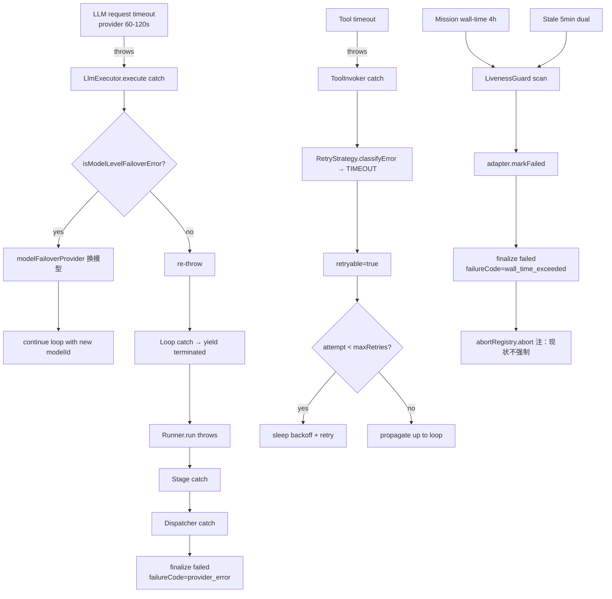
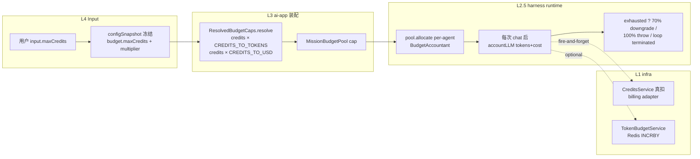
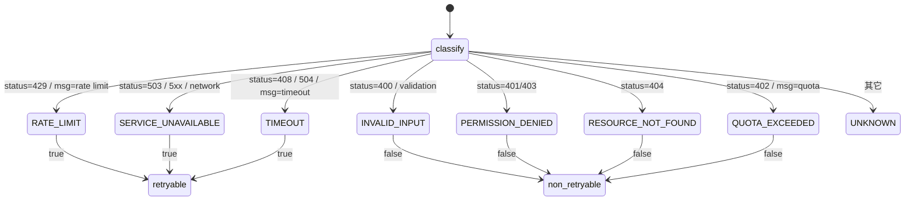
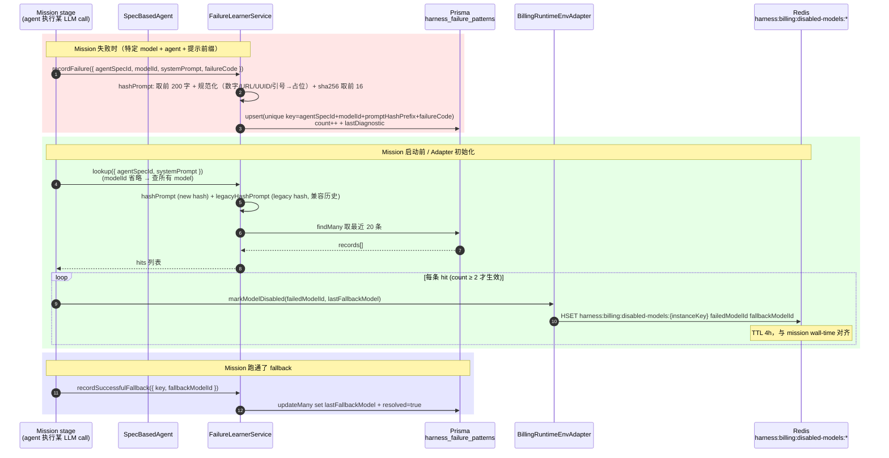
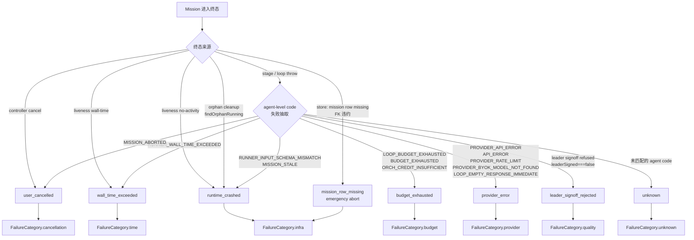

# Agent Playground 端到端 · 第 5 路：跨层异常 / 韧性总集

> 范围：跨层（L1 infra / L2 engine / L2.5 harness / L3 ai-app）的所有失败模式和系统级保护机制。
> 与第 1-4 路的边界：本路只讲"事情不按 happy path 走时发生什么"和"挂之前怎么挡住"，不重复任何
> happy path 流程细节。
>
> 调研日期：2026-05-24。所有 file:line 引用基于当时主干 (commit `61cce0fb5` 及之前)。

---

## 目录

1. [Overview · 本路覆盖范围 + 与其他路的边界](#1-overview)
2. [AbortSignal 端到端穿透图](#2-abortsignal-端到端穿透)
3. [超时机制矩阵](#3-超时机制矩阵)
4. [预算守护数据流](#4-预算守护)
5. [retry + circuit breaker 状态机](#5-retry--circuit-breaker)
6. [Failure Learning 跨 mission 数据流](#6-failure-learning)
7. [Rerun 路径分析（full restart vs stage-rerun-dispatcher）](#7-rerun-路径)
8. [27 个异常场景逐个分析](#8-27-个异常场景逐个分析)
9. [MissionFailureCode 分类决策树](#9-failurecode-决策树)
10. [漏洞清单 · 未覆盖的场景 + file:line 证据](#10-漏洞清单)

---

## 1. Overview

### 1.1 本路负责的能力

| 维度         | 覆盖范围                                                                                                |
| ------------ | ------------------------------------------------------------------------------------------------------- |
| Abort 协议   | `MissionAbortRegistry`、`AbortSignal` 在 controller → orchestrator → loop → llm-executor → fetch 的链路 |
| Timeout      | stage 单步 / mission wall-time / LLM 请求 / DB 查询 / RAG 搜索；谁守 + 超了谁报                         |
| Budget       | `BudgetAccountant` / `MissionBudgetPool` / `ResolvedBudgetCaps` / `TokenBudgetService` 四层             |
| Rate Limit   | controller 层 `RateLimitGuard`、engine 层 `RateLimitService`（global/tenant/agentType）                 |
| Concurrency  | per-user 3 个 mission cap、`ConcurrencyLimiter` 通用信号量                                              |
| Retry        | `RetryStrategy`（tool 调用指数退避）、`LlmExecutor` schema retry、`model-failover.util`（跨模型）       |
| Circuit      | `CircuitBreakerService`（L2 engine，CLOSED/OPEN/HALF_OPEN 三态）                                        |
| Learning     | `FailureLearnerService` + `harness_failure_patterns` 表 + `BillingRuntimeEnvAdapter.markModelDisabled`  |
| Rerun        | `LocalRerunService` / `RerunGuardService` / `StageRerunDispatcher`（cascade 链）/ `CtxHydratorService`  |
| Liveness     | `MissionLivenessGuard`（heartbeat + events 双信号 + wall-time + soft warn）                             |
| Postmortem   | `PostmortemClassifierService` + `MissionPostmortemHelper`（mission 复盘写 harnessVectorMemory）         |
| Notification | `NotificationService.createNotification`、event emitter → WS gateway                                    |
| CI Guard     | `.husky/pre-push`（god-class size / 架构边界 / UI 一致性 / i18n / runtime deps）                        |
| Final state  | `MissionLifecycleManager.finalize`（条件写仲裁，首写赢）+ `MissionFailureCode` enum                     |

### 1.2 与第 1-4 路的边界

| 这一路**不**讲                                                             | 第 X 路讲了               |
| -------------------------------------------------------------------------- | ------------------------- |
| controller / WS gateway 的 happy path（接入、JWT 验证、emit 编排）         | 第 1 路（HTTP / WS 链路） |
| pipeline-dispatcher 在所有 stage 成功跑通的流转                            | 第 2 路（mission 主流程） |
| Leader / Researcher / Reconciler / Analyst / Writer / Critic 的具体 prompt | 第 3 路（agent 角色）     |
| ReportArtifact 装配、quality scoring 算法                                  | 第 4 路（产出装配）       |

但凡涉及"挂了 / 抢锁 / 退化 / 取消 / 限流 / 报警"，全部归本路。

### 1.3 设计原则（贯穿全文）

1. **单写者赢**（C0/G1 契约）：所有把 mission 推到终态的来源都走 `MissionLifecycleManager.finalize`
   - `MissionTerminalArbiter.applyTerminalIfRunning` 条件写 `WHERE status='running'`。**先到为真因，后到 no-op**。
2. **AbortSignal 在合法节点 check**（不依赖外层 try-catch）：loop / executor / fetch 自己看 `signal.aborted`。
3. **失败必落 canonical code**：`MissionFailureCode` 8 个 enum 值是平台唯一真源，category 由 code 派生（投影禁独立赋值）。
4. **fail-open 默认**：guard 服务（CacheService / token bucket store / FailureLearner）任何 store 故障一律返 allow，不阻断主流程。
5. **best-effort partial**：rerun 失败、stage cascade 中断时已成产物保留（不清表），用户用顶部"重新运行"自愈。

---

## 2. AbortSignal 端到端穿透

### 2.1 单一控制器：`MissionAbortRegistry`

文件：`backend/src/modules/ai-harness/lifecycle/mission-lifecycle/abort-registry.ts:32`

```typescript
@Injectable()
export class MissionAbortRegistry {
  private readonly map = new Map<string, AbortController>();
  register(missionId: string): AbortController {
    /* new + map.set */
  }
  abort(missionId, reason: MissionAbortReason): boolean {
    /* 幂等 */
  }
  getSignal(missionId: string): AbortSignal | undefined;
  unregister(missionId: string): void;
}
```

**关键设计**：

- `MissionAbortReason` enum（abort-registry.ts:21）：`user_cancelled` / `budget_exhausted` /
  `mission_wall_time_exceeded` / `mission_row_missing` / `rerun_replacing_stale` / `superseded` /
  `orchestrator_shutdown`。是 `MissionFailureCode` 的真子集（`mission-failure.ts:86`
  `ABORT_REASON_TO_FAILURE_CODE` 总映射）。
- abort 幂等（`abort-registry.ts:46`，`signal.aborted` 已 true 跳过）。
- in-process 唯一表：Nest @Global module 单例，每 pod 一份。**不跨 pod**——但 mission 在哪个 pod 启
  就被哪个 pod 管，跨 pod cancel 走 DB（详见 §8.1 用户主动 cancel）。

### 2.2 端到端穿透 mermaid

```mermaid
sequenceDiagram
    autonumber
    participant FE as Frontend
    participant Ctl as Controller<br/>(agent-playground)
    participant Reg as MissionAbortRegistry
    participant LCM as MissionLifecycleManager
    participant Store as MissionStore<br/>(arbiter)
    participant Disp as Pipeline Dispatcher
    participant Stage as Stage handler
    participant Inv as AgentExecutionSupport.invoke
    participant Runner as AgentRunner
    participant Loop as ReAct/Plan/Reflexion Loop
    participant LE as LlmExecutor
    participant Chat as AiChatService
    participant Tool as Tool Invoker

    Note over Ctl,Reg: 启动 mission 时<br/>controller / runtime-builder<br/>调 register(missionId)
    Ctl->>Reg: register(missionId) → AbortController c
    Reg-->>Ctl: c.signal

    Note over Disp,Stage: dispatcher 把 c.signal<br/>透传到每个 stage 的<br/>mission-deps.abortRegistry
    Disp->>Stage: runStage(ctx, deps)
    Stage->>Inv: invoke(spec, input, ctx, onEvent)
    Inv->>Reg: getSignal(missionId)
    Reg-->>Inv: signal
    Inv->>Runner: run(spec, input, { signal, ...rest })
    Runner->>Loop: loop.execute({ envelope, signal, budget, ... })

    rect rgb(255, 230, 230)
    Note over FE,Loop: ★ Cancel 触发点（FE→BE）
    FE->>Ctl: POST /missions/:id/cancel
    Ctl->>Ctl: assertOwnership(missionId, userId)
    Ctl->>Reg: abort(missionId, "user_cancelled")
    Note over Reg: c.abort(reason)<br/>signal.aborted=true<br/>所有 listener 收到 abort event
    Ctl->>LCM: finalize({ status:"cancelled", reason, arbiter:store, onWon:emit })
    LCM->>Store: applyTerminalIfRunning(missionId, intent)
    Store->>Store: UPDATE WHERE status='running' AND userId=...<br/>{ status:'cancelled', errorMessage:... }
    alt updated.count > 0
        Store-->>LCM: won=true
        LCM->>Ctl: onWon() — broadcast mission:cancelled
        Ctl-->>FE: 200 { ok:true, status:"cancelled" }
    else updated.count = 0
        Store-->>LCM: won=false (已被别的来源终结)
        LCM-->>Ctl: { won:false } no-op
        Ctl-->>FE: 200 { ok:true, status:"cancelled", alreadyCancelled:true }
    end
    end

    Note over Loop,Chat: signal 在多层主动 check
    Loop->>Loop: 每轮顶部检查 signal?.aborted<br/>(react-loop.ts:519)
    Loop->>LE: chat 调用前 check signal.aborted<br/>(llm-executor.ts:453)
    LE->>Chat: aiChatService.chat({ signal, ...})
    Chat->>Chat: fetch(url, { signal })
    Note over Chat: signal 透传到底层 fetch<br/>provider 连接立刻 abort
    Chat-->>LE: throws AbortError / DOMException
    LE->>LE: re-throw（不当 failover 候选,<br/>isModelLevelFailoverError 排除）
    Loop->>Tool: invokeTool 前 check signal<br/>tool-invoker.ts
    Tool-->>Loop: 单次 tool 中断
    Loop-->>Runner: terminated reason=cancelled
    Runner-->>Inv: throws / aborted state
    Inv-->>Stage: throws
    Stage-->>Disp: stage 失败传播
```

### 2.3 谁会"主动检查 aborted"？

| 层级                               | 文件:行号                            | 是否检查 | 说明                                                                           |
| ---------------------------------- | ------------------------------------ | -------- | ------------------------------------------------------------------------------ |
| controller cancel                  | `agent-playground.controller.ts:244` | -        | 触发点：调 `abortRegistry.abort(id, user_cancelled)` + `finalize(cancelled)`   |
| `MissionLifecycleManager.finalize` | `mission-lifecycle-manager.ts:93`    | 触发     | `abort=true` 时调 `abortRegistry.abort(id, reason)`（幂等）                    |
| pipeline-dispatcher                | （第 2 路）                          | 间接     | 透传 signal 给 stage handlers via `mission-deps.abortRegistry`                 |
| stage 函数                         | 大部分 stage（s2/s3/.../s10）        | 间接     | 通过调 invoke 把 signal 传给 runner，自身不直接检查（依赖 invoke / runner）    |
| `AgentExecutionSupport.invoke`     | `agent-execution-support.ts:32`      | 透传     | `this.abortRegistry.getSignal(ctx.missionId)` → 传给 runner.run                |
| `AgentRunner.run`                  | (harness facade)                     | 透传     | 传给 loop.execute({ signal })                                                  |
| `react-loop.execute`               | `react-loop.ts:519`                  | **是**   | 每轮顶部 `if (options?.signal?.aborted)` → yield terminated{cancelled} 退出    |
| `plan-act-loop`                    | `plan-act-loop.ts:151`, `:318`       | **是**   | 入口检查 + 每个 act 阶段检查                                                   |
| `reflexion-loop`                   | 类似 plan-act                        | **是**   |                                                                                |
| `simple-loop`                      | 类似                                 | **是**   |                                                                                |
| `LlmExecutor.execute`              | `llm-executor.ts:453`                | **是**   | 每次 schema retry 顶部 check，抛 `DOMException AbortError`                     |
| `AiChatService.chat`               | (engine)                             | **是**   | 把 signal 透到底层 `fetch(url, { signal })` → provider 连接立刻 abort          |
| `ToolInvoker.invokeTool`           | `tool-invoker.ts`                    | **是**   | 工具内部传 signal 给 fetch / DB 查询                                           |
| 长时间 DB op                       | Prisma queries                       | **否**   | ★ **漏洞**：Prisma 不接 AbortSignal，DB 锁着的 long query 不能中断（见 §10.1） |

### 2.4 abort 触发点全集

| 触发者                                                                  | reason                                 | 文件:行号                                                                                |
| ----------------------------------------------------------------------- | -------------------------------------- | ---------------------------------------------------------------------------------------- |
| 用户 cancel API                                                         | `user_cancelled`                       | `agent-playground.controller.ts:244`                                                     |
| `MissionStore.applyTerminalIfRunning`（mission_row_missing 紧急 abort） | `mission_row_missing`                  | `mission-store.service.ts:172`，hook `emergencyAbort`                                    |
| budget 触底（loop 检测 `exhausted()`）                                  | `budget_exhausted`                     | loop 内部 yield terminated → dispatcher 调 finalize(reason=budget_exhausted)             |
| wall-time 超 4h                                                         | `mission_wall_time_exceeded`           | `mission-liveness-guard.ts:335` 检测 → adapter.markFailed → liveness adapter 调 finalize |
| rerun 替代 stale（强行抢锁）                                            | `rerun_replacing_stale`                | `rerun-runtime-builder.service.ts:62` `protectStaleAbortController`                      |
| orchestrator 主动 shutdown / superseded                                 | `superseded` / `orchestrator_shutdown` | （未在 controller 直接调，预留给 graceful redeploy 场景）                                |

---

## 3. 超时机制矩阵

### 3.1 三层 timeout 总表

| 类型                                       | 守护方                                               | 默认值                             | 文件:行号                                                                              | 超时后行为                                                                              |
| ------------------------------------------ | ---------------------------------------------------- | ---------------------------------- | -------------------------------------------------------------------------------------- | --------------------------------------------------------------------------------------- |
| Mission wall-time（hard）                  | `MissionLivenessGuard`（per-pod cron 60s）           | 4 h（可配）                        | `mission-liveness-guard.ts:108-123`, app override `agent-playground.module.ts:438-447` | adapter.markFailed → `MissionLifecycleManager.finalize(failureCode=wall_time_exceeded)` |
| Mission stale（dual signal）               | `MissionLivenessGuard`                               | heartbeat AND events 都 5min stale | `mission-liveness-guard.ts:364`                                                        | adapter.markFailed → finalize(`runtime_crashed`，"no-activity"）                        |
| Mission soft warn                          | `MissionLivenessGuard.emitWarning`                   | 任一 stale > 10min                 | `mission-liveness-guard.ts:382-411`                                                    | emit `mission:warning` 事件给前端 toast，不杀                                           |
| Stage / step                               | 无单独定时器                                         | -                                  | -                                                                                      | ★ **漏洞**：stage 没有独立 timeout，靠 mission liveness（5min 双信号）兜底（见 §10.2）  |
| LLM 单次请求                               | `AiChatService` / `fetch` 内部                       | provider sdk 默认（通常 60-120s）  | `ai-engine/llm/services/ai-chat.service.ts`（含 fetch signal）                         | throws → loop 进 retry / failover                                                       |
| Tool 单次调用                              | `ToolInvoker` + tool-side timeout                    | tool spec 自定义                   | `tool-invoker.ts`                                                                      | throws → `RetryStrategy.classifyError` → 可能 retry                                     |
| Rate limit retry-after                     | `RateLimitService` / `RateLimitedError.retryAfterMs` | 1000ms                             | `rate-limit.service.ts:88, 105, 122`                                                   | throw `RateLimitedError`，caller 通常返回 429                                           |
| Circuit breaker default cooldown           | `CircuitBreakerService`                              | 3 min                              | `circuit-breaker.service.ts:135`                                                       | OPEN 期间所有调用 `canExecute=false`                                                    |
| Circuit breaker rate-limit cooldown        |                                                      | 5 min                              | `circuit-breaker.service.ts:136`                                                       |                                                                                         |
| Liveness scan interval                     | `MissionLivenessGuard.scanIntervalMs`                | 60s                                | `mission-liveness-guard.ts:121`                                                        | 每 60s 跑一次 runOnce                                                                   |
| Liveness boot delay                        |                                                      | 60s                                | `mission-liveness-guard.ts:122`                                                        | pod 起来 60s 后才开始扫，让 redeploy 切换稳定                                           |
| Liveness startup grace                     |                                                      | 5 min                              | `mission-liveness-guard.ts:117`                                                        | mission 启动 5min 内不扫，避免 fire-and-forget heartbeat 未落库即被杀                   |
| Frontend rate limit window                 | `@RateLimit` decorator on controller                 | 60s                                | `agent-playground.controller.ts:172-176`                                               | 每用户 30 req / 60s 启动 mission；超出返 429                                            |
| Rerun frequency limit                      | `LocalRerunService.enforceRerunFrequency`            | 50 次 / 24h                        | `local-rerun.service.ts:60-61, 414-440`                                                | throw 429 HTTP_TOO_MANY_REQUESTS                                                        |
| Rerun cost guard                           | `LocalRerunService` 实时 cost                        | 累计 ≥ creditBudgetProxyUsd        | `local-rerun.service.ts:222-237`                                                       | throw `BadRequestException`                                                             |
| BillingAdapter balance cache TTL           | -                                                    | 30s                                | `billing-adapter.ts:35`                                                                | 30s 内 multi-call 不再查 DB                                                             |
| BillingAdapter disabledModels TTL（Redis） | -                                                    | 4h                                 | `billing-adapter.ts:37`                                                                | 对齐 mission wall-time                                                                  |
| Token budget Redis TTL                     | `TokenBudgetService.BUDGET_TTL_SEC`                  | 24h                                | `token-budget.service.ts:15`                                                           | 24h 后 budget 自然过期                                                                  |
| Circuit breaker inactive TTL               | -                                                    | 24h                                | `circuit-breaker.service.ts:138`                                                       | 24h 不活跃自动清理                                                                      |

### 3.2 timeout 上层响应链



注意一个隐式契约：**liveness 走 `finalize` 路径时 `abort: false`**（不在 adapter.markFailed 路径上调 abortRegistry）。
意味着 in-flight LLM 请求不会被立刻中断，得等到下次 loop 顶检查 signal 或者 stage 自然返回再发现"我已经 failed 了"——
这是个已知妥协，避免跨 pod 时找不到 signal（详见 §10.3）。

---

## 4. 预算守护

### 4.1 四层 budget 数据流



### 4.2 关键不变量

| 不变量                                                                                     | 文件:行号                               | 守护方                                               |
| ------------------------------------------------------------------------------------------ | --------------------------------------- | ---------------------------------------------------- |
| `maxTokens = credits × 1000`、`creditBudgetProxyUsd = credits × 0.002`，全项目唯一一处常量 | `resolved-budget-caps.ts:16-17`         | `ResolvedBudgetCaps` 私有构造 + readonly 字段        |
| Pool exhaustion 任一 attached accountant 都 true                                           | `mission-budget-pool.ts:60-70, 123-125` | `MissionAwareBudgetAccountant.exhausted` override    |
| Pool 计入 cache token（context window 共享）                                               | `mission-budget-pool.ts:108-115`        | accountLLM 同时 `pool.recordSpend(p+cache, c, cost)` |
| Pool vs Accountant comparator 一致（都 ≥）                                                 | `mission-budget-pool.ts:64-69`          | R2-#36 fix                                           |
| Redis INCRBY 原子累加 usedTokens（防并发覆盖）                                             | `token-budget.service.ts:225-235`       | Round 1 P1 fix                                       |
| Rerun cost guard 单位对齐（USD vs USD，不是 USD vs credits）                               | `local-rerun.service.ts:222-237`        | C3a/G4                                               |

### 4.3 阈值行为表

| 阈值   | shouldDowngrade? | exhausted? | 行为                                                                                       |
| ------ | ---------------- | ---------- | ------------------------------------------------------------------------------------------ |
| < 70%  | false            | false      | 正常跑                                                                                     |
| ≥ 70%  | **true**         | false      | `ReActLoop` 可选 downgrade tier（strong→standard→basic，`budget-accountant.ts:30-43`）     |
| ≥ 90%  | true             | false      | logger.warn 触发（`token-budget.service.ts:237-241`）                                      |
| ≥ 100% | true             | **true**   | loop 内部 `BudgetAccountant.exhausted()` 检测到，yield terminated{reason=budget_exhausted} |

**注意 soft 警告口径**：本项目目前没有"80% 触前端提醒"的逻辑——`TokenBudgetService.consume` 在 ≥ 90% 时
打 logger.warn，但**不 emit 事件给用户**。前端 budget 状态完全靠定期轮询 mission detail 的 `costUsd` 字段对照
`maxCredits` 自己算。这是个 UX 弱点（详见 §10.5）。

### 4.4 BYOK / 平台 key fallback

`BillingRuntimeEnvAdapter.suggestFallback` (billing-adapter.ts:320-442) 按 reason 分支：

| reason                                                       | action                  | 说明                                                         |
| ------------------------------------------------------------ | ----------------------- | ------------------------------------------------------------ |
| `no_credit`                                                  | notify_user / downgrade | 余额 ≤ 100 提示充值；> 100 降级                              |
| `rate_limit`                                                 | retry                   | retryAfterMs=2000                                            |
| `outage`                                                     | downgrade               | `findSiblingModel` 找同 costTier 健康备选                    |
| `byok_quota_exceeded`                                        | notify_user             | **不跨 provider auto fallback**，要求用户手动续费 / 申请权限 |
| `context_too_long` / `no_quota`                              | abort                   | 不可恢复                                                     |
| `safety_refusal` / `reasoning_exhaustion` / `empty_response` | downgrade               | `findNonReasoningModel` 切非 reasoning 模型                  |
| `truncated`                                                  | retry                   | 调高 maxTokens 重试 1 次                                     |
| `parse_failure`                                              | retry                   | 由 Reflexion critique-revise 处理                            |
| `model_not_found`                                            | downgrade               | findSiblingModel 找候选                                      |
| `tool_failure`                                               | retry                   | 调用方决定换工具                                             |
| `verifier_low_score` / `schema_mismatch`                     | retry                   | Reflexion 处理                                               |

---

## 5. Retry + Circuit Breaker

### 5.1 Retry 全表

| 类型                                | 文件:行号                                            | maxRetries                                            | 退避算法                                                |
| ----------------------------------- | ---------------------------------------------------- | ----------------------------------------------------- | ------------------------------------------------------- |
| LLM schema retry                    | `llm-executor.ts:419, 452-645`                       | 2（共 3 轮）                                          | 无退避，立即重试 + 把错误注入下轮 system prompt         |
| LLM 跨 model failover               | `model-failover.util.ts` + `llm-executor.ts:517-555` | `MAX_MODEL_FAILOVERS`（4，参考 react-loop.ts import） | 无退避，立即换模型                                      |
| Tool 通用 retry                     | `retry-strategy.ts:78-84`                            | 3                                                     | 指数退避 1000ms × 2^attempt + jitter 0.75-1.25，cap 30s |
| RateLimit retry-after               | `RateLimitedError.retryAfterMs`                      | -                                                     | caller 决定                                             |
| Circuit half-open success threshold | `circuit-breaker.service.ts:137`                     | 2                                                     | 半开期间累计 2 次成功才回 CLOSED                        |

`RetryStrategy.classifyError` 状态机（`retry-strategy.ts:164-249`）：



### 5.2 Circuit Breaker 三态机

文件：`backend/src/modules/ai-engine/safety/resilience/circuit-breaker.service.ts:174-361`

```mermaid
stateDiagram-v2
    [*] --> CLOSED
    CLOSED --> OPEN: failureCount ≥ 3<br/>(rate-limit 立即;<br/>context overflow / auth 立即;<br/>其它累计 3)
    OPEN --> HALF_OPEN: 冷却期满<br/>(default 3min;<br/>rate-limit 5min;<br/>non-retryable 6min)
    HALF_OPEN --> CLOSED: successCount ≥ 2
    HALF_OPEN --> OPEN: 任一失败 → 立即 re-open
    OPEN --> [*]: inactive > 24h<br/>(cleanup)
```

**关键边界**：

- entity 维度：**目前主要给 model / agent / tool 用**（参考 entityId 命名）。controller 层 mission 级别没用 CB。
- Redis 持久化：通过可选注入的 `CacheService`，TTL 与 inactiveTtl 对齐（24h）。
- Hook：`engine.circuit.open` / `engine.circuit.close` plugin hook，可接 Slack/PagerDuty（`circuit-breaker.service.ts:772-805`）。
- **failureCount=3 是硬编码**（`circuit-breaker.service.ts:134`），通过 `configure()` 可调但项目内无人调。

---

## 6. Failure Learning

### 6.1 表 + 服务概览

| 实体                                                                           | 文件 / 位置                                                                       |
| ------------------------------------------------------------------------------ | --------------------------------------------------------------------------------- |
| 表 `harness_failure_patterns`                                                  | migration `20260426e` (schema reference) + `failure-learner.service.ts:91-128` 写 |
| `FailureLearnerService.recordFailure`                                          | `failure-learner.service.ts:83-128`                                               |
| `FailureLearnerService.lookup`                                                 | `failure-learner.service.ts:140-178`                                              |
| `FailureLearnerService.recordSuccessfulFallback`                               | `failure-learner.service.ts:184-207`                                              |
| 消费方：mission 启动前调 lookup → `BillingRuntimeEnvAdapter.markModelDisabled` | `billing-adapter.ts:110-117`                                                      |

### 6.2 数据流



### 6.3 三个细节

1. **prompt hash 稳定化**（`failure-learner.service.ts:60-72`）：原版用 systemPrompt 全文 hash，导致每个
   mission 都是新 key（topic / dimension / language 渲染进来），count++ 失效。修复后取前 200 字 + 剥离动态字段。
2. **legacy hash 兼容**（`failure-learner.service.ts:79-81, 147-150`）：lookup 同时查新旧 hash key，让历史 DB
   行过渡期可用。
3. **学习失败不阻断 mission**（`failure-learner.service.ts:122-128, 172-178, 200-207`）：所有 upsert/lookup 都 try/catch
   → 仅打 warn。

### 6.4 跨 mission 失败学习的"count >= 2 才禁用"约定

代码里没强制写在 `failure-learner.service.ts` 里，是 consumer 侧（mission 启动前的 stage）按"hit.count >= N"判定的
启发式。目前 playground 的具体调用点在 stage handler 中，通过 `BillingRuntimeEnvAdapter.markModelDisabled` 间接落地。

---

## 7. Rerun 路径

### 7.1 两条路径

| 路径                             | 入口                                                             | 文件                                                          | 何时用                                                                      |
| -------------------------------- | ---------------------------------------------------------------- | ------------------------------------------------------------- | --------------------------------------------------------------------------- |
| **Full restart（fresh rerun）**  | controller `/team/run` 新 mission                                | `agent-playground.controller.ts:177`                          | 用户点"开新研究对比"——创建新 missionId，原 mission 保留                     |
| **Local rerun（stage cascade）** | controller `/missions/:id/rerun-stage` → `LocalRerunService.run` | `local-rerun.service.ts:185`，`stage-rerun.dispatcher.ts:284` | 用户点 todo 卡片"重跑此阶段"——同 missionId，从指定 stepId 起 cascade 到 s11 |

### 7.2 Stage 黑名单

文件：`stage-rerun.dispatcher.ts:64-65` + `local-rerun.service.ts:49-52`

```typescript
const STAGE_RERUN_BLACKLIST = new Set<string>([
  "s1-budget", // 预算闸：重跑等于改用户 input 配置（应新建 mission）
]);
```

其他 stage 是否可重跑由 `PLAYGROUND_PIPELINE.steps[].dag.rerunable` 字段决定（黑名单是兜底）。

### 7.3 Cascade 调度

`StageRerunDispatcher.runFromStageWithCascade` (stage-rerun.dispatcher.ts:284-289) 委托给 framework
`BusinessTeamStageRerunDispatcherFramework`：

1. `computeChain(fromStepId)` → 用 `computeCascadeChain(PLAYGROUND_PIPELINE.steps, fromStepId)` 算出后续步骤
2. 顺序跑每个 stage handler（`buildStubs` 注入 runtimeBuilder/session）
3. 每个 stage 完成后 `markStageProgress` 更新 `lastCompletedStage`
4. 任一 stage 失败：`emit cascade-aborted` + abortedAt + remaining 列表保留（best-effort partial）
5. 终点是 s11-persist 时 caller 调 `maybeReopen` 让 mission 从 failed/quality-failed → running
6. cleanup：`stubs.session.cleanup()`（释放 abortRegistry 等）

### 7.4 频次 + cost 双闸

- **频次闸**（`local-rerun.service.ts:60, 414-440`）：单 (mission, stepId) 24h 内最多 50 次（防恶意脚本）
- **cost 闸**（`local-rerun.service.ts:206-237`）：mission.costUsd ≥ `ResolvedBudgetCaps.resolve(...).creditBudgetProxyUsd` 拒绝
- **并发锁**（`local-rerun.service.ts:245-249`）：`RerunLockRegistry.acquire(missionId, todoId)` 防同 todo 重入

### 7.5 Hydrate ctx（从 DB 重建上游产物）

`CtxHydratorService.hydrate` (ctx-hydrator.service.ts:57)：

1. `store.getById(missionId, userId)` 拿 mission 主行
2. `assertSnapshotSupported`：检查 configSnapshot.schemaVersion 非 null（旧 mission 不支持重跑）
3. 反序列化 `reportArtifact`（v2 走 `parseReportArtifact` zod 校验；v1 当 ResearchReport 用）
4. 子表 join：`agent_playground_research_results` + `agentPlaygroundChapterDraft`
5. 输出 `HydratedMissionContext`（缺 billing/pool/leader/abortRegistry → 由 `RerunMissionRuntimeBuilder.buildSession` 补 stub）

### 7.6 Stale abort controller 保护

`RerunMissionRuntimeBuilder.protectStaleAbortController` (rerun-runtime-builder.service.ts:62)：
启动新 session 前，先 abort 旧的 controller（reason=`rerun_replacing_stale`），防双 controller 抢同 missionId。

---

## 8. 27 个异常场景逐个分析

> 每个场景按 5 维度记录：触发点 / 检测者 / 传播路径 / 最终状态 / 用户感知 / 修复建议是否到位。

### 8.1 用户主动 cancel（任意阶段）

- **触发**：FE 调 `POST /missions/:id/cancel`
- **检测**：`agent-playground.controller.ts:222-264` `cancelMission` handler
- **传播**：
  1. `assertOwnership` 校验
  2. `persisted.status === "cancelled"` → 幂等返 200 (alreadyCancelled=true)
  3. `persisted.status !== "running"` → 400
  4. `abortRegistry.abort(missionId, user_cancelled)` 触发 signal
  5. `MissionLifecycleManager.finalize({status:cancelled, ...})` 经 arbiter 条件写
  6. won → `onWon` 广播 `mission:cancelled` 事件
  7. in-flight LLM / tool 收到 signal.aborted → 顺序退出
- **最终状态**：`status=cancelled` + `errorMessage="Mission cancelled by user."`
- **MissionFailureCode**：`user_cancelled`（C1→C2 映射恒等）
- **用户感知**：FE toast + mission 卡片置灰 + 顶部"重新运行"按钮
- **修复**：完善。幂等、ownership 校验、双签机制都到位。
- **多 pod 警告**：abort 是 in-process（`abort-registry.ts:148`），如果 mission 在 pod-A 跑、cancel 请求路由到
  pod-B，则 pod-B 的 abortRegistry.abort 返回 false（map 里没有）；但 finalize 经 DB 条件写仍然能把状态置 cancelled，
  pod-A 的 in-flight 等到下次 loop 顶检测到 DB status 不是 running 才退出（或撞 `mission_row_missing` 紧急 abort）。
  **当前 Railway 单 pod 不暴露这个问题**。

### 8.2 用户关闭浏览器（WS 断，但 mission 仍跑）

- **触发**：FE socket disconnect / 关 tab
- **检测**：WS gateway 收到 disconnect 事件，但**不通知后端 cancel**
- **传播**：mission 在后台继续跑，事件继续 emit 但没人订阅（落 `MissionEventBuffer` ring buffer）
- **最终状态**：正常完成 / failed / liveness 杀
- **用户感知**：重新打开 tab → `/replay?since=N` 拉历史事件 + 加入 WS 房间继续监听
- **修复**：到位。fire-and-forget 设计本来就是为这场景。

### 8.3 Pod OOM kill / 进程崩

- **触发**：Railway OOM / signal kill / 节点宕
- **检测**：`MissionLivenessGuard` 60s 扫一次，发现 heartbeat AND events 都 5min stale
- **传播**：
  1. `runOnce` 双信号判定 stale
  2. adapter.markFailed → `MissionLifecycleManager.finalize({status:failed, failureCode:runtime_crashed})`
  3. arbiter 条件写赢（被 LivenessGuard 接管）
  4. onWon 调 `electionTracker.clear` + emit `mission:failed`（`source: "liveness-guard"`，`failureCode: MISSION_STALE`）
- **最终状态**：`status=failed` + `failureCode=runtime_crashed`
- **用户感知**：FE banner "Mission 在执行过程中失联 ≥ 5 分钟（无心跳 + 无事件输出）。可能原因：pod 重启 / Railway redeploy / 进程崩溃。建议使用顶部「重新运行」按钮重启相同主题。"（`mission-liveness-guard.ts:367-369`）
- **修复**：到位。最近修了 `effectiveStart = max(startedAt, lastReopenedAt)` 防 reopen 后误杀（rerun-overhaul §3.5）。

### 8.4 Pod 升级（rolling deploy）

- **触发**：Railway 健康升级，旧 pod 关闭、新 pod 起
- **检测**：旧 pod 被 SIGTERM；mission 在内存中失联
- **传播**：旧 pod 停止 emit heartbeat → 5min 后新 pod 的 LivenessGuard 扫到 → 杀 mission
- **最终状态**：`failed + runtime_crashed`
- **用户感知**：5min 内 mission 卡 running 但没有任何事件流——这是个体验黑洞。`mission-liveness-guard.ts:122`
  bootDelay=60s 让新 pod 起来 60s 后才开始扫，避免重启瞬间误杀刚起的 mission。
- **修复**：**部分到位**。没有 graceful shutdown 路径（pod SIGTERM 时主动 markFailed / 用 superseded reason），
  现在等同于 pod 崩。可参考 `MissionAbortReason.orchestrator_shutdown`，但代码里没人调用（detail §10.4）。

### 8.5 LLM 4xx — parameter invalid / context too long / content filtered

- **触发**：provider 返 400 / 413 / 401 / 403
- **检测**：`RetryStrategy.classifyError` (retry-strategy.ts:185-202) 把状态码映射到 `INVALID_INPUT` / `CONTEXT_OVERFLOW` / `PERMISSION_DENIED`
- **传播**：retryable=false → 不重试 → throw 上抛到 loop
- **classify into**：`CircuitBreakerService.parseErrorType` → `CONTEXT_OVERFLOW` / `AUTH_ERROR` 立即熔断（`circuit-breaker.service.ts:297-323`）
- **failover**：context overflow / auth 不走 model failover（`isModelLevelFailoverError` 排除）
- **最终状态**：上抛到 stage → mission failed + `provider_error` 或类似
- **用户感知**：banner "provider 返回错误..."（实际看 stage emit 的 narrative）
- **修复**：到位但 UX 弱——content_filtered 没有专门的 user 提示，会冒充成 provider_error。

### 8.6 LLM 5xx — provider downtime

- **触发**：provider 返 500 / 502 / 503 / 504
- **检测**：`RetryStrategy.classifyError` → `SERVICE_UNAVAILABLE`（retryable=true）
- **传播**：
  1. RetryStrategy 指数退避重试最多 3 次（1s→2s→4s + jitter）
  2. 仍失败 + `modelFailoverProvider` 存在 → `LlmExecutor` 换模型重试 (llm-executor.ts:517-555)
  3. 同时 `CircuitBreakerService.recordFailure(entityId=model, errorType=SERVICE_UNAVAILABLE)` → 累计 3 次熔断（3min cooldown）
- **最终状态**：换模型成功 → continue；全部失败 → mission failed + `provider_error`
- **用户感知**：narrative 提示 "model-failover → ${next}"
- **修复**：到位。三层防御（retry / failover / circuit）。

### 8.7 LLM rate limit (429 with retry-after)

- **触发**：provider 返 429
- **检测**：`RetryStrategy.classifyError` → `RATE_LIMIT`（retryable=true）；`CircuitBreakerService` → `RATE_LIMITED` 立即熔断
- **传播**：
  1. CB 直接 OPEN 5min（`circuit-breaker.service.ts:271-293`）
  2. `BillingRuntimeEnvAdapter.suggestFallback(reason="rate_limit")` → retry retryAfterMs=2000
  3. 跨 model failover 可绕开（同 provider 不同 model 视为不同 entity）
- **最终状态**：换模型成功或等冷却；持续 429 → mission failed
- **用户感知**：FE 通常感知不到（loop 内部处理）
- **修复**：到位。但 `CircuitBreakerService` 直接 5min open 比 retry-after header 更激进（保守策略）。

### 8.8 LLM streaming connection drop mid-response

- **触发**：fetch SSE 连接中断
- **检测**：`AiChatService` 透传 signal 给 fetch；连接断时通常 throw `AbortError` 或 `Error: connection reset`
- **传播**：
  1. 若是 signal.aborted 引起 → 不重试
  2. 若是 network error → `RetryStrategy.NETWORK_ERROR` retryable=true → 指数退避
- **classify**：`isModelLevelFailoverError` 通常认为 5xx-ish → failover
- **最终状态**：换模型 / retry → 成功；多次失败 → provider_error
- **用户感知**：narrative emit "attempt N/M failed" / "model-failover → ..."
- **修复**：基本到位。但 streaming 已经 emit 出去的 partial content 是丢的（没有断点续传），下次 retry 等于从头跑。

### 8.9 Tool exception (network / parse / business)

- **触发**：tool 执行 throw
- **检测**：`ToolInvoker` catch + `RetryStrategy.classifyError`
- **传播**：retryable=true → 指数退避；retryable=false 直接抛
- **classify**：未匹配特定模式 → `UNKNOWN`（retryable=false）
- **错误自愈**：失败结果注入下轮 prompt 让 LLM 调整策略（react-loop 设计目标 §v2.错误自愈）
- **最终状态**：retry 成功 / LLM 换工具 / 上抛
- **用户感知**：narrative emit "tool failed: ..." → "trying different tool"
- **修复**：到位。

### 8.10 Tool 不存在 (registry miss)

- **触发**：LLM 调了 unknown toolId
- **检测**：`ToolInvoker.invokeTool` 查 registry → undefined
- **传播**：throw ToolNotFound-like → LLM 下轮看到错误反馈，自动换 toolId（react-loop.ts:184 的 prompt rule "Do not invent tool ids"）
- **最终状态**：通常 LLM 自愈
- **用户感知**：可能不感知（loop 内部自愈）
- **修复**：到位。Prompt 明确告诉 LLM 不能 invent。

### 8.11 DB connection lost mid-transaction

- **触发**：Postgres 重启 / 网络抖
- **检测**：Prisma 抛 Error
- **传播**：
  - heartbeat 写失败（hook `writeHeartbeat`）：fire-and-forget catch warn，**不阻断 stage**
  - mission 主行写失败（finalize 路径）：throw 上抛
  - `MissionStore.applyTerminalIfRunning` 抛 → `MissionLifecycleManager.finalize` 失败 → 真因丢失
- **最终状态**：mission 可能卡 running（DB 没写成功）→ 后续 LivenessGuard 兜底
- **用户感知**：5-15min 后 liveness 杀掉
- **修复**：**有漏洞**。`finalize` 路径里 `arbiter.applyTerminalIfRunning` 抛 throw 没有 retry（mission-lifecycle-manager.ts:101），
  依赖 liveness 兜底导致用户等很久。可考虑在 finalize 内部加 1-2 次 DB retry。

### 8.12 Redis connection lost (BullMQ / cache miss)

- **触发**：Redis 抖
- **检测**：`CacheService.get/set/incrby` 抛
- **传播**：fail-open 模式：
  - `TokenBudgetService` (token-budget.service.ts:118-132)：cache miss → counter fallback 到 entry.usedTokens
  - `RateLimitService.checkAndConsume` (rate-limit.service.ts:84, 99-100, 117-119)：`.catch(() => true)` fail-open 放行
  - `BillingRuntimeEnvAdapter.disabledModels` (billing-adapter.ts:78-102)：cache 缺则用进程内 fallback Map
  - `CircuitBreakerService.loadFromRedis` (circuit-breaker.service.ts:690-724)：try/catch warn，状态从空开始
- **最终状态**：mission 正常跑（短期 Redis 抖动用户不感知）
- **用户感知**：无
- **修复**：到位。所有 cache 路径都 fail-open。

### 8.13 WebSocket gateway crash

- **触发**：pod 内 WS gateway 异常（罕见）
- **检测**：socket 连接掉
- **传播**：FE 自动 reconnect + `/replay` 拉缺失事件
- **最终状态**：mission 不受影响
- **用户感知**：短暂 spinner（重连期）
- **修复**：到位。`MissionEventBuffer` ring buffer 保证 reconnect 后能补全。

### 8.14 Soft budget 80% reach (warn user but continue)

- **触发**：理论上的 soft cap
- **检测**：**项目内没有 80% 软警告事件**。`BudgetAccountant.shouldDowngrade` 走的是 70% 阈值（budget-accountant.ts:30-34），
  `TokenBudgetService.consume` 在 90% 打 logger.warn 但不 emit 事件。
- **传播**：用户唯一信号源是定期轮询 mission detail 自己算 cost/maxCredits 比率
- **修复**：**漏洞**（详见 §10.5）。

### 8.15 Hard budget 100% reach (abort with partial)

- **触发**：`MissionBudgetPool.isExhausted()` 或 `BudgetAccountant.exhausted()` 返 true
- **检测**：loop 内部每轮 check（react-loop / plan-act-loop 设计目标 §终止条件）
- **传播**：
  1. loop yield terminated{reason=budget_exhausted}
  2. agent runner 把 reason 透传出来
  3. stage 接收，dispatcher 调 `finalize(failed, failureCode=budget_exhausted)`
  4. agent 级 code 经 `mapAgentFailureCode` (mission-failure.ts:130-135) 映射：`LOOP_BUDGET_EXHAUSTED` / `BUDGET_EXHAUSTED` / `ORCH_CREDIT_INSUFFICIENT` → `budget_exhausted`
- **最终状态**：`failed + budget_exhausted`，**已成产物保留**（v2 partial 路径）
- **用户感知**：FE banner "本次研究达到额度上限。已生成的部分章节保留。"（实际文案待 banner mapping）
- **修复**：到位。partial 保留 + 重跑链路（rerun-overhaul 把 reset-before-rerun 删了，rerun-guard.service.ts:33-38）。

### 8.16 Mission wall time 超 (e.g. 4h)

- **触发**：mission 总时长 > `wallTimeCapMs`
- **检测**：`MissionLivenessGuard.runOnce` (mission-liveness-guard.ts:332-352) `if (ageMs > wallTimeCapMs)`
- **传播**：adapter.markFailed("wall-time-exceeded", ...) → finalize(failed, wall_time_exceeded)
- **最终状态**：`failed + wall_time_exceeded`
- **用户感知**：banner "Mission 超过最大执行时长（240 分钟）。已自动停止以释放资源。建议：使用顶部「重新运行」按钮重启相同主题，或微调档位（depth / lengthProfile）后重新发起。"（mission-liveness-guard.ts:339-341）
- **修复**：到位。wallTimeCapMs=0 → Infinity 防 instant-kill（agent-playground.module.ts:440-441）。

### 8.17 Stage 单步超时 (e.g. 5min)

- **触发**：单个 stage 跑得超慢但没 throw
- **检测**：**没有独立的 stage-timeout**——只靠 mission liveness 5min 双信号兜底（heartbeat + events 都 stale 5min 才认死）
- **传播**：参考 §8.3
- **修复**：**漏洞**（详见 §10.2）。stage 内部可能跑 10min+（如多 dim 并发研究），但只要其中 1 个 sub-call 在 emit
  事件 / 跑成功，整个 stage 不被认作 stale。这造成单 stage 单点 hang（如某 tool 永远在 wait）也不被发现。

### 8.18 DAG sibling fail (一个 stage fail 是否拖死全 mission)

- **触发**：S3 researcher 并行跑 N 个 dim，某个 dim throw
- **检测**：取决于 stage 内部实现
- **行为**：
  - `AgentExecutionSupport.runDagConcurrency` (agent-execution-support.ts:62)：内存数组 dependsOn 调度，单 item throw 由
    用户提供的 fn 决定是否吞错；本项目实践通常 swallow + 记 narrative，让 mission 继续
  - cascade rerun 路径：单 stage fail → `cascade-aborted` + remaining 列表保留（best-effort partial）
- **最终状态**：通常单 dim fail 不拖死 mission；多 dim 全 fail 才让 S4 leader-assess 决定 abort
- **修复**：到位（设计上）。但具体哪些 stage 是 fail-tolerant / fail-fast 散在各自实现里。

### 8.19 Prompt injection detected (user input 含恶意)

- **触发**：用户在 topic / 评论里写 "ignore all previous instructions..."
- **检测**：`sanitizePromptInput` (prompt-sanitizer.ts:196-273) 扫 DANGEROUS_PATTERNS（19 个 regex，含指令覆盖 / 角色劫持 / 系统角色伪装 / 提示泄露 / 开发者模式 / DAN / Jailbreak）
- **传播**：危险模式被替换成 `[FILTERED]` + `securityLogger.logPromptInjection` 审计日志 + `hasDangerousContent=true` 返回
- **caller 通常的行为**：sanitize 后继续走（不抛错），但 audit log 留痕
- **最终状态**：mission 正常跑，但 LLM 看到的是已过滤版
- **用户感知**：无（透明 sanitize）
- **关键边界**：`sanitizeExternalContent` (prompt-sanitizer.ts:300-316) 是 PDF / search result 的"非 detection 版本"——不打 security event，避免学术研究主题（"Jailbreak Statistics" 论文）误杀。
- **修复**：到位。19 个 pattern 是常见 OWASP LLM Top 10 攻防的标准实践。

### 8.20 PII 漏 (sensitive 在 LLM output)

- **触发**：LLM 输出 / search 抓取里出现身份证 / 手机号
- **检测**：**项目里没有专门的 PII detector 服务**。`security/` 目录只覆盖 prompt-injection。
- **修复**：**漏洞**（详见 §10.6）。

### 8.21 Output validation fail (Writer 输出不符 schema)

- **触发**：LLM 输出不符 Zod schema
- **检测**：`LlmExecutor.execute` (llm-executor.ts:612-622) Zod safeParse fail
- **传播**：把错误注入下轮 system prompt → 重试最多 2 次（maxRetries）
- **超出**：throw `SchemaRetryExhaustedError`（llm-executor.ts:119-130）
- **最终状态**：stage 抛 → mission failed + 通常被分类为 `runtime_crashed`（schema 不符不是 provider 问题）
- **用户感知**：banner "..." + 顶部"重新运行"
- **修复**：到位。3 轮 retry 配合 prompt 自愈通常能恢复。

### 8.22 Rerun 从 checkpoint 恢复

- **触发**：用户点 todo 卡片"重跑此阶段"
- **检测**：`LocalRerunService.run` (local-rerun.service.ts:185)
- **行为**：参考 §7
- **最终状态**：cascade 完成 → mission status 经 `maybeReopen` (local-rerun.service.ts:461-488) failed→running，再由 s11 标 completed
- **修复**：到位。zombie-cleanup（rerun-guard.service.ts:83-92）+ 频次闸 + cost 闸 + 并发锁四闸防御。

### 8.23 Rerun 但 checkpoint 损坏

- **触发**：mission 缺 reportArtifact（v2）且 chapter_drafts 表也空
- **检测**：`StageRerunDispatcher.rebuildArtifactFromDrafts` (stage-rerun.dispatcher.ts:630-737) 返 undefined
- **传播**：throw `BadRequestException` "无法重跑 S11 持久化..."
- **最终状态**：mission 保持原状（cascade 没启动）；用户被引导用"开新研究对比"按钮
- **修复**：到位。recovery degradation 路径 (stage-rerun.dispatcher.ts:686-693 `recoveryDegraded: true` + warning) 在产物存在但
  装配元数据缺失时也能跑通。

### 8.24 双 pod 同时跑同 mission (race)

- **触发**：rerun 抢锁失败 / 多 pod 部署期间
- **检测**：
  - `RerunLockRegistry.acquire` (local-rerun.service.ts:245-249) in-process 锁
  - `RerunGuardService.ensureRerunable` (rerun-guard.service.ts) 9-cell 决策矩阵 + zombie cleanup
  - `RerunMissionRuntimeBuilder.protectStaleAbortController` (rerun-runtime-builder.service.ts:62) 先 abort 旧 controller
- **传播**：抢到锁的赢；输的 throw 429
- **最终状态**：单一 pod 持有
- **修复**：到位但是**单 pod 假设**。in-process 锁跨 pod 失效——多 pod 部署下俩 pod 同时 acquire 都成功。
  目前 Railway 单 pod 不暴露这个问题。详见 §10.7。

### 8.25 用户在 mission 中变更了 topic (中途参数变更)

- **触发**：FE 调 `PATCH /missions/:id` 改 topic
- **检测**：`agent-playground.controller.ts:308-...` updateMission handler
- **行为**：**只允许在终态改 topic**（"任意状态可改"但只 topic 是任意，**预算字段必须非运行态**——controller 注释）
- **后果**：topic 改了但**不影响当前 in-flight stage**，stage 内部用的是装配时冻结的 input.topic（`configSnapshot.businessInput.topic`）
- **下次 rerun**：`CtxHydratorService.buildHydrated` (ctx-hydrator.service.ts:97-117) 从 snap 读 topic，**不是从 mission.topic 字段**
- **修复**：基本到位但 UX 隐患——用户改了 topic 但 in-flight 跑的还是老 topic，重跑也是老 topic。
  实际只有 mission 列表 / 卡片显示更新到新 topic。

### 8.26 第三方 API key 失效 (BYOK)

- **触发**：用户 BYOK 配额耗尽 / key 被 provider 吊销
- **检测**：LLM 调用 throw 401/403 / `byok_quota_exceeded`
- **传播**：
  1. `RetryStrategy` → `PERMISSION_DENIED` retryable=false
  2. `CircuitBreakerService` → `AUTH_ERROR` 立即熔断
  3. `BillingRuntimeEnvAdapter.suggestFallback` (billing-adapter.ts:355-364) → `notify_user`，**不跨 provider auto fallback**
- **最终状态**：stage 抛 → mission failed
- **用户感知**：banner "您当前 BYOK 模型「...」的 provider 配额已耗尽。请前往 个人中心 → BYOK 管理 续费或更换 key..."
- **修复**：到位。BYOK 单源原则明确：用户自己续费 / 申请 admin key 分配。

### 8.27 单 stage 反复 fail (>= 3 次) 触发 circuit breaker

- **触发**：同 model / agent 连续失败
- **检测**：`CircuitBreakerService.recordFailure` (circuit-breaker.service.ts:326-346) 累计 failureCount ≥ 3
- **传播**：OPEN 3min（默认）/ 5min（rate-limit）/ 6min（auth / context overflow）
- **跨 mission 沉淀**：`FailureLearnerService.recordFailure` 持久化到 DB（§6），下次 mission 启动前 lookup
- **最终状态**：本 mission 通常 failed；下次 mission 直接绕开该 model
- **用户感知**：narrative "model-failover → ..."
- **修复**：到位。三层网（CB / RetryStrategy / FailureLearner）。

---

## 9. FailureCode 决策树



### 9.1 quality-failed 的特殊路径

`MissionLifecycleHelper.buildFailedUpdate` (mission-lifecycle.helper.ts:105-158)：

```typescript
const isLeadRefusal = d.leaderSigned === false;
const update = {
  status: isLeadRefusal ? "quality-failed" : "failed",
  failureCode: d.failureCode ?? (isLeadRefusal ? leader_signoff_rejected : null),
  ...
};
```

**关键设计**：`quality-failed` 是 **business outcome**（业务态），平台 lifecycle 的 3 个 outcome 只有
completed/failed/cancelled（G6 契约）。`quality-failed` 实际在 DB 是 "quality-failed" 字符串状态，但 lifecycle
意义上等同于 "failed"。前端把 quality-failed 当作"reviewer 拒签"的特殊 banner。

### 9.2 mapAbortReasonToFailureCode 总表

| MissionAbortReason           | MissionFailureCode    |
| ---------------------------- | --------------------- |
| `user_cancelled`             | `user_cancelled`      |
| `budget_exhausted`           | `budget_exhausted`    |
| `mission_wall_time_exceeded` | `wall_time_exceeded`  |
| `mission_row_missing`        | `mission_row_missing` |
| `rerun_replacing_stale`      | `runtime_crashed`     |
| `superseded`                 | `runtime_crashed`     |
| `orchestrator_shutdown`      | `runtime_crashed`     |

参考：mission-failure.ts:86-101。契约测试 (`mission-failure.spec.ts`) 强制总映射穷尽。

---

## 10. 漏洞清单

> 以下场景**目前代码覆盖不全或有边界 case 漏失**，附 file:line 证据。

### 10.1 Prisma 长查询无法中断

- **现象**：用户 cancel 后 `signal.aborted=true`，但已发出的 Prisma 查询继续跑直到 DB 返回
- **代码证据**：Prisma 不接 AbortSignal 参数；`mission-liveness-guard.ts:288, 313` 这种 long-running query 没有 timeout
- **影响**：长查询期间 mission 在 cancel 后还会消耗 DB CPU + 几秒延迟
- **建议**：把 Prisma 调用包成 `Promise.race([prisma.query(...), abortPromise])`，到点 throw

### 10.2 Stage 单步无独立 timeout

- **现象**：stage 内部某 tool 卡死、其他 emit 还在打，liveness 双信号不 stale 不杀
- **代码证据**：`mission-liveness-guard.ts:359-381` 双信号判定；`PLAYGROUND_PIPELINE.steps` 无 `timeoutMs` 字段
- **影响**：mission 等到 wall-time 4h 才被杀（极端场景）；用户等很久没反馈
- **建议**：在 step 元数据加 `timeoutMs`，dispatcher 在 stage 调用外包 `Promise.race([handler, timeoutPromise])`

### 10.3 Liveness markFailed 不主动 abort signal

- **现象**：liveness 把 mission status 改 failed 了，但 in-flight LLM / tool 没收到 abort，要等下次 loop 顶部检测 status 才退
- **代码证据**：`mission-liveness-guard.ts:336-349` adapter.markFailed → app 层 `agent-playground.module.ts:367-404` finalize() 调用**没传 `abort: true`**
- **影响**：mission status=failed 但 cost 还在涨（in-flight LLM 跑完才停）
- **建议**：liveness adapter 的 markFailed → finalize 调用加 `abort: true`（注意多 pod 风险：如果 mission 在另一个 pod 跑，本 pod 的 abortRegistry 没记录，无害 no-op）

### 10.4 Rolling deploy 无 graceful shutdown

- **现象**：pod SIGTERM 时 mission 没机会主动 markFailed("superseded")，导致 5min liveness window 内卡 running
- **代码证据**：`MissionAbortReason.orchestrator_shutdown` 定义在 `abort-registry.ts:28` 但**全代码库无 caller**（grep 0 命中）
- **建议**：app `onApplicationShutdown` 钩子里：遍历本 pod 的 abortRegistry → 对每个 running mission 调 `finalize(failed, runtime_crashed, abort=true, errorMessage="pod rolling deploy")`

### 10.5 没有 budget 80% soft warning 事件

- **现象**：用户没有渐进式预警，要么 100% 直接 fail，要么自己轮询算比率
- **代码证据**：`budget-accountant.ts:30-34` shouldDowngrade 是 70% 内部用；`token-budget.service.ts:237-241` 只 logger.warn 不 emit；没有 `agent-playground.budget:warning` 类事件
- **建议**：BudgetAccountant 在 70%/80%/90% 触发 hook → adapter emit `mission:budget-warning` 事件

### 10.6 缺 PII / 敏感数据过滤

- **现象**：用户输入或 search 抓取的 PII 没有自动 redact
- **代码证据**：`backend/src/modules/ai-engine/safety/security/` 目录只有 `llm-injection`，没有 `pii`
- **CLAUDE.md 提到的**：`L2 ai-engine/safety/ (pii / moderation / injection)` 是目标态，pii 尚未实现
- **建议**：实现 `safety/pii` 子目录，至少覆盖手机号 / 邮箱 / 身份证号；在 LLM 调用前后做 redact pass

### 10.7 in-process 锁跨 pod 不一致

- **现象**：`RerunLockRegistry` / `MissionOwnershipRegistry` / `MissionAbortRegistry` 都是内存 Map
- **代码证据**：
  - `ownership-registry.ts:1-26` 注释明确"内存 LRU"
  - `abort-registry.ts:148` "IN-PROCESS（故意不迁 Redis）"
  - `mission-liveness-guard.ts:141-178` lastWarnedAt 也 in-process
- **影响**：multi-pod 时同 mission 可能被两个 pod 同时 acquire rerun lock；ownership 跨 pod 不一致需 DB fallback 兜底
- **当前状态**：Railway 单 pod 不暴露
- **建议（如未来上多 pod）**：rerun lock 迁 Redis SETNX；ownership 用 DB 主键 lookup；abortRegistry 用 Redis pub/sub 通知其它 pod 调本地 abort

### 10.8 LivenessGuard markFailed 失败时的真因丢失

- **现象**：liveness adapter.markFailed throw 时只 warn，mission 卡在 running
- **代码证据**：`mission-liveness-guard.ts:343-349, 371-378` `.catch(err => this.log.warn(...))`
- **影响**：下次 scan 60s 后又来杀一次（最终能成功），但中间 1-N 个 scan 周期 mission 卡 running
- **修复**：可接受，本来就是 best-effort 兜底

### 10.9 cascade aborted 时 reachesTerminal 判断局限

- **现象**：cascade abort 在 cascadeChain 含 s11 但中途 abort 时才回写 failed
- **代码证据**：`local-rerun.service.ts:317-352`
- **影响**：cascadeChain 不含 s11 的（比如只跑 s9-critic）失败时 mission status **不被回写**，仍依赖 liveness 兜底（5-15min）
- **建议**：所有 cascade abort 路径都走 finalize（不仅 s11 终点的）

### 10.10 FailureLearner 无 "count >= N 才生效" 的硬阈值

- **现象**：lookup 返 hit 列表，由 caller 决定怎么用
- **代码证据**：`failure-learner.service.ts:140-178` 返所有 hit；CLAUDE.md "count >= 2 触发预禁用" 是设计目标但代码里没找到强制点
- **建议**：把 count 阈值加到 `lookup` 参数 (`minCount=2`)，或在 caller (`BillingRuntimeEnvAdapter` 注入点) 显式过滤

### 10.11 RateLimit fail-open 没有降级告警

- **现象**：Redis 抖时 RateLimit 直接放行所有请求
- **代码证据**：`rate-limit.service.ts:84, 99-100, 117-119` `.catch(() => true)`
- **影响**：Redis 长时间故障时无限流，可能被恶意打爆
- **建议**：catch 里 emit metric `rate_limit.fail_open` 给 ops 监控

### 10.12 Notification 通知机制未覆盖 mission 失败

- **现象**：`NotificationType.MISSION_COMPLETED` 在 enum 里，但 mission failed 没有 enum
- **代码证据**：`notification.service.ts:14-46` 的 `VALID_NOTIFICATION_TYPES` 只有 `MISSION_COMPLETED`，没有 `MISSION_FAILED`
- **影响**：mission 失败时**没有 email / 推送通知**给用户，只能靠 WS 实时连接看到 banner
- **建议**：加 `MISSION_FAILED` 类型；在 mission lifecycle finalize(failed) 的 onWon 里调 `notificationService.createNotification`

### 10.13 LivenessGuard warn cooldown 跨 pod 重复

- **现象**：每 pod 各自维护 `lastWarnedAt`，跨 pod 同 mission 收到多份 warning
- **代码证据**：`mission-liveness-guard.ts:152-177` 注释明确 "跨 pod 场景下各 pod 有独立 lastWarnedAt"
- **影响**：用户可能收到 2× warning toast
- **当前状态**：单 pod 不暴露
- **可接受**：仅 UX 重复，不影响正确性

---

## 附录 · 主要文件目录索引

> 本路涉及的主要文件路径，绝对路径形式（方便后续维护时直接打开）。

### Harness 层

- `D:\projects\codes\genesis-agent-teams\backend\src\modules\ai-harness\guardrails\budget\budget-accountant.ts`
- `D:\projects\codes\genesis-agent-teams\backend\src\modules\ai-harness\guardrails\budget\mission-budget-pool.ts`
- `D:\projects\codes\genesis-agent-teams\backend\src\modules\ai-harness\guardrails\budget\resolved-budget-caps.ts`
- `D:\projects\codes\genesis-agent-teams\backend\src\modules\ai-harness\guardrails\billing\billing-adapter.ts`
- `D:\projects\codes\genesis-agent-teams\backend\src\modules\ai-harness\guardrails\runtime\token-budget.service.ts`
- `D:\projects\codes\genesis-agent-teams\backend\src\modules\ai-harness\lifecycle\mission-lifecycle\abort-registry.ts`
- `D:\projects\codes\genesis-agent-teams\backend\src\modules\ai-harness\lifecycle\mission-lifecycle\mission-lifecycle-manager.ts`
- `D:\projects\codes\genesis-agent-teams\backend\src\modules\ai-harness\lifecycle\mission-lifecycle\mission-liveness-guard.ts`
- `D:\projects\codes\genesis-agent-teams\backend\src\modules\ai-harness\lifecycle\mission-lifecycle\ownership-registry.ts`
- `D:\projects\codes\genesis-agent-teams\backend\src\modules\ai-harness\lifecycle\mission-lifecycle\rerun-lock.registry.ts`
- `D:\projects\codes\genesis-agent-teams\backend\src\modules\ai-harness\lifecycle\mission-lifecycle\abstractions\mission-failure.ts`
- `D:\projects\codes\genesis-agent-teams\backend\src\modules\ai-harness\lifecycle\learning\failure-learner.service.ts`
- `D:\projects\codes\genesis-agent-teams\backend\src\modules\ai-harness\lifecycle\learning\postmortem-classifier.service.ts`
- `D:\projects\codes\genesis-agent-teams\backend\src\modules\ai-harness\runner\concurrency\concurrency-limiter.ts`
- `D:\projects\codes\genesis-agent-teams\backend\src\modules\ai-harness\runner\executor\retry-strategy.ts`
- `D:\projects\codes\genesis-agent-teams\backend\src\modules\ai-harness\runner\executor\llm-executor.ts`
- `D:\projects\codes\genesis-agent-teams\backend\src\modules\ai-harness\runner\loop\react-loop.ts`
- `D:\projects\codes\genesis-agent-teams\backend\src\modules\ai-harness\runner\loop\model-failover.util.ts`

### Engine 层

- `D:\projects\codes\genesis-agent-teams\backend\src\modules\ai-engine\safety\resilience\circuit-breaker.service.ts`
- `D:\projects\codes\genesis-agent-teams\backend\src\modules\ai-engine\safety\resilience\rate-limit.service.ts`
- `D:\projects\codes\genesis-agent-teams\backend\src\modules\ai-engine\safety\resilience\token-bucket.ts`
- `D:\projects\codes\genesis-agent-teams\backend\src\modules\ai-engine\safety\security\llm-injection\prompt-sanitizer.ts`
- `D:\projects\codes\genesis-agent-teams\backend\src\modules\ai-engine\safety\security\llm-injection\security-audit-logger.ts`

### App 层

- `D:\projects\codes\genesis-agent-teams\backend\src\modules\ai-app\agent-playground\api\controller\agent-playground.controller.ts`
- `D:\projects\codes\genesis-agent-teams\backend\src\modules\ai-app\agent-playground\mission\rerun\local-rerun.service.ts`
- `D:\projects\codes\genesis-agent-teams\backend\src\modules\ai-app\agent-playground\mission\rerun\rerun-guard.service.ts`
- `D:\projects\codes\genesis-agent-teams\backend\src\modules\ai-app\agent-playground\mission\rerun\ctx-hydrator.service.ts`
- `D:\projects\codes\genesis-agent-teams\backend\src\modules\ai-app\agent-playground\mission\rerun\stage-rerun.dispatcher.ts`
- `D:\projects\codes\genesis-agent-teams\backend\src\modules\ai-app\agent-playground\mission\rerun\rerun-runtime-builder.service.ts`
- `D:\projects\codes\genesis-agent-teams\backend\src\modules\ai-app\agent-playground\mission\rerun\mission-rerun-orchestrator.service.ts`
- `D:\projects\codes\genesis-agent-teams\backend\src\modules\ai-app\agent-playground\mission\roles\agent-execution-support.ts`
- `D:\projects\codes\genesis-agent-teams\backend\src\modules\ai-app\agent-playground\mission\lifecycle\mission-postmortem.helper.ts`
- `D:\projects\codes\genesis-agent-teams\backend\src\modules\ai-app\agent-playground\mission\lifecycle\mission-lifecycle.helper.ts`
- `D:\projects\codes\genesis-agent-teams\backend\src\modules\ai-app\agent-playground\mission\lifecycle\mission-store.service.ts`
- `D:\projects\codes\genesis-agent-teams\backend\src\modules\ai-app\agent-playground\module\agent-playground.module.ts`

### Infra 层

- `D:\projects\codes\genesis-agent-teams\backend\src\modules\ai-infra\notifications\notification.service.ts`

### CI / Husky

- `D:\projects\codes\genesis-agent-teams\.husky\pre-push`

---

## 修订记录

- 2026-05-24（首版）：第 5 路调研产出。覆盖 abort / timeout / budget / retry / circuit / learning / rerun /
  liveness / failureCode 全栈，27 个异常场景逐个分析，列出 13 个待修漏洞 + file:line 证据。
