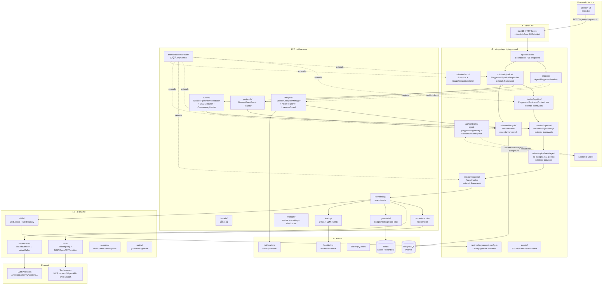

# Agent Playground 端到端业务推理 — 总分报告

**日期：** 2026-05-24
**范围：** 用户从前端"开始研究"触发 → 报告生成完成 / 失败，全链路覆盖 playground (L3) + harness (L2.5) + engine (L2) + infra (L1)
**方法：** 5 路并行 sub-agent 深度扫，每路一份专题报告 (~600-1100 行)，本文档是顶层总分
**总产出：** 5 份专题 + 本 SUMMARY + branch-coverage 共 ~5600 行

---

## 子报告索引

| 路  | 主题                       | 报告                                                           | 行数 |
| --- | -------------------------- | -------------------------------------------------------------- | ---- |
| 1   | HTTP / WebSocket 入口      | [01-http-entrypoint.md](./01-http-entrypoint.md)               | 593  |
| 2   | Pipeline 调度              | [02-pipeline-orchestration.md](./02-pipeline-orchestration.md) | 1024 |
| 3   | Agent / LLM 调用           | [03-agent-invocation.md](./03-agent-invocation.md)             | 1058 |
| 4   | Mission Lifecycle / 持久化 | [04-mission-lifecycle.md](./04-mission-lifecycle.md)           | 893  |
| 5   | 异常 / 韧性                | [05-exception-scenarios.md](./05-exception-scenarios.md)       | 1039 |
| -   | 分支覆盖矩阵               | [branch-coverage.md](./branch-coverage.md)                     | -    |

---

## 1. 顶层架构图（L1-L4 四层）



**关键关系说明**：

- L3 业务层只装"做什么"（业务规则 / 事件命名 / Stage 实现），不实现"怎么跑"
- L2.5 framework 通过抽象类被 L3 继承（business-team/dispatcher/invoker/bindings/orchestrator/lifecycle/rerun 等）
- L3 不得绕过 facade 直接 import L2.5 内部 — Wave 4 守护栏强制
- L2.5 不得反向 import L2 内部 ai-engine — 用 DI tokens 解耦
- L2 engine 完全 agent-unaware — 不知道有 mission / agent 概念

---

## 2. End-to-end 数据流（happy path）

```mermaid
sequenceDiagram
  autonumber
  actor User
  participant FE as Frontend
  participant Ctrl as RunController
  participant Disp as Dispatcher
  participant Shell as RuntimeShell
  participant Store as MissionStore
  participant Orch as PipelineOrchestrator
  participant Stage as Stage Handler
  participant Inv as AgentInvoker
  participant Loop as ReAct Loop
  participant LLM as LLM Provider
  participant Tool as Tool
  participant EventBus as DomainEventBus
  participant WS as Gateway
  participant Lifecycle as LifecycleManager

  User->>FE: 点"开始研究"
  FE->>Ctrl: POST /agent-playground/team/run<br/>(topic, depth, userProfile)
  Ctrl->>Ctrl: JwtAuthGuard + RateLimit + Zod validate
  Ctrl->>Disp: runMission(input)
  Disp->>Shell: openSession() — 冻结 typed configSnapshot
  Shell->>Store: createMission(running, configSnapshot)
  Store->>Store: Prisma insert + heartbeatAt = now()
  Disp-->>Ctrl: { missionId }
  Ctrl-->>FE: 200 { missionId }
  FE->>WS: join room playground:{missionId}

  Note over Disp,EventBus: 异步: Orchestrator 启动 13 step

  Disp->>Orch: registerPipeline(PLAYGROUND_PIPELINE) + run
  loop 每个 step
    Orch->>Stage: invoke handler(ctx, deps)
    Stage->>Inv: invoke(agentSpec, input)
    Inv->>Loop: enter ReAct loop
    loop ReAct turns ≤ MAX
      Loop->>LLM: chat(messages, tools, taskProfile)
      LLM-->>Loop: assistant + tool_use[]
      par parallel tools
        Loop->>Tool: execute(args)
        Tool-->>Loop: result
      end
      Loop->>Loop: decide continue | finalize | reject
    end
    Inv-->>Stage: result + token usage
    Stage->>EventBus: emit stage:lifecycle(completed)
    EventBus->>WS: broadcast playground:{missionId}
    WS-->>FE: socket event
    Stage->>Store: heartbeatAt update
  end

  Orch->>Disp: pipeline finished
  Disp->>Lifecycle: finalize(missionId, completed, output)
  Lifecycle->>Store: applyTerminalIfRunning(status='running' → 'completed')
  Store-->>Lifecycle: row 1 (success) | row 0 (already terminal)
  Lifecycle->>EventBus: emit mission:completed
  EventBus->>WS: broadcast
  WS-->>FE: completed event
  FE->>Ctrl: GET /mission/{id}/report
  Ctrl-->>FE: ReportArtifact
```

---

## 3. 跨路核心发现汇总（按严重度排序）

### 🔴 P0 — 真问题，影响生产

| #   | 现象                                                  | 出处                  | 影响                                                                                                                                                                                                                                                                                                                    |
| --- | ----------------------------------------------------- | --------------------- | ----------------------------------------------------------------------------------------------------------------------------------------------------------------------------------------------------------------------------------------------------------------------------------------------------------------------- |
| 1   | **Stage 单步无独立 timeout**                          | 路 2 §5 + 路 5 §10.2  | step 内部死循环只靠 mission liveness (5min stale + 4h wall) 兜底，最长可烧 4h                                                                                                                                                                                                                                           |
| 2   | **Liveness markFailed 不主动 abort in-flight signal** | 路 5 §10.3            | LivenessGuard 标 failed 后，in-flight LLM call 继续烧钱直到 ReAct loop 顶检测到 abort（最坏 1 turn）                                                                                                                                                                                                                    |
| 3   | **Rolling deploy 无 graceful shutdown**               | 路 5 §10.4            | `orchestrator_shutdown` reason 定义但 0 调用者，pod 升级时 in-flight mission 走 liveness 回收（≥5min）                                                                                                                                                                                                                  |
| 4   | **缺 PII / 敏感数据过滤**                             | 路 5 §10.6 + 路 3 §14 | `engine/safety/pii` 目录还没实现，prompt 含 PII 会直接进 LLM provider                                                                                                                                                                                                                                                   |
| 5   | **没有 MISSION_FAILED notification**                  | 路 5 §10.12           | NotificationType 枚举无 MISSION_FAILED，失败用户无 email 通知，只能靠 UI WS（UI 关了就不知道）                                                                                                                                                                                                                          |
| 6   | ~~**WS 不查 Redis blocklist**~~ ✅ 已修 (`b5bdca089`) | 路 1 §3               | gateway.extractUserId 验签后查 blocklist:user:<id>，被禁用户拒连                                                                                                                                                                                                                                                        |
| 7   | **运行时无 user-facing budget 告警**（修正版）        | 路 5 §10.5            | ⚠️ 原find "没有 80% 事件" 不准。实测: S1 pre-flight 有 `mission:budget-warning-soft/hard`；loop ≥70% 有 `budget_warning` agent 事件（内部 tier-downgrade + cost-tick 用）。**真缺口**: ≥70% 运行时告警未桥接成 user-facing mission 事件，长 mission 中途用户收不到。修法=hot-path event-relay 桥接，需 integration 验证 |

### 🟡 P1 — 实际差距，影响运维 / UX

| #   | 现象                                       | 出处                 | 影响                                                                                                    |
| --- | ------------------------------------------ | -------------------- | ------------------------------------------------------------------------------------------------------- |
| 8   | **RateLimit 是 in-memory 单 pod**          | 路 1 §3              | 实际限额 = pods × maxRequests，没用 DistributedRateLimitGuard                                           |
| 9   | **并发 mission 创建 race**                 | 路 1 §11             | `countRunningByUser` 不加锁，两 POST 可同过 3-mission 检查；DB 无唯一约束兜底                           |
| 10  | **mission 创建 row-missing 前端不可见**    | 路 4 §3              | openSession 失败仅返回 missionId，依赖前端 polling                                                      |
| 11  | **3 个前缀不一致**                         | 路 1 §6              | namespace `agent-playground` + room `playground:<id>` + event type `agent-playground.*`，前端订阅易写错 |
| 12  | **MissionEventBuffer 双调用模式**          | 路 1 §7              | controller cancel + module liveness 直接 `buffer.broadcast` 绕 registry/schema/throttle/idempotency     |
| 13  | **Prisma 长查询无 abort**                  | 路 5 §10.1           | abort signal 不能中断已发出的 DB query，cancel 后 DB 查询仍跑完                                         |
| 14  | **cascade aborted 仅 s11 终点回写 failed** | 路 5 §10.9           | 中间 stage 收到 abort 不主动 finalize，等终点 stage 才落终态                                            |
| 15  | **stage timeout 不杀 stage**               | 路 2 §5 + 路 5 §10.2 | `step.timeoutMs * 1.5` 只 emit `stage:stalled` 警告（设计如此，但 P0-1 加重该问题）                     |
| 16  | **RateLimit fail-open 无降级告警**         | 路 5 §10.11          | Redis 挂时 RateLimit 直接放行，没有告警                                                                 |

### 🟢 P2 — 文档 / 治理改进

| #   | 现象                                        | 出处             | 影响                                                                                                               |
| --- | ------------------------------------------- | ---------------- | ------------------------------------------------------------------------------------------------------------------ |
| 17  | LivenessGuard markFailed 失败短暂卡 running | 路 5 §10.8       | DB 写 failed 失败，下次 scan 再试，期间 mission status=running 误导前端                                            |
| 18  | FailureLearner 没有硬 count 阈值            | 路 5 §10.10      | failure pattern 表无 count >= N 触发预禁用的阈值                                                                   |
| 19  | LivenessGuard warn cooldown 跨 pod 重复     | 路 5 §10.13      | warn 节流是 in-process Map，多 pod 各自计 cooldown                                                                 |
| 20  | runtime/ 在三家 app 含义不一致              | P32 architect P1 | playground/radar thin config + adapter; social 塞了 mcp-client.service / publish-queue.service 等 stateful service |

---

## 4. Happy path 检查（5 路一致结论）

| 阶段                               | 路 1 | 路 2 | 路 3 | 路 4 | 路 5 | 一致？ |
| ---------------------------------- | ---- | ---- | ---- | ---- | ---- | ------ |
| 用户 POST → 创建 mission row       | ✅   | -    | -    | ✅   | -    | ✅     |
| 异步 dispatcher.runMission 启动    | ✅   | ✅   | -    | -    | -    | ✅     |
| Orchestrator 跑 13 step            | -    | ✅   | -    | -    | -    | ✅     |
| Stage 调 invoker + LLM + tool      | -    | ✅   | ✅   | -    | -    | ✅     |
| 事件 emit + WS broadcast           | ✅   | ✅   | -    | -    | -    | ✅     |
| heartbeat 上报                     | -    | -    | -    | ✅   | -    | ✅     |
| 终态 finalize (条件写)             | -    | ✅   | -    | ✅   | -    | ✅     |
| 用户收 completed event + 拉 report | ✅   | -    | -    | ✅   | -    | ✅     |

**结论**：Happy path 链路在 5 路之间叙述一致，无矛盾。

---

## 5. Framework 切片消费方现状（修自 P32 审计）

| 切片                       | LOC  | playground 继承 | social 继承 | radar 继承              | 评估                 |
| -------------------------- | ---- | --------------- | ----------- | ----------------------- | -------------------- |
| `invocation/`              | 155  | ✅              | ✅          | ❌ (无 invoker)         | 多消费方             |
| `dispatcher/`              | 192  | ✅              | ✅          | ❌ (radar 用单事件模型) | 多消费方             |
| `bindings/`                | 46   | ✅              | ❌          | ❌                      | ⚠️ 单消费方薄骨架    |
| `state/`                   | 81   | ✅              | ✅          | ✅                      | 多消费方             |
| `span/`                    | 178  | ✅              | ✅          | ❌                      | 多消费方             |
| `events/`                  | shim | ✅              | ✅          | ✅                      | 多消费方             |
| `helpers/` (P4)            | -    | ✅              | ❌          | ❌                      | ⚠️ 单消费方          |
| `rerun/` (P5)              | -    | ✅              | ❌          | ❌                      | ⚠️ 单消费方          |
| `lifecycle/` (P6) shell    | -    | ✅              | ✅          | ✅                      | shell 多消费方       |
| `lifecycle/` (P6) 7 helper | -    | ✅              | ❌          | ❌                      | ⚠️ 7 helper 单消费方 |
| `orchestrator/` (P7)       | -    | ✅              | ✅          | ✅                      | 多消费方             |

**单消费方债务 (4 项)**：`bindings/` + `helpers/` + `rerun/` + 7 个 `lifecycle/` helper —— 已在 roadmap 标注，不回滚（damage 已成）。

---

## 6. 业界对标 / 反向洞察命中点

路 3 §10 把 CLAUDE.md "Claude Code v2.1.88 反向洞察 10 条" 全部 trace 到 playground 代码具体命中位置，例如：

| 反向坑                                  | 路 3 §10 命中点                                                                          |
| --------------------------------------- | ---------------------------------------------------------------------------------------- |
| #1 `stop_reason === 'tool_use'` 不可靠  | `react-loop.ts:553-557` 已按"看 content 里有没有未执行 tool_use block"实现               |
| #4 API error 不跑 stop hook             | `react-loop.ts:1262-1264` 有 autocompact 断路器                                          |
| #5 MAX_CONSECUTIVE_FAILURES=3           | `MAX_FINALIZE_REJECTS=3` / `MAX_RECOVERABLE_RETRIES=3` / `TOOL_CIRCUIT_THRESHOLD=3` 三层 |
| #6 fallback 时 strip thinking signature | `react-loop.ts:925-929` 已实现                                                           |
| #7 pinnedEdits 字节级一致               | `DECISION_FC_SUFFIX = DECISION_SYSTEM_SUFFIX` 字节相等保证                               |
| #9 fallback 后 yield 配对 tool_result   | `react-loop.ts:984` 已实现                                                               |

详见 [03-agent-invocation.md §10](./03-agent-invocation.md)。

---

## 7. 整链验证结论

**整体评估**：playground 端到端业务链路 **基本正常**，5 路并发审计无发现"系统性 broken"。但存在 7 个 P0 实质问题（不会让现有 happy path 跑不通，但在边缘 / 异常 / 多 pod 场景下有可见的功能缺口或安全风险），需排入修复 backlog。

**修复优先级建议**：

1. **立即**：P0-#1（stage timeout 兜底）+ P0-#2（liveness markFailed 主动 abort）+ P0-#6（WS blocklist）— 都是小改动，闭环安全 / 韧性
2. **本季**：P0-#3（graceful shutdown）+ P0-#5（MISSION_FAILED notification）+ P0-#7（80% budget event）— 中等改动，提 UX
3. **专项**：P0-#4（PII filter）— 需独立 spec + implementation 路线
4. **下迭代**：所有 P1（RateLimit distributed / mission race / row-missing 前端可见 / 前缀统一）
5. **治理**：P2 文档 + cooldown 跨 pod 等

**与 Wave 4 守护栏的关系**：本次扫出的问题，**大部分不会被 Wave 4 (§8.2 layout + facade contract) 看护栏捕获**，因为它们是**运行时行为**而非**结构合规**。说明 Wave 4 只是"防住未来回归"，本次扫出来的是"既有存量债"，需要 follow-up code review 或专项修复来清。

---

## 8. 后续建议

1. 把本目录归档进 blueprint doc "实证报告" 章节
2. 7 个 P0 转 GitHub issue（每个独立追踪）
3. branch-coverage.md 中 100% 分支列表作为 "regression test backlog" — 后续补 spec 时按图索骥
4. 12 个月后重做一次端到端推理对比，看运行时债务清理进度

---

## 相关文档

- [agent-playground 边界 + 目录蓝图](../agent-playground-target-boundary-and-directory-blueprint-2026-05-24.md)
- [agent app 迁移路线图 v2](../../agent-app-mass-migration-roadmap-2026-05-24.md)
- [P32 4-way 审计汇总](../wave-4-review-2026-05-24/SUMMARY.md)
- [standards/23 business-team framework SOP](../../../../.claude/standards/23-business-team-framework-usage.md)

---

**报告生成时间**: 2026-05-24
**生成方式**: 5 路 general-purpose sub-agent 并发 + 主 agent 汇总
**总文档**: 5 专题 + 本 SUMMARY + branch-coverage 共 ~5600 行
