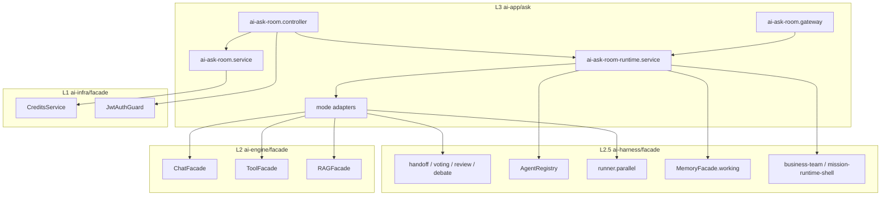
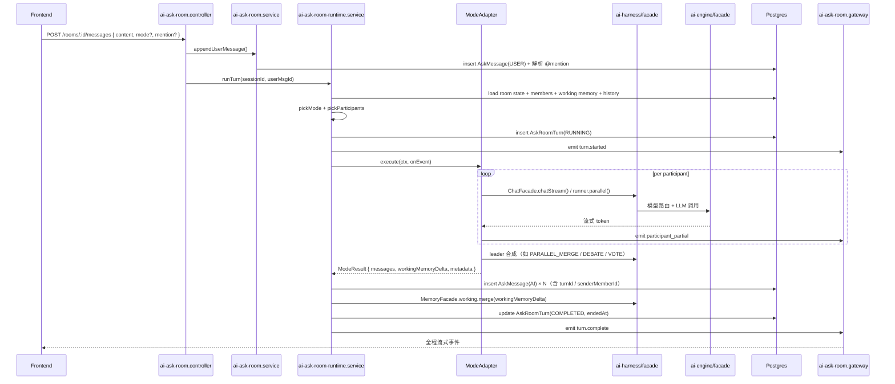

# AI Ask - Teams 模式设计方案

> 在 AI Ask 内引入「Teams 模式」：单会话内拉入多个 AI 成员，支持自由群聊 / 并行合并 / 辩论 / 投票 / 评审 / handoff，全部基于 ai-harness 与 ai-engine 既有能力。

**最后更新**：2026-05-08
**版本**：v0.2（集体评审收敛）
**状态**：待实施
**关联 ADR**：[004-ai-ask-teams-mode.md](../../../decisions/004-ai-ask-teams-mode.md)
**评审纪要**：[teams-mode-review.md](./teams-mode-review.md)
**对应代码区域**：`backend/src/modules/ai-app/ask/`、`backend/src/modules/ai-harness/`、`backend/src/modules/ai-engine/`

> v0.2 变更要点（vs v0.1）：所有 ID 改 `uuid()`；`triggerMessageId` / `parentMessageId` 补 FK；`AskRoomMember` 改软删 + 加 `memberType`；流式协议加 `sequenceNum` 与 `messageId` 生成时机；socket.io namespace 显式声明 `/ai-ask-room`；新增 `ProcessMemory` / `Review` 表迁移；工期 14d → 17.5d；PR1/PR2 串行依赖明示。

---

## 1. 背景与目标

### 1.1 现状

| 模块                | 角色                       | 入口                                                                   |
| ------------------- | -------------------------- | ---------------------------------------------------------------------- |
| `ai-app/ask`        | 1:1 单聊（多模型 / RAG）   | `AiAskService.sendMessage()`                                           |
| `ai-app/teams`      | mission/topic 重型多 Agent | `TeamMissionService` + `MissionExecutionService`                       |
| `ai-harness/teams`  | 协作 pattern 与 runtime    | `collaboration/patterns/{handoff,voting}` + `review` + `business-team` |
| `ai-harness/agents` | Agent 抽象与注册           | `AgentRegistry`                                                        |
| `ai-engine/facade`  | 模型 / 工具 / RAG          | `ChatFacade` / `ToolFacade` / `RAGFacade`                              |

AI Ask 当前已通过 `ai-harness/facade`（ChatFacade、ToolFacade、RAGFacade、MissionExecutorService、ProcessMemoryManagerService）调用底层能力，分层合规。

### 1.2 用户需求

> 当用户在 AI Ask 选择「Teams」时，能拉入多个 AI 一起群聊，支持多种协作模式，但建立在 Harness、Engine 基础之上。

### 1.3 设计目标

| 目标       | 说明                                                                                |
| ---------- | ----------------------------------------------------------------------------------- |
| **轻量**   | Ask 的"流畅对话"体验保持不变，群聊作为子模式，不引入 mission/topic 重模型           |
| **可复用** | 协作能力来自 ai-harness（patterns / agents / runner / memory），不在 ai-app 重写    |
| **可逃生** | 需要长时任务时一键升格 mission，由 harness `business-team` 框架接管                 |
| **零回归** | SOLO 模式（现有 Ask）行为不变，AskMessage 既有字段读取兼容                          |
| **合规**   | 单向依赖 L4 → L3 → L2.5 → L2，所有 harness/engine 调用经 facade，`verify:arch` 全绿 |

### 1.4 非目标

- 不替换或下线 `ai-app/teams`：mission 长任务、topic 协作仍走原有路径
- 不实现"AI 之间在用户离线时自主推进"：那是 mission 级，由升格逃生口承接
- 不做端到端的会议纪要 / 投票公告板等 PM 类功能：本期专注消息级群聊体验

---

## 2. 核心设计决策

| 决策                       | 选项                                                               | 选定                                                                                                 |
| -------------------------- | ------------------------------------------------------------------ | ---------------------------------------------------------------------------------------------------- |
| **与 ai-app/teams 的关系** | A. 轻量新建 / B. 下沉 teams / C. 共享层双消费                      | **A**：在 ai-app/ask 内新增 room 子能力，直接用 harness patterns；不引入 mission                     |
| **持久化模型**             | A. 扩展 AskSession + 新表 / B. 全新 AskRoomSession / C. 复用 Topic | **A**：扩展 AskSession 加 `mode` 字段 + 新增 `AskRoomMember` / `AskRoomTurn` 表                      |
| **编排粒度**               | 消息级 / 会话级 mission / 两种并存                                 | **消息级 + 房间级状态 + 升格 mission 逃生口**：默认消息级，用户可手动升格成 mission                  |
| **协作模式**               | freechat / parallel-merge / debate / vote / review / handoff       | **全部支持**，由 mode adapter 把 Ask 的 turn 翻译成 harness pattern                                  |
| **debate 归属**            | 留 ai-app/teams / 提到 ai-harness                                  | **提到 `ai-harness/teams/collaboration/debate`**：本期一并修复架构层级（详见 §9）                    |
| **流式协议**               | 复用 ai-teams.gateway / 新建                                       | **新建 `ai-ask-room.gateway.ts`**：socket.io，按 `ask-room:${sessionId}` 房间隔离，避免与 teams 互扰 |

---

## 3. 架构总览

### 3.1 分层定位

```
L3 ai-app/ask                                ★ 唯一改动模块
  ├─ ai-ask.service.ts                       现有 SOLO 单聊（不动）
  ├─ ai-ask-room.service.ts                  ★ 新增：room CRUD / 成员管理
  ├─ ai-ask-room-runtime.service.ts          ★ 新增：消息级 turn 编排
  ├─ ai-ask-room.controller.ts               ★ 新增：REST
  ├─ ai-ask-room.gateway.ts                  ★ 新增：WebSocket 流式
  ├─ adapters/                               ★ 新增：mode → harness pattern 适配
  │   ├─ freechat.adapter.ts
  │   ├─ parallel-merge.adapter.ts
  │   ├─ debate.adapter.ts
  │   ├─ vote.adapter.ts
  │   ├─ review.adapter.ts
  │   └─ handoff.adapter.ts
  └─ dto/                                    ★ 扩展

L2.5 ai-harness/facade                        复用，按需补 export
  ├─ teams/collaboration/patterns/handoff-pattern    既有
  ├─ teams/collaboration/patterns/voting-pattern     既有
  ├─ teams/collaboration/review/review-workflow      既有
  ├─ teams/collaboration/debate                      ★ 从 ai-app/teams 提层（见 §9）
  ├─ agents/registry                                  既有
  ├─ runner/                                          既有，用于并行 fanout
  ├─ memory/working                                   既有，房间共享黑板
  └─ business-team/mission-runtime-shell              既有，用于 mission 升格

L2 ai-engine/facade                           复用
  ├─ ChatFacade                              已在 Ask 用
  ├─ ToolFacade                              已在 Ask 用
  ├─ RAGFacade                               已在 Ask 用
  └─ TaskProfile / 模型路由                  已在 Ask 用
```

**强制约束**：

1. `ai-app/ask` 仅 import `ai-harness/facade` / `ai-engine/facade` / `ai-infra/facade`，禁止穿透内部路径
2. 缺失的 export 在对应 facade 的 `index.ts` 补充，不得绕过
3. 不允许 `ai-app/ask` 直接 import `ai-app/teams` 任意符号

### 3.2 模块拓扑（Mermaid）



---

## 4. 数据模型

### 4.1 Prisma Schema 变更

**保持 `AskSession` / `AskMessage` 既有字段全部不变**，仅追加。

> 评审收敛（R2）：所有 id 与现有 `AskSession`/`AskMessage` 一致用 `@default(uuid())`；`triggerMessageId` / `parentMessageId` 补 FK；`AskRoomMember` 改软删避免历史发言者信息丢失。

```prisma
// 既有，仅扩展字段
model AskSession {
  id            String   @id @default(uuid())
  userId        String
  title         String   @default("New Chat")
  summary       String?
  modelId       String?
  isBookmarked  Boolean  @default(false)
  createdAt     DateTime @default(now())
  updatedAt     DateTime @updatedAt

  // ★ 新增字段
  mode          AskSessionMode @default(SOLO)
  roomConfig    Json     @default("{}")  // { defaultMode, leaderModelId, autoMentionPolicy, maxParticipants, ... }

  messages      AskMessage[]
  members       AskRoomMember[]
  turns         AskRoomTurn[]
}

enum AskSessionMode {
  SOLO
  ROOM
}

// 既有，仅扩展字段
model AskMessage {
  id            String   @id @default(uuid())
  sessionId     String
  role          String   // "user" | "assistant" | "system"
  content       String   @db.Text
  modelId       String?
  modelName     String?
  tokens        Int      @default(0)
  webSearch     Boolean  @default(false)
  createdAt     DateTime @default(now())

  // ★ 新增字段
  senderType    AskSenderType @default(USER)
  senderMemberId String?       // -> AskRoomMember.id（AI 时填；成员软删后保留 id 不变）
  mentionedMemberIds String[]  @default([])
  turnId        String?        // -> AskRoomTurn.id
  parentMessageId String?      // 辩论 / handoff 链路（自引用）
  sequenceNum    Int?          // 房间内单调递增；流式排序用

  session       AskSession @relation(fields: [sessionId], references: [id], onDelete: Cascade)
  senderMember  AskRoomMember? @relation(fields: [senderMemberId], references: [id], onDelete: SetNull)
  turn          AskRoomTurn?   @relation(fields: [turnId], references: [id], onDelete: SetNull)
  parent        AskMessage?    @relation(name: "ask_msg_replies", fields: [parentMessageId], references: [id], onDelete: SetNull)
  replies       AskMessage[]   @relation(name: "ask_msg_replies")

  @@index([sessionId, createdAt])
  @@index([sessionId, sequenceNum])
  @@index([turnId])
  // ★ mentionedMemberIds 用 GIN 索引（迁移 SQL 中 CREATE INDEX CONCURRENTLY）
}

enum AskSenderType {
  USER
  AI
  SYSTEM
}

// ★ 新表：房间成员（一个 AI = 一行）；软删，不允许硬删除单成员
model AskRoomMember {
  id            String   @id @default(uuid())
  sessionId     String
  memberType    AskRoomMemberType @default(VIRTUAL)  // R1: 区分已注册 agent / 虚拟成员
  agentId       String?   // memberType=REGISTERED 时为 harness AgentRegistry id；VIRTUAL 时 null
  modelId       String   // ai-engine 模型 id
  displayName   String
  role          AskRoomMemberRole @default(MEMBER)
  systemPrompt  String?  @db.Text
  persona       Json?     // { tone, expertise, constraints }; ≤ 2KB
  order         Int      @default(0)
  enabled       Boolean  @default(true)
  deletedAt     DateTime?  // 软删；查询默认过滤
  createdAt     DateTime @default(now())
  updatedAt     DateTime @updatedAt

  session       AskSession @relation(fields: [sessionId], references: [id], onDelete: Cascade)
  messages      AskMessage[]

  @@index([sessionId, order])
  @@index([sessionId, deletedAt])
}

enum AskRoomMemberRole {
  LEADER
  MEMBER
}

enum AskRoomMemberType {
  REGISTERED  // 已注册的 harness agent
  VIRTUAL     // 用户即兴选 model + persona 构造的虚拟成员
}

// ★ 新表：每次用户消息触发的一次编排
model AskRoomTurn {
  id              String   @id @default(uuid())
  sessionId       String
  triggerMessageId String  @unique  // 触发该 turn 的用户消息（一条消息最多一个 turn）
  mode            AskRoomMode
  status          AskTurnStatus @default(PENDING)
  participantIds  String[]  // 实际参与的 AskRoomMember.id 快照
  partialDeltas   Json?     // 流式过程的 sequenceNum → deltaText 累积，断线重连补差用
  metadata        Json?     // mode 配置、调度细节、错误信息
  startedAt       DateTime  @default(now())
  endedAt         DateTime?

  session         AskSession  @relation(fields: [sessionId], references: [id], onDelete: Cascade)
  trigger         AskMessage  @relation(fields: [triggerMessageId], references: [id], onDelete: Restrict)
  messages        AskMessage[]

  @@index([sessionId, startedAt])
}

enum AskRoomMode {
  FREECHAT
  PARALLEL_MERGE
  DEBATE
  VOTE
  REVIEW
  HANDOFF
}

enum AskTurnStatus {
  PENDING
  RUNNING
  COMPLETED
  FAILED
  CANCELLED
}
```

### 4.2 迁移脚本

按项目规范使用**手写 SQL**，不用 `prisma migrate dev`：

```
backend/prisma/migrations/20260508d_add_ask_room_tables/migration.sql
backend/prisma/migrations/20260508e_add_process_memory/migration.sql   # P1-13
backend/prisma/migrations/20260508f_add_review_tables/migration.sql    # P1-14（W4 初）
```

> 评审收敛（R2/R3）：(a) 命名顺延 `20260508d` 因为今天已有 `20260508a/b/c`；(b) 同步建 `ProcessMemory` 表（解锁房间共享黑板）；(c) `Review` / `ReviewFeedback` 表延到 W4 初再建（不阻断 W2/W3）。

要点：

1. 所有 `ALTER TABLE ... ADD COLUMN` 必须给 `DEFAULT`，避免锁表
2. enum 用 `CREATE TYPE` + `ALTER TYPE ADD VALUE IF NOT EXISTS`，**不**包 `DO $$ EXCEPTION`（项目规范）
3. 创建索引用 `CREATE INDEX CONCURRENTLY` 减少锁
4. `mentionedMemberIds` 用 GIN 索引：`CREATE INDEX CONCURRENTLY ask_messages_mentioned_members_gin_idx ON ask_messages USING GIN (mentioned_member_ids);`
5. `roomConfig` CHECK：`ALTER TABLE ask_sessions ADD CONSTRAINT room_config_max_participants_chk CHECK (room_config IS NULL OR (room_config->>'maxParticipants')::int <= 8);`
6. 旧数据 `mode` 默认 `SOLO`，`roomConfig` 默认 `'{}'`，行为完全等价
7. ESLint 与 `verify:arch` 同步更新（PR1 内）：`backend/.eslintrc.js` 加 `ai-harness/teams/collaboration/debate` 路径，`layer-boundaries.spec.ts` 补 assertion

### 4.3 状态机

```
AskRoomTurn 状态机：

PENDING ──(runtime.run)──> RUNNING ──(adapter.complete)──> COMPLETED
   │                          │
   │                          ├──(adapter.error)──> FAILED
   │                          │
   │                          └──(user.cancel / signal abort)──> CANCELLED
   └──(creation failed)──> FAILED
```

---

## 5. 协作模式（mode → harness pattern 映射）

每个模式实现为 `IModeAdapter`，输入是 turn 上下文，输出是流式事件 + 落库消息。

### 5.1 适配器接口

```ts
// adapters/mode.adapter.interface.ts
export interface ModeContext {
  session: AskSession;
  members: AskRoomMember[];
  triggerMessage: AskMessage;
  history: AskMessage[]; // 最近 N 条
  workingMemory: JsonObject; // harness MemoryFacade.working 取出
  signal: AbortSignal;
}

export interface ModeEvent {
  type:
    | "participant_thinking"
    | "participant_partial"
    | "participant_done"
    | "round_start"
    | "round_end"
    | "vote_open"
    | "vote_cast"
    | "vote_closed"
    | "handoff_request"
    | "handoff_accepted"
    | "handoff_rejected"
    | "leader_synthesis_start"
    | "leader_synthesis_done"
    | "turn_complete";
  // 各 type 对应 payload，详见类型定义
}

export interface ModeResult {
  messages: PendingMessage[]; // 待落库的 AskMessage
  workingMemoryDelta?: JsonObject; // 写回房间共享黑板
  metadata: JsonObject; // 写入 AskRoomTurn.metadata
}

export interface IModeAdapter {
  readonly mode: AskRoomMode;
  execute(
    ctx: ModeContext,
    onEvent: (e: ModeEvent) => void,
  ): Promise<ModeResult>;
}
```

### 5.2 各模式行为

| Mode             | harness 入口                                                     | 内部行为                                                                                                                                                                            |
| ---------------- | ---------------------------------------------------------------- | ----------------------------------------------------------------------------------------------------------------------------------------------------------------------------------- |
| `FREECHAT`       | 自定义路由器 + `ChatFacade.chatStream`（每个被命中成员一次）     | 解析 `mentionedMemberIds`：命中 → 那些成员各回一条；未命中 → leader 用 `taskProfile: { creativity: 'low', outputLength: 'minimal' }` 决定让谁回（fan-out 选择器，输出成员 id 列表） |
| `PARALLEL_MERGE` | `runner.parallel` + 每成员 `ChatFacade.chatStream` + leader 合成 | 所有 enabled 成员并行各跑一次；全部完成后 leader 用 `creativity: 'medium', outputLength: 'long'` 把 N 份答案合成一份"综合答"；产出 N+1 条消息（N 成员 + 1 leader 合成）             |
| `DEBATE`         | `ai-harness/teams/collaboration/debate`（提层后）                | 多轮交锋；每轮成员看到上一轮全文；可配置 `rounds`（默认 3）；leader 在末轮做总结陈词；turn 内事件流 `round_start` / `round_end` 让前端按轮渲染                                      |
| `VOTE`           | `voting-pattern` + 各成员 `ChatFacade.chat`（投票理由）          | leader 提出选项（也可用户在消息中给出 `options`）→ 各成员调用 `castVote()` + 简短理由 → `closeVote()` 计票 → 输出结论消息                                                           |
| `REVIEW`         | `review-workflow.service` + 主答者 + 评审者                      | 主答者出稿 → 评审者批注（多人并行）→ 主答者修订一轮 → 输出终稿；至少 1 主答 + 1 评审                                                                                                |
| `HANDOFF`        | `handoff-pattern.HandoffCoordinator` + 起始 agent + 后继 agent   | 起始 agent 不能解决时按 prompt 声明把任务交给后继 agent；最大深度 5（`HandoffCoordinator` 已实现）；前端展示 handoff 链                                                             |

### 5.3 模式选择器

优先级（从高到低）：

1. **用户显式命令**：消息开头 `/mode debate`、`/mode vote`、`/mode parallel`、`/mode review`、`/mode handoff`、`/mode freechat`
2. **roomConfig.defaultMode**：用户在房间设置中预设
3. **启发式**（轻量规则，仅当 1、2 都未指定时）：
   - 消息含 `@xxx` → `FREECHAT`
   - 消息含「对比 / 比较 / 各自 / 多角度」→ `PARALLEL_MERGE`
   - 消息以 `?` 结尾且 < 50 字 → `FREECHAT`
   - 否则 → `roomConfig.defaultMode || FREECHAT`

启发式仅作软引导，前端在消息发送前展示"将以 X 模式回答（点击切换）"，避免黑盒。

### 5.4 参与者选择

- **FREECHAT**：mention 命中的成员；未命中时由 leader 选 1~3 名（fan-out selector 输出 ids）
- **PARALLEL_MERGE / DEBATE**：全部 `enabled` 且 `deletedAt IS NULL` 成员
- **VOTE**：全部 `enabled` 成员（leader 不投票，仅主持）
- **REVIEW**：用户在消息中或 roomConfig 指定 `authorMemberId` 与 `reviewerIds`，否则 leader = author，其余 = reviewers
- **HANDOFF**：用户消息或 leader 选定 `startMemberId`，handoff 链由 agent 自身决定

### 5.5 虚拟成员（VIRTUAL）调用流程

> 评审收敛（R1）：成员可能是已注册 agent，也可能是用户即兴选模型 + persona 构造的"虚拟成员"。adapter 必须分流。

```
adapter 内部统一入口 callMember(member, prompt, ctx):
  if member.memberType === REGISTERED:
      agent = AgentRegistry.get(member.agentId)
      return agent.invoke(prompt, ctx)        // 走完整 agent 生命周期
  else  // VIRTUAL
      return ChatFacade.chat({                // 直接走模型，不走 AgentRegistry
        model: member.modelId,
        messages: [
          { role: "system", content: composeSystemPrompt(member.systemPrompt, member.persona) },
          ...ctx.history,
          { role: "user", content: prompt }
        ],
        taskProfile: { creativity: "medium", outputLength: "standard" },
        billing: { ...ctx.billing, referenceId: ctx.turnId }
      })
```

虚拟成员的 `agentId` 字段为 null；`composeSystemPrompt` 把 persona 的 tone/expertise/constraints 拼成结构化 prompt 段，**不**做模板字符串拼接（防 prompt 注入）。

### 5.6 Leader Synthesis Spec

> 评审收敛（R1）：PARALLEL_MERGE / DEBATE / VOTE 末尾的 leader 合成不能黑盒，需有明文规范。

**模板骨架**（所有 leader 合成共用，按 mode 填变量）：

```
SYSTEM:
你是 {leaderDisplayName}，正在主持一场多 AI 协作。本轮模式：{mode}。
任务：基于下方 N 位成员的回答，输出一份综合答复。

约束（不可违反）：
1. 不得改变成员陈述的客观事实；如成员说法冲突，列出分歧并标注来源成员。
2. 不得引入成员未提及的新事实。
3. 用户问题：{userQuestion}
4. 输出语言匹配用户问题。

USER:
[member-1 / displayName=...] 的回答：
...

[member-2 / ...] 的回答：
...
```

| Mode           | creativity | outputLength | 额外约束                                     |
| -------------- | ---------- | ------------ | -------------------------------------------- |
| PARALLEL_MERGE | medium     | long         | 强调"综合多视角"，列出共识与分歧             |
| DEBATE         | medium     | long         | 仅做"陈述总结"，不裁判；末段给观点光谱       |
| VOTE           | low        | medium       | 输出"决议 + 票数 + 理由摘要"，不夹带个人立场 |

**Billing**：合成调用作为第 N+1 次 chat 计入 `BillingContext.run(...)`，与成员调用同一 turn referenceId，前端预扣展示 `baseCost × (N+1)`。

---

## 6. 一次 turn 的执行链路

### 6.1 时序图



### 6.0 协议定位（评审收敛）

**ROOM 模式是新流式协议**（基于 socket.io），SOLO 模式继续用现有的 fetch + JSON 同步返回，不改动。前端按 `AskSession.mode` 切两套数据流。

### 6.2 流式事件协议

- **socket.io namespace**：`/ai-ask-room`（独立于现有 `/ai-teams`，避免命名冲突）
- **房间 join key**：`ask-room:${sessionId}`，gateway 在 `handleConnection` 解析 JWT，校验 session 归属后才允许 join
- **messageId 生成时机**：每个 participant 进入流式输出前，adapter 在内存中 `uuid()` 生成 messageId，从 `participant.thinking` 起所有事件都携带；`participant.done` 时按该 id 落库（前端用 messageId 判断"新建气泡"vs"追加")
- **sequenceNum**：服务端在 turn 内单调递增（房间维度），所有事件都带；前端按 sequenceNum 排序，**不**用 `createdAt`（避免乱序）
- **partial 累积**：每次 `participant.partial` 同时写入 `AskRoomTurn.partialDeltas[messageId][sequenceNum] = deltaText`，断线重连可调 `GET /turns/:tid/partial-log?since=:seq` 拉差量

```ts
// 服务端 → 客户端（所有事件都带 turnId + sequenceNum）
type AskRoomServerEvent = { turnId: string; sequenceNum: number } & (
  | { kind: "turn.started"; mode: AskRoomMode; participantIds: string[] }
  | { kind: "participant.thinking"; memberId: string; messageId: string }
  | {
      kind: "participant.partial";
      memberId: string;
      messageId: string;
      deltaText: string;
    }
  | {
      kind: "participant.done";
      memberId: string;
      messageId: string;
      tokensUsed: number;
    }
  | { kind: "round.start"; round: number } // DEBATE
  | { kind: "round.end"; round: number } // DEBATE
  | { kind: "vote.open"; voteId: string; options: VoteOption[] }
  | {
      kind: "vote.cast";
      voteId: string;
      voterMemberId: string;
      optionId: string;
    }
  | { kind: "vote.closed"; voteId: string; result: VoteResult }
  | { kind: "handoff.request"; from: string; to: string }
  | { kind: "handoff.accepted" | "handoff.rejected"; from: string; to: string }
  | { kind: "leader.synthesis.started" }
  | { kind: "leader.synthesis.done"; messageId: string }
  | { kind: "turn.complete"; status: "COMPLETED" | "FAILED" | "CANCELLED" }
  | { kind: "turn.error"; error: string }
);

// 客户端 → 服务端
type AskRoomClientEvent =
  | { kind: "turn.cancel"; turnId: string }
  | { kind: "turn.subscribe"; turnId: string; resumeFromSeq?: number };
```

**前后端类型契约**：定义于 `backend/src/modules/ai-app/ask/gateway/types.ts`，前端通过 path alias 直接 import；W2 收尾必须有 1 条契约 unit 测试，覆盖事件结构稳定性。

### 6.3 中断与可恢复性

- **取消**：`POST /rooms/:id/turns/:tid/cancel` → runtime 触发 `AbortController.abort()` → harness runner 收到 signal 终止 LLM 流；已 partial 的消息标 `metadata.partial = true` 落库；turn → `CANCELLED`
- **失败**：单个 participant 失败不阻断其他 participant（PARALLEL_MERGE / DEBATE 内部容错）；全部失败或 leader 合成失败 → turn → `FAILED`，metadata 记录已完成 participant 列表
- **重试**：前端可调 `POST /rooms/:id/turns/:tid/retry`：复用 triggerMessageId、mode、participants 重新跑；旧 turn 标 `metadata.supersededBy = newTurnId`
- **断线重连**：客户端记最后一个 `sequenceNum`，重连用 `turn.subscribe { turnId, resumeFromSeq }` 上报；gateway 从 `AskRoomTurn.partialDeltas` 读 `> resumeFromSeq` 的事件补发；若 turn 已 COMPLETED 则直接发 `turn.complete`；若 5s 内重连失败，前端降级为只展示最终消息（不演 partial）。前端可备用 `GET /rooms/:id/turns/:tid/partial-log?since=:seq` 主动拉差量。

---

## 7. mission 升格逃生口

回应"消息级是否能完成基本任务"的关切。**消息级在 turn 内部支持任意 harness pattern，覆盖 ≥ 95% 的常见任务**。剩余 5%（用户离线时 AI 自主推进、跨多日的长任务）由 mission 升格承接。

### 7.1 触发

UI：turn 详情面板右上「转交团队长任务」按钮；或 API：

```
POST /api/ai-ask/rooms/:id/promote-to-mission
{
  "fromTurnId": "...",          // 从该 turn 上下文起
  "goal": "用户填写的目标描述",
  "deadline": "2026-05-15T...",  // 可选
  "constraints": { ... }         // 可选
}
```

### 7.2 内部流程

1. 复制当前房间状态（成员、roomConfig、最近 history）作为 mission 输入
2. 调 `business-team/mission-runtime-shell.framework` 启动 mission（harness 既有）
3. mission 在后台跑（独立进程模型，不占 Ask socket）
4. mission 输出事件经 `business-team/relay/event-relay.framework` 推回 `ask-room:${sessionId}`，作为 `senderType=SYSTEM` 的特殊 AskMessage（携带 sequenceNum，**不**用 createdAt 排序）
5. mission 完成 → 输出落到房间为一条结尾 SYSTEM 消息（含产物链接）
6. 用户继续在原房间提问，下一个 turn 可读取 mission 产物作为上下文

### 7.3 AskRoomMember → TeamMember 映射

> 评审收敛（R1）：升格时 Ask 域 entity 投影成 harness 域 entity 的规则。

| Ask 域字段                       | Mission 域字段（harness `ITeamMember`）  | 备注                                        |
| -------------------------------- | ---------------------------------------- | ------------------------------------------- |
| `AskRoomMember.id`               | `TeamMember.externalRef`                 | 跨域引用，保留 Ask 端可追溯                 |
| `displayName`                    | `TeamMember.displayName`                 |                                             |
| `memberType=REGISTERED, agentId` | `TeamMember.agentId`                     | 直接复用                                    |
| `memberType=VIRTUAL`             | `TeamMember.agent = VirtualAgentAdapter` | 投影成 harness 适配器，封装 ChatFacade.chat |
| `role=LEADER`                    | `TeamMember.role = leader`               |                                             |
| `systemPrompt + persona`         | `TeamMember.systemPrompt`（编译后）      | 沿用 §5.5 `composeSystemPrompt`             |
| `modelId`                        | `TeamMember.modelHint`                   | 由 mission planner 传入路由                 |

### 7.4 幂等性

同一 `triggerMessageId` 升格请求最多创建一个 mission。DB 层加 unique 约束：

```sql
CREATE UNIQUE INDEX promote_to_mission_unique_per_turn
  ON ask_room_promotions (turn_id);
```

重复请求返回既有 missionId，不再创建新 mission。

### 7.3 边界

- **本期不做**：mission 中途与房间双向同步、用户中断 mission、mission 内的成员改组
- 仅做"开火 + 单向回灌产物"，复杂场景仍走 `agent-playground` 入口

---

## 8. API 设计

### 8.0 持久化与列表合流（评审收敛 / 用户提醒）

**ROOM 与 SOLO 共用 `AskSession` 表与既有会话列表 API**，不分流：

| 操作                           | 端点                                                | SOLO | ROOM                                  |
| ------------------------------ | --------------------------------------------------- | ---- | ------------------------------------- |
| 会话列表（侧边栏）             | `GET /api/ai-ask/sessions`                          | ✓    | ✓ 同表                                |
| 会话详情 + 历史消息            | `GET /api/ai-ask/sessions/:id`                      | ✓    | ✓ mode=ROOM 时附 members + 最近 turns |
| 删除会话                       | `DELETE /api/ai-ask/sessions/:id`                   | ✓    | ✓ cascade 到 AskRoomMember/Turn       |
| 重命名 / 收藏                  | `PATCH /api/ai-ask/sessions/:id`                    | ✓    | ✓                                     |
| 用户消息（SOLO 单聊）          | `POST /api/ai-ask/sessions/:id/messages`            | ✓    | — 仅 SOLO                             |
| 创建房间 / 升级会话            | `POST /api/ai-ask/rooms`                            | —    | ✓                                     |
| 房间专属操作（成员/turn/升格） | `POST /api/ai-ask/rooms/:id/{members,messages,...}` | —    | ✓                                     |

**意图说明**：用户在前端看到的会话历史是统一的——SOLO 与 ROOM 按 `updatedAt` 混排，前端按 `mode` 字段渲染图标区分（SOLO = 单 AI 头像；ROOM = 成员头像组）。**前端不应该有"我的房间"的独立 tab**——房间就是一种带成员的会话。`/rooms` 路径仅承载 SOLO 没有的专属操作（成员管理、turn 编排、mission 升格）。

### 8.1 REST

全部以 `/api/ai-ask` 为前缀，新增以 `/rooms` 为子前缀。

| 方法     | 路径                                       | 说明                                       |
| -------- | ------------------------------------------ | ------------------------------------------ |
| `POST`   | `/api/ai-ask/rooms`                        | 创建 room（或基于 SOLO session 升级）      |
| `GET`    | `/api/ai-ask/rooms/:id`                    | 房间详情（含成员、roomConfig）             |
| `PATCH`  | `/api/ai-ask/rooms/:id`                    | 更新 roomConfig                            |
| `DELETE` | `/api/ai-ask/rooms/:id`                    | 删除（继承 AskSession 的 cascade）         |
| `POST`   | `/api/ai-ask/rooms/:id/members`            | 添加 AI 成员                               |
| `PATCH`  | `/api/ai-ask/rooms/:id/members/:mid`       | 更新成员（启停 / persona / role）          |
| `DELETE` | `/api/ai-ask/rooms/:id/members/:mid`       | 移除成员                                   |
| `POST`   | `/api/ai-ask/rooms/:id/messages`           | 用户发消息，立即返回 turnId，结果走 socket |
| `GET`    | `/api/ai-ask/rooms/:id/turns/:tid`         | 查询 turn 当前状态                         |
| `POST`   | `/api/ai-ask/rooms/:id/turns/:tid/cancel`  | 取消 turn                                  |
| `POST`   | `/api/ai-ask/rooms/:id/turns/:tid/retry`   | 重跑 turn                                  |
| `POST`   | `/api/ai-ask/rooms/:id/promote-to-mission` | 升格成 mission                             |

### 8.2 关键 DTO

```ts
// dto/create-room.dto.ts
export class CreateRoomDto {
  @IsOptional() @IsString() title?: string;
  @IsOptional() @IsString() fromSessionId?: string; // 从已有 SOLO 升级
  @IsOptional() @IsObject() roomConfig?: RoomConfigDto;
  @IsOptional()
  @ValidateNested({ each: true })
  @Type(() => InitialMemberDto)
  initialMembers?: InitialMemberDto[];
}

export class RoomConfigDto {
  @IsOptional() @IsEnum(AskRoomMode) defaultMode?: AskRoomMode;
  @IsOptional() @IsString() leaderModelId?: string;
  @IsOptional() @IsInt() @Min(1) @Max(8) maxParticipants?: number;
  @IsOptional()
  @IsEnum(AutoMentionPolicy)
  autoMentionPolicy?: AutoMentionPolicy;
  @IsOptional() @IsInt() @Min(1) @Max(5) debateRounds?: number;
}

// dto/send-room-message.dto.ts
export class SendRoomMessageDto {
  @IsString() @MaxLength(20000) content!: string;
  @IsOptional() @IsEnum(AskRoomMode) mode?: AskRoomMode;
  @IsOptional()
  @IsArray()
  @ArrayMaxSize(8)
  @IsString({ each: true })
  mentionedMemberIds?: string[];
  @IsOptional() @IsArray() knowledgeBaseIds?: string[]; // 复用 Ask RAG
  @IsOptional() @IsBoolean() enableTools?: boolean; // 复用 Ask 工具
  @IsOptional() @IsObject() modeOptions?: ModeOptionsDto; // vote 选项 / review 角色等
}
```

### 8.3 鉴权

- 所有 controller `@UseGuards(JwtAuthGuard)`
- service 内部所有 query 都按 `userId` 过滤
- gateway 在 `handleConnection` 解析 JWT，`socket.join(`ask-room:${sessionId}`)` 前校验 session 归属
- `senderMemberId` / `mentionedMemberIds` 必须属于 `sessionId`，否则 400（防越权造消息）

---

## 9. 架构修复：debate 提到 ai-harness

### 9.1 问题

`ai-app/teams/services/collaboration/debate.service.ts` 是通用协作 pattern，与 `ai-harness/teams/collaboration/patterns/{handoff,voting}-pattern.ts` 同级，但被错误放在 ai-app 层。这违反 `ai-app 之间极少直接依赖` 原则——若 Ask Room 直接 inject `ai-app/teams` 的 DebateService，会建立 `ai-app/ask → ai-app/teams` 横向依赖。

### 9.2 方案

把 debate 抽到 `ai-harness/teams/collaboration/debate/`：

```
ai-harness/teams/collaboration/
├─ patterns/
│   ├─ handoff-pattern.ts       既有
│   └─ voting-pattern.ts        既有
├─ review/
│   └─ review-workflow.service  既有
└─ debate/                      ★ 新增
    ├─ index.ts
    ├─ debate.service.ts        从 ai-app/teams 移过来
    ├─ debate.interface.ts
    └─ __tests__/
```

`ai-app/teams` 改为通过 `ai-harness/facade` 引用 DebateService，外部行为不变。

### 9.3 工作量

约 1 工程日，作为本特性的前置 PR（W1 内）单独提：

- 移动文件 + 修复 import
- 在 `ai-harness/facade/index.ts` 补 export
- 跑通 ai-app/teams 既有 debate spec 0 失败
- 跑通 `verify:arch`

---

## 10. 前端改动

### 10.1 路由与页面

```
frontend/app/ai-ask/
├─ page.tsx                       现有（不动）
└─ [sessionId]/page.tsx           ★ 改：根据 mode 字段切换 SOLO/ROOM 视图
```

不新增独立路由，避免会话列表分流。

### 10.2 组件

```
frontend/components/ai-ask/
├─ ChatComposer.tsx               ★ 改：加 @-mention picker + /mode 命令解析
├─ MessageList.tsx                ★ 改：按 senderType/senderMemberId 渲染气泡（颜色 / avatar）
├─ ModeBadge.tsx                  ★ 新：消息列上方显示当前 turn mode
├─ RoomPanel.tsx                  ★ 新：右侧抽屉，成员管理 + roomConfig
├─ TurnTimeline.tsx               ★ 新：DEBATE/PARALLEL_MERGE 时显示参与者并行进度
├─ ModeSelector.tsx               ★ 新：模式切换器（与 /mode 命令等价）
├─ VotePanel.tsx                  ★ 新：VOTE 模式下显示选项与投票实况
├─ ReviewLane.tsx                 ★ 新：REVIEW 模式下分稿/批注/终稿三栏
└─ HandoffChain.tsx               ★ 新：HANDOFF 模式下显示交接链路
```

### 10.3 hooks / store

```
frontend/hooks/domain/
├─ useAskSession.ts               现有
├─ useAskRoom.ts                  ★ 新：room CRUD + members + socket 订阅
├─ useAskRoomTurn.ts              ★ 新：当前 turn 流式状态
└─ useAskRoomEvents.ts            ★ 新：socket.io 房间事件订阅

frontend/stores/
└─ ask-room.store.ts              ★ 新：room state + per-member streaming buffers
```

### 10.4 视觉

- 会话列表中 ROOM 会话加成员头像组角标，区分 SOLO/ROOM
- 不新增页面，不分流入口

---

## 11. 安全与配额

| 维度            | 措施                                                                                                 |
| --------------- | ---------------------------------------------------------------------------------------------------- |
| **越权**        | controller `@UseGuards(JwtAuthGuard)`；service 全部按 `userId` 过滤；socket join 前校验 session 归属 |
| **成员上限**    | `roomConfig.maxParticipants ≤ 8`（debate 经验值，再多 leader 合成质量下降）                          |
| **消息长度**    | `content ≤ 20000` 字符（沿用 Ask `sanitizeMessageContent` 规则）                                     |
| **预算**        | `BillingContext.run({ moduleType: "ai-ask", operationType: "room-${mode}" })`；turn 内 N 次调用累加  |
| **预扣**        | 前端发送前展示估算积分（`baseCost × participantCount + leaderCost`），用户确认后执行                 |
| **速率限制**    | harness `guardrails/rate-limit` + `concurrency`：单房间并发 turn = 1（用户须等 turn 完才能再发）     |
| **prompt 注入** | `mentionedMemberIds` 在 controller 层用结构化字段解析，不直接拼进 system prompt                      |
| **persona**     | `persona` JSON 大小 ≤ 2KB；不在日志打印完整 systemPrompt                                             |
| **图片清理**    | 复用 Ask `sanitizeMessageContent` 移除 base64 图片                                                   |
| **PII**         | 复用 ai-engine `safety/pii` 在出库前扫描（与 SOLO 模式一致）                                         |

---

## 12. 测试计划

### 12.1 单元测试

| 模块                          | 用例覆盖                                                 |
| ----------------------------- | -------------------------------------------------------- |
| `freechat.adapter`            | mention 命中 / 未命中走 leader 选择 / 全部沉默           |
| `parallel-merge.adapter`      | N 成员并行 / 单成员失败不阻断 / leader 合成失败 fallback |
| `debate.adapter`              | 多轮交锋 / 提前收敛 / 中断保存                           |
| `vote.adapter`                | majority / unanimous / weighted / 平票处理               |
| `review.adapter`              | 主答 + 评审并行 + 修订一轮                               |
| `handoff.adapter`             | 接受 / 拒绝 + 备选 / 深度 5 截止                         |
| `ai-ask-room-runtime.service` | mode 选择优先级 / participants 选择 / 取消 / 重试        |
| `ai-ask-room.service`         | 创建 / 升级 SOLO / 成员上限 / 越权过滤                   |
| `ai-ask-room.gateway`         | join 鉴权 / 事件分发 / 断线                              |

目标：每个 adapter ≥ 90% 行覆盖；service ≥ 85%。

### 12.2 集成测试

- `ai-ask-room.spec` 端到端跑完 1 个 PARALLEL_MERGE turn（3 个 mock 成员 + leader 合成）→ 校验落库的 N+1 条 AskMessage 与 1 条 AskRoomTurn(COMPLETED)
- mission 升格 → 回灌 SYSTEM 消息

### 12.3 E2E（Playwright）

`e2e/ai-ask-room/`：

- `create-room.spec`：从 SOLO 升级 → 加 2 个成员 → 发问 → 收到 2 条流式回复
- `mode-debate.spec`：3 个成员 / 2 轮辩论 → leader 总结 → ≤ 30s
- `mode-vote.spec`：4 个成员投票 → consensus 显示
- `mode-review.spec`：主答 + 2 评审 → 终稿
- `cancel-turn.spec`：发问 → 1 秒内取消 → AskRoomTurn=CANCELLED

### 12.4 性能基线

| 场景                                   | p50    | p95    |
| -------------------------------------- | ------ | ------ |
| FREECHAT（1 成员）                     | ≤ 3 s  | ≤ 6 s  |
| PARALLEL_MERGE（4 成员 + leader 合成） | ≤ 8 s  | ≤ 12 s |
| DEBATE（3 成员 / 2 轮）                | ≤ 12 s | ≤ 20 s |

不达标视为性能回归阻断合并。

### 12.5 强成功标准（按 Karpathy 原则）

- [ ] `npm run verify:arch` 全绿
- [ ] `npm run verify:full` 全绿
- [ ] 所有上面列出的 unit / integration / e2e 用例通过
- [ ] 性能基线达标
- [ ] 现有 SOLO Ask 既有 spec 0 回归
- [ ] AskMessage 既有字段读写兼容（旧客户端不感知 senderType / turnId）

---

## 13. 实施分波（评审收敛 v0.2）

> 评审收敛（R5）：原 14 d 被低估。debate 提层补 spec、Billing 嵌套 spike、E2E 编写、event-relay 集成、白名单同步均被遗漏。修订后 **17.5 d**。

| 波次   | 范围                                                                                                           | 工时      | 交付物                                                   |
| ------ | -------------------------------------------------------------------------------------------------------------- | --------- | -------------------------------------------------------- |
| **W1** | Prisma 迁移（含 ProcessMemory）+ ESLint/`verify:arch` 白名单 + debate 提层 + 补 5 条 debate 边界 spec          | **3 d**   | PR1（schema + facade + lint）+ PR2（debate 提层 + spec） |
| **W2** | room CRUD + 成员管理 + AskRoomTurn 骨架 + FREECHAT adapter + gateway 显式 namespace + WebSocket 类型契约       | **3.5 d** | PR3                                                      |
| **W3** | Billing 嵌套 spike（1d）+ PARALLEL_MERGE + DEBATE adapter + leader 合成（按 §5.6 Spec）                        | **2.5 d** | PR4                                                      |
| **W4** | VOTE / REVIEW（含 Review 表迁移）/ HANDOFF 三 adapter + 前端模式 UI + 3 条 E2E (create-room / debate / cancel) | **3.5 d** | PR5（modes）+ PR6（FE）+ PR7（E2E 第一批）               |
| **W5** | mission 升格 + event-relay 集成 + 幂等性约束 + Billing 接入                                                    | **3 d**   | PR8                                                      |
| **W6** | 后续 3 条 E2E (vote / review / mission-escalate) + 性能基线 + 回归 + 文档                                      | **2 d**   | PR9（e2e 第二批 + 文档）+ release note                   |

**合计 17.5 工程日**。

### 13.1 PR 串行依赖

```
PR1 (Prisma + facade + ESLint白名单)  ┐
                                      ├── 必须先合 ──→ PR3 (W2 room 基础)
PR2 (debate 提层 + spec)              ┘                  │
                                                         ↓
                              PR4 (W3 DEBATE adapter)  严格依赖 PR2
```

PR1 与 PR2 可并行开发；PR2 review 阻塞超 1 工作日，立即在 `ai-harness/facade` 加 `DebateService` stub re-export 让 PR3 解锁。

### 13.2 Worktree 工作流（强制）

按 CLAUDE.md「Git Worktree 多会话最佳实践」，本特性强制使用独立 worktree：

```bash
# W1
claude --worktree feat/ask-room-w1-schema   # PR1: Prisma + facade + ESLint
claude --worktree feat/ask-room-w1-debate   # PR2: debate 提层（与上独立）

# W2 起每波次独立 worktree
claude --worktree feat/ask-room-w2-room
claude --worktree feat/ask-room-w3-modes
claude --worktree feat/ask-room-w4-modes2
claude --worktree feat/ask-room-w5-mission
claude --worktree feat/ask-room-w6-e2e
```

每个 worktree 内独立 `npm install && npx prisma generate`。Sub-Agent 使用 `Task({ isolation: "worktree", ... })` 让其在独立沙箱工作，禁止越权。合并前必须 `git diff main..feat/...` 逐文件审查，严禁 `git checkout -- .` / `git reset --hard`。

### 13.3 关键风险

| 风险                                                                   | 等级 | 缓解                                                                                                  |
| ---------------------------------------------------------------------- | ---- | ----------------------------------------------------------------------------------------------------- |
| debate 提层触碰 ai-app/teams，6 个依赖 service 需联动                  | 高   | PR2 单独合，先跑 `npm run test:quick -- debate` 全绿；补 ≥ 5 条边界 spec；teams full integration 1 条 |
| PARALLEL_MERGE 5 路并行 + BillingContext AsyncLocalStorage 交叉污染    | 高   | W3 启动前 1 d spike 验证嵌套 BillingContext 正确性；不达标降级为 leader 串行调度                      |
| `ProcessMemory` / `Review` 表未建导致 working memory / REVIEW 落库降级 | 中   | W1 同时建 `ProcessMemory`；`Review` 延 W4 初；REVIEW 在表 ready 前用 turn metadata 承载               |
| socket.io namespace 与 `/ai-teams` 隐性混用                            | 中   | gateway 装饰器显式 `namespace: "/ai-ask-room"`；前端独立 socket 实例                                  |
| mission 升格事件回灌顺序错乱 / 重复升格                                | 中   | event-relay 携带 sequenceNum；DB unique 约束 `promote_to_mission_unique_per_turn`                     |
| E2E 6 用例 2d 不现实                                                   | 中   | 拆 W4 跑 3 条 + W6 跑 3 条，预算 3d                                                                   |
| 旧 SOLO 会话读取受新字段影响                                           | 低   | 所有新字段有默认值；DTO 输出层按 `mode` 决定是否暴露                                                  |

---

## 14. 与现有模块的边界

### 14.1 与 ai-app/teams 的关系

| 维度       | ai-app/teams（mission）                    | ai-app/ask Room（本期）                               |
| ---------- | ------------------------------------------ | ----------------------------------------------------- |
| 编排粒度   | 会话级 mission（长任务、多阶段）           | 消息级 turn（每轮完结）                               |
| 数据模型   | Topic / Mission / TeamMember / TeamMessage | AskSession / AskMessage / AskRoomMember / AskRoomTurn |
| 主用途     | 报告生成、辩论、长程协作                   | 多 AI 群聊、轻量协作问答                              |
| 与 harness | 重度（mission lifecycle / pipeline）       | 轻量（pattern adapter 调用）                          |
| 升格出口   | —                                          | 一键升格到 mission                                    |

两者**长期并存**，定位不同。Ask Room 为日常即时多 AI 问答，mission 为长目标。

### 14.2 与 ai-harness/teams 的关系

Ask Room 是 ai-harness/teams 的**消费方**，不再造抽象。所有 `Team` / `ITeamMember` / `Workflow` 抽象不在 Ask 层暴露——AskRoomMember 是 Ask 自己的轻量持久化模型，需要时通过 adapter 投影成 harness 的 `ITeamMember` 喂给 pattern。

### 14.3 与 ai-engine 的关系

完全复用：`ChatFacade.chat / chatStream`、`ToolFacade.chatWithToolsStream`、`RAGFacade`、`TaskProfile`。所有模型调用的 `creativity` / `outputLength` 走语义化配置，禁止硬编码 model id（沿用 Ask 既有规范）。

---

## 15. 可观测性

复用 ai-harness `tracing`：

- 每个 turn 生成一个 trace span（`ai-ask.room.turn`），attributes 含 `mode` / `participantCount` / `userId`
- 每个 participant LLM 调用是子 span，关联 `memberId` / `modelId`
- BillingContext 自动记账，`operationType = room-${mode}`
- 失败 turn 的 metadata 写入 trace，便于问题定位
- Grafana 看板新增「Ask Room turn p95 / 失败率 / 单 turn 平均成员数 / mode 分布」

---

## 16. Open Questions / 后续工作

| #   | 问题                                                                  | 计划                                       |
| --- | --------------------------------------------------------------------- | ------------------------------------------ |
| 1   | DEBATE 是否支持 user 中途插话（打断 AI 辩论）                         | v0.2 评估，本期 turn 内不可插话            |
| 2   | 是否允许成员在 turn 内调用 ai-engine `tools`（web_search 等）         | v0.2 评估，本期成员只做 Chat               |
| 3   | 房间是否支持邀请其他用户协同（multi-user collab）                     | 不在本特性范围，需要新设计                 |
| 4   | mission 升格后的双向同步（用户在 mission 跑时继续在房间提问怎么处理） | 本期单向：mission 跑期间房间允许 SOLO 模式 |
| 5   | A2A 协议（ADR-003）外部 agent 是否能加入 Ask Room                     | 复用 `A2ATeamMemberAdapter`，v0.2 接入     |

---

## 17. 关联文档

- [ai-app/ask/README.md](./README.md) - SOLO 模式与现有功能
- [ai-app/teams/architecture.md](../teams/architecture.md) - mission 模型与升格目标
- [ai-harness/README.md](../../ai-harness/README.md) - harness 总览
- [ADR-003 A2A 协议](../../../decisions/003-a2a-protocol-adoption.md) - 外部 agent 接入路径
- [ADR-004 AI Ask Teams 模式](../../../decisions/004-ai-ask-teams-mode.md) - 本设计的核心决策

---

## 变更记录

| 版本 | 日期       | 作者 | 变更         |
| ---- | ---------- | ---- | ------------ |
| v0.1 | 2026-05-08 | -    | 初稿，待评审 |
