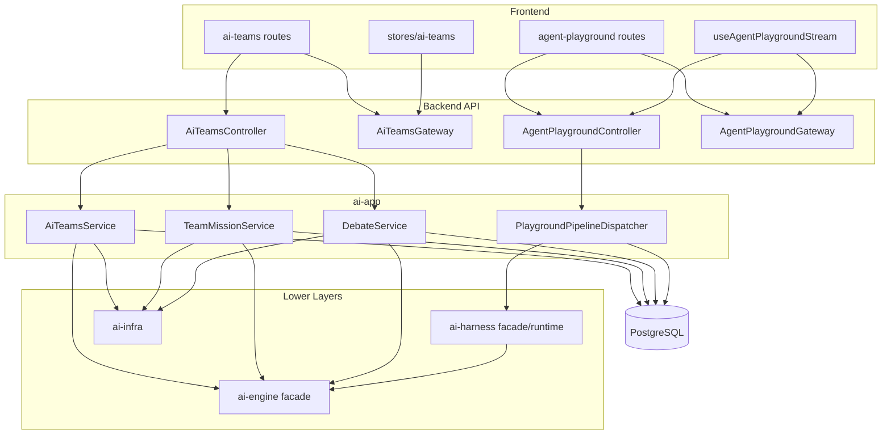
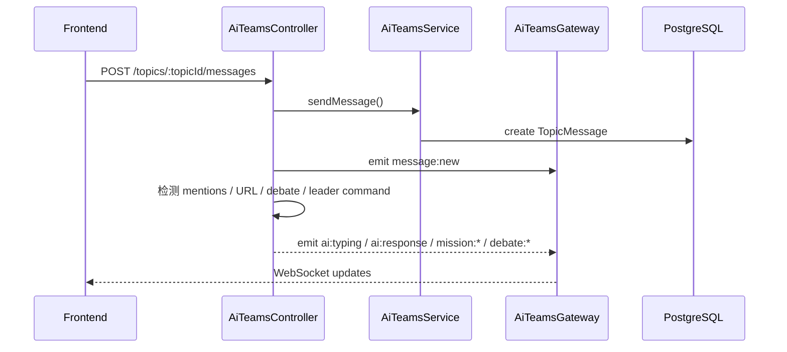
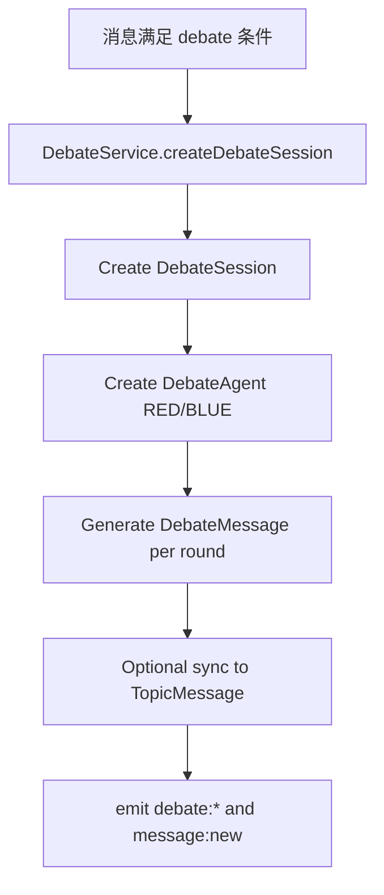
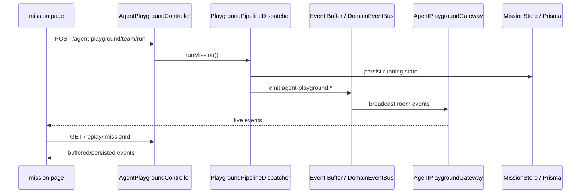

# Teams Architecture

> 当前多 Agent 文档的主入口。这里只描述活跃代码，不再沿用旧 `ai-engine/teams` 设计。

## 1. 范围

本目录对应两套并行系统：

1. `ai-app/teams`
2. `ai-app/agent-playground`

## 2. 组件关系图



## 3. `ai-app/teams`

### 3.1 后端结构

当前活跃入口：

- `ai-teams.module.ts`
- `controllers/ai-teams.controller.ts`
- `ai-teams.gateway.ts`
- `ai-teams.service.ts`
- `teams.repository.ts`

当前核心服务：

| 服务                           | 作用                                     |
| ------------------------------ | ---------------------------------------- |
| `AiTeamsService`               | Topic、Message、Resource、Summary 主入口 |
| `TeamMissionService`           | Team Mission 主入口                      |
| `MissionExecutionService`      | 子任务执行                               |
| `MissionReviewService`         | Leader 审核                              |
| `MissionLifecycleService`      | 生命周期管理                             |
| `MissionRetryService`          | 重试                                     |
| `MissionHealthCheckService`    | 健康检查                                 |
| `MissionAICallerService`       | AI 调用封装                              |
| `DebateService`                | Debate session                           |
| `AiResponseService`            | 普通 @AI 回复                            |
| `TopicContextRetrievalService` | Topic 上下文检索                         |
| `ContextRouterService`         | 回复路径路由                             |

### 3.2 前端结构

当前活跃入口：

- `frontend/app/ai-teams/page.tsx`
- `frontend/app/ai-teams/[topicId]/page.tsx`
- `frontend/services/ai-teams/api.ts`
- `frontend/stores/ai-teams/`

store 当前拆成：

- `topicsSlice`
- `messagesSlice`
- `missionsSlice`
- `websocketSlice`

### 3.3 持久化模型

当前活跃 Prisma 模型：

- `Topic`
- `TopicMember`
- `TopicAIMember`
- `TopicMessage`
- `TopicMessageMention`
- `TopicMessageAttachment`
- `TopicMessageReaction`
- `TopicResource`
- `TopicSummary`
- `TopicJoinRequest`
- `TeamMission`
- `AgentTask`
- `MissionLog`
- `VoteProposal`
- `VoteRecord`
- `DebateSession`
- `DebateAgent`
- `DebateMessage`

### 3.4 Topic 消息流



前端当前消费的主要事件：

- `message:new`
- `message:delete`
- `reaction:add`
- `reaction:remove`
- `member:typing`
- `ai:typing`
- `ai:response`
- `ai:error`
- `mission:created`
- `mission:status_changed`
- `mission:progress_updated`
- `task:completed`
- `task:status`
- `mission:agent_working`
- `mission:agent_done`
- `mission:completed`
- `mission:failed`

### 3.5 Team Mission 流

```mermaid
flowchart TD
    A[POST /topics/:topicId/missions] --> B[TeamMissionService.createMission]
    B --> C[Persist TeamMission]
    C --> D[Leader planning]
    D --> E[Create AgentTask[]]
    E --> F[Mission execution]
    F --> G[Leader review / revision]
    G --> H[finalResult + summary]
    H --> I[emit mission:*]
```

### 3.6 Debate 流



## 4. `agent-playground`

### 4.1 当前事实

Playground 不是 `TeamMission` 的别名，而是独立的 pipeline 系统：

- 入口：`PlaygroundPipelineDispatcher`
- 通道：HTTP + WebSocket + `/replay/:missionId`
- 运行时依赖：ownership、abort、checkpoint、event buffer
- 事件命名空间：`agent-playground.*`

### 4.2 活跃 API

- `GET /agent-playground/missions`
- `GET /agent-playground/missions/:id`
- `POST /agent-playground/team/run`
- `POST /agent-playground/missions/:id/rerun`
- `POST /agent-playground/missions/:id/todos/:todoId/rerun`
- `POST /agent-playground/missions/:id/todos/:todoId/local-rerun`
- `POST /agent-playground/missions/:id/cancel`
- `GET /agent-playground/replay/:missionId`
- `GET|POST /agent-playground/missions/:id/leader-chat`
- `GET /agent-playground/missions/:id/export`

### 4.3 Stage 主干

当前主干 stage：

1. `s1-mission-estimate-budget`
2. `s2-leader-plan-mission`
3. `s3-researcher-collect-findings`
4. `s4-leader-assess-research`
5. `s5-reconciler-cross-dim-fact-check`
6. `s6-analyst-synthesize-insights`
7. `s7-writer-plan-outline`
8. `s8-writer-draft-report`
9. `s9-reviewer-critic-l4`
10. `s10-leader-foreword-and-signoff`
11. `s11-mission-persist`

### 4.4 事件流



关键事件：

- `agent-playground.mission:started`
- `agent-playground.mission:completed`
- `agent-playground.mission:failed`
- `agent-playground.mission:cancelled`
- `agent-playground.mission:rerun-started`
- `agent-playground.mission:rerun-completed`
- `agent-playground.mission:rerun-failed`
- `agent-playground.draft:completed`
- `agent-playground.mission:budget-warning-soft`
- `agent-playground.mission:budget-warning-hard`
- `agent-playground.mission:persist-failed`
- `agent-playground.event:oversized`

## 5. 结论

当前代码的真实分工是：

- `ai-app/teams` 负责实时协作型多 Agent 产品
- `ai-app/agent-playground` 负责结构化 pipeline 型多 Agent 产品
- `ai-harness` 提供运行时
- `ai-engine` 提供原子 AI 能力

因此，任何继续把当前主实现写成 `ai-engine/teams/*` 的文档都应视为历史描述。
