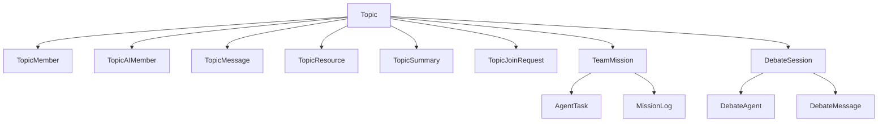

# AI Teams Core Concepts

> 本页已按当前代码收口。旧版把核心抽象落在 `backend/src/modules/ai-engine/teams/*`，该描述不再代表现状。

## 当前系统边界

当前仓库里与 AI Teams 直接对应的主实现位于：

- `backend/src/modules/ai-app/teams/`
- `frontend/app/ai-teams/`
- `frontend/services/ai-teams/api.ts`
- `frontend/stores/ai-teams/`

Teams 依赖下层能力，但并不再以单独的 `ai-engine/teams` 抽象层作为现行主入口。

## 当前核心对象

### 1. Topic

Topic 是协作空间，承载成员、消息、资源、摘要、入群申请和 mission。

对应模型：

- `Topic`
- `TopicMember`
- `TopicAIMember`
- `TopicMessage`
- `TopicResource`
- `TopicSummary`
- `TopicJoinRequest`

代码入口：

- `backend/src/modules/ai-app/teams/controllers/ai-teams.controller.ts`
- `backend/src/modules/ai-app/teams/services/`

### 2. AI Member

AI Member 是挂在 Topic 上的智能成员，而不是旧文档里抽象的通用 `TeamMember` 基类。

当前关键能力：

- 作为 Topic 成员参与消息流
- 被设置为 leader 或指定 team role
- 触发自动回复、辩论和 mission 协作

对应接口入口：

- `POST /topics/:topicId/ai-members`
- `POST /topics/:topicId/ai-members/debate`
- `POST /topics/:topicId/ai-members/:aiMemberId/set-leader`
- `PATCH /topics/:topicId/ai-members/:aiMemberId/team-role`

### 3. Message

Message 是 Topic 内的基础交互单元，支持提及、附件、反应、书签转发和 AI 跟进。

对应模型：

- `TopicMessage`
- `TopicMessageMention`
- `TopicMessageAttachment`
- `TopicMessageReaction`

对应实时事件：

- `message:new`
- `member:typing`
- `ai:typing`
- `ai:response`
- `reaction:add`
- `reaction:remove`

### 4. Debate

Debate 是 Teams 的一类协作模式，围绕 Topic 组织 AI 角色对抗和总结。

对应模型：

- `DebateSession`
- `DebateAgent`
- `DebateMessage`

入口：

- `POST /topics/:topicId/ai-members/debate`
- `GET /topics/:topicId/debates`
- `GET /topics/:topicId/debates/:debateId`

### 5. Team Mission

Team Mission 是挂在 Topic 下的协作任务对象，不等于旧方案里的通用 mission 抽象。

对应模型：

- `TeamMission`
- `AgentTask`
- `MissionLog`

入口：

- `POST /topics/:topicId/missions`
- `GET /topics/:topicId/missions`
- `GET /topics/:topicId/missions/:missionId`
- `POST /topics/:topicId/missions/:missionId/cancel`
- `POST /topics/:topicId/missions/:missionId/pause`
- `POST /topics/:topicId/missions/:missionId/resume`
- `POST /topics/:topicId/missions/:missionId/retry`

## 当前概念关系

## 与 Agent Playground 的关系

AI Teams 和 Agent Playground 都是活跃系统，但职责不同：

- AI Teams 偏向 Topic 协作、消息流、AI 成员和团队任务
- Agent Playground 偏向结构化 mission pipeline、回放、rerun、leader chat 和导出

不要把两者混写成同一套执行框架。

## 历史说明

如果你需要查阅旧的抽象设计，请把它当成历史背景，而不是当前代码约束。现行文档请优先参考：

- [architecture.md](architecture.md)
- [features-ai-teams/system-design.md](features-ai-teams/system-design.md)
- [../../system-overview.md](../../system-overview.md)
