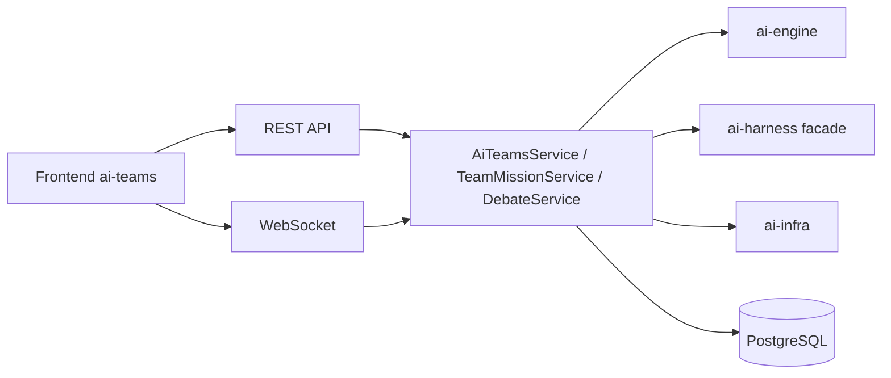
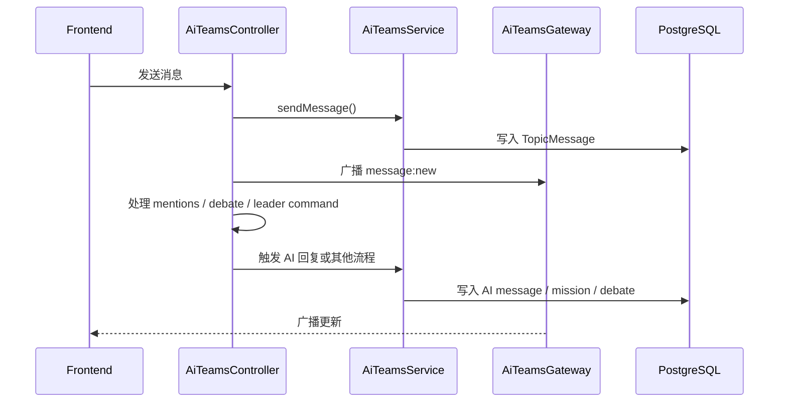
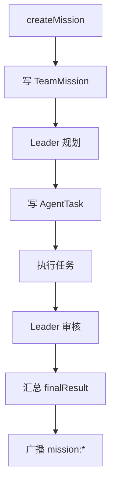
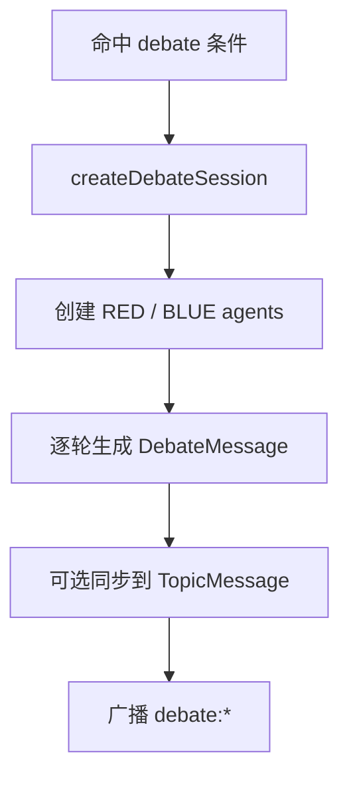

# AI Teams System Design

> 当前系统设计对应 `backend/src/modules/ai-app/teams/`。

## 1. 范围

本文覆盖：

- Topic
- Member / AI Member
- Message / Reaction / Resource / Summary
- Debate
- Team Mission
- WebSocket

不覆盖：

- `agent-playground`
- 已废弃的 `ai-engine/teams`

## 2. 架构图

## 3. 后端入口

### 3.1 HTTP

当前控制器实际承载的能力：

- Topic CRUD
- Public Topic / Join Request
- Member CRUD
- AI Member CRUD
- Message / Reaction / Read
- AI Response
- Resource / Summary
- Debate 查询
- Mission CRUD / retry / pause / resume / full report / logs
- Team role
- URL parsing

### 3.2 WebSocket

当前 gateway 支持：

- `topic:join`
- `topic:leave`
- `message:send`
- `message:typing`
- `message:read`
- `reaction:add`
- `reaction:remove`

以及向前端广播：

- `message:new`
- `member:online`
- `member:typing`
- `ai:typing`
- `ai:response`
- `ai:error`
- `mission:*`
- `debate:*`

## 4. 核心服务分工

| 服务                           | 作用                                     |
| ------------------------------ | ---------------------------------------- |
| `AiTeamsService`               | Topic、Message、Resource、Summary 主流程 |
| `TeamMissionService`           | Team Mission 主入口                      |
| `MissionExecutionService`      | 子任务执行                               |
| `MissionReviewService`         | 审核与修订                               |
| `MissionLifecycleService`      | 生命周期流转                             |
| `MissionRetryService`          | 重试                                     |
| `MissionHealthCheckService`    | 健康检查                                 |
| `MissionAICallerService`       | AI 调用与 token 计量                     |
| `DebateService`                | Debate session                           |
| `AiResponseService`            | 普通 @AI 回复                            |
| `TopicContextRetrievalService` | Topic 历史上下文检索                     |
| `ContextRouterService`         | 回复路径路由                             |

## 5. 数据模型

### 5.1 协作域

- `Topic`
- `TopicMember`
- `TopicAIMember`
- `TopicMessage`
- `TopicMessageMention`
- `TopicMessageAttachment`
- `TopicMessageReaction`
- `TopicResource`
- `TopicSummary`
- `TopicJoinRequest`

### 5.2 Mission 域

- `TeamMission`
- `AgentTask`
- `MissionLog`

关键字段：

- `TeamMission.status`
- `TeamMission.taskBreakdown`
- `TeamMission.contextPackage`
- `TeamMission.progressPercent`
- `AgentTask.dependsOnIds`

### 5.3 Debate / Vote 域

- `DebateSession`
- `DebateAgent`
- `DebateMessage`
- `VoteProposal`
- `VoteRecord`

关键字段：

- `DebateAgent.conversationHistory`
- `VoteProposal.strategy`
- `VoteRecord.confidence`

## 6. 数据流

### 6.1 Topic 协作

### 6.2 Team Mission

### 6.3 Debate

## 7. 前端消费面

当前前端接口封装位于 `frontend/services/ai-teams/api.ts`，覆盖：

- Topic
- Member / AI Member
- Message / Reaction / Read
- Resource / Summary
- Mission
- Team role
- URL parsing
- Public Topic / Join Request

当前 store 订阅的关键事件位于 `frontend/stores/ai-teams/index.ts`。

## 8. 更新原则

本文在以下文件变化时必须同步：

- `controllers/ai-teams.controller.ts`
- `ai-teams.gateway.ts`
- `ai-teams.module.ts`
- `frontend/services/ai-teams/api.ts`
- `frontend/stores/ai-teams/index.ts`
- `backend/prisma/schema/models.prisma`
