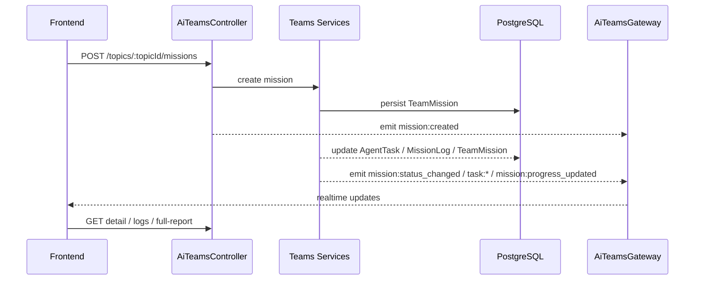

# AI Teams Mission Lifecycle

> 本页描述当前 `ai-app/teams` 中 Team Mission 的可验证生命周期。旧版基于 `ai-engine/teams/orchestrator/mission-orchestrator.ts` 的阶段机已不再是当前主实现。

## 当前事实来源

- `backend/src/modules/ai-app/teams/controllers/ai-teams.controller.ts`
- `backend/prisma/schema/models.prisma`
- `frontend/stores/ai-teams/index.ts`

## 生命周期范围

当前可从 API、模型和前端事件确认的 Team Mission 生命周期，重点是 Topic 内 mission 的创建、执行反馈、暂停恢复、重试、取消和报告生成。

## 关键对象

- `TeamMission`
- `AgentTask`
- `MissionLog`

## 可验证状态变化

虽然运行时内部步骤可能继续细分，但系统外可稳定观察到的主流程是：

```text
create -> running/progressing -> paused/resumed -> completed | failed | cancelled
```

前端实际消费的 mission 事件包括：

- `mission:created`
- `mission:status_changed`
- `mission:progress_updated`
- `mission:agent_working`
- `mission:agent_done`
- `task:completed`
- `task:status`
- `mission:completed`
- `mission:failed`

## 主流程

### 1. 创建

用户在 Topic 下创建 mission：

`POST /topics/:topicId/missions`

系统创建 `TeamMission`，并通过实时流向前端广播 `mission:created`。

### 2. 执行中

执行过程中，系统按任务粒度持续输出：

- mission 状态变化
- progress 更新
- agent working / done
- task 完成与状态更新

前端 store 通过 WebSocket 将这些事件并入 Topic 页面状态。

### 3. 控制动作

当前明确存在的控制接口：

- `POST /topics/:topicId/missions/:missionId/pause`
- `POST /topics/:topicId/missions/:missionId/resume`
- `POST /topics/:topicId/missions/:missionId/retry`
- `POST /topics/:topicId/missions/:missionId/cancel`
- `DELETE /topics/:topicId/missions/:missionId`

### 4. 结果与报告

任务结束后，可以继续获取：

- mission 详情
- logs
- full report
- regenerate report

对应接口：

- `GET /topics/:topicId/missions/:missionId`
- `GET /topics/:topicId/missions/:missionId/logs`
- `GET /topics/:topicId/missions/:missionId/full-report`
- `POST /topics/:topicId/missions/:missionId/regenerate-report`

## 数据流



## 与 Agent Playground 的区别

不要把这里的 lifecycle 与 `agent-playground` 的多 stage pipeline 混用：

- Teams Mission 绑定 Topic 协作上下文
- Playground Mission 绑定 `agent-playground` controller、event bus、replay 和 rerun 体系

## 维护要求

如果后续要继续细化内部阶段，必须至少同时满足两点：

1. 能在 controller、service 或事件名上找到落点
2. 能在前端状态消费或持久化模型上找到对应证据
