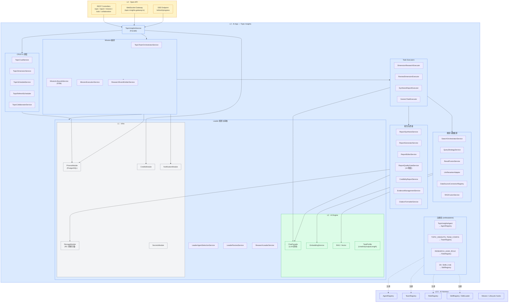
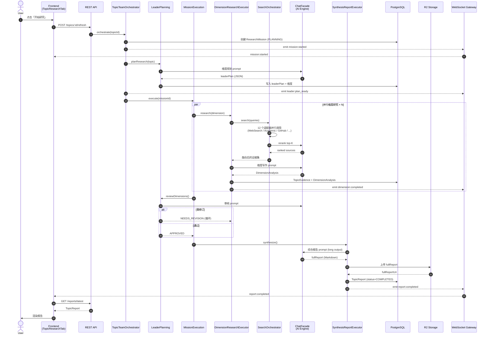
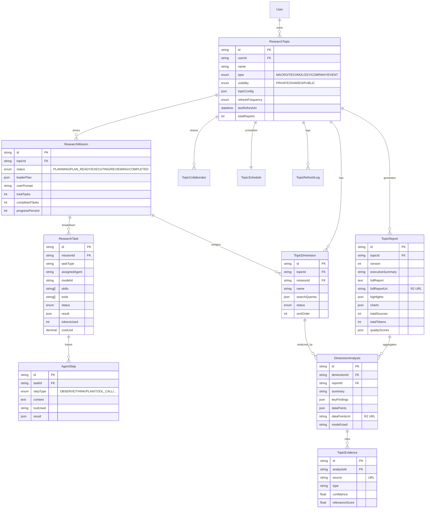
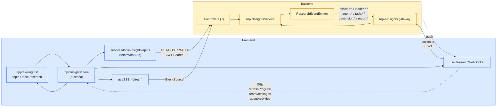

# AI Insights 架构总览

> **模块**: `backend/src/modules/ai-app/topic-insights/`
> **分层**: L3 AI App (依赖 L2.5 AI Harness + L2 AI Engine)
> **入口 Facade**: `TopicInsightsService` (协调 70+ 子服务)

---

## 1. 分层架构总览

按 Genesis.ai 4 层 + L2.5 Harness 的标准分层，AI Insights 落在 L3 AI App 层。



> 关键约束: **AI App 只通过 ChatFacade / Registry 访问 AI Engine 与 Harness, 禁止穿透内部路径**。

---

## 2. Mission 执行流程 (Leader-Driven)

用户点击「开始研究」后, Mission 在 `PLANNING → PLAN_READY → EXECUTING → REVIEWING → COMPLETED` 五态间推进, 每一步都通过 `ResearchEventEmitterService` 向 WebSocket 推流。



---

## 3. 数据模型关系

PostgreSQL 单库存储, JSON 字段承担灵活配置, 大字段 (fullReport / dataPoints) 离线到 R2 仅存 URI。



---

## 4. 前后端实时通信

Zustand store 接 REST + WebSocket 双通道, REST 走「请求-响应」, WebSocket 走「Mission 进度流」。



**WebSocket 事件分类**:

| 命名空间      | 事件                                                          | 触发点                       |
| ------------- | ------------------------------------------------------------- | ---------------------------- |
| `mission:*`   | started / progress / completed / failed                       | MissionLifecycleService      |
| `leader:*`    | thinking / planning / plan_ready                              | LeaderPlanningService        |
| `agent:*`     | working / completed / failed                                  | AgentActivityService         |
| `task:*`      | started / progress / completed / failed                       | MissionExecutionService      |
| `dimension:*` | research_started / progress / completed                       | DimensionResearchExecutor    |
| `report:*`    | synthesis_started / progress / completed                      | SynthesisReportExecutor      |
| `todo:*`      | created / status_changed / reviewing / reviewed               | ResearchTodoService          |

---

## 5. 关键架构亮点

| 亮点               | 实现                                                                        |
| ------------------ | --------------------------------------------------------------------------- |
| **Facade 单入口**  | `TopicInsightsService` 协调 70+ 子服务, 控制器只看到 1 个对外 API           |
| **Leader 闭环**    | 规划 → 派发 → 维度执行 → 审核 → 综合, Leader 可要求 NEEDS_REVISION 再循环   |
| **多源融合**       | 12 个搜索适配器 (Web/学术/GitHub/社交/金融/政策/天气/PubMed/RAG) 并行召回   |
| **质量门禁**       | `ReportQualityGateService` 按 10 维度评分, 不合格触发 `SectionRemediation`  |
| **实时可观测性**   | WebSocket 推 Leader 思考、Agent 活动、维度进度; SSE 推刷新进度              |
| **大字段离线存储** | `fullReport` / `dataPoints` 写 R2, DB 仅存 URI, 单库不爆                    |
| **跨模块导出**     | `TOPIC_INSIGHTS_DATA_EXPORT` token 供 Office/Slides 模块消费                |
| **声明式 Agent**   | `TopicInsightsAgent` 带 capabilities/templates, 注册到 AgentRegistry 供路由 |

---

## 6. 关键文件路径速查

```
backend/src/modules/ai-app/topic-insights/
├── topic-insights.module.ts          ← 70+ 服务的依赖注入
├── topic-insights.service.ts         ← Facade 入口
├── topic-insights.gateway.ts         ← WebSocket
├── controllers/                      ← 7 个 REST 控制器
├── services/
│   ├── topic-team-orchestrator.service.ts
│   ├── mission-lifecycle.service.ts
│   ├── leader-planning.service.ts
│   ├── leader-review.service.ts
│   ├── executors/
│   │   ├── dimension-research.executor.ts
│   │   ├── review-dimension.executor.ts
│   │   └── synthesis-report.executor.ts
│   ├── search/
│   │   ├── search-orchestrator.service.ts
│   │   ├── adapters/  (12 个数据源适配器)
│   │   └── data-source-connector-registry.ts
│   └── report/
│       ├── report-synthesis.service.ts
│       ├── report-quality-gate.service.ts
│       └── credibility-report.service.ts
├── agents/topic-insights.agent.ts    ← 注册到 AgentRegistry
├── teams/topic-insights-team.config.ts
└── skills/                           ← 35+ 个 .md skill 定义

frontend/
├── app/ai-insights/                  ← 页面入口
├── components/ai-insights/           ← UI 组件树
├── stores/topicInsightsStore.ts      ← Zustand
├── services/topic-insights/api.ts    ← REST 客户端
├── hooks/useResearchWebSocket.ts     ← WebSocket
└── types/topic-insights.ts

backend/prisma/schema/
└── models.prisma                     ← ResearchTopic / TopicReport /
                                          ResearchMission / ResearchTask /
                                          TopicDimension / TopicEvidence /
                                          DimensionAnalysis / AgentStep
```
