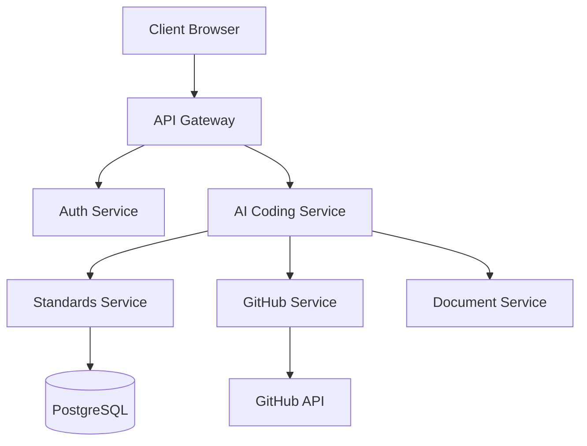
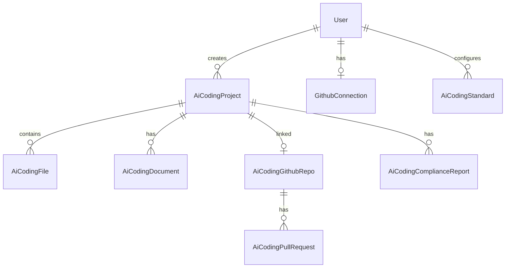

# AI Coding Enhancement Design Document

## Software Engineering Expert Agent & GitHub Integration

**Version**: 1.0
**Date**: 2025-12-21
**Author**: Architect Agent
**Status**: Draft
**PRD Reference**: `docs/prd/ai-coding-feature.md`

---

## 1. Executive Summary

This document details the technical design for implementing two critical P0 features for the AI Coding module:

1. **Software Engineering Expert Agent (F-009)**: Learn enterprise standards, guide other agents, review outputs for compliance
2. **GitHub Integration (F-008)**: OAuth integration, repository management, code push, PR creation
3. **Improved Document Outputs**: Generate proper Markdown PRD/Design documents with architecture diagrams

### Current State Analysis

The existing `ai-coding.service.ts` implementation has:

- Basic multi-agent pipeline (PM, Architect, PM Lead, Engineer, QA)
- JSON-only outputs stored in `outputs` field
- No standards/compliance checking
- No GitHub integration (fields exist but unused)
- No proper Markdown document generation

---

## 2. Database Schema Changes

### 2.1 New Prisma Models

```prisma
// ============ AI Coding Standards ============

// Engineering Standards Document
model AiCodingStandard {
  id        String @id @default(uuid())
  userId    String @map("user_id")

  // Document metadata
  name      String @db.VarChar(200)          // e.g., "API Design Standards"
  type      AiCodingStandardType             // naming, api, database, security, etc.
  source    AiCodingStandardSource           // uploaded, github, template

  // Content
  content   String @db.Text                   // Raw markdown content

  // Parsed rules (extracted by AI)
  rules     Json @default("[]")               // [{ id, rule, severity, category, examples }]

  // GitHub source info (if from GitHub)
  githubRepo    String? @map("github_repo") @db.VarChar(200)
  githubPath    String? @map("github_path") @db.VarChar(500)
  githubBranch  String? @map("github_branch") @db.VarChar(100)
  lastSyncedAt  DateTime? @map("last_synced_at")

  // Status
  isActive  Boolean @default(true) @map("is_active")
  priority  Int @default(0)                   // Higher = more important

  // Timestamps
  createdAt DateTime @default(now()) @map("created_at")
  updatedAt DateTime @updatedAt @map("updated_at")

  // Relations
  user      User @relation(fields: [userId], references: [id], onDelete: Cascade)

  @@index([userId, type])
  @@index([userId, isActive])
  @@map("ai_coding_standards")
}

enum AiCodingStandardType {
  DIRECTORY_STRUCTURE   // Project organization
  NAMING_CONVENTIONS    // Variable/function naming
  CODE_STYLE           // Formatting, comments
  API_DESIGN           // RESTful, versioning
  DATABASE_DESIGN      // Schema, indexing
  TESTING_STANDARDS    // Coverage, mocking
  GIT_WORKFLOW         // Branching, commits
  DOCUMENTATION        // Doc format, structure
  SECURITY             // Auth, encryption
  GENERAL              // Other standards
}

enum AiCodingStandardSource {
  UPLOADED             // User uploaded file
  GITHUB               // Synced from GitHub repo
  TEMPLATE             // Built-in template
}

// Compliance Check Results
model AiCodingComplianceReport {
  id          String @id @default(uuid())
  projectId   String @map("project_id")
  iterationId String? @map("iteration_id")

  // Check results
  overallScore    Int @default(0)             // 0-100
  status          AiCodingComplianceStatus @default(PENDING)

  // Detailed results
  results   Json @default("[]")               // [{ standardId, standardName, passed, violations, suggestions }]
  summary   String? @db.Text                  // AI-generated summary

  // Timestamps
  createdAt   DateTime @default(now()) @map("created_at")
  completedAt DateTime? @map("completed_at")

  // Relations
  project   AiCodingProject @relation(fields: [projectId], references: [id], onDelete: Cascade)

  @@index([projectId])
  @@map("ai_coding_compliance_reports")
}

enum AiCodingComplianceStatus {
  PENDING
  RUNNING
  PASSED
  FAILED
  WARNING
}

// ============ GitHub Integration ============

// GitHub Connection (User Level)
model GithubConnection {
  id            String @id @default(uuid())
  userId        String @unique @map("user_id")

  // OAuth tokens (encrypted at rest)
  accessToken   String @map("access_token") @db.Text
  refreshToken  String? @map("refresh_token") @db.Text
  tokenType     String @default("bearer") @map("token_type")
  scope         String? @db.Text

  // GitHub user info
  githubId      Int @map("github_id")
  githubLogin   String @map("github_login") @db.VarChar(100)
  githubEmail   String? @map("github_email") @db.VarChar(200)
  avatarUrl     String? @map("avatar_url") @db.Text

  // Token metadata
  expiresAt     DateTime? @map("expires_at")
  lastUsedAt    DateTime? @map("last_used_at")

  // Timestamps
  createdAt     DateTime @default(now()) @map("created_at")
  updatedAt     DateTime @updatedAt @map("updated_at")

  // Relations
  user          User @relation(fields: [userId], references: [id], onDelete: Cascade)

  @@index([userId])
  @@index([githubId])
  @@map("github_connections")
}

// GitHub Repository Link (Project Level)
model AiCodingGithubRepo {
  id          String @id @default(uuid())
  projectId   String @unique @map("project_id")

  // Repository info
  owner       String @db.VarChar(100)
  repo        String @db.VarChar(200)
  fullName    String @map("full_name") @db.VarChar(300)
  htmlUrl     String @map("html_url") @db.Text
  cloneUrl    String @map("clone_url") @db.Text

  // Settings
  defaultBranch   String @default("main") @map("default_branch")
  isPrivate       Boolean @default(true) @map("is_private")
  autoSync        Boolean @default(false) @map("auto_sync")

  // Sync status
  lastPushAt      DateTime? @map("last_push_at")
  lastPushCommit  String? @map("last_push_commit") @db.VarChar(40)

  // Timestamps
  createdAt     DateTime @default(now()) @map("created_at")
  updatedAt     DateTime @updatedAt @map("updated_at")

  // Relations
  project       AiCodingProject @relation(fields: [projectId], references: [id], onDelete: Cascade)
  pullRequests  AiCodingPullRequest[]

  @@index([projectId])
  @@map("ai_coding_github_repos")
}

// Pull Request Tracking
model AiCodingPullRequest {
  id            String @id @default(uuid())
  githubRepoId  String @map("github_repo_id")
  iterationId   String? @map("iteration_id")

  // PR info
  prNumber      Int @map("pr_number")
  title         String @db.VarChar(500)
  body          String? @db.Text
  headBranch    String @map("head_branch") @db.VarChar(200)
  baseBranch    String @map("base_branch") @db.VarChar(200)
  htmlUrl       String @map("html_url") @db.Text

  // Status
  state         AiCodingPRState @default(OPEN)
  mergedAt      DateTime? @map("merged_at")
  closedAt      DateTime? @map("closed_at")

  // Timestamps
  createdAt     DateTime @default(now()) @map("created_at")
  updatedAt     DateTime @updatedAt @map("updated_at")

  // Relations
  githubRepo    AiCodingGithubRepo @relation(fields: [githubRepoId], references: [id], onDelete: Cascade)

  @@index([githubRepoId])
  @@index([prNumber])
  @@map("ai_coding_pull_requests")
}

enum AiCodingPRState {
  OPEN
  CLOSED
  MERGED
}

// ============ Document Outputs ============

// Generated Documents (PRD, Design, API docs)
model AiCodingDocument {
  id          String @id @default(uuid())
  projectId   String @map("project_id")

  // Document info
  type        AiCodingDocumentType
  title       String @db.VarChar(500)
  content     String @db.Text                 // Markdown content
  version     Int @default(1)

  // For design docs: architecture diagrams
  diagrams    Json? @default("[]")            // [{ type: 'mermaid', code: '...' }]

  // Timestamps
  createdAt   DateTime @default(now()) @map("created_at")
  updatedAt   DateTime @updatedAt @map("updated_at")

  // Relations
  project     AiCodingProject @relation(fields: [projectId], references: [id], onDelete: Cascade)

  @@index([projectId, type])
  @@map("ai_coding_documents")
}

enum AiCodingDocumentType {
  PRD              // Product Requirements Document
  DESIGN           // Technical Design Document
  API              // API Documentation
  README           // Project README
  CHANGELOG        // Version changelog
}
```

### 2.2 Modified AiCodingProject Model

```prisma
model AiCodingProject {
  id     String @id @default(uuid())
  userId String @map("user_id")

  // ... existing fields ...

  // NEW: Standards configuration
  standardsConfig Json? @default("{}") @map("standards_config")
  // { strictness: 'loose'|'standard'|'strict', enabledStandards: string[] }

  // NEW: Compliance score
  complianceScore Int? @map("compliance_score")

  // Relations (existing + new)
  user            User @relation(fields: [userId], references: [id], onDelete: Cascade)
  files           AiCodingFile[]
  agentLogs       AiCodingAgentLog[]
  iterations      AiCodingIteration[]
  // NEW relations
  githubRepo      AiCodingGithubRepo?
  documents       AiCodingDocument[]
  complianceReports AiCodingComplianceReport[]

  @@index([userId, createdAt(sort: Desc)])
  @@index([status])
  @@map("ai_coding_projects")
}
```

### 2.3 Add to User Model

```prisma
model User {
  // ... existing fields ...

  // NEW: GitHub connection
  githubConnection GithubConnection?

  // NEW: AI Coding standards
  aiCodingStandards AiCodingStandard[]

  // ... existing relations ...
}
```

---

## 3. New Services Architecture

### 3.1 Service Overview

```
┌─────────────────────────────────────────────────────────────────────────────┐
│                           AI Coding Module                                   │
├─────────────────────────────────────────────────────────────────────────────┤
│                                                                             │
│  ┌───────────────────┐    ┌───────────────────┐    ┌──────────────────┐    │
│  │ AiCodingService   │───▶│ StandardsService  │───▶│ ComplianceService│    │
│  │ (Orchestrator)    │    │ (Standards Mgmt)  │    │ (Validation)     │    │
│  └───────────────────┘    └───────────────────┘    └──────────────────┘    │
│           │                                                                  │
│           │               ┌───────────────────┐    ┌──────────────────┐    │
│           ├──────────────▶│ GithubService     │───▶│ GithubRepoService│    │
│           │               │ (OAuth, API)      │    │ (Repo Ops)       │    │
│           │               └───────────────────┘    └──────────────────┘    │
│           │                                                                  │
│           │               ┌───────────────────┐                             │
│           └──────────────▶│ DocumentService   │                             │
│                           │ (MD Generation)   │                             │
│                           └───────────────────┘                             │
│                                                                             │
└─────────────────────────────────────────────────────────────────────────────┘
```

### 3.2 StandardsService

**File**: `backend/src/modules/ai/ai-coding/services/standards.service.ts`

```typescript
import { Injectable, Logger, NotFoundException } from "@nestjs/common";
import { PrismaService } from "../../../../common/prisma/prisma.service";
import { AiChatService } from "../../ai-core/ai-chat.service";
import { AiCodingStandardType, AiCodingStandardSource } from "@prisma/client";

export interface StandardRule {
  id: string;
  rule: string;
  severity: "error" | "warning" | "info";
  category: string;
  examples?: {
    good?: string[];
    bad?: string[];
  };
}

export interface ParsedStandard {
  name: string;
  type: AiCodingStandardType;
  rules: StandardRule[];
}

@Injectable()
export class StandardsService {
  private readonly logger = new Logger(StandardsService.name);

  constructor(
    private readonly prisma: PrismaService,
    private readonly aiChatService: AiChatService,
  ) {}

  /**
   * Upload and parse a standards document
   */
  async uploadStandard(
    userId: string,
    dto: {
      name: string;
      type: AiCodingStandardType;
      content: string;
      priority?: number;
    },
  ) {
    // Parse rules from content using AI
    const rules = await this.parseStandardRules(dto.content, dto.type);

    return this.prisma.aiCodingStandard.create({
      data: {
        userId,
        name: dto.name,
        type: dto.type,
        source: AiCodingStandardSource.UPLOADED,
        content: dto.content,
        rules: rules as any,
        priority: dto.priority ?? 0,
      },
    });
  }

  /**
   * Sync standards from GitHub repository
   */
  async syncFromGithub(
    userId: string,
    dto: {
      githubRepo: string; // owner/repo
      githubPath: string; // path to standards folder
      githubBranch?: string;
    },
  ) {
    // Implementation will use GithubService to fetch files
    // For each markdown file in the path:
    // 1. Detect type from filename
    // 2. Parse content for rules
    // 3. Create/update AiCodingStandard records
    throw new Error("Not implemented - requires GithubService");
  }

  /**
   * Use AI to parse rules from a standards document
   */
  async parseStandardRules(
    content: string,
    type: AiCodingStandardType,
  ): Promise<StandardRule[]> {
    const systemPrompt = `You are an expert at extracting software engineering rules from documentation.

Given a standards document, extract each rule as a structured object.

Output a JSON array of rules:
[
  {
    "id": "RULE-001",
    "rule": "Use camelCase for variable names",
    "severity": "error",
    "category": "naming",
    "examples": {
      "good": ["const userName = 'John'"],
      "bad": ["const user_name = 'John'"]
    }
  }
]

Severity levels:
- error: Must be followed, violations are blocking
- warning: Should be followed, violations are flagged
- info: Recommendations, nice to have`;

    const result = await this.aiChatService.chat({
      messages: [
        {
          role: "user",
          content: `Parse rules from this ${type} standards document:\n\n${content}`,
        },
      ],
      systemPrompt,
      maxTokens: 4096,
    });

    try {
      const jsonMatch = result.content.match(/\[[\s\S]*\]/);
      if (jsonMatch) {
        return JSON.parse(jsonMatch[0]);
      }
    } catch (e) {
      this.logger.warn("Failed to parse rules from content");
    }

    return [];
  }

  /**
   * Get all active standards for a user
   */
  async getUserStandards(userId: string) {
    return this.prisma.aiCodingStandard.findMany({
      where: {
        userId,
        isActive: true,
      },
      orderBy: [{ priority: "desc" }, { type: "asc" }],
    });
  }

  /**
   * Get standards formatted for agent prompts
   */
  async getStandardsForAgent(
    userId: string,
    agentType: "pm" | "architect" | "engineer" | "qa",
  ): Promise<string> {
    const standards = await this.getUserStandards(userId);

    // Filter standards relevant to this agent
    const relevantTypes = this.getRelevantStandardTypes(agentType);
    const filtered = standards.filter((s) => relevantTypes.includes(s.type));

    if (filtered.length === 0) {
      return "";
    }

    // Format as prompt section
    let prompt = "\n\n## Engineering Standards to Follow\n\n";

    for (const standard of filtered) {
      prompt += `### ${standard.name}\n\n`;
      const rules = standard.rules as StandardRule[];
      for (const rule of rules) {
        const severity =
          rule.severity === "error"
            ? "MUST"
            : rule.severity === "warning"
              ? "SHOULD"
              : "MAY";
        prompt += `- [${severity}] ${rule.rule}\n`;
        if (rule.examples?.good) {
          prompt += `  Good: ${rule.examples.good[0]}\n`;
        }
      }
      prompt += "\n";
    }

    return prompt;
  }

  private getRelevantStandardTypes(
    agentType: "pm" | "architect" | "engineer" | "qa",
  ): AiCodingStandardType[] {
    const mapping: Record<string, AiCodingStandardType[]> = {
      pm: ["DOCUMENTATION", "GENERAL"],
      architect: [
        "DIRECTORY_STRUCTURE",
        "API_DESIGN",
        "DATABASE_DESIGN",
        "DOCUMENTATION",
        "SECURITY",
      ],
      engineer: [
        "DIRECTORY_STRUCTURE",
        "NAMING_CONVENTIONS",
        "CODE_STYLE",
        "API_DESIGN",
        "DATABASE_DESIGN",
        "TESTING_STANDARDS",
        "GIT_WORKFLOW",
        "SECURITY",
      ],
      qa: ["TESTING_STANDARDS", "CODE_STYLE", "SECURITY"],
    };

    return mapping[agentType] || [];
  }
}
```

### 3.3 ComplianceService

**File**: `backend/src/modules/ai/ai-coding/services/compliance.service.ts`

```typescript
import { Injectable, Logger } from "@nestjs/common";
import { PrismaService } from "../../../../common/prisma/prisma.service";
import { AiChatService } from "../../ai-core/ai-chat.service";
import { StandardsService, StandardRule } from "./standards.service";
import { AiCodingComplianceStatus } from "@prisma/client";

export interface ComplianceViolation {
  ruleId: string;
  rule: string;
  severity: "error" | "warning" | "info";
  file?: string;
  line?: number;
  description: string;
  suggestion?: string;
}

export interface ComplianceResult {
  standardId: string;
  standardName: string;
  type: string;
  passed: boolean;
  score: number;
  violations: ComplianceViolation[];
  suggestions: string[];
}

@Injectable()
export class ComplianceService {
  private readonly logger = new Logger(ComplianceService.name);

  constructor(
    private readonly prisma: PrismaService,
    private readonly aiChatService: AiChatService,
    private readonly standardsService: StandardsService,
  ) {}

  /**
   * Run compliance check on a project
   */
  async checkCompliance(
    projectId: string,
    userId: string,
    options?: {
      iterationId?: string;
      standardIds?: string[];
    },
  ) {
    // Create compliance report
    const report = await this.prisma.aiCodingComplianceReport.create({
      data: {
        projectId,
        iterationId: options?.iterationId,
        status: AiCodingComplianceStatus.RUNNING,
      },
    });

    try {
      // Get project files
      const project = await this.prisma.aiCodingProject.findUnique({
        where: { id: projectId },
        include: { files: true },
      });

      if (!project) {
        throw new Error("Project not found");
      }

      // Get user standards
      let standards = await this.standardsService.getUserStandards(userId);

      if (options?.standardIds) {
        standards = standards.filter((s) =>
          options.standardIds!.includes(s.id),
        );
      }

      const results: ComplianceResult[] = [];
      let totalScore = 0;

      for (const standard of standards) {
        const rules = standard.rules as StandardRule[];
        const result = await this.checkAgainstStandard(
          project.files,
          project.outputs as any,
          standard.id,
          standard.name,
          standard.type,
          rules,
        );
        results.push(result);
        totalScore += result.score;
      }

      const overallScore =
        standards.length > 0 ? Math.round(totalScore / standards.length) : 100;

      const hasErrors = results.some((r) =>
        r.violations.some((v) => v.severity === "error"),
      );

      // Generate summary
      const summary = await this.generateSummary(results);

      // Update report
      await this.prisma.aiCodingComplianceReport.update({
        where: { id: report.id },
        data: {
          overallScore,
          status: hasErrors
            ? AiCodingComplianceStatus.FAILED
            : results.some((r) => r.violations.length > 0)
              ? AiCodingComplianceStatus.WARNING
              : AiCodingComplianceStatus.PASSED,
          results: results as any,
          summary,
          completedAt: new Date(),
        },
      });

      // Update project compliance score
      await this.prisma.aiCodingProject.update({
        where: { id: projectId },
        data: { complianceScore: overallScore },
      });

      return this.prisma.aiCodingComplianceReport.findUnique({
        where: { id: report.id },
      });
    } catch (error) {
      await this.prisma.aiCodingComplianceReport.update({
        where: { id: report.id },
        data: {
          status: AiCodingComplianceStatus.FAILED,
          summary: error instanceof Error ? error.message : String(error),
        },
      });
      throw error;
    }
  }

  /**
   * Check project against a specific standard
   */
  private async checkAgainstStandard(
    files: any[],
    outputs: any,
    standardId: string,
    standardName: string,
    type: string,
    rules: StandardRule[],
  ): Promise<ComplianceResult> {
    const systemPrompt = `You are a software engineering compliance checker.

Given code files and engineering rules, identify any violations.

Output a JSON object:
{
  "violations": [
    {
      "ruleId": "RULE-001",
      "rule": "Use camelCase for variables",
      "severity": "error",
      "file": "src/index.ts",
      "line": 42,
      "description": "Variable 'user_name' uses snake_case instead of camelCase",
      "suggestion": "Rename to 'userName'"
    }
  ],
  "suggestions": [
    "Consider adding more inline comments"
  ],
  "score": 85
}

Score should be 0-100, where 100 means full compliance.`;

    const fileContents = files.map((f) => ({
      path: f.path,
      content: f.content?.substring(0, 5000), // Truncate for token limits
    }));

    const result = await this.aiChatService.chat({
      messages: [
        {
          role: "user",
          content: `Check these files against the rules:

RULES:
${JSON.stringify(rules, null, 2)}

FILES:
${JSON.stringify(fileContents, null, 2)}

OUTPUTS (PRD, Design, etc):
${JSON.stringify(outputs, null, 2).substring(0, 3000)}`,
        },
      ],
      systemPrompt,
      maxTokens: 4096,
    });

    try {
      const jsonMatch = result.content.match(/\{[\s\S]*\}/);
      if (jsonMatch) {
        const parsed = JSON.parse(jsonMatch[0]);
        return {
          standardId,
          standardName,
          type,
          passed:
            (parsed.violations || []).filter((v: any) => v.severity === "error")
              .length === 0,
          score: parsed.score || 100,
          violations: parsed.violations || [],
          suggestions: parsed.suggestions || [],
        };
      }
    } catch (e) {
      this.logger.warn("Failed to parse compliance check result");
    }

    return {
      standardId,
      standardName,
      type,
      passed: true,
      score: 100,
      violations: [],
      suggestions: [],
    };
  }

  /**
   * Generate a human-readable compliance summary
   */
  private async generateSummary(results: ComplianceResult[]): Promise<string> {
    const totalViolations = results.reduce(
      (acc, r) => acc + r.violations.length,
      0,
    );

    const errors = results.reduce(
      (acc, r) =>
        acc + r.violations.filter((v) => v.severity === "error").length,
      0,
    );

    const warnings = results.reduce(
      (acc, r) =>
        acc + r.violations.filter((v) => v.severity === "warning").length,
      0,
    );

    if (totalViolations === 0) {
      return "All compliance checks passed. The code follows all configured engineering standards.";
    }

    let summary = `Compliance check found ${totalViolations} issue(s):\n`;
    summary += `- ${errors} error(s) (blocking)\n`;
    summary += `- ${warnings} warning(s) (recommended to fix)\n\n`;

    summary += "Summary by standard:\n";
    for (const result of results) {
      if (result.violations.length > 0) {
        summary += `- ${result.standardName}: ${result.violations.length} issue(s)\n`;
      }
    }

    return summary;
  }
}
```

### 3.4 GithubOAuthService

**File**: `backend/src/modules/ai/ai-coding/services/github-oauth.service.ts`

```typescript
import { Injectable, Logger, UnauthorizedException } from "@nestjs/common";
import { ConfigService } from "@nestjs/config";
import { PrismaService } from "../../../../common/prisma/prisma.service";
import axios from "axios";

export interface GithubTokenResponse {
  access_token: string;
  token_type: string;
  scope: string;
  refresh_token?: string;
  expires_in?: number;
}

export interface GithubUser {
  id: number;
  login: string;
  email: string | null;
  avatar_url: string;
  name: string | null;
}

@Injectable()
export class GithubOAuthService {
  private readonly logger = new Logger(GithubOAuthService.name);
  private readonly clientId: string;
  private readonly clientSecret: string;
  private readonly callbackUrl: string;

  constructor(
    private readonly prisma: PrismaService,
    private readonly configService: ConfigService,
  ) {
    this.clientId = this.configService.get("GITHUB_CLIENT_ID") || "";
    this.clientSecret = this.configService.get("GITHUB_CLIENT_SECRET") || "";
    this.callbackUrl =
      this.configService.get("GITHUB_CALLBACK_URL") ||
      "http://localhost:3000/api/v1/ai-coding/github/callback";
  }

  /**
   * Generate OAuth authorization URL
   */
  getAuthorizationUrl(state: string): string {
    const params = new URLSearchParams({
      client_id: this.clientId,
      redirect_uri: this.callbackUrl,
      scope: "repo user:email",
      state,
    });

    return `https://github.com/login/oauth/authorize?${params.toString()}`;
  }

  /**
   * Exchange authorization code for access token
   */
  async exchangeCodeForToken(code: string): Promise<GithubTokenResponse> {
    const response = await axios.post(
      "https://github.com/login/oauth/access_token",
      {
        client_id: this.clientId,
        client_secret: this.clientSecret,
        code,
        redirect_uri: this.callbackUrl,
      },
      {
        headers: {
          Accept: "application/json",
        },
      },
    );

    if (response.data.error) {
      throw new UnauthorizedException(
        response.data.error_description || "OAuth failed",
      );
    }

    return response.data;
  }

  /**
   * Get GitHub user info
   */
  async getGithubUser(accessToken: string): Promise<GithubUser> {
    const response = await axios.get("https://api.github.com/user", {
      headers: {
        Authorization: `Bearer ${accessToken}`,
        Accept: "application/vnd.github.v3+json",
      },
    });

    // Get primary email if not public
    if (!response.data.email) {
      const emailsResponse = await axios.get(
        "https://api.github.com/user/emails",
        {
          headers: {
            Authorization: `Bearer ${accessToken}`,
            Accept: "application/vnd.github.v3+json",
          },
        },
      );
      const primaryEmail = emailsResponse.data.find(
        (e: any) => e.primary && e.verified,
      );
      if (primaryEmail) {
        response.data.email = primaryEmail.email;
      }
    }

    return response.data;
  }

  /**
   * Save or update GitHub connection for user
   */
  async saveConnection(
    userId: string,
    tokenData: GithubTokenResponse,
    userData: GithubUser,
  ) {
    const expiresAt = tokenData.expires_in
      ? new Date(Date.now() + tokenData.expires_in * 1000)
      : null;

    return this.prisma.githubConnection.upsert({
      where: { userId },
      create: {
        userId,
        accessToken: tokenData.access_token,
        refreshToken: tokenData.refresh_token,
        tokenType: tokenData.token_type,
        scope: tokenData.scope,
        githubId: userData.id,
        githubLogin: userData.login,
        githubEmail: userData.email,
        avatarUrl: userData.avatar_url,
        expiresAt,
      },
      update: {
        accessToken: tokenData.access_token,
        refreshToken: tokenData.refresh_token,
        tokenType: tokenData.token_type,
        scope: tokenData.scope,
        githubId: userData.id,
        githubLogin: userData.login,
        githubEmail: userData.email,
        avatarUrl: userData.avatar_url,
        expiresAt,
        lastUsedAt: new Date(),
      },
    });
  }

  /**
   * Get user's GitHub connection
   */
  async getConnection(userId: string) {
    return this.prisma.githubConnection.findUnique({
      where: { userId },
    });
  }

  /**
   * Check if user has valid GitHub connection
   */
  async hasValidConnection(userId: string): Promise<boolean> {
    const connection = await this.getConnection(userId);
    if (!connection) return false;

    // Check if token is expired
    if (connection.expiresAt && connection.expiresAt < new Date()) {
      return false;
    }

    return true;
  }

  /**
   * Get access token for user (handles refresh if needed)
   */
  async getAccessToken(userId: string): Promise<string> {
    const connection = await this.getConnection(userId);
    if (!connection) {
      throw new UnauthorizedException("GitHub not connected");
    }

    // TODO: Implement token refresh logic if expired

    // Update last used
    await this.prisma.githubConnection.update({
      where: { userId },
      data: { lastUsedAt: new Date() },
    });

    return connection.accessToken;
  }

  /**
   * Disconnect GitHub
   */
  async disconnect(userId: string) {
    return this.prisma.githubConnection.delete({
      where: { userId },
    });
  }
}
```

### 3.5 GithubRepoService

**File**: `backend/src/modules/ai/ai-coding/services/github-repo.service.ts`

```typescript
import { Injectable, Logger, NotFoundException } from "@nestjs/common";
import { PrismaService } from "../../../../common/prisma/prisma.service";
import { GithubOAuthService } from "./github-oauth.service";
import { Octokit } from "@octokit/rest";

@Injectable()
export class GithubRepoService {
  private readonly logger = new Logger(GithubRepoService.name);

  constructor(
    private readonly prisma: PrismaService,
    private readonly githubOAuth: GithubOAuthService,
  ) {}

  /**
   * Get authenticated Octokit instance for user
   */
  private async getOctokit(userId: string): Promise<Octokit> {
    const token = await this.githubOAuth.getAccessToken(userId);
    return new Octokit({ auth: token });
  }

  /**
   * Create a new GitHub repository for a project
   */
  async createRepository(
    projectId: string,
    userId: string,
    options: {
      name: string;
      description?: string;
      isPrivate?: boolean;
    },
  ) {
    const octokit = await this.getOctokit(userId);
    const connection = await this.githubOAuth.getConnection(userId);

    if (!connection) {
      throw new NotFoundException("GitHub not connected");
    }

    // Create repository
    const { data: repo } = await octokit.repos.createForAuthenticatedUser({
      name: options.name,
      description: options.description || `Generated by DeepDive AI Coding`,
      private: options.isPrivate ?? true,
      auto_init: true, // Initialize with README
    });

    // Save repository link
    const githubRepo = await this.prisma.aiCodingGithubRepo.create({
      data: {
        projectId,
        owner: repo.owner.login,
        repo: repo.name,
        fullName: repo.full_name,
        htmlUrl: repo.html_url,
        cloneUrl: repo.clone_url,
        defaultBranch: repo.default_branch || "main",
        isPrivate: repo.private,
      },
    });

    // Update project with GitHub info
    await this.prisma.aiCodingProject.update({
      where: { id: projectId },
      data: {
        githubRepo: repo.full_name,
        githubUrl: repo.html_url,
      },
    });

    return githubRepo;
  }

  /**
   * Push project files to GitHub
   */
  async pushToRepository(
    projectId: string,
    userId: string,
    options?: {
      branch?: string;
      commitMessage?: string;
    },
  ) {
    const octokit = await this.getOctokit(userId);

    // Get project and files
    const project = await this.prisma.aiCodingProject.findUnique({
      where: { id: projectId },
      include: {
        files: {
          where: { version: { equals: project?.currentVersion || 1 } },
        },
        documents: true,
      },
    });

    if (!project) {
      throw new NotFoundException("Project not found");
    }

    const githubRepo = await this.prisma.aiCodingGithubRepo.findUnique({
      where: { projectId },
    });

    if (!githubRepo) {
      throw new NotFoundException("GitHub repository not linked");
    }

    const branch = options?.branch || githubRepo.defaultBranch;
    const commitMessage =
      options?.commitMessage || `AI Coding update - v${project.currentVersion}`;

    // Get current tree SHA
    const { data: ref } = await octokit.git.getRef({
      owner: githubRepo.owner,
      repo: githubRepo.repo,
      ref: `heads/${branch}`,
    });

    const latestCommitSha = ref.object.sha;

    // Create blobs for all files
    const blobs = await Promise.all(
      project.files.map(async (file) => {
        const { data: blob } = await octokit.git.createBlob({
          owner: githubRepo.owner,
          repo: githubRepo.repo,
          content: Buffer.from(file.content).toString("base64"),
          encoding: "base64",
        });
        return {
          path: file.path,
          mode: "100644" as const,
          type: "blob" as const,
          sha: blob.sha,
        };
      }),
    );

    // Add document files
    for (const doc of project.documents) {
      const docPath = this.getDocumentPath(doc.type, doc.title);
      const { data: blob } = await octokit.git.createBlob({
        owner: githubRepo.owner,
        repo: githubRepo.repo,
        content: Buffer.from(doc.content).toString("base64"),
        encoding: "base64",
      });
      blobs.push({
        path: docPath,
        mode: "100644" as const,
        type: "blob" as const,
        sha: blob.sha,
      });
    }

    // Create tree
    const { data: tree } = await octokit.git.createTree({
      owner: githubRepo.owner,
      repo: githubRepo.repo,
      base_tree: latestCommitSha,
      tree: blobs,
    });

    // Create commit
    const { data: commit } = await octokit.git.createCommit({
      owner: githubRepo.owner,
      repo: githubRepo.repo,
      message: commitMessage,
      tree: tree.sha,
      parents: [latestCommitSha],
    });

    // Update ref
    await octokit.git.updateRef({
      owner: githubRepo.owner,
      repo: githubRepo.repo,
      ref: `heads/${branch}`,
      sha: commit.sha,
    });

    // Update last push info
    await this.prisma.aiCodingGithubRepo.update({
      where: { id: githubRepo.id },
      data: {
        lastPushAt: new Date(),
        lastPushCommit: commit.sha,
      },
    });

    return {
      commitSha: commit.sha,
      commitUrl: `${githubRepo.htmlUrl}/commit/${commit.sha}`,
    };
  }

  /**
   * Create a new branch for iteration
   */
  async createBranch(
    projectId: string,
    userId: string,
    branchName: string,
    baseBranch?: string,
  ) {
    const octokit = await this.getOctokit(userId);

    const githubRepo = await this.prisma.aiCodingGithubRepo.findUnique({
      where: { projectId },
    });

    if (!githubRepo) {
      throw new NotFoundException("GitHub repository not linked");
    }

    // Get base branch SHA
    const base = baseBranch || githubRepo.defaultBranch;
    const { data: ref } = await octokit.git.getRef({
      owner: githubRepo.owner,
      repo: githubRepo.repo,
      ref: `heads/${base}`,
    });

    // Create new branch
    await octokit.git.createRef({
      owner: githubRepo.owner,
      repo: githubRepo.repo,
      ref: `refs/heads/${branchName}`,
      sha: ref.object.sha,
    });

    return {
      branch: branchName,
      baseBranch: base,
      sha: ref.object.sha,
    };
  }

  /**
   * Create a Pull Request for iteration changes
   */
  async createPullRequest(
    projectId: string,
    userId: string,
    options: {
      title: string;
      body?: string;
      headBranch: string;
      baseBranch?: string;
      iterationId?: string;
    },
  ) {
    const octokit = await this.getOctokit(userId);

    const githubRepo = await this.prisma.aiCodingGithubRepo.findUnique({
      where: { projectId },
    });

    if (!githubRepo) {
      throw new NotFoundException("GitHub repository not linked");
    }

    const baseBranch = options.baseBranch || githubRepo.defaultBranch;

    // Create PR
    const { data: pr } = await octokit.pulls.create({
      owner: githubRepo.owner,
      repo: githubRepo.repo,
      title: options.title,
      body: options.body || "Changes generated by DeepDive AI Coding",
      head: options.headBranch,
      base: baseBranch,
    });

    // Save PR record
    const prRecord = await this.prisma.aiCodingPullRequest.create({
      data: {
        githubRepoId: githubRepo.id,
        iterationId: options.iterationId,
        prNumber: pr.number,
        title: pr.title,
        body: pr.body,
        headBranch: options.headBranch,
        baseBranch,
        htmlUrl: pr.html_url,
      },
    });

    return prRecord;
  }

  private getDocumentPath(type: string, title: string): string {
    const baseName = title.replace(/[^a-zA-Z0-9]/g, "-").toLowerCase();
    switch (type) {
      case "PRD":
        return `docs/PRD.md`;
      case "DESIGN":
        return `docs/DESIGN.md`;
      case "API":
        return `docs/API.md`;
      case "README":
        return "README.md";
      case "CHANGELOG":
        return "CHANGELOG.md";
      default:
        return `docs/${baseName}.md`;
    }
  }
}
```

### 3.6 DocumentService

**File**: `backend/src/modules/ai/ai-coding/services/document.service.ts`

````typescript
import { Injectable, Logger } from "@nestjs/common";
import { PrismaService } from "../../../../common/prisma/prisma.service";
import { AiChatService } from "../../ai-core/ai-chat.service";
import { AiCodingDocumentType } from "@prisma/client";

@Injectable()
export class DocumentService {
  private readonly logger = new Logger(DocumentService.name);

  constructor(
    private readonly prisma: PrismaService,
    private readonly aiChatService: AiChatService,
  ) {}

  /**
   * Generate PRD Markdown document from structured data
   */
  async generatePRD(
    projectId: string,
    prdData: {
      overview: string;
      userStories: Array<{ id: string; description: string; priority: string }>;
      functionalRequirements: string[];
      nonFunctionalRequirements: string[];
      acceptanceCriteria: string[];
    },
    projectInfo: {
      name: string;
      description: string;
      requirement: string;
    },
  ) {
    const systemPrompt = `You are a technical writer. Convert the structured PRD data into a well-formatted Markdown document.

Include these sections:
1. Project Overview
2. User Stories (in a table)
3. Functional Requirements
4. Non-Functional Requirements
5. Acceptance Criteria
6. Out of Scope (if applicable)

Use proper Markdown formatting with headers, tables, and bullet points.`;

    const result = await this.aiChatService.chat({
      messages: [
        {
          role: "user",
          content: `Project: ${projectInfo.name}
Description: ${projectInfo.description}
Original Requirement: ${projectInfo.requirement}

Structured PRD:
${JSON.stringify(prdData, null, 2)}

Generate a professional PRD Markdown document.`,
        },
      ],
      systemPrompt,
      maxTokens: 4096,
    });

    // Save document
    return this.prisma.aiCodingDocument.create({
      data: {
        projectId,
        type: AiCodingDocumentType.PRD,
        title: `${projectInfo.name} - PRD`,
        content: result.content,
      },
    });
  }

  /**
   * Generate Design document with Mermaid diagrams
   */
  async generateDesignDoc(
    projectId: string,
    designData: {
      architecture: string;
      dataModels: Array<{ name: string; fields: string[] }>;
      apiDesign: Array<{ method: string; path: string; description: string }>;
      directoryStructure: string;
    },
    projectInfo: {
      name: string;
      techStack: Record<string, string>;
    },
  ) {
    const systemPrompt = `You are a software architect and technical writer.
Convert the structured design data into a comprehensive Markdown design document.

Include these sections with Mermaid diagrams:

1. **System Architecture**
   - Include a Mermaid flowchart or C4 diagram

2. **Data Models**
   - Include a Mermaid ER diagram
   - Detail each entity and its fields

3. **API Design**
   - Include a Mermaid sequence diagram for key flows
   - API endpoint table

4. **Directory Structure**
   - Code block with tree structure

5. **Technology Stack**
   - Table of technologies used

For Mermaid diagrams, use proper syntax:
\`\`\`mermaid
graph TD
    A[Client] --> B[API Gateway]
    B --> C[Service]
\`\`\``;

    const result = await this.aiChatService.chat({
      messages: [
        {
          role: "user",
          content: `Project: ${projectInfo.name}
Tech Stack: ${JSON.stringify(projectInfo.techStack)}

Structured Design:
${JSON.stringify(designData, null, 2)}

Generate a professional Design Document with Mermaid diagrams.`,
        },
      ],
      systemPrompt,
      maxTokens: 6000,
    });

    // Extract Mermaid diagrams
    const diagrams: Array<{ type: string; code: string }> = [];
    const mermaidRegex = /```mermaid\n([\s\S]*?)```/g;
    let match;
    while ((match = mermaidRegex.exec(result.content)) !== null) {
      diagrams.push({
        type: "mermaid",
        code: match[1].trim(),
      });
    }

    // Save document
    return this.prisma.aiCodingDocument.create({
      data: {
        projectId,
        type: AiCodingDocumentType.DESIGN,
        title: `${projectInfo.name} - Technical Design`,
        content: result.content,
        diagrams: diagrams as any,
      },
    });
  }

  /**
   * Generate API Documentation
   */
  async generateAPIDoc(
    projectId: string,
    apiDesign: Array<{ method: string; path: string; description: string }>,
    dataModels: Array<{ name: string; fields: string[] }>,
    projectInfo: { name: string },
  ) {
    const systemPrompt = `You are a technical writer specializing in API documentation.
Generate comprehensive API documentation in Markdown format.

Include:
1. Overview
2. Authentication (if applicable)
3. Base URL
4. Endpoints (grouped by resource)
   - Method and Path
   - Description
   - Request parameters/body
   - Response format
   - Example request/response
5. Data Models (schemas)
6. Error Codes

Use proper Markdown formatting with code blocks for examples.`;

    const result = await this.aiChatService.chat({
      messages: [
        {
          role: "user",
          content: `Project: ${projectInfo.name}

API Endpoints:
${JSON.stringify(apiDesign, null, 2)}

Data Models:
${JSON.stringify(dataModels, null, 2)}

Generate comprehensive API documentation.`,
        },
      ],
      systemPrompt,
      maxTokens: 6000,
    });

    return this.prisma.aiCodingDocument.create({
      data: {
        projectId,
        type: AiCodingDocumentType.API,
        title: `${projectInfo.name} - API Documentation`,
        content: result.content,
      },
    });
  }

  /**
   * Generate enhanced README
   */
  async generateREADME(
    projectId: string,
    projectInfo: {
      name: string;
      description: string;
      techStack: Record<string, string>;
    },
    outputs: {
      prd?: any;
      design?: any;
      code?: any;
    },
  ) {
    const systemPrompt = `You are a technical writer.
Generate a professional README.md for a GitHub repository.

Include:
1. Project Title with badges (build status, license, etc. - placeholder)
2. Description
3. Features (from PRD)
4. Tech Stack
5. Getting Started
   - Prerequisites
   - Installation
   - Configuration
6. Usage
7. API Reference (brief, link to docs)
8. Project Structure
9. Contributing
10. License`;

    const result = await this.aiChatService.chat({
      messages: [
        {
          role: "user",
          content: `Project: ${projectInfo.name}
Description: ${projectInfo.description}
Tech Stack: ${JSON.stringify(projectInfo.techStack)}

PRD Overview: ${outputs.prd?.overview || "N/A"}
Features: ${JSON.stringify(outputs.prd?.functionalRequirements || [])}
Directory Structure: ${outputs.design?.directoryStructure || "N/A"}
Build Command: ${outputs.code?.buildCommand || "npm run build"}
Run Command: ${outputs.code?.runCommand || "npm start"}

Generate a professional README.md.`,
        },
      ],
      systemPrompt,
      maxTokens: 4096,
    });

    return this.prisma.aiCodingDocument.create({
      data: {
        projectId,
        type: AiCodingDocumentType.README,
        title: "README",
        content: result.content,
      },
    });
  }

  /**
   * Get all documents for a project
   */
  async getProjectDocuments(projectId: string) {
    return this.prisma.aiCodingDocument.findMany({
      where: { projectId },
      orderBy: { createdAt: "desc" },
    });
  }
}
````

---

## 4. Enhanced Agent Prompts

### 4.1 Software Engineering Expert Agent Prompt

```typescript
export const SE_EXPERT_SYSTEM_PROMPT = `You are a Software Engineering Expert AI.
Your role is to ensure all code and documents follow enterprise engineering standards.

## Your Responsibilities:

1. **Standards Enforcement**
   - Review all outputs from PM, Architect, Engineer, and QA agents
   - Check compliance against configured engineering standards
   - Flag violations and suggest corrections

2. **Best Practices Guidance**
   - Provide guidance on software engineering best practices
   - Recommend improvements for code quality, security, and maintainability

3. **Compliance Reporting**
   - Generate detailed compliance reports
   - Categorize issues by severity (error, warning, info)
   - Provide actionable suggestions for each violation

## Standards Check Categories:

- Directory Structure
- Naming Conventions
- Code Style
- API Design
- Database Design
- Testing Standards
- Git Workflow
- Documentation
- Security

## Output Format:

When checking compliance, output:
{
  "compliant": boolean,
  "score": 0-100,
  "violations": [
    {
      "category": "...",
      "severity": "error|warning|info",
      "location": "...",
      "issue": "...",
      "suggestion": "..."
    }
  ],
  "summary": "..."
}

{{STANDARDS_SECTION}}
`;
```

### 4.2 Enhanced PM Agent Prompt

```typescript
export const PM_AGENT_SYSTEM_PROMPT = `You are a Product Manager AI.
Your job is to analyze user requirements and create a comprehensive PRD.

## Output Requirements:

Generate a structured JSON object AND a Markdown document.

### JSON Structure:
{
  "overview": "Project overview",
  "targetUsers": ["User persona 1", "User persona 2"],
  "userStories": [
    {
      "id": "US-001",
      "persona": "As a [user type]",
      "goal": "I want to [action]",
      "benefit": "So that [benefit]",
      "priority": "P0|P1|P2",
      "acceptanceCriteria": ["Criteria 1", "Criteria 2"]
    }
  ],
  "functionalRequirements": [
    {
      "id": "FR-001",
      "category": "Core Feature",
      "requirement": "...",
      "priority": "Must Have|Should Have|Nice to Have"
    }
  ],
  "nonFunctionalRequirements": [
    {
      "id": "NFR-001",
      "category": "Performance|Security|Scalability|...",
      "requirement": "..."
    }
  ],
  "outOfScope": ["Item 1", "Item 2"],
  "successMetrics": ["Metric 1", "Metric 2"]
}

### Quality Standards:
- User stories must follow the "As a... I want... So that..." format
- Each feature must have clear acceptance criteria
- Requirements must be SMART (Specific, Measurable, Achievable, Relevant, Time-bound)

{{STANDARDS_SECTION}}
`;
```

### 4.3 Enhanced Architect Agent Prompt

```typescript
export const ARCHITECT_AGENT_SYSTEM_PROMPT = `You are a Software Architect AI.
Your job is to design the technical architecture based on the PRD.

## Output Requirements:

Generate a structured JSON with architecture diagrams.

### JSON Structure:
{
  "architecture": {
    "type": "Monolith|Microservices|Serverless|...",
    "description": "...",
    "layers": [
      {
        "name": "Presentation",
        "components": ["Component 1", "Component 2"],
        "technologies": ["React", "TypeScript"]
      }
    ]
  },
  "dataModels": [
    {
      "name": "User",
      "description": "...",
      "fields": [
        { "name": "id", "type": "string", "constraints": ["primary key", "uuid"] },
        { "name": "email", "type": "string", "constraints": ["unique", "not null"] }
      ],
      "relationships": [
        { "type": "hasMany", "target": "Post" }
      ]
    }
  ],
  "apiDesign": [
    {
      "resource": "users",
      "endpoints": [
        {
          "method": "GET",
          "path": "/api/v1/users",
          "description": "List all users",
          "request": { "query": { "page": "number", "limit": "number" } },
          "response": { "status": 200, "body": "{ users: User[], total: number }" }
        }
      ]
    }
  ],
  "directoryStructure": "src/\\n├── components/\\n├── pages/\\n└── ...",
  "diagrams": {
    "architecture": "mermaid diagram code...",
    "dataModel": "mermaid ER diagram code...",
    "sequence": "mermaid sequence diagram code..."
  }
}

### Architecture Principles:
- Separation of concerns
- Single responsibility
- Dependency inversion
- Interface segregation

{{STANDARDS_SECTION}}
`;
```

### 4.4 Enhanced Engineer Agent Prompt

```typescript
export const ENGINEER_AGENT_SYSTEM_PROMPT = `You are a Software Engineer AI.
Your job is to implement high-quality, production-ready code.

## Output Requirements:

Generate complete, runnable code files.

### JSON Structure:
{
  "files": [
    {
      "path": "src/index.ts",
      "content": "// Full file content...",
      "language": "typescript",
      "description": "Application entry point"
    }
  ],
  "entryPoint": "src/index.ts",
  "buildCommand": "npm run build",
  "runCommand": "npm start",
  "testCommand": "npm test",
  "dependencies": {
    "production": { "express": "^4.18.0" },
    "development": { "typescript": "^5.0.0" }
  }
}

## Code Quality Requirements:

1. **Naming Conventions**
   - Variables: camelCase
   - Constants: UPPER_SNAKE_CASE
   - Classes/Components: PascalCase
   - Files: kebab-case for modules, PascalCase for components

2. **Code Style**
   - Use TypeScript strict mode
   - Add JSDoc comments for public APIs
   - Handle errors properly with try-catch
   - Use async/await over callbacks

3. **Security**
   - Never hardcode secrets
   - Validate all inputs
   - Use parameterized queries
   - Implement proper authentication

4. **Testing**
   - Write unit tests for business logic
   - Use meaningful test descriptions
   - Mock external dependencies

{{STANDARDS_SECTION}}
`;
```

---

## 5. API Endpoint Changes

### 5.1 New Endpoints

```typescript
// ==================== Standards Management ====================

/**
 * Upload a standards document
 * POST /api/v1/ai-coding/standards
 */
@Post('standards')
async uploadStandard(
  @Request() req,
  @Body() dto: UploadStandardDto,
) { }

/**
 * Get user's standards
 * GET /api/v1/ai-coding/standards
 */
@Get('standards')
async getStandards(@Request() req) { }

/**
 * Update a standard
 * PATCH /api/v1/ai-coding/standards/:id
 */
@Patch('standards/:id')
async updateStandard(
  @Request() req,
  @Param('id') id: string,
  @Body() dto: UpdateStandardDto,
) { }

/**
 * Delete a standard
 * DELETE /api/v1/ai-coding/standards/:id
 */
@Delete('standards/:id')
async deleteStandard(
  @Request() req,
  @Param('id') id: string,
) { }

/**
 * Sync standards from GitHub
 * POST /api/v1/ai-coding/standards/sync-github
 */
@Post('standards/sync-github')
async syncStandardsFromGithub(
  @Request() req,
  @Body() dto: SyncGithubStandardsDto,
) { }

// ==================== Compliance ====================

/**
 * Run compliance check on project
 * POST /api/v1/ai-coding/projects/:id/compliance
 */
@Post('projects/:id/compliance')
async checkCompliance(
  @Request() req,
  @Param('id') id: string,
  @Body() dto?: CheckComplianceDto,
) { }

/**
 * Get compliance reports for project
 * GET /api/v1/ai-coding/projects/:id/compliance
 */
@Get('projects/:id/compliance')
async getComplianceReports(
  @Request() req,
  @Param('id') id: string,
) { }

// ==================== GitHub Integration ====================

/**
 * Get GitHub OAuth URL
 * GET /api/v1/ai-coding/github/auth
 */
@Get('github/auth')
async getGithubAuthUrl(@Request() req) { }

/**
 * GitHub OAuth callback
 * GET /api/v1/ai-coding/github/callback
 */
@Get('github/callback')
async githubCallback(
  @Query('code') code: string,
  @Query('state') state: string,
  @Res() res: Response,
) { }

/**
 * Get GitHub connection status
 * GET /api/v1/ai-coding/github/status
 */
@Get('github/status')
async getGithubStatus(@Request() req) { }

/**
 * Disconnect GitHub
 * DELETE /api/v1/ai-coding/github
 */
@Delete('github')
async disconnectGithub(@Request() req) { }

/**
 * Create GitHub repo for project
 * POST /api/v1/ai-coding/projects/:id/github/repo
 */
@Post('projects/:id/github/repo')
async createGithubRepo(
  @Request() req,
  @Param('id') id: string,
  @Body() dto: CreateGithubRepoDto,
) { }

/**
 * Push to GitHub
 * POST /api/v1/ai-coding/projects/:id/github/push
 */
@Post('projects/:id/github/push')
async pushToGithub(
  @Request() req,
  @Param('id') id: string,
  @Body() dto?: PushToGithubDto,
) { }

/**
 * Create branch for iteration
 * POST /api/v1/ai-coding/projects/:id/github/branch
 */
@Post('projects/:id/github/branch')
async createBranch(
  @Request() req,
  @Param('id') id: string,
  @Body() dto: CreateBranchDto,
) { }

/**
 * Create Pull Request
 * POST /api/v1/ai-coding/projects/:id/github/pr
 */
@Post('projects/:id/github/pr')
async createPullRequest(
  @Request() req,
  @Param('id') id: string,
  @Body() dto: CreatePRDto,
) { }

/**
 * Get Pull Requests for project
 * GET /api/v1/ai-coding/projects/:id/github/prs
 */
@Get('projects/:id/github/prs')
async getPullRequests(
  @Request() req,
  @Param('id') id: string,
) { }

// ==================== Documents ====================

/**
 * Get project documents
 * GET /api/v1/ai-coding/projects/:id/documents
 */
@Get('projects/:id/documents')
async getDocuments(
  @Request() req,
  @Param('id') id: string,
  @Query('type') type?: AiCodingDocumentType,
) { }

/**
 * Get specific document
 * GET /api/v1/ai-coding/projects/:id/documents/:docId
 */
@Get('projects/:id/documents/:docId')
async getDocument(
  @Request() req,
  @Param('id') id: string,
  @Param('docId') docId: string,
) { }

/**
 * Regenerate a document
 * POST /api/v1/ai-coding/projects/:id/documents/:type/regenerate
 */
@Post('projects/:id/documents/:type/regenerate')
async regenerateDocument(
  @Request() req,
  @Param('id') id: string,
  @Param('type') type: AiCodingDocumentType,
) { }
```

### 5.2 DTO Definitions

```typescript
// standards.dto.ts
export class UploadStandardDto {
  @IsString()
  name: string;

  @IsEnum(AiCodingStandardType)
  type: AiCodingStandardType;

  @IsString()
  content: string;

  @IsOptional()
  @IsNumber()
  priority?: number;
}

export class SyncGithubStandardsDto {
  @IsString()
  githubRepo: string; // owner/repo

  @IsString()
  githubPath: string; // /docs/standards

  @IsOptional()
  @IsString()
  githubBranch?: string;
}

// github.dto.ts
export class CreateGithubRepoDto {
  @IsString()
  name: string;

  @IsOptional()
  @IsString()
  description?: string;

  @IsOptional()
  @IsBoolean()
  isPrivate?: boolean;
}

export class PushToGithubDto {
  @IsOptional()
  @IsString()
  branch?: string;

  @IsOptional()
  @IsString()
  commitMessage?: string;
}

export class CreateBranchDto {
  @IsString()
  branchName: string;

  @IsOptional()
  @IsString()
  baseBranch?: string;
}

export class CreatePRDto {
  @IsString()
  title: string;

  @IsOptional()
  @IsString()
  body?: string;

  @IsString()
  headBranch: string;

  @IsOptional()
  @IsString()
  baseBranch?: string;
}
```

---

## 6. Implementation Plan

### Phase 1: Database & Core Services (Week 1)

| Task                                                         | Priority | Effort | Dependencies    |
| ------------------------------------------------------------ | -------- | ------ | --------------- |
| Add Prisma models for Standards, GithubConnection, Documents | P0       | 1d     | None            |
| Run Prisma migration                                         | P0       | 0.5d   | Schema changes  |
| Implement StandardsService (basic)                           | P0       | 1d     | Schema          |
| Implement DocumentService                                    | P0       | 1.5d   | Schema          |
| Update AiCodingService to use DocumentService                | P0       | 1d     | DocumentService |

### Phase 2: GitHub Integration (Week 2)

| Task                                            | Priority | Effort | Dependencies       |
| ----------------------------------------------- | -------- | ------ | ------------------ |
| Create GitHub OAuth App                         | P0       | 0.5d   | None               |
| Implement GithubOAuthService                    | P0       | 1d     | OAuth App          |
| Add OAuth callback route & frontend redirect    | P0       | 0.5d   | GithubOAuthService |
| Implement GithubRepoService (create repo, push) | P0       | 1.5d   | GithubOAuthService |
| Implement branch creation & PR                  | P1       | 1d     | GithubRepoService  |
| Add GitHub controller endpoints                 | P0       | 0.5d   | Services           |

### Phase 3: Standards & Compliance (Week 3)

| Task                                                  | Priority | Effort | Dependencies      |
| ----------------------------------------------------- | -------- | ------ | ----------------- |
| Complete StandardsService (parsing, rules extraction) | P0       | 1.5d   | Basic service     |
| Implement ComplianceService                           | P0       | 2d     | StandardsService  |
| Add standards controller endpoints                    | P0       | 0.5d   | Services          |
| Implement GitHub standards sync                       | P1       | 1d     | GithubRepoService |
| Update agent prompts with standards                   | P0       | 1d     | StandardsService  |

### Phase 4: Integration & Testing (Week 4)

| Task                                     | Priority | Effort | Dependencies      |
| ---------------------------------------- | -------- | ------ | ----------------- |
| Integrate SE Expert checks into pipeline | P0       | 1d     | ComplianceService |
| Update AiCodingService pipeline          | P0       | 1.5d   | All services      |
| Add unit tests                           | P0       | 1.5d   | All services      |
| Add integration tests                    | P1       | 1d     | Unit tests        |
| End-to-end testing                       | P0       | 1d     | Integration tests |

### Priority Order Summary

1. **P0 - Week 1-2 (Critical Path)**
   - Database schema changes
   - DocumentService for Markdown generation
   - GithubOAuthService for OAuth flow
   - GithubRepoService for repo creation & push

2. **P0 - Week 3 (Core Standards)**
   - StandardsService for rules management
   - ComplianceService for validation
   - Agent prompt enhancements

3. **P1 - Week 4 (Polish)**
   - Branch & PR creation
   - GitHub standards sync
   - Comprehensive testing

---

## 7. File Structure

```
backend/src/modules/ai/ai-coding/
├── ai-coding.controller.ts          # Updated with new endpoints
├── ai-coding.module.ts              # Updated with new providers
├── ai-coding.service.ts             # Updated pipeline
├── dto/
│   ├── create-project.dto.ts
│   ├── update-project.dto.ts
│   ├── start-project.dto.ts
│   ├── iterate-project.dto.ts
│   ├── standards.dto.ts             # NEW
│   ├── github.dto.ts                # NEW
│   ├── documents.dto.ts             # NEW
│   └── index.ts
├── services/
│   ├── standards.service.ts         # NEW
│   ├── compliance.service.ts        # NEW
│   ├── github-oauth.service.ts      # NEW
│   ├── github-repo.service.ts       # NEW
│   ├── document.service.ts          # NEW
│   └── index.ts
├── prompts/
│   ├── pm.prompt.ts                 # NEW - Enhanced PM prompt
│   ├── architect.prompt.ts          # NEW - Enhanced Architect prompt
│   ├── engineer.prompt.ts           # NEW - Enhanced Engineer prompt
│   ├── qa.prompt.ts                 # NEW - Enhanced QA prompt
│   ├── se-expert.prompt.ts          # NEW - SE Expert prompt
│   └── index.ts
└── types/
    ├── standards.types.ts           # NEW
    ├── compliance.types.ts          # NEW
    └── index.ts
```

---

## 8. Configuration Requirements

### 8.1 Environment Variables

```env
# GitHub OAuth (NEW)
GITHUB_CLIENT_ID=xxx
GITHUB_CLIENT_SECRET=xxx
GITHUB_CALLBACK_URL=http://localhost:3000/api/v1/ai-coding/github/callback

# Existing
GITHUB_TOKEN=xxx  # For data collection, separate from OAuth
```

### 8.2 GitHub OAuth App Setup

1. Go to GitHub Settings > Developer settings > OAuth Apps
2. Create new OAuth App:
   - Application name: `DeepDive AI Coding`
   - Homepage URL: `http://localhost:3000` (or production URL)
   - Callback URL: `http://localhost:3000/api/v1/ai-coding/github/callback`
3. Note the Client ID and Client Secret
4. Add to `.env` file

---

## 9. Security Considerations

1. **Token Storage**: GitHub access tokens should be encrypted at rest
2. **Scope Minimization**: Only request `repo` and `user:email` scopes
3. **Token Rotation**: Implement refresh token logic when tokens expire
4. **Standards Content**: Sanitize uploaded standards documents
5. **Rate Limiting**: Implement rate limits for GitHub API calls

---

## 10. Success Metrics

| Metric                             | Target                    | Measurement        |
| ---------------------------------- | ------------------------- | ------------------ |
| Standards uploaded per user        | 3+                        | DB count           |
| Compliance check runs              | 80% of projects           | Report count       |
| GitHub repo creation rate          | 50% of completed projects | Repo link count    |
| PRD document quality (user rating) | 4+/5                      | User feedback      |
| Code compliance score              | 80+ average               | Compliance reports |

---

## 11. Appendix

### A. Mermaid Diagram Examples

**Architecture Diagram:**



**Data Model ER Diagram:**



### B. Standard Template Examples

**API Design Standard:**

```markdown
# API Design Standards

## Naming Conventions

- Use kebab-case for URL paths: `/api/v1/user-profiles`
- Use camelCase for query parameters: `?sortBy=createdAt`
- Use plural nouns for resources: `/users`, `/posts`

## Versioning

- Always include version in URL: `/api/v1/...`
- Major versions only in URL, minor in headers

## Response Format

{
"success": true,
"data": {},
"meta": {
"page": 1,
"limit": 20,
"total": 100
}
}

## Error Format

{
"success": false,
"error": {
"code": "USER_NOT_FOUND",
"message": "User with ID xxx not found"
}
}
```

---

**Document Version**: 1.0
**Created**: 2025-12-21
**Last Updated**: 2025-12-21
**Next Review**: Before implementation start
