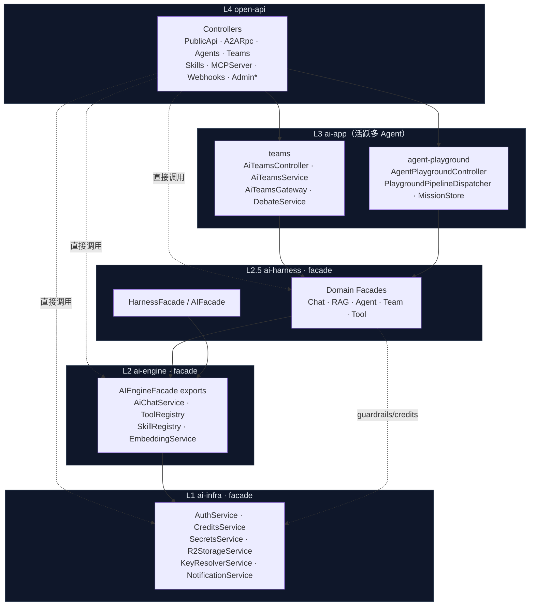
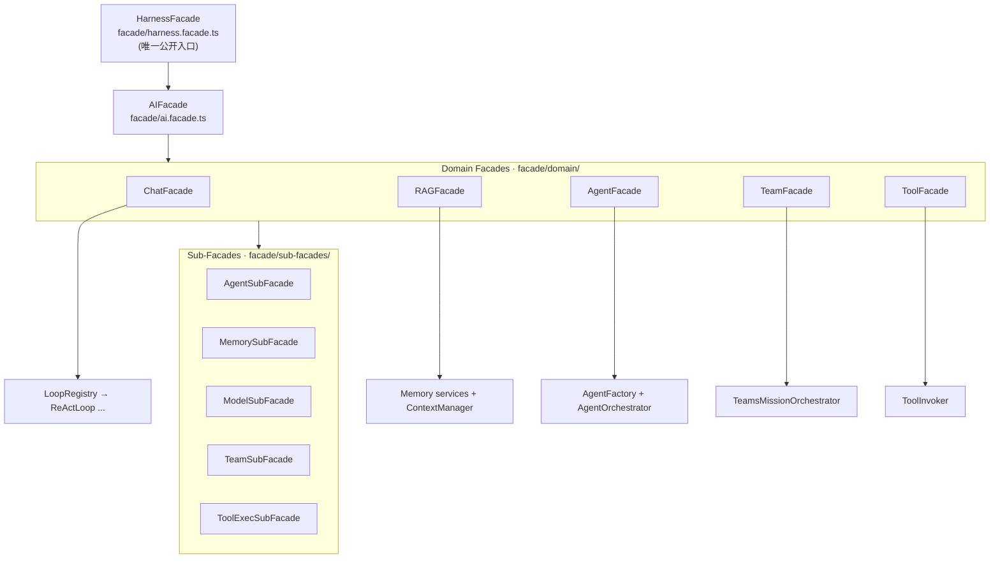
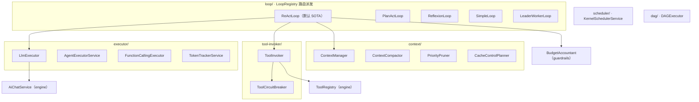
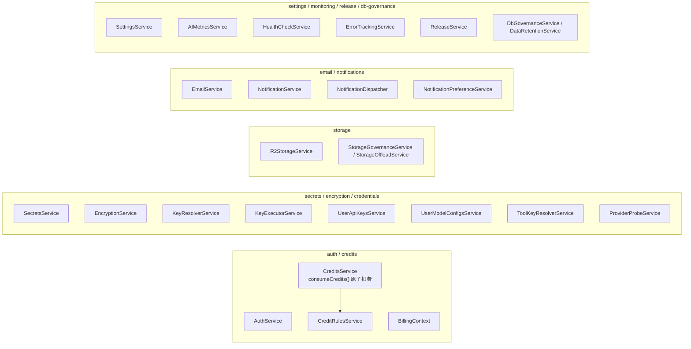
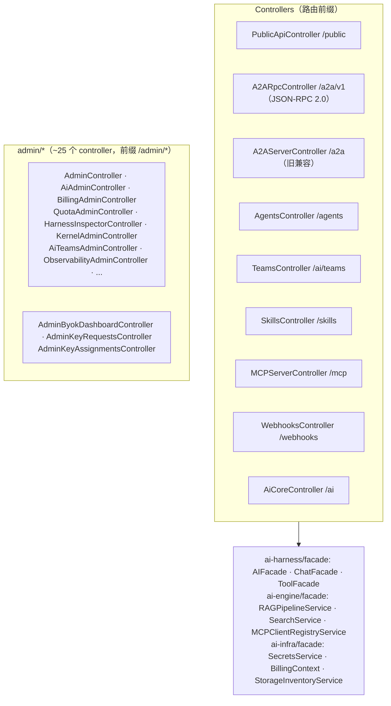
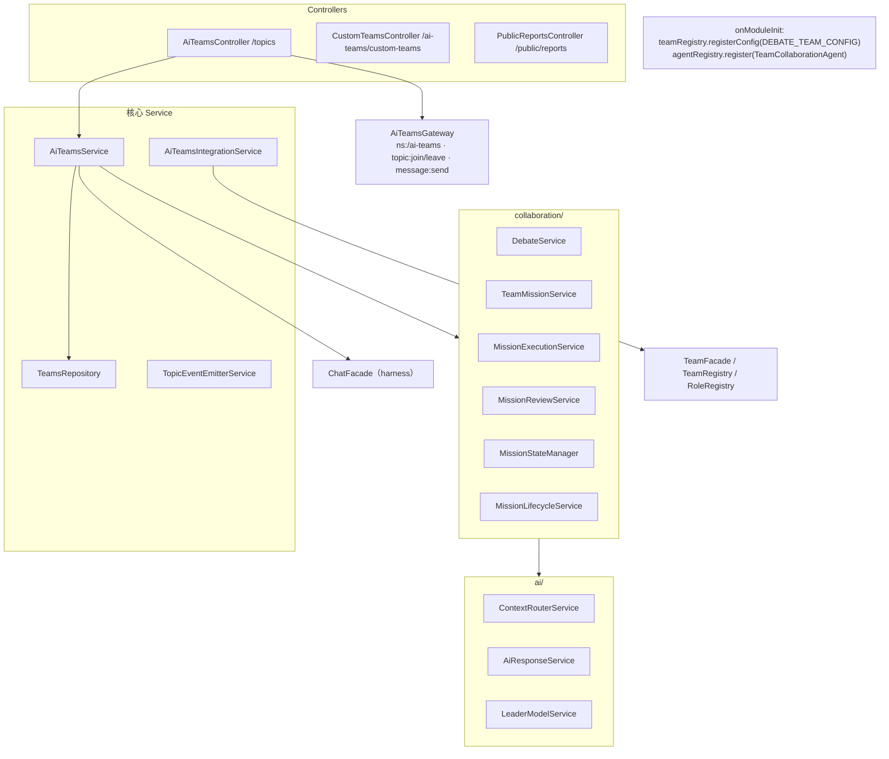
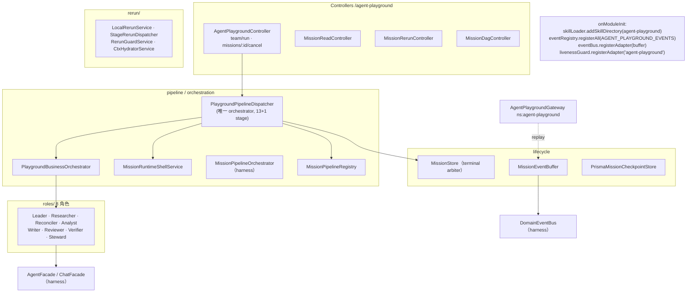
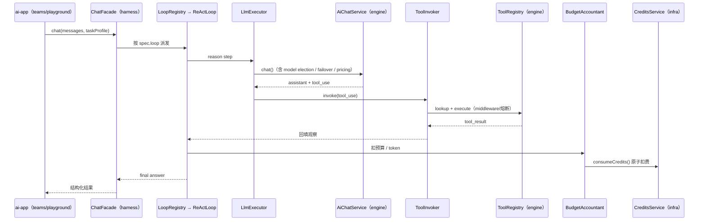

# GenesisPod 组件级架构图

> 落到真实 controller / service / registry / facade / gateway / loop 类名的组件级架构。
> 信息源：2026-05-29 对 `open-api` / `ai-app` / `ai-harness` / `ai-engine` / `ai-infra` 各层 module providers、`@Controller`、`@WebSocketGateway`、`onModuleInit`、class 定义的实测扫描，非记忆推断。
> 配套：分层总图见 [layered-architecture.md](layered-architecture.md)；数据流见 [system-overview.md](system-overview.md)。
>
> **范围说明**：框架层（open-api / harness / engine / infra）做全量组件；`ai-app` 聚焦接线模式 + 两大活跃多 Agent 系统（teams、agent-playground），其余 18 个产品模块走同一 facade + registry 接线模式（见 §6）。

---

## 1. 全局组件接线总图



---

## 2. L2.5 ai-harness 组件图（11 聚合 + facade）

### 2.1 Facade 门面层



### 2.2 runner 聚合（运行循环核心）



### 2.3 其余 9 聚合核心类

| 聚合         | 核心类（path 前缀 `ai-harness/`）                                                                                                                                                                                                                                                                                                                                           |
| ------------ | --------------------------------------------------------------------------------------------------------------------------------------------------------------------------------------------------------------------------------------------------------------------------------------------------------------------------------------------------------------------------- |
| `agents`     | `AgentFactory`(core/agent-factory) · `HarnessedAgent` · `SpecAgentRegistry` · `HookRegistry` · `AgentOrchestrator`(registry) · `PlanBasedAgentRegistry` · `AgentConfigService` · `SubagentSpawner`(subagents) · `SkillActivator`/`SkillLoader`(skill-runtime) · `SkillLearner`(learning) · `DomainConceptRegistry`(domain)                                                  |
| `teams`      | `TeamsMissionOrchestrator`(orchestrator) · `AdaptiveReplannerService` · `MissionPipelineOrchestratorService` · `MissionPipelineRegistry` · `TeamRegistry`/`RoleRegistry`(registry) · `TeamsService` · `ReviewWorkflowService`(collaboration/review) · `MissionRuntimeShellFramework`(business-team)                                                                         |
| `handoffs`   | `AgentRegistry`(中央 Agent 目录) · `HandoffService`（OpenAI 标准切换）                                                                                                                                                                                                                                                                                                      |
| `memory`     | `AgentStepCheckpointService`/`AgentEventStore`(checkpoint) · `MemoryCoordinatorService`(coordinator) · `MemoryContextBindingService`/`MemoryAutoIndexer`(indexing) · `InMemoryVectorStore`/`PrismaVectorStore`(vector) · `LongTermMemoryService`/`ShortTermMemoryService`(stores) · `ProcessMemoryManagerService`(working) · `MissionCheckpointService`(mission-checkpoint) |
| `protocols`  | `DomainEventBus`/`DomainEventRegistry`(events) · `EventBusService`/`MessageBusService`/`ProgressTrackerService`/`AgentLifecycleProtocolService`(ipc) · `EventJournalService`/`CheckpointManager`(journal) · `A2ARpcService`/`A2AClientService`/`AgentCardRegistry`(a2a) · `SocketBroadcastAdapter`(realtime)                                                                |
| `evaluation` | `CritiqueRefineService`/`OutputReviewerService`/`ReportQualityGateService`(critique) · `JudgeService`(verify) · `FigureRelevanceService`(figure) · `ReflectionMissionScheduler`(dreaming)                                                                                                                                                                                   |
| `guardrails` | `ConstraintEnforcementService`(constraints) · `ConcurrencyPlannerService`/`ResourceManagerService`(resources) · `RuntimeEnvironmentService`/`TokenBudgetService`(runtime) · `BudgetAccountant`(budget)                                                                                                                                                                      |
| `tracing`    | `AgentTracer`(tracer, OTEL) · `AiObservabilityService`/`LlmTracingService`/`CostAttributionService`/`TraceCollectorService`(observability) · `SessionLatencyTrackerService`(latency)                                                                                                                                                                                        |
| `lifecycle`  | `MissionLifecycleManager`/`MissionAbortRegistry`/`MissionLivenessGuardService`/`OwnershipRegistry`/`RerunLockRegistry`(mission-lifecycle) · `MissionExecutorService`/`ProcessManagerService`(manager) · `FailureLearnerService`/`PostmortemClassifierService`(learning) · `ProcessSupervisorService`(supervisor)                                                            |

**关键 DI 端口（token → impl）**：`AGENT_REGISTRY_PORT→PlanBasedAgentRegistry` · `CHAT_PROVIDER_PORT→ChatFacade` · `CHECKPOINT_MANAGER_PORT→CheckpointManager` · `CONSTRAINT_ENFORCEMENT_PORT→ConstraintEnforcementService` · `EXECUTION_STATE_MANAGER_PORT→ProcessSupervisorService` · `MCP_PROVIDER_PORT→MCPManager`。

---

## 3. L2 ai-engine 组件图（10 聚合）

```mermaid
flowchart TB
    subgraph LLM["llm/"]
        CHAT["AiChatService"]
        CALLER["AiApiCallerService"]
        FOC["AiChatFailoverCallerService"]
        STREAM["AiStreamHandlerService"]
        ELECT["ModelElectionService"]
        FB["ModelFallbackService"]
        PRICE["ModelPricingRegistry"]
        CAP["ModelCapabilityService"]
        CFG["AiModelConfigService"]
        UADP["UniversalLLMAdapter / FunctionCallingLLMAdapter"]
    end
    subgraph TOOLS["tools/"]
        TR["ToolRegistry"]
        TP["ToolPipeline / ToolExecutor"]
        MCPM["MCPManager"]
        MCPR["MCPClientRegistryService"]
        MID["Validation/Timeout/RateLimit/Permission Middleware"]
    end
    subgraph SKILLS["skills/"]
        SR["SkillRegistry"]
        SL["SkillLoaderService"]
        SC["SkillContentService"]
        SB["SkillPromptBuilder"]
        SS["SkillSandboxService"]
        ESP["EngineSkillProvider（→harness ISkillProvider 端口）"]
    end
    subgraph RAG["rag/ + knowledge/"]
        EMB["EmbeddingService"]
        VEC["VectorService"]
        CHUNK["DocumentChunker"]
        PIPE["RAGPipelineService"]
        SEARCH["SearchService"]
        EVID["EvidenceManagerService"]
        CITE["CitationFormatterService"]
    end
    subgraph PLAN["planning/"]
        TB["TokenBudgetService"]
        INTENT["IntentDetectionService"]
        REFLECT["ReflectionService"]
    end
    subgraph SAFETY["safety/"]
        GP["GuardrailsPipelineService"]
        INJ["PromptInjectionDetector"]
        CIRC["CircuitBreakerService"]
        RL["RateLimitService"]
        QG["QualityGateService"]
    end
    subgraph CONTENT["content/"]
        FETCH["ContentFetchService"]
        YT["YoutubeService"]
        IMGF["ImageFactory"]
        FIG["FigureExtractorService"]
    end

    CHAT --> CALLER --> UADP
    CHAT --> ELECT --> FB
    CHAT --> PRICE
    TR --> TP --> MID
    TR --> MCPM --> MCPR
    PIPE --> EMB & VEC & CHUNK
```



**SSOT 唯一源**：`ModelPricingRegistry`（价格）· `ModelCapabilityService`（能力，读）· `CapabilityOverridesWriterService`（能力，写）· `ToolRegistry`（工具）· `SkillRegistry`（技能）。

**engine → infra 依赖**：`SecretsService`(secrets) · `KeyResolverService`/`KeyExecutorService`/`UserApiKeysService`/`UserModelConfigsService`(credentials BYOK) · `CreditsService`(credits 计费) · `KeyHealthService`(key 健康)。

---

## 4. L1 ai-infra 组件图



> 原子扣费链：`CreditsService.consumeCredits(params)` → `CreditRulesService`（规则）+ `BillingContext`（上下文），抛 `InsufficientCreditsException`/`AccountFrozenException`（commit `ccd267ba8` 修复 lost-update 与负余额）。

---

## 5. L4 open-api 组件图



---

## 6. L3 ai-app 接线模式 + 两大活跃系统

### 6.1 通用接线模式（所有 20 个产品模块共用）

```typescript
// onModuleInit 向下层 Registry 注册自己的 Agent/Team
onModuleInit() {
  this.teamRegistry.registerConfig(MY_TEAM_CONFIG);   // 注册团队配置
  this.agentRegistry.register(this.myAgent);          // 注册 Agent
}

// 运行时只经 facade 调用下层
const result = await this.chatFacade.chat({
  messages, model, taskProfile: { creativity: "low", outputLength: "standard" },
});
```

### 6.2 teams 系统组件图



持久化对象：`Topic*` · `TeamMission` · `AgentTask` · `MissionLog` · `VoteProposal`/`VoteRecord` · `DebateSession`/`DebateAgent`/`DebateMessage`。

### 6.3 agent-playground 系统组件图



运行时对象：`MissionStore` · `MissionEventBuffer` · `MissionCheckpointService` · `OwnershipRegistry` · `MissionAbortRegistry`（后 3 者由 ai-harness 提供）。

---

## 7. 端到端核心调用链（ReAct 一次回合）



---

## 8. 维护要求

1. 组件图每个方框必须能指回真实 class + path，新增/重命名核心 service 时同步更新本图。
2. 新 ai-app 模块默认走 §6.1 接线模式，无需单独画图；只有出现新的"活跃多 Agent 系统"才补组件图。
3. SSOT 类（ToolRegistry / SkillRegistry / ModelPricingRegistry / 各 Registry）全项目唯一,新增同名概念前先查本图。
4. 顶层结构变化时,同步更新 [layered-architecture.md](layered-architecture.md) 与 [system-overview.md](system-overview.md)。

---

**最后更新**：2026-05-29
**信息源**：4 路并行 Explore agent 实测扫描（module providers / @Controller / @WebSocketGateway / onModuleInit / class 定义）
**维护者**：Claude Code
