# 架构手绘图集 · AI Engine + AI Harness

> 一组手绘风格的架构示意图，直观呈现 L2 **AI Engine** 与 L2.5 **AI Harness** 的能力划分。
>
> **性质**：这些是**叙事性/概念性**插画，用于快速建立心智模型，**不是权威结构定义**。
> 权威结构以 [standards/16-ai-engine-harness-structure.md](../../../.claude/standards/16-ai-engine-harness-structure.md) 为准；
> 个别图与重构后现状有出入处，本文已逐一标注「⚠️ 与现状差异」。
>
> 心智模型一句话：**harness = Agent OS（操作系统），engine = 它驱动的一族引擎（CPU/存储/IO）。**
> OS 调度硬件、硬件从不回调 OS —— 对应「依赖方向 harness → engine，反向禁止」。

---

## 一、AI Engine（L2 · 无 agent 状态的原子能力，12 聚合）

### 1. Engine 总览

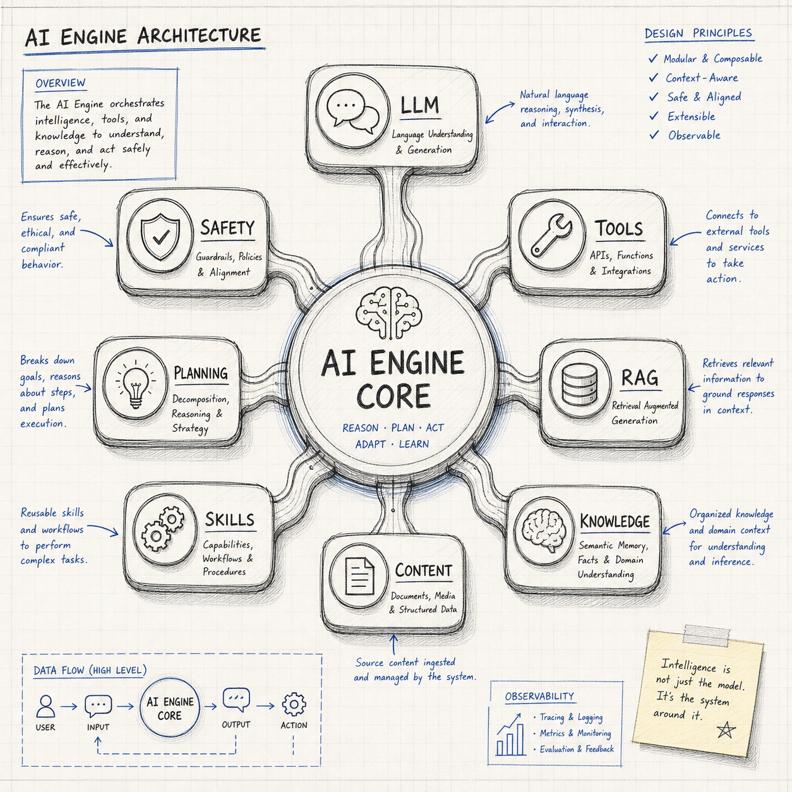

`AI ENGINE CORE` 为中心的能力轮：**llm · tools · rag · knowledge · content · skills · planning · safety**。
对应 `backend/src/modules/ai-engine/`。

> ⚠️ 与现状差异：图示 8 个核心聚合；现实是 **12 个**，另含后续扩出的 `routing`（无状态打分路由）、`reliability`（rate-limit/entity-health）、`evaluation`（无状态启发式质检）、`facade`（对外门面）。

### 2. LLM 引擎（推理 / CPU）

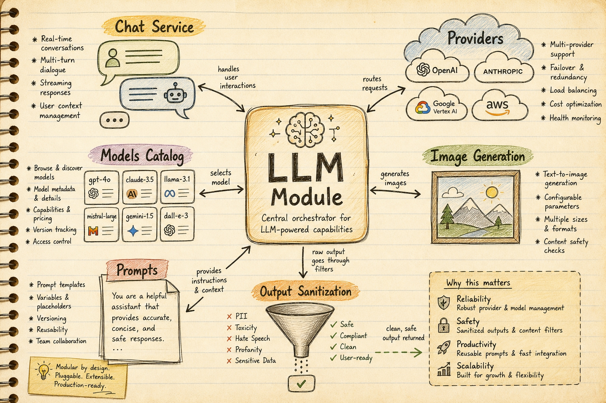

`llm/` 中心编排：chat service · providers（OpenAI/Anthropic/Google/AWS）· models catalog · image generation · prompts · output sanitization。
对应 `ai-engine/llm/{chat,providers,models,image,prompts,output}`。

### 3. RAG 引擎（检索 / 磁盘）—— pipeline 阶段轴的范本

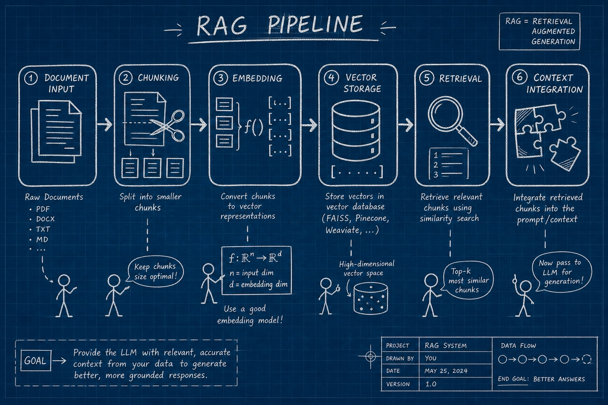

6 阶段流水线：document input → **chunking → embedding → vector storage → retrieval** → context integration。
对应 `ai-engine/rag/{chunking,embedding,vector,pipeline}`。这正是 standards/16 §五.0「pipeline 阶段」切分轴的活例。

### 4. Knowledge 引擎（知识抽取）

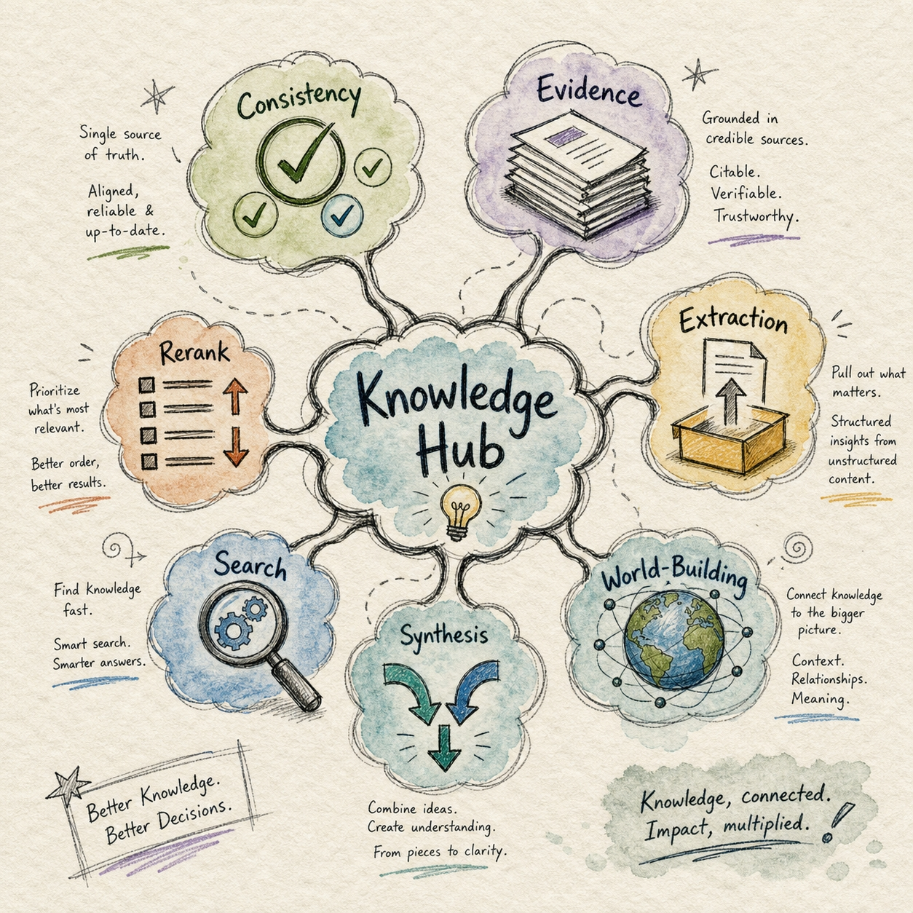

`Knowledge Hub`：consistency · evidence · extraction · rerank · synthesis · world-building（+ search）。
对应 `ai-engine/knowledge/{consistency,evidence,extraction,rerank,synthesis,world-building}`。

> ⚠️ 与现状差异：图中的 **Search** 已在 W5 迁出到 `content/web-search`（它是 web egress，非知识抽取）；`rerank` 在 W1 去重为项目唯一权威实现。

### 5. Safety 引擎（保护环 / MMU）—— 纵深防御

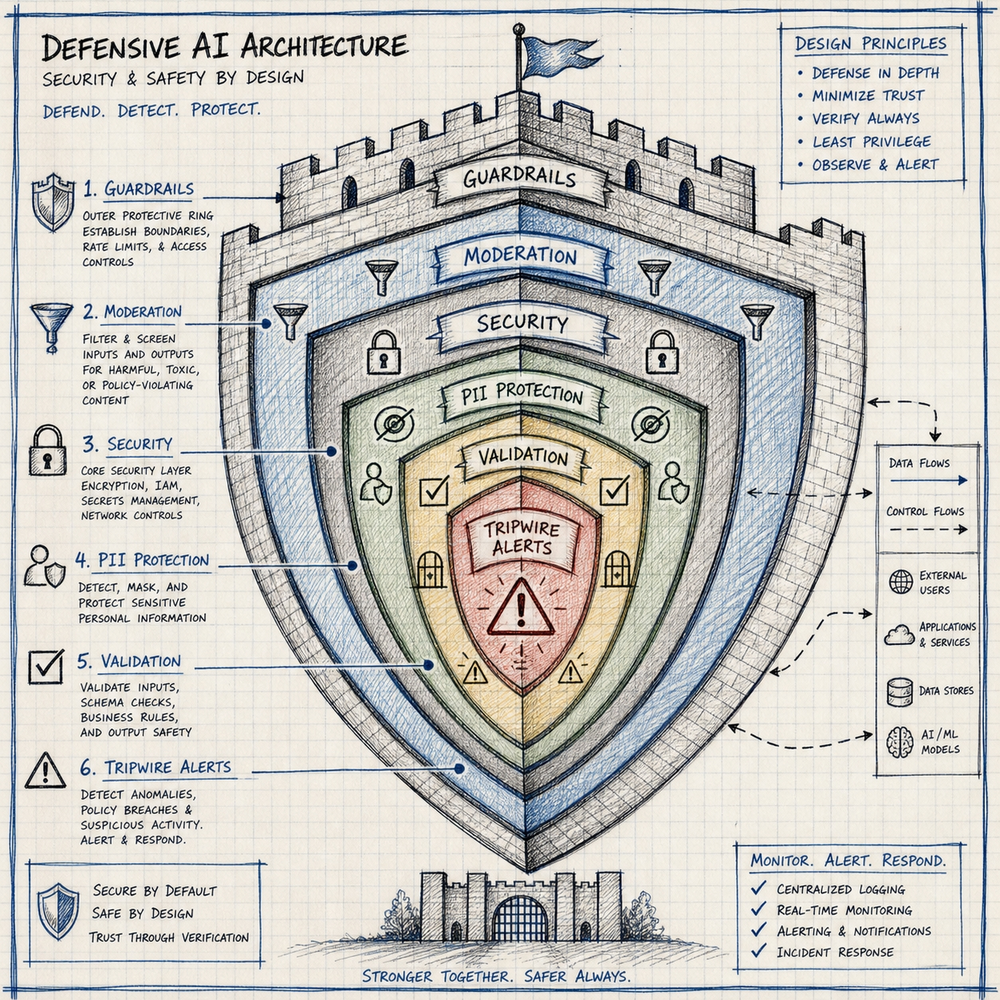

层层护盾：guardrails → moderation → security → PII protection → validation → tripwire alerts。
对应 `ai-engine/safety/{guardrails,moderation,security,validation}`。

> ⚠️ 与现状差异：图中「capability/进程级访问控制」相关已在 W2 迁回 harness（`guardrails/capability`，因其依赖 agent 进程状态）。

### 6. Tools & Skills 生态（IO 设备 + 指令集）

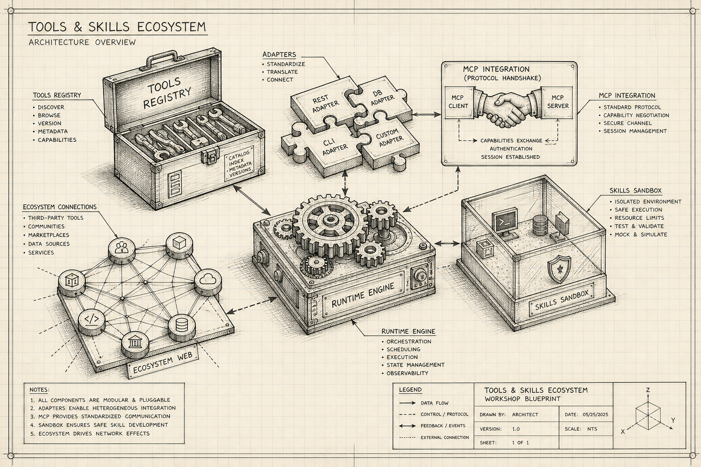

tools registry · adapters（REST/DB/CLI/Custom + **MCP** 协议握手）· runtime engine · skills sandbox · ecosystem web。
对应 `ai-engine/tools/{registry,adapters/mcp,categories,…}` + `ai-engine/skills/{registry,sandbox,…}`。MCP 作为 tool source adapter 落在 engine，与 OpenAPI/function 同层。

---

## 二、AI Harness（L2.5 · Agent 运行时脚手架，含 agent/mission 状态，11 聚合）

### 7. Harness 总览（Agent OS）

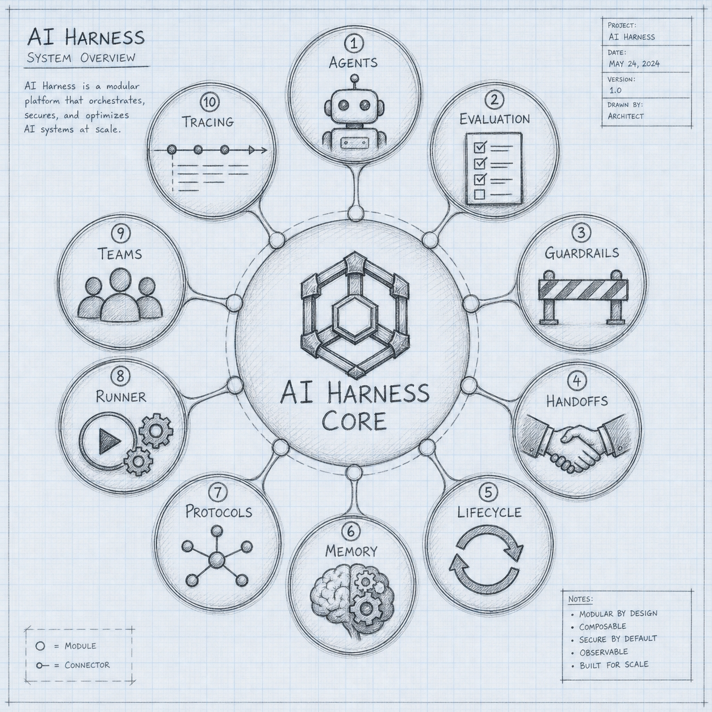

`AI HARNESS CORE` 为中心的 10 模块轮：agents · evaluation · guardrails · handoffs · lifecycle · memory · protocols · runner · teams · tracing（+ facade = 第 11）。
对应 `backend/src/modules/ai-harness/`。

### 8. Agents 模块（进程表 / PCB）

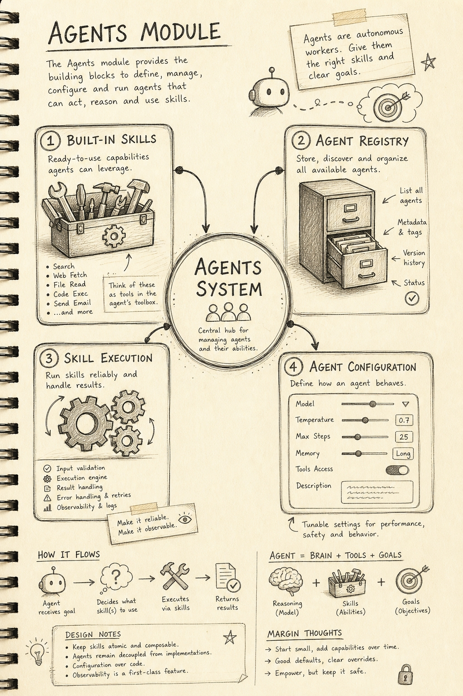

`AGENTS SYSTEM`：built-in skills · agent registry · skill execution · agent configuration。Agent = Brain(model) + Tools(skills) + Goals。
对应 `ai-harness/agents/{core,registry,base,subagents,…}`。

### 9. Runner 执行环（调度器 / 取指-译码-执行）

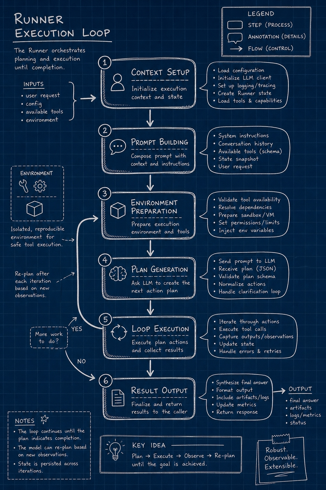

6 步主循环：context setup → prompt building → environment preparation → plan generation → **loop execution（observe→re-plan）** → result output。
对应 `ai-harness/runner/{loop,executor,tool-invoker,scheduler,…}`。

### 10. Teams 编排（多进程 / 进程组）

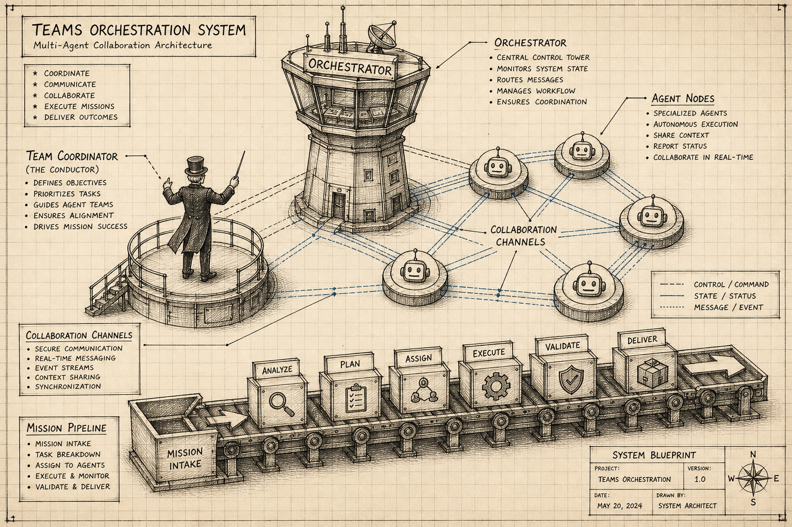

orchestrator（控制塔）· team coordinator（指挥）· agent nodes · collaboration channels · mission pipeline（analyze→plan→assign→execute→validate→deliver）。
对应 `ai-harness/teams/{orchestrator,collaboration,profile,factory,…}`。

### 11. Memory（内存管理）

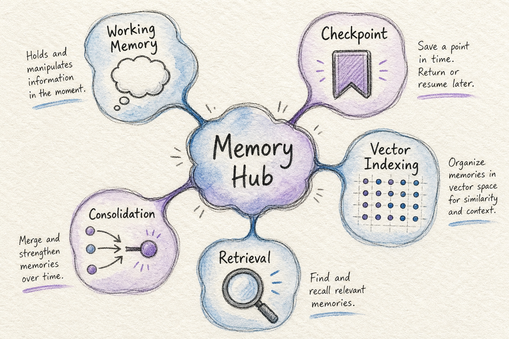

`Memory Hub`：working memory（RAM）· checkpoint（swap/快照）· vector indexing · retrieval · consolidation（GC）。
对应 `ai-harness/memory/{working,checkpoint,vector,indexing,consolidation}`。

### 12. Guardrails & Evaluation（资源限额 / 运行时 QA）

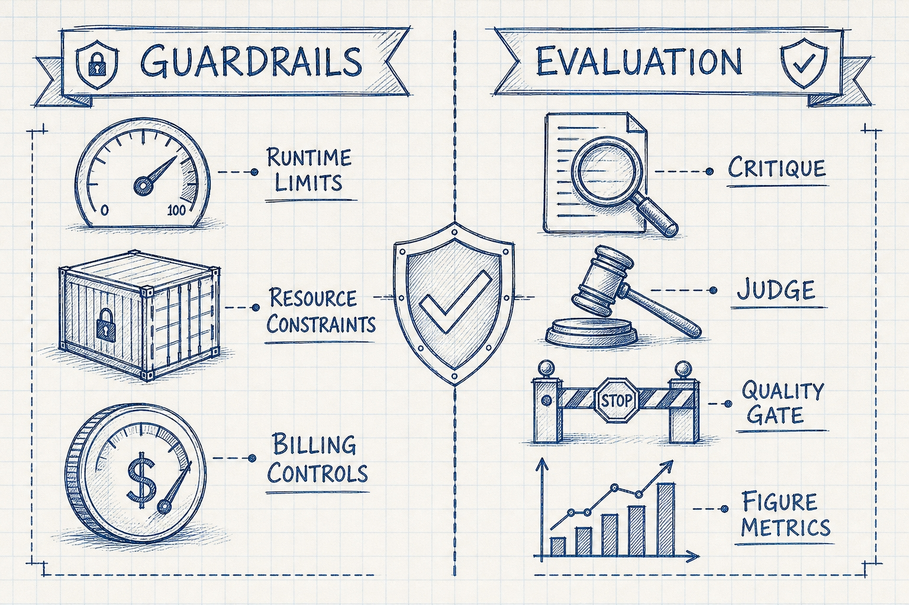

**Guardrails**（cgroups/ulimit）：runtime limits · resource constraints · billing controls。
**Evaluation**（带 mission 上下文的 QA）：critique · judge · quality gate · figure metrics。
对应 `ai-harness/guardrails/{budget,billing,rate-limit,concurrency,constraints,capability}` + `ai-harness/evaluation/{critique,verify,figure}`。

> 注：engine 也有一个 `evaluation/`（**无状态**启发式质检，无 LLM/agent 状态），与此处 harness 的 agent-感知评判**有意分层、勿合**。

---

**最后更新**：2026-06-04 · 共 12 图（engine 6 + harness 6）。源图为 AI 生成手绘风格，重命名为 `engine-*` / `harness-*` 归入本目录。
