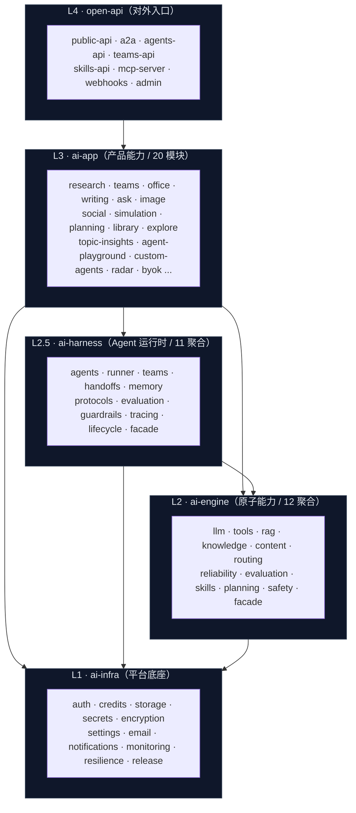
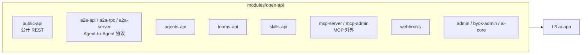
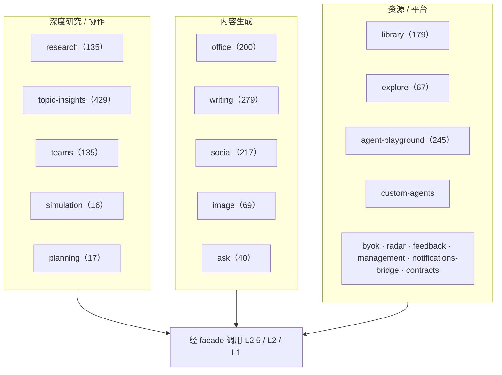
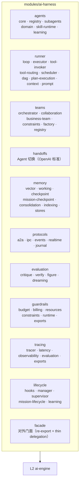
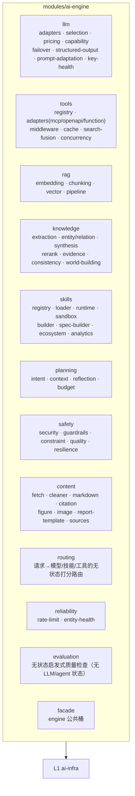
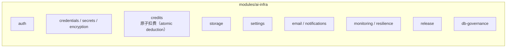
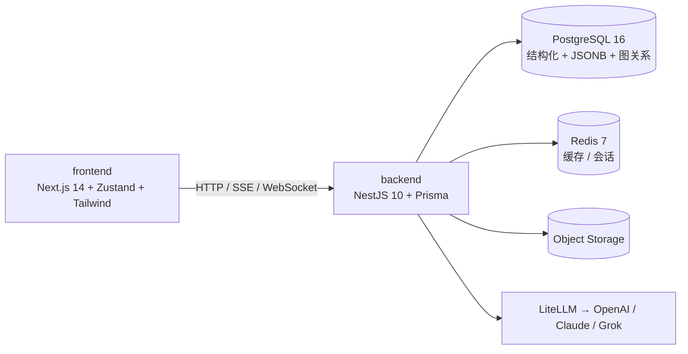

# GenesisPod 分层架构总图

> 按实际代码目录（`backend/src/modules/`）整理的五层系统架构图。
> 信息源：2026-05-29 对 `ai-app` / `ai-harness` / `ai-engine` / `ai-infra` / `open-api` 各层目录的实测扫描，非记忆推断。
> 配套：总览数据流见 [system-overview.md](system-overview.md)；分层规则见 [ARCHITECTURE_RULES.md](ARCHITECTURE_RULES.md)。

---

## 1. 五层总图（单向依赖）

**依赖铁律**：L4 → L3 → L2.5 → L2 → L1，严格单向。

- `ai-engine` **不知道** agent / mission（无 agent 状态）；`ai-harness` 必知 agent / mission。
- `ai-app` 访问下层**只能走各自 facade**（`ai-engine/facade`、`ai-harness/facade`、`ai-infra/facade`），禁止穿透内部路径。
- 三层看护：ESLint `no-restricted-imports` + `layer-boundaries.spec.ts` + `.husky/pre-push`。

---

## 2. L4 · open-api（对外入口）

| 子模块                                                     | 职责                              |
| ---------------------------------------------------------- | --------------------------------- |
| `public-api`                                               | 对外公开 REST API                 |
| `a2a-api` / `a2a-rpc.controller` / `a2a-server.controller` | Agent-to-Agent 协议服务端         |
| `agents-api` / `teams-api` / `skills-api`                  | Agent / Team / Skill 对外编程接口 |
| `mcp-server` / `mcp-admin`                                 | MCP 协议对外暴露与管理            |
| `webhooks`                                                 | 外部回调入口                      |
| `admin` / `byok-admin` / `ai-core`                         | 后台与核心管理接口                |

> 经 `5ed371432` 重构后，open-api 通过 facade 访问 ai-engine / ai-harness，并有 eslint guard 守护。

---

## 3. L3 · ai-app（产品能力，20 模块）

| 模块                      | 文件数    | 定位                                                         |
| ------------------------- | --------- | ------------------------------------------------------------ |
| `topic-insights`          | 429       | 话题洞察（Research 衍生，最大模块）                          |
| `writing`                 | 279       | AI 长文写作                                                  |
| `agent-playground`        | 245       | 结构化 mission pipeline / 事件流 / 重跑 / 导出               |
| `social`                  | 217       | 社交内容生成                                                 |
| `office`                  | 200       | 文档 / PPT / 设计生成                                        |
| `library`                 | 179       | 资源库（collections/notes/rag/knowledge-graph/integrations） |
| `research` / `teams`      | 135 / 135 | 深度研究 / 多 Agent 协作辩论                                 |
| `image` / `explore`       | 69 / 67   | 图像生成 / 内容浏览发现                                      |
| `ask`                     | 40        | 智能问答多模型切换                                           |
| `planning` / `simulation` | 17 / 16   | AI 规划 / 多角色模拟辩论                                     |
| `custom-agents` 等        | —         | 自定义 Agent、BYOK、radar、feedback、management 等           |

**当前两大活跃多 Agent 系统**：`teams`（Topic 协作 / 辩论 / TeamMission）与 `agent-playground`（结构化 mission pipeline）。

---

## 4. L2.5 · ai-harness（Agent 运行时，11 聚合）

| 聚合         | 关键子目录                                                                       | 职责                                                                     |
| ------------ | -------------------------------------------------------------------------------- | ------------------------------------------------------------------------ |
| `agents`     | core / registry / subagents / domain / skill-runtime / learning                  | Agent 定义与注册                                                         |
| `runner`     | loop / executor / tool-invoker / tool-routing / scheduler / dag / plan-execution | Agent 运行循环与执行                                                     |
| `teams`      | orchestrator / collaboration（voting/debate/review）/ business-team              | 团队业务编排模式                                                         |
| `handoffs`   | handoff.service / agent-registry                                                 | Agent 切换（OpenAI 标准）                                                |
| `memory`     | vector / working / checkpoint / mission-checkpoint / consolidation / indexing    | Agent 状态与记忆                                                         |
| `protocols`  | a2a / ipc / events / realtime / journal                                          | 5 个 agent 层协议（A2AMessage 接口源头在 `protocols/ipc/abstractions/`） |
| `evaluation` | critique / verify / figure / dreaming                                            | 质量评判                                                                 |
| `guardrails` | budget / billing / resources / constraints / runtime                             | 资源限额                                                                 |
| `tracing`    | tracer / latency / observability / evaluation                                    | 追踪                                                                     |
| `lifecycle`  | hooks / manager / supervisor / mission-lifecycle / learning                      | 韧性与生命周期                                                           |
| `facade`     | ai.facade / harness.facade / sub-facades                                         | 对外门面                                                                 |

> 历史包袱已清：`ai-kernel/`（删）、`ai-engine/runtime/`（迁出）、`intent-gateway/`（删，空壳）。所有 Agent 运行时能力集中在本层。

---

## 5. L2 · ai-engine（原子能力，12 聚合）

| 聚合          | 关键子目录                                                                 | 职责                                                 |
| ------------- | -------------------------------------------------------------------------- | ---------------------------------------------------- |
| `llm`         | adapters / selection / pricing / capability / failover / structured-output | LLM 调用 + 模型适配 + 路由 + 定价                    |
| `tools`       | registry / adapters(mcp/openapi/function) / middleware / cache             | 项目唯一 tools（MCP 在此，与 OpenAPI/function 同层） |
| `rag`         | embedding / chunking / vector / pipeline                                   | 检索基元                                             |
| `knowledge`   | extraction / synthesis / rerank / evidence / world-building                | 知识抽取                                             |
| `skills`      | registry / loader / runtime / sandbox / builder                            | 项目唯一 SkillRegistry                               |
| `planning`    | intent / context / reflection / budget                                     | 任务分解（不含 agent loop）                          |
| `safety`      | security / guardrails / constraint / quality                               | PII / moderation / injection                         |
| `content`     | fetch / markdown / citation / figure / sources                             | 内容处理                                             |
| `routing`     | model / skill / tool 打分路由                                              | 请求→模型/技能/工具的无状态打分（非 llm/selection）  |
| `reliability` | rate-limit / entity-health                                                 | 引擎级韧性                                           |
| `evaluation`  | heuristics / checks                                                        | 无状态启发式质量检查（无 LLM、无 agent 状态）        |
| `facade`      | exports / abstractions                                                     | engine 公共桶                                        |

> MECE 原则：`tools` 全项目唯一在 engine、`SkillRegistry` 全项目唯一、engine 无 agent / mission 状态。
> `credentials`（BYOK / secret resolver）已于 2026-05-01（fee5d688b）迁入 L1 ai-infra，见 §6。

---

## 6. L1 · ai-infra（平台底座）

| 子模块                                   | 职责                                                     |
| ---------------------------------------- | -------------------------------------------------------- |
| `auth`                                   | 认证授权                                                 |
| `credits`                                | 积分 / 原子扣费（`ccd267ba8` 修复 lost-update 与负余额） |
| `storage`                                | 对象存储                                                 |
| `secrets` / `encryption` / `credentials` | 密钥与加密                                               |
| `settings`                               | 平台配置                                                 |
| `email` / `notifications`                | 邮件与通知                                               |
| `monitoring` / `resilience`              | 监控与韧性                                               |
| `release` / `db-governance`              | 发布与数据库治理                                         |

---

## 7. 基础设施与运行时环境

- **数据库**：PostgreSQL 16 唯一库（已移除 MongoDB / Neo4j / Qdrant，成本优化 70-75%）。
- **缓存**：Redis 7。
- **部署**：Docker + Railway + PM2。

---

## 8. 维护要求

1. 架构图必须能指回真实目录 / controller / service / Prisma 模型，禁止凭记忆推断。
2. 顶层结构变化时，同步更新本文、[system-overview.md](system-overview.md)、`docs/README.md`、`STRUCTURE.md`。
3. 新增聚合 / 子模块时，先确认是否违反 MECE 与单向依赖，再更新本图。

---

**最后更新**：2026-05-29
**信息源**：实测目录扫描
**维护者**：Claude Code
