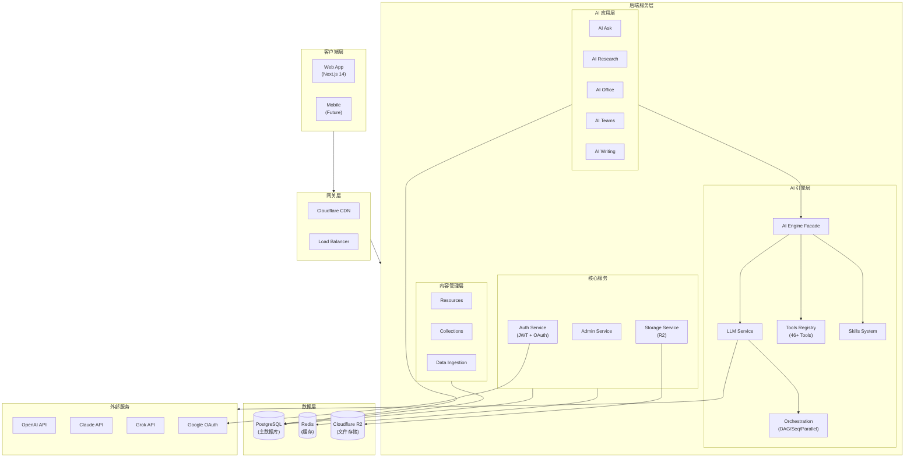
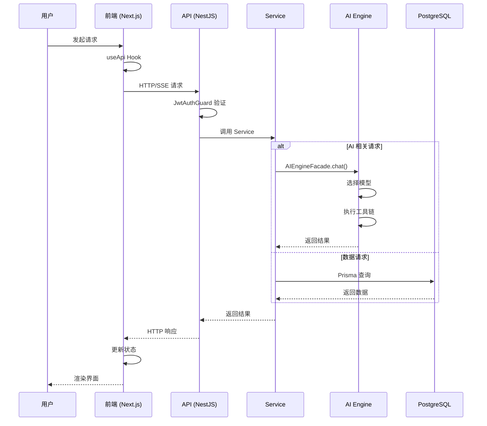
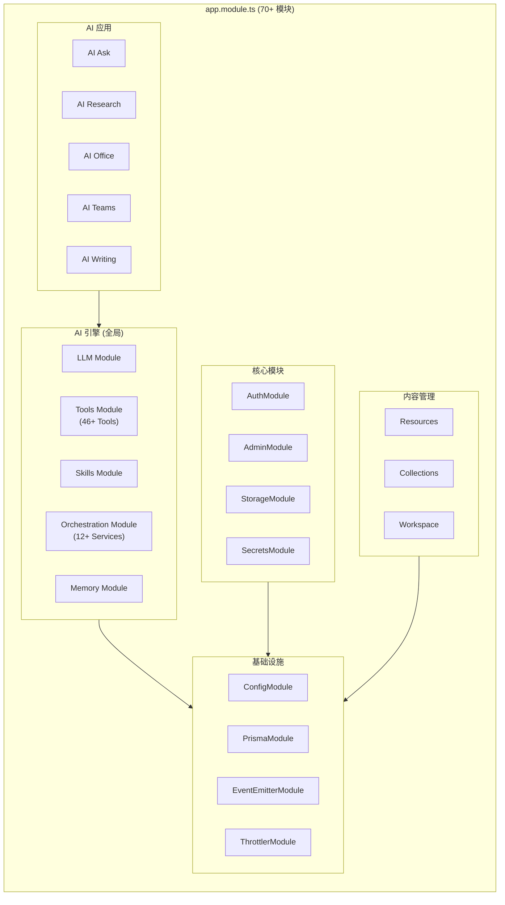
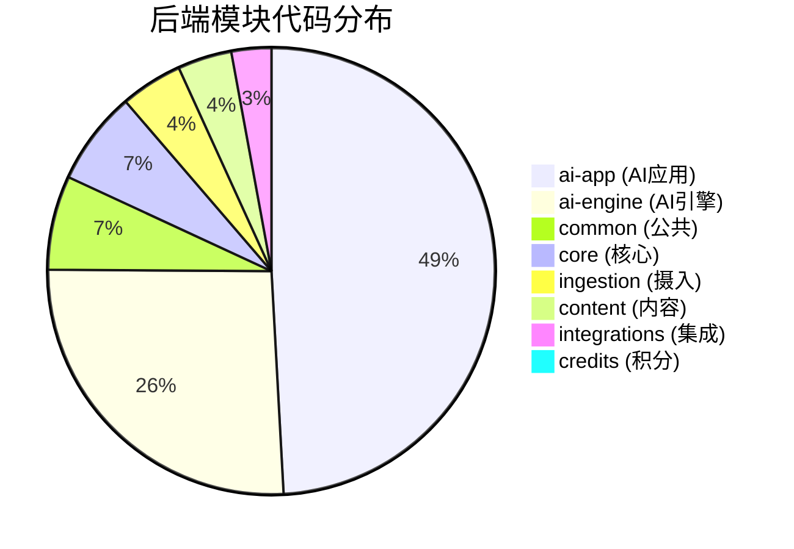
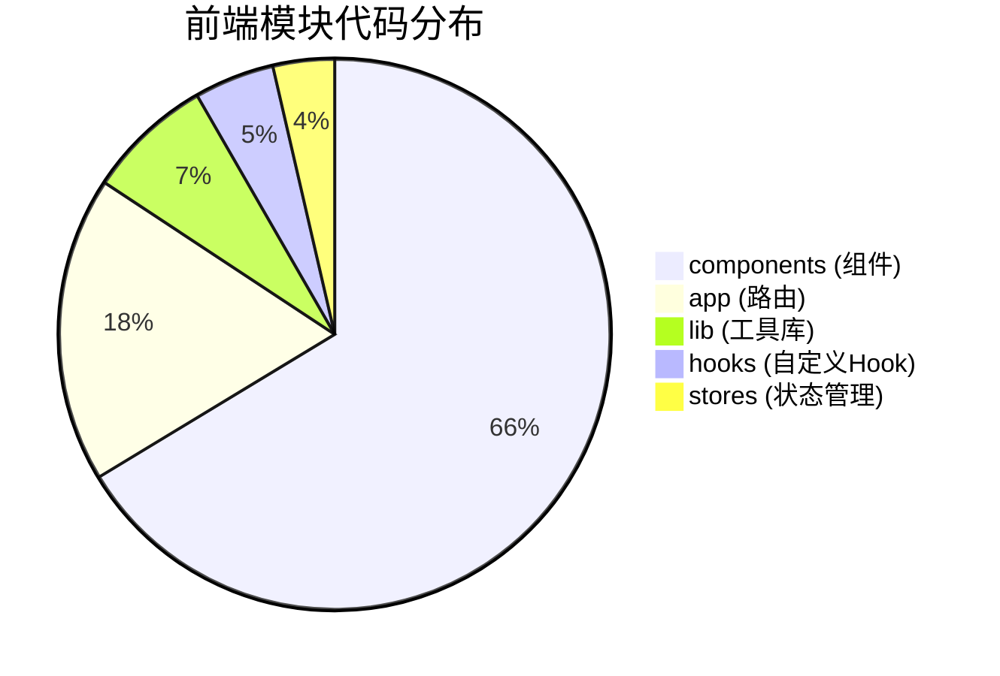
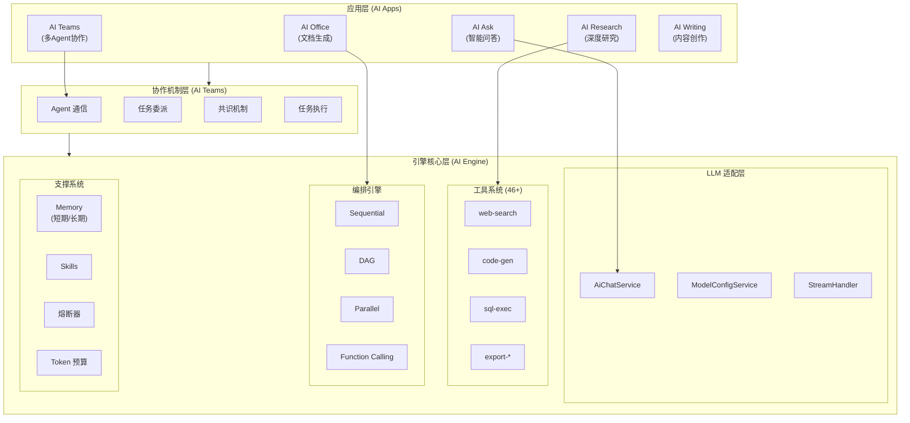
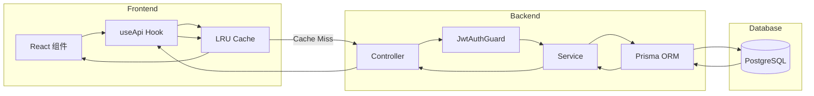
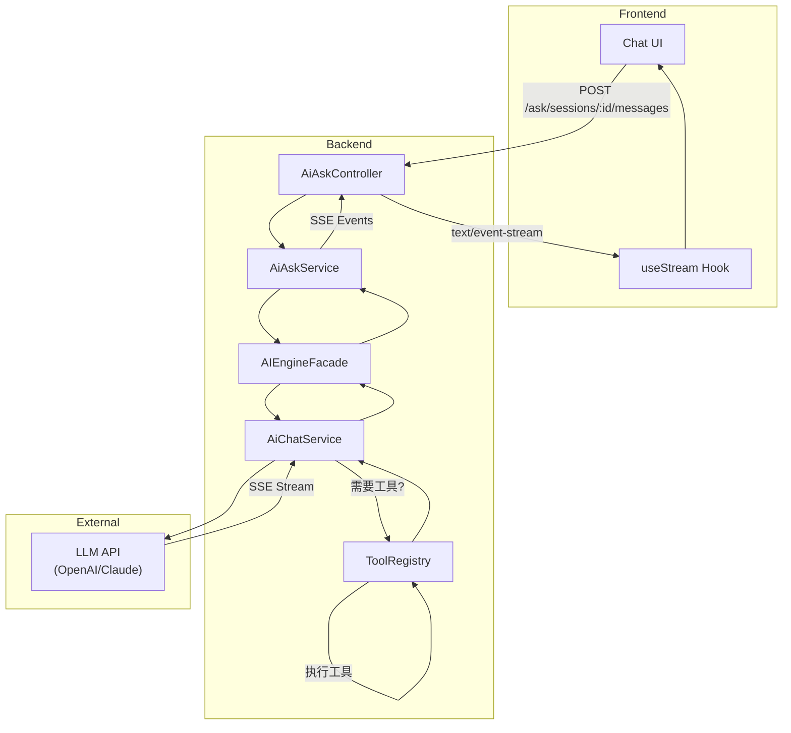
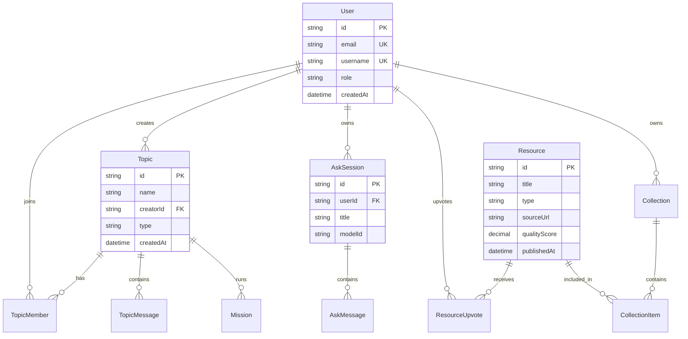

# Genesis.ai - 系统架构总览

> **版本**: v2.0
> **创建日期**: 2026-01-24
> **最后更新**: 2026-01-24
> **状态**: 🟢 活跃
> **维护者**: DeepDive Team

---

## 目录

1. [项目概述](#1-项目概述)
2. [技术栈](#2-技术栈)
3. [系统架构图](#3-系统架构图)
4. [后端架构](#4-后端架构)
5. [前端架构](#5-前端架构)
6. [AI 架构分层](#6-ai-架构分层)
7. [数据流架构](#7-数据流架构)
8. [代码质量指标](#8-代码质量指标)
9. [改进路线图](#9-改进路线图)

---

## 1. 项目概述

**Genesis.ai** 是一个企业级 AI 深度研究和内容管理平台，提供多 Agent 协作、智能问答、文档生成等功能。

### 1.1 代码规模

| 分类                | 文件数    | 总行数      | 有效代码行数 |
| ------------------- | --------- | ----------- | ------------ |
| **后端 (Backend)**  | 1,122     | 386,355     | 297,445      |
| **前端 (Frontend)** | 763       | 297,152     | 263,399      |
| **Prisma Schema**   | 2         | 7,577       | -            |
| **总计**            | **1,887** | **691,084** | **560,844**  |

### 1.2 核心模块

| 模块        | 描述                       | 后端路径             | 前端路径           |
| ----------- | -------------------------- | -------------------- | ------------------ |
| AI Research | 深度研究，多步骤规划和报告 | `ai-app/research/`   | `app/ai-research/` |
| AI Teams    | 多 Agent 协作，辩论碰撞    | `ai-app/teams/`      | `app/ai-teams/`    |
| AI Office   | 文档/PPT/设计生成          | `ai-app/office/`     | `app/ai-office/`   |
| AI Ask      | 智能问答，多模型切换       | `ai-app/ask/`        | `app/ai-ask/`      |
| AI Writing  | AI 写作助手，长文本创作    | `ai-app/writing/`    | `app/ai-writing/`  |
| Library     | 资源库，内容管理           | `content/resources/` | `app/library/`     |

---

## 2. 技术栈

### 2.1 技术选型

```
┌─────────────────────────────────────────────────────────────────┐
│                         技术栈概览                               │
├─────────────────────────────────────────────────────────────────┤
│  前端                                                            │
│  ├── Framework: Next.js 14 (App Router)                         │
│  ├── Language: TypeScript 5.x                                   │
│  ├── State: Zustand (Slice Pattern)                             │
│  ├── Styling: TailwindCSS + Radix UI                            │
│  └── API: Custom Hooks (useApi, useStream)                      │
├─────────────────────────────────────────────────────────────────┤
│  后端                                                            │
│  ├── Framework: NestJS 10                                       │
│  ├── Language: TypeScript 5.x                                   │
│  ├── ORM: Prisma (PostgreSQL)                                   │
│  ├── Auth: JWT + Passport.js + Google OAuth                     │
│  └── Validation: class-validator + class-transformer            │
├─────────────────────────────────────────────────────────────────┤
│  AI 服务                                                         │
│  ├── Gateway: LiteLLM (统一模型接口)                             │
│  ├── Models: OpenAI GPT-4o / Claude / Grok / DeepSeek          │
│  ├── Tools: 46+ 工具 (搜索/代码/SQL/导出等)                      │
│  └── Orchestration: DAG/Sequential/Parallel Executors          │
├─────────────────────────────────────────────────────────────────┤
│  基础设施                                                        │
│  ├── Database: PostgreSQL 16                                    │
│  ├── Cache: Redis / In-Memory LRU                               │
│  ├── Storage: Cloudflare R2                                     │
│  ├── Deploy: Railway + Docker                                   │
│  └── Process: PM2                                               │
└─────────────────────────────────────────────────────────────────┘
```

---

## 3. 系统架构图

### 3.1 整体架构



### 3.2 请求流程图



---

## 4. 后端架构

### 4.1 模块结构图



### 4.2 模块代码量分布



### 4.3 分层架构

```
┌─────────────────────────────────────────────────────────────────┐
│                    Controller 层 (HTTP 入口)                     │
│  ┌─────────────┐ ┌─────────────┐ ┌─────────────┐               │
│  │AuthController│ │AiAskController│ │ResourcesController│ ...   │
│  └──────┬──────┘ └──────┬──────┘ └──────┬──────┘               │
└─────────┼────────────────┼────────────────┼─────────────────────┘
          ↓                ↓                ↓
┌─────────────────────────────────────────────────────────────────┐
│                    Service 层 (业务逻辑)                         │
│  ┌─────────────┐ ┌─────────────┐ ┌─────────────┐               │
│  │AuthService  │ │AiAskService │ │ResourcesService│ ...        │
│  └──────┬──────┘ └──────┬──────┘ └──────┬──────┘               │
└─────────┼────────────────┼────────────────┼─────────────────────┘
          ↓                ↓                ↓
┌─────────────────────────────────────────────────────────────────┐
│                    Facade 层 (AI 统一入口)                       │
│  ┌──────────────────────────────────────────────────────────┐   │
│  │                    AIEngineFacade                         │   │
│  │  chat() | search() | executeTool() | startTeamMission()  │   │
│  └──────────────────────────────────────────────────────────┘   │
└─────────────────────────────────────────────────────────────────┘
          ↓
┌─────────────────────────────────────────────────────────────────┐
│                    数据访问层 (Prisma ORM)                       │
│  ┌─────────────┐ ┌─────────────┐ ┌─────────────┐               │
│  │PrismaService│ │ Models      │ │ Migrations  │               │
│  └──────┬──────┘ └─────────────┘ └─────────────┘               │
└─────────┼───────────────────────────────────────────────────────┘
          ↓
┌─────────────────────────────────────────────────────────────────┐
│                    PostgreSQL 数据库                             │
└─────────────────────────────────────────────────────────────────┘
```

---

## 5. 前端架构

### 5.1 目录结构图

```mermaid
graph TB
    subgraph Frontend["frontend/"]
        subgraph App["app/ (路由层)"]
            AdminRoutes["admin/*"]
            AIRoutes["ai-*/*"]
            LibraryRoutes["library/*"]
            ExploreRoutes["explore/*"]
        end

        subgraph Components["components/ (组件层)"]
            AdminComp["admin/"]
            AIComp["ai-*/"]
            CommonComp["common/"]
            LayoutComp["layout/"]
            UIComp["ui/"]
        end

        subgraph Hooks["hooks/ (逻辑层)"]
            CoreHooks["core/<br/>useApi, useStream"]
            DomainHooks["domain/<br/>useResources"]
            FeatureHooks["features/<br/>useDeepResearch"]
        end

        subgraph Stores["stores/ (状态层)"]
            CoreStores["core/<br/>settings, theme"]
            AIStores["ai-*/<br/>slides, research"]
        end

        subgraph Lib["lib/ (工具层)"]
            APIClient["api/<br/>client, SSE"]
            Utils["utils/"]
        end
    end

    App --> Components
    Components --> Hooks
    Hooks --> Stores
    Hooks --> Lib
    Stores --> Lib
```



### 5.2 前端模块代码分布



### 5.3 Hook 三层架构

```
┌─────────────────────────────────────────────────────────────────┐
│                    Features Hooks (13个)                         │
│  ┌────────────────┐ ┌────────────────┐ ┌────────────────┐      │
│  │useDeepResearch │ │useSlideGeneration│ │useExport       │ ... │
│  └────────┬───────┘ └────────┬───────┘ └────────┬───────┘      │
└───────────┼──────────────────┼──────────────────┼───────────────┘
            ↓                  ↓                  ↓
┌─────────────────────────────────────────────────────────────────┐
│                    Domain Hooks (18个)                           │
│  ┌────────────────┐ ┌────────────────┐ ┌────────────────┐      │
│  │useResources    │ │useGoogleDrive  │ │useAdminSecrets │ ...  │
│  └────────┬───────┘ └────────┬───────┘ └────────┬───────┘      │
└───────────┼──────────────────┼──────────────────┼───────────────┘
            ↓                  ↓                  ↓
┌─────────────────────────────────────────────────────────────────┐
│                    Core Hooks (4个)                              │
│  ┌────────────────┐ ┌────────────────┐ ┌────────────────┐      │
│  │useApi          │ │useStream       │ │useAsyncOperation│     │
│  │(HTTP + Cache)  │ │(SSE)           │ │(状态管理)      │      │
│  └────────┬───────┘ └────────┬───────┘ └────────────────┘      │
└───────────┼──────────────────┼──────────────────────────────────┘
            ↓                  ↓
┌─────────────────────────────────────────────────────────────────┐
│                    API Client Layer                              │
│  ┌────────────────────────────────────────────────────────────┐ │
│  │  apiClient.get() | apiClient.post() | createSSEStream()   │ │
│  └────────────────────────────────────────────────────────────┘ │
└─────────────────────────────────────────────────────────────────┘
```

### 5.4 状态管理架构 (Zustand Slice Pattern)

```
┌─────────────────────────────────────────────────────────────────┐
│                    Zustand Stores                                │
├─────────────────────────────────────────────────────────────────┤
│  Core Stores (全局状态)                                          │
│  ├── settingsStore: 应用设置                                     │
│  ├── themeStore: 主题切换                                        │
│  └── toastStore: Toast 通知                                      │
├─────────────────────────────────────────────────────────────────┤
│  Feature Stores (功能模块状态 - Slice 模式)                       │
│  ├── ai-research/                                               │
│  │   ├── topicSlice: Topics, Dimensions, Stats                  │
│  │   ├── reportSlice: Reports, Evidence, Logs                   │
│  │   └── researchSlice: Refresh, Mission, Team                  │
│  ├── ai-office/                                                 │
│  │   └── slidesStore: Sessions, Pages, Progress                 │
│  ├── ai-teams/                                                  │
│  │   └── teamsStore: Topics, Messages, Members                  │
│  └── ...                                                        │
└─────────────────────────────────────────────────────────────────┘
```

---

## 6. AI 架构分层

### 6.1 AI 三层架构模型



### 6.2 AI Engine 内部结构

```
┌─────────────────────────────────────────────────────────────────┐
│                    AIEngineFacade (统一入口)                     │
│  ┌──────────────────────────────────────────────────────────┐   │
│  │ chat() | chatWithSkills() | search() | executeTool()    │   │
│  │ startTeamMission() | storeMemory() | getAvailableModels()│   │
│  └──────────────────────────────────────────────────────────┘   │
└───────────────────────────────────────────────────────────────── ┘
                               ↓
┌─────────────────────────────────────────────────────────────────┐
│                    LLM 服务层                                    │
│  ┌─────────────┐ ┌─────────────┐ ┌─────────────┐               │
│  │AiChatService│ │ModelConfig  │ │TaskProfile  │               │
│  │             │ │Service      │ │Mapper       │               │
│  └─────────────┘ └─────────────┘ └─────────────┘               │
│                                                                  │
│  TaskProfile 参数:                                               │
│  ├── creativity: deterministic(0.1) | low(0.3) | medium(0.7)   │
│  └── outputLength: minimal(500) | short(1500) | medium(4000)   │
└─────────────────────────────────────────────────────────────────┘
                               ↓
┌─────────────────────────────────────────────────────────────────┐
│                    工具注册表 (46+ 工具)                         │
│  ┌─────────────────────────────────────────────────────────┐    │
│  │ Information: web-search, news-search, arxiv-search      │    │
│  │ Execution: sql-executor, container-executor, ocr        │    │
│  │ Generation: code-gen, text-gen, video-gen               │    │
│  │ Export: image-export, pdf-export, markdown-export       │    │
│  │ Collaboration: agent-comm, task-delegation, consensus   │    │
│  │ Processing: document-chunker, summarizer, entity-extract│    │
│  └─────────────────────────────────────────────────────────┘    │
│                                                                  │
│  Tool Pipeline (中间件):                                         │
│  ├── ValidationMiddleware (入参验证)                             │
│  └── TimeoutMiddleware (执行超时控制)                            │
└─────────────────────────────────────────────────────────────────┘
                               ↓
┌─────────────────────────────────────────────────────────────────┐
│                    编排引擎 (12+ 服务)                           │
│  ┌─────────────┐ ┌─────────────┐ ┌─────────────┐               │
│  │Sequential   │ │DAG Executor │ │Parallel     │               │
│  │Executor     │ │             │ │Executor     │               │
│  └─────────────┘ └─────────────┘ └─────────────┘               │
│  ┌─────────────┐ ┌─────────────┐ ┌─────────────┐               │
│  │Function     │ │Circuit      │ │Token Budget │               │
│  │Calling      │ │Breaker      │ │Service      │               │
│  └─────────────┘ └─────────────┘ └─────────────┘               │
└─────────────────────────────────────────────────────────────────┘
```

---

## 7. 数据流架构

### 7.1 API 请求数据流



### 7.2 AI 对话数据流



### 7.3 数据库 ER 图 (核心表)



---

## 8. 代码质量指标

### 8.1 质量评分总览

| 层级              | 评分       | 状态        |
| ----------------- | ---------- | ----------- |
| **L0 基础设施层** | 8.5/10     | ✅ 良好     |
| **L1 核心架构层** | 8.3/10     | ✅ 良好     |
| **L2 代码质量层** | 8.1/10     | ✅ 良好     |
| **L3 业务逻辑层** | 8.0/10     | ✅ 良好     |
| **总体评分**      | **8.2/10** | ✅ 生产就绪 |

### 8.2 关键指标

| 指标                  | 结果    | 评价      |
| --------------------- | ------- | --------- |
| TypeScript `any` 使用 | 0       | ✅ 优秀   |
| `@ts-ignore` 使用     | 0       | ✅ 优秀   |
| Try-Catch 覆盖率      | 85%     | ✅ 良好   |
| NestJS Logger 使用    | 114+ 处 | ✅ 良好   |
| console.log 残留      | 37 处   | ⚠️ 需清理 |

### 8.3 大型文件待重构

| 文件                       | 行数  | 优先级 | 建议                     |
| -------------------------- | ----- | ------ | ------------------------ |
| `AIEngineFacade.ts`        | 2000+ | 🔴 P0  | 拆分为 5-6 个专用 Facade |
| `AiAskService.ts`          | 1000+ | 🔴 P0  | 拆分为 4 个专用 Service  |
| `HomePage.tsx`             | 4000+ | 🔴 P0  | 拆分为 6-8 个子组件      |
| `WritingMissionService.ts` | 8000+ | 🟡 P1  | 拆分任务执行逻辑         |

---

## 9. 改进路线图

### 9.1 短期改进 (1-2 周)

- [ ] 拆分 AIEngineFacade（5-6 个专用 Facade）
- [ ] 拆分 AiAskService（4 个专用 Service）
- [ ] 重构 HomePage.tsx（6-8 个子组件）
- [ ] 清理 console.log（37 处）

### 9.2 中期改进 (3-4 周)

- [ ] 统一 API 响应格式
- [ ] 添加前端 API 拦截器
- [ ] 清理遗留 Store
- [ ] 添加 Repository 层（可选）

### 9.3 长期改进 (1-2 月)

- [ ] 实现分布式跟踪（OpenTelemetry）
- [ ] 完善 Function Calling 实现
- [ ] 添加更多测试覆盖
- [ ] 性能基准测试

---

## 相关文档

| 文档              | 路径                                                                               |
| ----------------- | ---------------------------------------------------------------------------------- |
| 后端 NestJS 架构  | [infra/backend/backend-nestjs.md](infra/backend/backend-nestjs.md)                 |
| 前端 Next.js 架构 | [infra/frontend/frontend-nextjs-react.md](infra/frontend/frontend-nextjs-react.md) |
| AI Engine 架构    | [ai-engine/readme.md](ai-engine/readme.md)                                         |
| AI Teams 架构     | [ai-teams/readme.md](ai-teams/readme.md)                                           |
| 数据库设计        | [infra/database/database-postgresql.md](infra/database/database-postgresql.md)     |

---

**文档版本**: v2.0
**生成时间**: 2026-01-24
**分析范围**: 完整前后端代码库（1,887 个文件，691,084 行代码）
