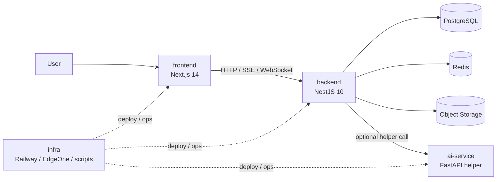
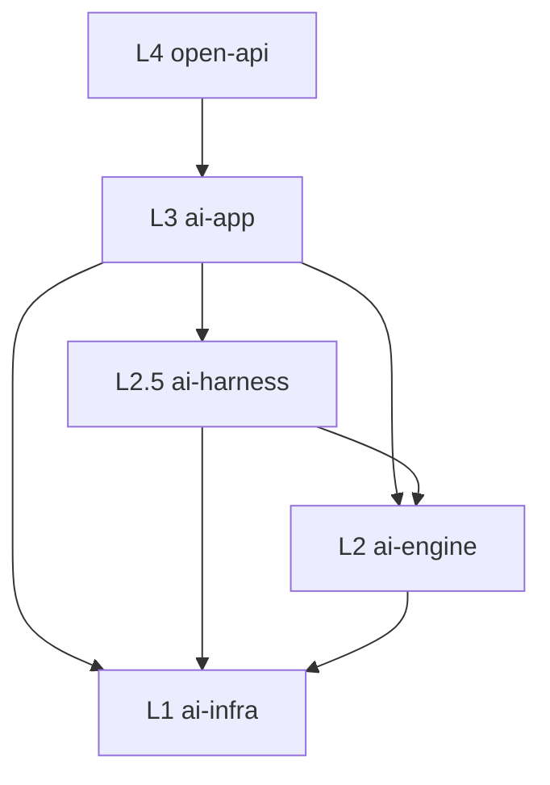
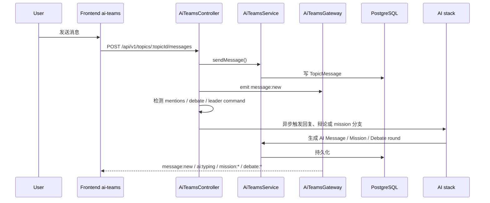
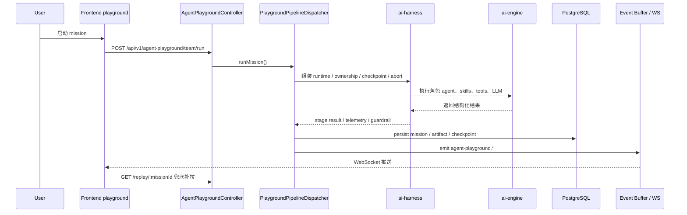

# System Overview

> 当前仓库的系统级总览。只描述仍在运行的实现，不复述已淘汰的旧分层。

## 1. 代码信息源

本文基于以下活跃代码：

- `backend/src/app.module.ts`
- `backend/src/__tests__/architecture/layer-boundaries.spec.ts`
- `backend/src/modules/ai-app/teams/ai-teams.module.ts`
- `backend/src/modules/ai-app/teams/controllers/ai-teams.controller.ts`
- `backend/src/modules/ai-app/agent-playground/agent-playground.module.ts`
- `backend/src/modules/ai-app/agent-playground/agent-playground.controller.ts`
- `backend/prisma/schema/models.prisma`
- `frontend/services/ai-teams/api.ts`
- `frontend/stores/ai-teams/index.ts`

## 2. 仓库组件图

## 3. 后端五层结构

含义：

- `open-api` 负责对外入口
- `ai-app` 负责产品能力
- `ai-harness` 负责运行时与 mission 基础设施
- `ai-engine` 负责 LLM、tools、skills、planning 等原子能力
- `ai-infra` 负责 auth、credits、storage、settings、secrets 等底座

## 4. 当前活跃的多 Agent 系统

| 系统             | 代码目录                                       | 定位                                        | 主要持久化对象                                           |
| ---------------- | ---------------------------------------------- | ------------------------------------------- | -------------------------------------------------------- |
| AI Teams         | `backend/src/modules/ai-app/teams/`            | Topic 协作、AI 成员、辩论、Team Mission     | `Topic*`, `TeamMission`, `AgentTask`, `Vote*`, `Debate*` |
| Agent Playground | `backend/src/modules/ai-app/agent-playground/` | 结构化 mission pipeline、事件流、重跑、导出 | Playground mission store、checkpoint、event buffer       |

两者共用下层：

- `ai-harness`：ownership、abort、checkpoint、event bus、runtime
- `ai-engine`：LLM、tools、skills、content、planning
- `ai-infra`：auth、credits、storage、notifications

## 5. AI Teams 数据流

## 6. Agent Playground 数据流

## 7. 核心存储

### 7.1 AI Teams

活跃模型：

- `Topic`
- `TopicMember`
- `TopicAIMember`
- `TopicMessage`
- `TopicMessageMention`
- `TopicMessageAttachment`
- `TopicMessageReaction`
- `TopicResource`
- `TopicSummary`
- `TopicJoinRequest`
- `TeamMission`
- `AgentTask`
- `MissionLog`
- `VoteProposal`
- `VoteRecord`
- `DebateSession`
- `DebateAgent`
- `DebateMessage`

### 7.2 Agent Playground

活跃运行时对象：

- `MissionStore`
- `MissionCheckpointService`
- `MissionEventBuffer`
- `MissionOwnershipRegistry`
- `MissionAbortRegistry`

## 8. 维护要求

1. 架构图、数据流图必须能指回 controller、gateway、service、Prisma 模型或前端 store。
2. 旧的 `ai-engine/teams` 叙述不应再作为当前实现写入活跃入口文档。
3. 顶层结构变化时，优先更新本文、`docs/README.md`、`STRUCTURE.md`。
