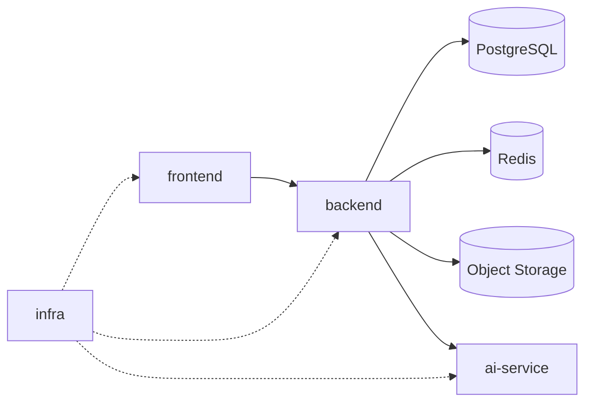
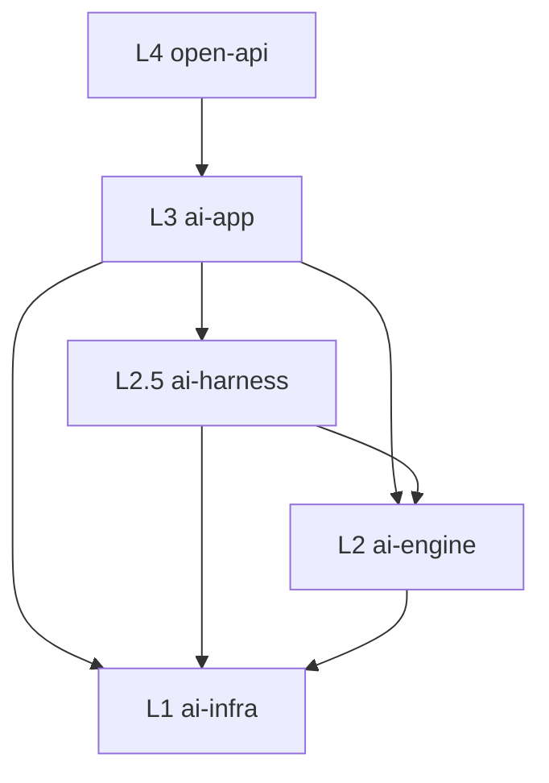

# System Containers

> 系统容器图回答“系统由哪些主要运行单元组成，以及它们怎么分层”。

## 代码信息源

- `backend/src/__tests__/architecture/layer-boundaries.spec.ts`
- `backend/src/app.module.ts`
- `backend/src/modules/ai-app/teams/ai-teams.module.ts`
- `backend/src/modules/ai-app/agent-playground/agent-playground.module.ts`

## 仓库级容器

## 后端五层结构

## 当前活跃多 Agent 系统

| 系统             | 代码目录                                       | 职责                                                        |
| ---------------- | ---------------------------------------------- | ----------------------------------------------------------- |
| AI Teams         | `backend/src/modules/ai-app/teams/`            | Topic 协作、AI 成员、Debate、Team Mission                   |
| Agent Playground | `backend/src/modules/ai-app/agent-playground/` | 结构化 mission pipeline、replay、rerun、leader chat、export |

## 说明

- `ai-app` 承载产品能力，不等于单一多 Agent 引擎。
- `AI Teams` 和 `Agent Playground` 都是活跃系统，但边界不同。
- 公共能力继续下沉到 `ai-harness`、`ai-engine`、`ai-infra`。

## 下钻

- 完整总览见 [../architecture/system-overview.md](../architecture/system-overview.md)
- 数据流见 [data-flows.md](data-flows.md)
