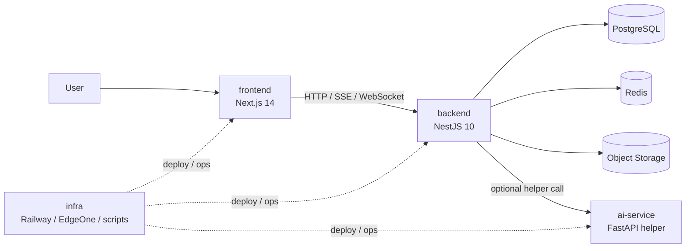

# System Context

> 系统上下文图回答“这个仓库在和谁交互”。

## 代码信息源

- `frontend/`
- `backend/src/app.module.ts`
- `ai-service/`
- `infra/`

## 上下文图

## 说明

- `frontend` 是用户直接交互入口。
- `backend` 是主业务和 API 编排中心。
- `ai-service` 是可选的辅助 AI 服务，不是所有链路都会经过它。
- `infra` 管理部署、运行环境和运维脚本。

## 下钻

- 组件级结构见 [container.md](container.md)
- 跨系统交互见 [data-flows.md](data-flows.md)
