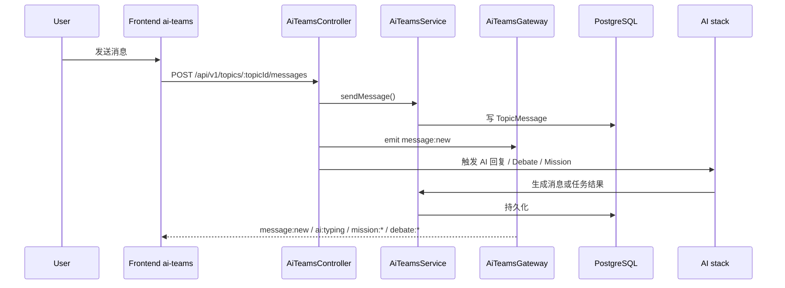
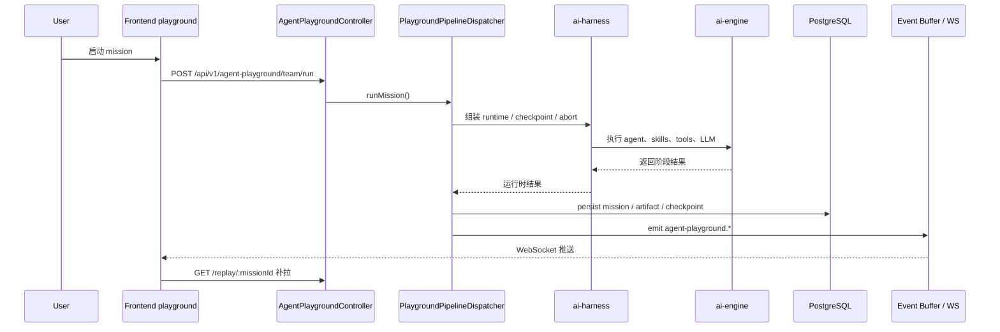

# System Data Flows

> 数据流文档回答“关键请求如何穿过前端、控制器、服务、存储和实时通道”。

## 代码信息源

- `backend/src/modules/ai-app/teams/controllers/ai-teams.controller.ts`
- `backend/src/modules/ai-app/teams/ai-teams.gateway.ts`
- `backend/src/modules/ai-app/playground/agent-playground.controller.ts`
- `frontend/services/ai-teams/api.ts`
- `frontend/stores/ai-teams/index.ts`
- `backend/prisma/schema/models.prisma`

## AI Teams

## Agent Playground

## 说明

- AI Teams 重点是 Topic 上下文内的协作和实时消息。
- Agent Playground 重点是结构化流水线、事件流和回放体系。
- 两条主链路都依赖下层 `ai-harness`、`ai-engine` 和基础存储。

## 下钻

- 系统边界见 [context.md](context.md) 和 [container.md](container.md)
- 合并总览见 [../architecture/system-overview.md](../architecture/system-overview.md)
